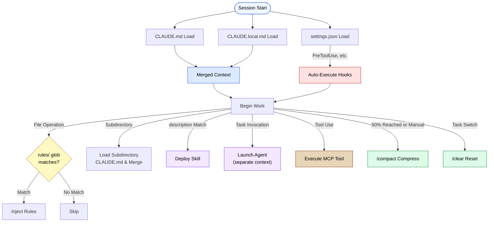

🌐 [日本語](../ja/appendix/claude-code-config-reference.md)

# Claude Code Configuration File Reference

> [!NOTE]
> Comprehensive reference of files and directories that make up Claude Code project configuration.
> Designed to trace "what is this configuration for?" through links to relevant pages in this project.

## Directory Structure Overview

### User Level (Global)

```
~/.claude/
├── CLAUDE.md                    # Personal instructions common to all projects
└── settings.json                # Global personal settings (tool permissions, etc.)
```

### Project Level

```
my-project/
├── CLAUDE.md                    # Main project instruction file (auto-loaded)
├── CLAUDE.local.md              # Local-only instructions (not Git-managed)
├── .claude/
│   ├── settings.json            # Tool permissions, MCP config, Hooks (team-shared)
│   ├── settings.local.json      # Local-only settings (not Git-managed)
│   ├── commands/
│   │   └── deploy.md            # Custom slash commands (executed with /deploy)
│   ├── rules/
│   │   ├── frontend.md          # Conditional rules (auto-injected via glob pattern)
│   │   ├── testing.md
│   │   └── ...
│   └── skills/
│       └── skill-name/
│           ├── SKILL.md         # Skill definition (required)
│           ├── scripts/         # Helper scripts (optional)
│           ├── references/      # Reference documents (optional)
│           └── assets/          # Templates, etc. (optional)
├── src/
│   ├── CLAUDE.md                # Subdirectory-specific (loaded when accessing this directory)
│   └── components/
│       └── CLAUDE.md            # Deeper hierarchies also possible
```

### Enterprise Level (Admin Configuration)

```
(Distributed by organization admin)
├── managed-settings.json        # Organization policy (distributed via MDM, highest priority)
```

### Configuration Priority

```
Managed (Highest)   managed-settings.json (organization policy)
  ↓
Project             .claude/settings.json (team-shared)
  ↓
Project Local       .claude/settings.local.json (personal local)
  ↓
User (Lowest)       ~/.claude/settings.json (global personal)
```

Below, each file/directory is explained by categorizing "how it affects context."

| Category | Configuration File / Feature | Loading | Explanation |
| --- | --- | --- | --- |
| **Resident Context** (Part 3) | `~/.claude/CLAUDE.md` | Auto on session start | [Hierarchy Merge](../03-always-loaded-context/hierarchy.md) |
| | `CLAUDE.md` | Auto on session start | [Design Principles](../03-always-loaded-context/claude-md.md) |
| | `CLAUDE.local.md` | Auto on session start | [Operations](../03-always-loaded-context/local-md.md) |
| | Subdirectory `CLAUDE.md` | On-demand when accessing directory | [Hierarchy Merge](../03-always-loaded-context/hierarchy.md) |
| **Conditional Context** (Part 4) | `.claude/rules/` | When glob pattern matches | [Design Principles](../04-conditional-context/rules.md) |
| **On-Demand Context** (Part 5) | `.claude/skills/` | When description matches | [Skills](../05-on-demand-context/skills.md) |
| | Agents (`Task()`) | On explicit invocation | [Agents](../05-on-demand-context/agents.md) |
| **Tool Context** (Part 6) | MCP (`mcpServers`) | Tool definitions always consumed | [Context Cost](../06-tool-context/mcp-context-cost.md) |
| **Runtime Control** (Part 7) | `managed-settings.json` | Enforce organization policy (highest priority) | [settings.json](../07-runtime-layer/settings-json.md) |
| | `.claude/settings.json` | Runtime reference (invisible to LLM) | [settings.json](../07-runtime-layer/settings-json.md) |
| | `.claude/settings.local.json` | Personal local settings | [settings.json](../07-runtime-layer/settings-json.md) |
| | `~/.claude/settings.json` | Global personal settings (lowest priority) | [settings.json](../07-runtime-layer/settings-json.md) |
| | Hooks | Auto-execute around LLM behavior | [Lifecycle](../07-runtime-layer/hooks.md) |
| **Session Management** (Part 8) | `/compact` · `/clear` | Manual or auto at 50% threshold | [Usage](../08-session-management/compact-and-clear.md) |
| | Memory | Persist across sessions | [What to Remember](../08-session-management/what-to-remember.md) |

---

## Resident Context — Always Loaded on Session Start

### ~/.claude/CLAUDE.md (User Level)

| Item | Content |
| --- | --- |
| **Location** | `~/.claude/CLAUDE.md` |
| **Loading** | Auto on session start (merged first) |
| **Git Management** | No (home directory) |
| **Role** | Personal instructions common to all projects (e.g., "answer in English," "prefer functional style") |
| **Detailed Explanation** | [Hierarchy Merge Mechanism](../03-always-loaded-context/hierarchy.md) |

### CLAUDE.md (Project Level)

| Item | Content |
| --- | --- |
| **Location** | Project root directory |
| **Loading** | Auto on session start |
| **Git Management** | Yes (team-shared) |
| **Role** | Project-wide instructions, rules, and context provision |
| **Problems Addressed** | [Priority Saturation](../01-llm-structural-problems/priority-saturation.md), [Prompt Sensitivity](../01-llm-structural-problems/prompt-sensitivity.md) |
| **Constraint** | Recommended max 200 lines (avoid Priority Saturation) |
| **Detailed Explanation** | [CLAUDE.md Design Principles](../03-always-loaded-context/claude-md.md) |

### CLAUDE.local.md

| Item | Content |
| --- | --- |
| **Location** | Project root directory |
| **Loading** | Auto on session start (merged with CLAUDE.md) |
| **Git Management** | No (.gitignore recommended) |
| **Role** | Personal environment-specific settings (local paths, personal API keys, etc.) |
| **Detailed Explanation** | [CLAUDE.local.md Operations](../03-always-loaded-context/local-md.md) |

### Subdirectory CLAUDE.md (Hierarchy Merge)

| Item | Content |
| --- | --- |
| **Location** | Any subdirectory (e.g., `src/CLAUDE.md`) |
| **Loading** | On-demand when operating files in that directory |
| **Git Management** | Yes |
| **Role** | Add directory-specific rules. Merged with parent CLAUDE.md |
| **Problems Addressed** | [Context Rot](../01-llm-structural-problems/context-rot.md) (load only when needed) |
| **Detailed Explanation** | [Hierarchy Merge Mechanism](../03-always-loaded-context/hierarchy.md) |

---

## Conditional Context — Injected Only When Conditions Match

### .claude/rules/

| Item | Content |
| --- | --- |
| **Location** | `.claude/rules/*.md` |
| **Loading** | When glob pattern matches file operation |
| **Git Management** | Yes |
| **Role** | Auto-applied rules per file type (e.g., inject test conventions when editing `*.test.ts`) |
| **Problems Addressed** | [Priority Saturation](../01-llm-structural-problems/priority-saturation.md) (inject conditionally, not always), [Lost in the Middle](../01-llm-structural-problems/lost-in-the-middle.md) |
| **Detailed Explanation** | [.claude/rules/ Design Principles](../04-conditional-context/rules.md), [Glob Pattern Design Practice](../04-conditional-context/glob-patterns.md) |

**Example:**

```markdown
---
description: TypeScript test files
globs: **/*.test.ts, **/*.spec.ts
---

- describe/it nesting max 2 levels
- Minimize mocks, prioritize integration tests with real services
```

---

## On-Demand Context — Deployed Only When Invoked

### .claude/skills/

| Item | Content |
| --- | --- |
| **Location** | `.claude/skills/<skill-name>/SKILL.md` |
| **Loading** | When description matches |
| **Git Management** | Yes |
| **Role** | Reusable prompt templates. Code generation patterns, documentation generation procedures, etc. |
| **Problems Addressed** | [Context Rot](../01-llm-structural-problems/context-rot.md) (doesn't consume context when unused) |
| **Detailed Explanation** | [Skills Design Principles](../05-on-demand-context/skills.md) |

**Directory Structure Example:**

```
.claude/skills/
└── component-gen/
    ├── SKILL.md          # Prompt instructions (required)
    ├── scripts/          # Helper scripts
    ├── references/       # Reference documents
    └── assets/           # Templates, etc.
```

### Agents (Sub-processes via Task())

| Item | Content |
| --- | --- |
| **Definition** | Use `Task()` within Skills or during conversation |
| **Context** | Execute in **independent** context window from parent |
| **Role** | Cross-model QA, parallel processing, domain separation |
| **Problems Addressed** | [Sycophancy](../01-llm-structural-problems/sycophancy.md) (independent judgment), [Knowledge Boundary](../01-llm-structural-problems/knowledge-boundary.md) |
| **Detailed Explanation** | [Agents Design Principles](../05-on-demand-context/agents.md), [Skill vs Agent Decision](../05-on-demand-context/skill-vs-agent.md) |

---

## Tool Context — Tools Consume Context

### MCP (Model Context Protocol)

| Item | Content |
| --- | --- |
| **Config Location** | `mcpServers` in `.claude/settings.json` |
| **Context Cost** | Tool definitions themselves consume tokens |
| **Role** | Connect external tools, APIs (DB queries, file operations, external service calls, etc.) |
| **Problems Addressed** | [Knowledge Boundary](../01-llm-structural-problems/knowledge-boundary.md) (access external knowledge), [Hallucination](../01-llm-structural-problems/hallucination.md) (fact-check) |
| **Detailed Explanation** | [MCP Context Cost](../06-tool-context/mcp-context-cost.md), [Tool Search / Deferred Loading](../06-tool-context/tool-search.md) |

---

## Runtime Control — Layers Outside LLM Context

### .claude/settings.json

| Item | Content |
| --- | --- |
| **Location** | `.claude/settings.json` |
| **Loading** | Runtime reference (invisible to LLM) |
| **Git Management** | Yes |
| **Role** | Tool permission settings, MCP server definition, Hooks definition, environment variables |
| **Detailed Explanation** | [settings.json Role](../07-runtime-layer/settings-json.md), [Why Hide from LLM](../07-runtime-layer/why-not-in-context.md) |

**Example:**

```json
{
  "permissions": {
    "allow": ["Bash(npm run test)", "Read"],
    "deny": ["Bash(rm -rf)"]
  },
  "hooks": { ... },
  "mcpServers": { ... }
}
```

### .claude/settings.local.json

| Item | Content |
| --- | --- |
| **Location** | `.claude/settings.local.json` |
| **Git Management** | No (.gitignore recommended) |
| **Role** | Personal tool permission settings, local MCP server configuration |
| **Relationship** | Merged with `settings.json` (local takes priority) |

### ~/.claude/settings.json (User Level)

| Item | Content |
| --- | --- |
| **Location** | `~/.claude/settings.json` |
| **Git Management** | No (home directory) |
| **Role** | Global personal settings common to all projects |
| **Priority** | Lowest (overridden by project settings) |

### managed-settings.json (Enterprise Level)

| Item | Content |
| --- | --- |
| **Distribution** | Via MDM (Mobile Device Management) or server management |
| **Role** | Organization-wide security policy and permission enforcement |
| **Priority** | Highest (overrides all settings. Users cannot modify) |
| **Detailed Explanation** | [settings.json Role](../07-runtime-layer/settings-json.md) |

### Hooks

| Item | Content |
| --- | --- |
| **Config Location** | `hooks` in `.claude/settings.json` |
| **Execution Timing** | Auto-execute before/after LLM behavior (LLM unaware) |
| **Role** | Mechanical validation, auto-format, notifications, etc. |
| **Problems Addressed** | [Hallucination](../01-llm-structural-problems/hallucination.md) (auto test execution), [Sycophancy](../01-llm-structural-problems/sycophancy.md) (mechanical check), [Instruction Decay](../01-llm-structural-problems/instruction-decay.md) |
| **Detailed Explanation** | [Hooks Lifecycle](../07-runtime-layer/hooks.md) |

**Main Events:**

| Event | Timing |
| --- | --- |
| `PreToolUse` | Before tool execution |
| `PostToolUse` | After tool execution |
| `Notification` | On notification |
| `Stop` | On session stop |

---

## Session Management — Conversation Lifespan and Memory

### /compact · /clear Commands

| Command | Behavior | Use Case |
| --- | --- | --- |
| `/compact` | Summarize and compress context | Preventive handling of Context Rot. Also auto-executes at 50% threshold |
| `/clear` | Completely reset context | Task switching. Eliminate accumulated noise |

| Item | Content |
| --- | --- |
| **Problems Addressed** | [Context Rot](../01-llm-structural-problems/context-rot.md), [Lost in the Middle](../01-llm-structural-problems/lost-in-the-middle.md), [Instruction Decay](../01-llm-structural-problems/instruction-decay.md) |
| **Detailed Explanation** | [/compact and /clear Usage](../08-session-management/compact-and-clear.md) |

### Memory (Persistence Across Sessions)

| Item | Content |
| --- | --- |
| **Mechanism** | Persist information across sessions |
| **Problems Addressed** | [Context Rot](../01-llm-structural-problems/context-rot.md) (rescue information lost in compression), [Instruction Decay](../01-llm-structural-problems/instruction-decay.md) |
| **Detailed Explanation** | [Why Memory Matters](../08-session-management/memory-problem.md), [What to Remember](../08-session-management/what-to-remember.md), [When and How to Recall](../08-session-management/when-to-recall.md), [Tool Comparison and Selection](../08-session-management/tools-comparison.md) |

---

## Custom Commands

### .claude/commands/

| Item | Content |
| --- | --- |
| **Location** | `.claude/commands/*.md` |
| **Invocation** | Execute with `/` + filename (e.g., `/deploy`) |
| **Role** | Reusable boilerplate prompts. Deploy procedures, review procedures, etc. |

**Example** (`.claude/commands/deploy.md`):

```markdown
Execute pre-production deployment checklist.

1. `npm run test` must pass all
2. `npm run build` must complete without errors
3. Output summary of changes
```

---

## Configuration Loading Timing Overview



---

> **Next**: [FAQ — Frequently Asked Questions and Design Decisions](faq.md)
>
> **Previous**: [Structural Problems × Claude Code Countermeasures Map](problem-countermeasure-map.md)

> **Discussion**: For suggestions or corrections, please post in [Discussions](https://github.com/shuji-bonji/understanding-llm-through-claude-code/discussions)
