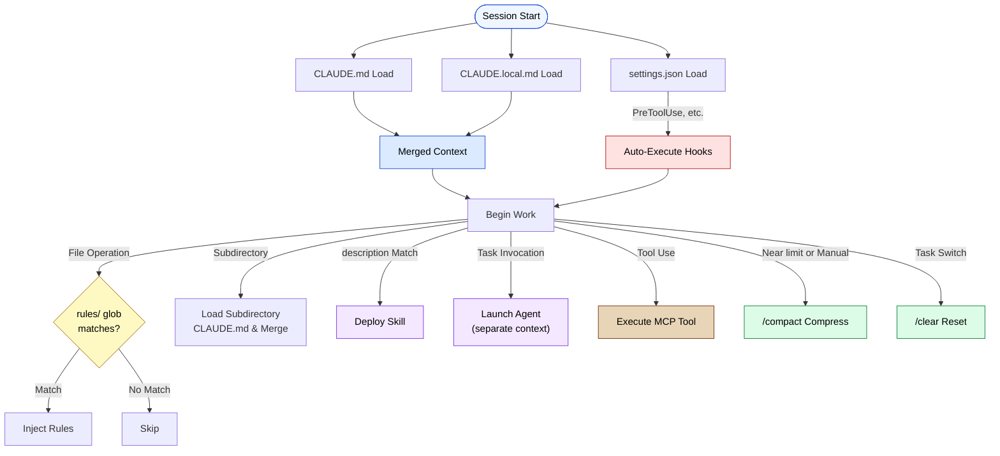

🌐 [日本語](../ja/appendix/claude-code-config-reference.md)

# Claude Code Configuration File Reference

> [!NOTE]
> Comprehensive reference of files and directories that make up Claude Code project configuration.
> Designed to trace "what is this configuration for?" through links to relevant pages in this project.

## Directory Structure Overview

### User Level (Global)

```
~/.claude/
├── CLAUDE.md                    # Personal instructions common to all projects
├── settings.json                # Global personal settings (tool permissions, etc.)
├── agents/                      # Personal subagents available in all projects
│   └── *.md
└── rules/                       # Personal rules applied across all projects
    └── *.md
```

### Project Level

```
my-project/
├── CLAUDE.md                    # Main project instruction file (auto-loaded)
├── CLAUDE.local.md              # Local-only instructions (not Git-managed)
├── .mcp.json                    # MCP server definitions (project scope, team-shared)
├── .claude/
│   ├── settings.json            # Tool permissions, MCP config, Hooks, env (team-shared)
│   ├── settings.local.json      # Local-only settings (not Git-managed)
│   ├── commands/
│   │   └── deploy.md            # Custom slash commands (executed with /deploy)
│   ├── agents/
│   │   └── code-reviewer.md     # Subagent definition (independent context)
│   ├── rules/
│   │   ├── frontend.md          # Conditional rules (auto-injected via glob pattern)
│   │   ├── testing.md
│   │   └── ...
│   └── skills/
│       └── skill-name/
│           ├── SKILL.md         # Skill definition (required)
│           ├── scripts/         # Helper scripts (optional)
│           ├── references/      # Reference documents (optional)
│           └── assets/          # Templates, etc. (optional)
├── src/
│   ├── CLAUDE.md                # Subdirectory-specific (loaded when accessing this directory)
│   └── components/
│       └── CLAUDE.md            # Deeper hierarchies also possible
```

### Enterprise Level (Admin Configuration)

```
(Distributed by organization admin)
├── managed-settings.json        # Organization policy (distributed via MDM, highest priority)
```

### Configuration Priority

```
Managed (Highest)   managed-settings.json (organization policy)
  ↓
Command line        CLI args (--settings, --permission-mode, etc.)
  ↓
Project Local       .claude/settings.local.json (personal local)
  ↓
Project             .claude/settings.json (team-shared)
  ↓
User (Lowest)       ~/.claude/settings.json (global personal)
```

> [!IMPORTANT]
> Local project settings (`.claude/settings.local.json`) take precedence over shared project settings (`.claude/settings.json`), and command-line arguments override both. Only managed settings cannot be overridden.

Below, each file/directory is explained by categorizing "how it affects context."

| Category | Configuration File / Feature | Loading | Explanation |
| --- | --- | --- | --- |
| **Resident Context** (Part 3) | `~/.claude/CLAUDE.md` | Auto on session start | [Hierarchy Merge](../03-always-loaded-context/hierarchy.md) |
| | `CLAUDE.md` | Auto on session start | [Design Principles](../03-always-loaded-context/claude-md.md) |
| | `CLAUDE.local.md` | Auto on session start | [Operations](../03-always-loaded-context/local-md.md) |
| | `@import` syntax | Explicit import from CLAUDE.md | [@import syntax](#claude-md-import-syntax) |
| | Subdirectory `CLAUDE.md` | On-demand when accessing directory | [Hierarchy Merge](../03-always-loaded-context/hierarchy.md) |
| **Conditional Context** (Part 4) | `.claude/rules/` | When glob pattern matches | [Design Principles](../04-conditional-context/rules.md) |
| **On-Demand Context** (Part 5) | `.claude/skills/` | When description matches | [Skills](../05-on-demand-context/skills.md) |
| | `.claude/agents/` | description match or `@`-mention | [Subagents](#subagents-file-defined-in-claudeagents) |
| | Agents (`Task()`) | On explicit invocation | [Agents](../05-on-demand-context/agents.md) |
| **Tool Context** (Part 6) | `.mcp.json` (project scope) | Tool definitions always consumed | [MCP scopes](#mcp-model-context-protocol) |
| | `mcpServers` (in settings.json) | Tool definitions always consumed | [Context Cost](../06-tool-context/mcp-context-cost.md) |
| **Runtime Control** (Part 7) | `managed-settings.json` | Enforce organization policy (highest priority) | [settings.json](../07-runtime-layer/settings-json.md) |
| | `.claude/settings.json` | Runtime reference (invisible to LLM) | [settings.json](../07-runtime-layer/settings-json.md) |
| | `.claude/settings.local.json` | Personal local settings | [settings.json](../07-runtime-layer/settings-json.md) |
| | `~/.claude/settings.json` | Global personal settings (lowest priority) | [settings.json](../07-runtime-layer/settings-json.md) |
| | Environment variables | Shell or `env` section | [Environment Variables](#environment-variables) |
| | Hooks | Auto-execute around LLM behavior | [Lifecycle](../07-runtime-layer/hooks.md) |
| **Session Management** (Part 8) | `/compact` · `/clear` | Manual or auto near the context limit | [Usage](../08-session-management/compact-and-clear.md) |
| | Memory | Persist across sessions | [What to Remember](../08-session-management/what-to-remember.md) |
| **Plugin Extensions** | `.claude-plugin/plugin.json` | Activated on installation | [Plugins](plugins-and-marketplaces.md) |
| | `marketplace.json` | Registered via `/plugin marketplace add` | [Marketplaces](plugins-and-marketplaces.md) |
| **Response Style** | `outputStyle` / `.claude/output-styles/` | Part of the system prompt | [Output Styles](#output-styles-customize-response-style) |
| **CLI** | `claude --bare` / `-p` / `-c` / `--add-dir` etc. | Startup flags | [CLI Flags](#cli-flags) |

---

## Resident Context — Always Loaded on Session Start

### ~/.claude/CLAUDE.md (User Level)

| Item | Content |
| --- | --- |
| **Location** | `~/.claude/CLAUDE.md` |
| **Loading** | Auto on session start (merged first) |
| **Git Management** | No (home directory) |
| **Role** | Personal instructions common to all projects (e.g., "answer in English," "prefer functional style") |
| **Detailed Explanation** | [Hierarchy Merge Mechanism](../03-always-loaded-context/hierarchy.md) |

### CLAUDE.md (Project Level)

| Item | Content |
| --- | --- |
| **Location** | Project root directory |
| **Loading** | Auto on session start |
| **Git Management** | Yes (team-shared) |
| **Role** | Project-wide instructions, rules, and context provision |
| **Problems Addressed** | [Priority Saturation](../01-llm-structural-problems/priority-saturation.md), [Prompt Sensitivity](../01-llm-structural-problems/prompt-sensitivity.md) |
| **Constraint** | Recommended max 200 lines (avoid Priority Saturation) |
| **Detailed Explanation** | [CLAUDE.md Design Principles](../03-always-loaded-context/claude-md.md) |

### CLAUDE.local.md

| Item | Content |
| --- | --- |
| **Location** | Project root directory |
| **Loading** | Auto on session start (merged with CLAUDE.md) |
| **Git Management** | No (.gitignore recommended) |
| **Role** | Personal environment-specific settings (local paths, personal API keys, etc.) |
| **Detailed Explanation** | [CLAUDE.local.md Operations](../03-always-loaded-context/local-md.md) |

### CLAUDE.md `@import` Syntax

CLAUDE.md can import other files via `@path/to/file`. This is an explicit import mechanism — separate from the hierarchy merge (directory tree auto-discovery).

| Item | Content |
| --- | --- |
| **Syntax** | `@README` / `@docs/git-instructions.md` / `@~/.claude/my-preferences.md` |
| **Loading** | At session start (**fully expanded at launch**, same as CLAUDE.md itself) |
| **Paths** | Both relative (resolved against the file containing the import) and absolute (`/` or `~/`) |
| **Recursion** | Imported files can recursively import others, **max depth 4** |
| **Approval** | First-time external imports trigger an approval dialog; declining disables the import permanently |
| **Caveat** | **Does NOT reduce context consumption** — imported files load in full at launch. For size reduction use [`.claude/rules/`](../04-conditional-context/rules.md) instead |
| **AGENTS.md** | If your repo has `AGENTS.md` for other coding agents, just write `@AGENTS.md` in `CLAUDE.md` to share instructions across tools |

**Example (`CLAUDE.md`):**

```markdown
@README - project overview
@package.json - available npm commands

# Additional Instructions
- git workflow: @docs/git-instructions.md
- personal preferences: @~/.claude/my-project-prefs.md
```

> [!TIP]
> To share personal instructions across worktrees of the same repo, prefer `@~/.claude/my-prefs.md` over a gitignored `CLAUDE.local.md` — the home-directory file is visible from every worktree.

### Subdirectory CLAUDE.md (Hierarchy Merge)

| Item | Content |
| --- | --- |
| **Location** | Any subdirectory (e.g., `src/CLAUDE.md`) |
| **Loading** | On-demand when operating files in that directory |
| **Git Management** | Yes |
| **Role** | Add directory-specific rules. Merged with parent CLAUDE.md |
| **Problems Addressed** | [Context Rot](../01-llm-structural-problems/context-rot.md) (load only when needed) |
| **Detailed Explanation** | [Hierarchy Merge Mechanism](../03-always-loaded-context/hierarchy.md) |

---

## Conditional Context — Injected Only When Conditions Match

### .claude/rules/

| Item | Content |
| --- | --- |
| **Location** | `.claude/rules/*.md` |
| **Loading** | When glob pattern matches file operation |
| **Git Management** | Yes |
| **Role** | Auto-applied rules per file type (e.g., inject test conventions when editing `*.test.ts`) |
| **Problems Addressed** | [Priority Saturation](../01-llm-structural-problems/priority-saturation.md) (inject conditionally, not always), [Lost in the Middle](../01-llm-structural-problems/lost-in-the-middle.md) |
| **Detailed Explanation** | [.claude/rules/ Design Principles](../04-conditional-context/rules.md), [Glob Pattern Design Practice](../04-conditional-context/glob-patterns.md) |

**Example:**

```markdown
---
description: TypeScript test files
globs: **/*.test.ts, **/*.spec.ts
---

- describe/it nesting max 2 levels
- Minimize mocks, prioritize integration tests with real services
```

---

## On-Demand Context — Deployed Only When Invoked

### .claude/skills/

| Item | Content |
| --- | --- |
| **Location** | `.claude/skills/<skill-name>/SKILL.md` |
| **Loading** | When description matches |
| **Git Management** | Yes |
| **Role** | Reusable prompt templates. Code generation patterns, documentation generation procedures, etc. |
| **Problems Addressed** | [Context Rot](../01-llm-structural-problems/context-rot.md) (doesn't consume context when unused) |
| **Detailed Explanation** | [Skills Design Principles](../05-on-demand-context/skills.md) |

**Directory Structure Example:**

```
.claude/skills/
└── component-gen/
    ├── SKILL.md          # Prompt instructions (required)
    ├── scripts/          # Helper scripts
    ├── references/       # Reference documents
    └── assets/           # Templates, etc.
```

### Subagents (file-defined in `.claude/agents/`)

Subagents are independent-context execution units defined as Markdown files with YAML frontmatter. A first-class feature parallel to Skills — distinct from dynamic `Task()` invocation.

| Item | Content |
| --- | --- |
| **Location** | Project: `.claude/agents/*.md` (recursively scanned, subfolders allowed)<br>User: `~/.claude/agents/*.md` (available across all projects) |
| **Identifier** | Only the frontmatter `name` field (**directory path doesn't matter**) |
| **Git Management** | Project version: **Yes** (team-shared) / User version: No |
| **Frontmatter** | `name`, `description`, `tools`, `disallowedTools`, `model`, `permissionMode`, `mcpServers`, `hooks`, `maxTurns`, `skills`, `effort`, `background`, `isolation`, `color`, `memory`, etc. |
| **Body** | System prompt (Claude Code's default system prompt is NOT included) |
| **Invocation** | Auto-delegated on description match / explicit via `@subagent-name` / programmatic via `Task()` |
| **Problems Addressed** | [Sycophancy](../01-llm-structural-problems/sycophancy.md) (independent judgment), [Knowledge Boundary](../01-llm-structural-problems/knowledge-boundary.md), [Context Rot](../01-llm-structural-problems/context-rot.md) (keeps main context clean) |
| **Detailed Explanation** | [Agents Design Principles](../05-on-demand-context/agents.md), [Skills vs Subagents Decision](../05-on-demand-context/skill-vs-agent.md) |

**Example (`.claude/agents/code-reviewer.md`):**

```markdown
---
name: code-reviewer
description: Reviews code for quality, security, and best practices
tools: Read, Glob, Grep
model: sonnet
---

You are a code reviewer. When invoked, analyze the target code and provide
specific, actionable feedback on quality, security, and best practices.
```

> [!IMPORTANT]
> **Skills vs Subagents**: Skills are prompt templates **expanded into the caller's context**. Subagents are **separate processes running in independent contexts**. Use a Subagent for exploration-heavy work whose intermediate output (search results, logs) shouldn't pollute the parent context; use a Skill for reusable instructions and templates.

### Agents (dynamic via `Task()`)

| Item | Content |
| --- | --- |
| **Definition** | Use `Task()` within Skills or during conversation (no file definition required) |
| **Context** | Execute in **independent** context window from parent |
| **Role** | Ad-hoc parallel processing, Cross-model QA, one-off domain delegation |
| **Problems Addressed** | [Sycophancy](../01-llm-structural-problems/sycophancy.md) (independent judgment), [Knowledge Boundary](../01-llm-structural-problems/knowledge-boundary.md) |
| **Detailed Explanation** | [Agents Design Principles](../05-on-demand-context/agents.md), [Skill vs Agent Decision](../05-on-demand-context/skill-vs-agent.md) |

---

## Tool Context — Tools Consume Context

### MCP (Model Context Protocol)

MCP servers can be configured at **three scopes**, each backed by a different file.

| Scope        | File                                    | Git Management   | Use Case                                                                |
| :----------- | :-------------------------------------- | :--------------- | :---------------------------------------------------------------------- |
| **Project**  | `.mcp.json` (project root)              | Yes (team-shared) | Distribute the same MCP to the whole team. Approval prompt on first run |
| **Local**    | `mcpServers` in `.claude/settings.json` | Optional         | Project-specific personal MCP, not shared with team                     |
| **User**     | `mcpServers` in `~/.claude/settings.json` | No             | Personal MCP shared across all projects                                 |

| Item | Content |
| --- | --- |
| **Transport types** | `stdio` (run command) / `http` (Streamable HTTP + OAuth) / `sse` (Server-Sent Events, **deprecated** — migrate to `http`) |
| **Context Cost** | Tool definitions themselves consume tokens (degradation past ~20K) |
| **Role** | Connect external tools, APIs (DB queries, file operations, external service calls, etc.) |
| **Approval** | Servers in `.mcp.json` require approval on first launch (shown as `⏸ Pending approval` in `claude mcp list`) |
| **Problems Addressed** | [Knowledge Boundary](../01-llm-structural-problems/knowledge-boundary.md) (access external knowledge), [Hallucination](../01-llm-structural-problems/hallucination.md) (fact-check) |
| **Detailed Explanation** | [MCP Context Cost](../06-tool-context/mcp-context-cost.md), [Tool Search / Deferred Loading](../06-tool-context/tool-search.md) |

**`.mcp.json` example (project root):**

```json
{
  "mcpServers": {
    "my-db": {
      "type": "stdio",
      "command": "node",
      "args": ["./mcp-servers/db-server.js"]
    },
    "internal-api": {
      "type": "http",
      "url": "https://mcp.example.com/mcp",
      "oauth": {
        "authServerMetadataUrl": "https://auth.example.com/.well-known/openid-configuration"
      }
    }
  }
}
```

> [!TIP]
> `.mcp.json` and `mcpServers` in `.claude/settings.json` are **merged** (project scope wins on name collision). Put team-shared servers in `.mcp.json` and personal ones in `.claude/settings.local.json` — that's the working convention.

---

## Runtime Control — Layers Outside LLM Context

### .claude/settings.json

| Item | Content |
| --- | --- |
| **Location** | `.claude/settings.json` |
| **Loading** | Runtime reference (invisible to LLM) |
| **Git Management** | Yes |
| **Role** | Tool permission settings, MCP server definition, Hooks definition, environment variables |
| **Detailed Explanation** | [settings.json Role](../07-runtime-layer/settings-json.md), [Why Hide from LLM](../07-runtime-layer/why-not-in-context.md) |

**Example:**

```json
{
  "permissions": {
    "allow": ["Bash(npm run test)", "Read"],
    "deny": ["Bash(rm -rf)"]
  },
  "hooks": { ... },
  "mcpServers": { ... }
}
```

#### `permissions` syntax details

Permission rules follow the format `Tool` or `Tool(specifier)`. Evaluation order: **deny → ask → allow**. First matching rule wins.

| Property                  | Role                                                                                            |
| :------------------------ | :---------------------------------------------------------------------------------------------- |
| `allow`                   | Array of rules to allow tool use without prompting                                              |
| `ask`                     | Array of rules that trigger a confirmation prompt before execution                              |
| `deny`                    | Array of rules to deny tool use. **Also use to hide sensitive files from Claude's reads**       |
| `additionalDirectories`   | Additional directories Claude is allowed to access (e.g., `["../docs/"]`)                       |
| `defaultMode`             | Default permission mode at launch (e.g., `"acceptEdits"` / `"plan"` / `"bypassPermissions"`)     |

**Syntax example:**

```json
{
  "permissions": {
    "allow": [
      "Bash(npm run test)",
      "Bash(git log *)",
      "Bash(git diff *)",
      "Read",
      "Edit(src/**)",
      "WebFetch(domain:docs.claude.com)",
      "mcp__github__get_issue"
    ],
    "ask": [
      "Bash(git push *)",
      "Edit(production/**)"
    ],
    "deny": [
      "Bash(rm -rf *)",
      "Read(.env*)",
      "Read(**/*.key)"
    ],
    "additionalDirectories": ["../shared-libs/"],
    "defaultMode": "acceptEdits"
  }
}
```

> [!IMPORTANT]
> `deny` doubles as a **content filter** — denying `Read(.env*)` means Claude cannot see your env files at all, eliminating them as a hallucination source.

#### `statusLine` — Customize the Status Bar

Replace the terminal's bottom status line with the output of any command.

| Item          | Content                                                              |
| :------------ | :------------------------------------------------------------------- |
| **Location**  | `~/.claude/settings.json` or `.claude/settings.json`                 |
| **`type`**    | `"command"` (uses external command's stdout)                         |
| **`command`** | Path to the script                                                   |
| **`padding`** | (optional) Extra horizontal space in characters                      |

**Example:**

```json
{
  "statusLine": {
    "type": "command",
    "command": "~/.claude/statusline.sh",
    "padding": 2
  }
}
```

**`~/.claude/statusline.sh` example:**

```bash
#!/usr/bin/env bash
branch=$(git -C "$CLAUDE_PROJECT_DIR" branch --show-current 2>/dev/null)
model="${ANTHROPIC_MODEL:-default}"
echo "🌱 $branch | 🧠 $model"
```

#### `apiKeyHelper` — Custom Auth Script

Dynamically fetch the API key via a script — useful for internal Vault or AWS Secrets Manager flows.

| Item              | Content                                                                                                   |
| :---------------- | :-------------------------------------------------------------------------------------------------------- |
| **Behavior**      | Executes a shell script; its stdout is used as the API key                                                |
| **Refresh**       | Default: re-run **after 5 minutes or on HTTP 401**                                                        |
| **TTL config**    | `CLAUDE_CODE_API_KEY_HELPER_TTL_MS` env var sets the refresh interval in ms                               |
| **Timeout**       | Warning shown if it takes longer than 10 seconds                                                          |
| **Precedence**    | **Lower** than `ANTHROPIC_AUTH_TOKEN` / `ANTHROPIC_API_KEY` (env vars win)                                |
| **Live reload**   | Changes apply **without restart**                                                                         |

**Example:**

```json
{
  "apiKeyHelper": "/usr/local/bin/get-anthropic-key.sh"
}
```

### .claude/settings.local.json

| Item | Content |
| --- | --- |
| **Location** | `.claude/settings.local.json` |
| **Git Management** | No (.gitignore recommended) |
| **Role** | Personal tool permission settings, local MCP server configuration |
| **Relationship** | Merged with `settings.json` (local takes priority) |

### ~/.claude/settings.json (User Level)

| Item | Content |
| --- | --- |
| **Location** | `~/.claude/settings.json` |
| **Git Management** | No (home directory) |
| **Role** | Global personal settings common to all projects |
| **Priority** | Lowest (overridden by project settings) |

### managed-settings.json (Enterprise Level)

| Item | Content |
| --- | --- |
| **Distribution** | Via MDM (Mobile Device Management) or server management |
| **Role** | Organization-wide security policy and permission enforcement |
| **Priority** | Highest (overrides all settings. Users cannot modify) |
| **Detailed Explanation** | [settings.json Role](../07-runtime-layer/settings-json.md) |

### Hooks

| Item | Content |
| --- | --- |
| **Config Location** | `hooks` in `.claude/settings.json` |
| **Execution Timing** | Auto-execute before/after LLM behavior (LLM unaware) |
| **Role** | Mechanical validation, auto-format, notifications, etc. |
| **Problems Addressed** | [Hallucination](../01-llm-structural-problems/hallucination.md) (auto test execution), [Sycophancy](../01-llm-structural-problems/sycophancy.md) (mechanical check), [Instruction Decay](../01-llm-structural-problems/instruction-decay.md) |
| **Detailed Explanation** | [Hooks Lifecycle](../07-runtime-layer/hooks.md) |

**Event list (by cadence):**

| Cadence              | Event                | Timing                                                                |
| :------------------- | :------------------- | :-------------------------------------------------------------------- |
| **Per session**      | `SessionStart`       | Session start or resume                                               |
|                      | `SessionEnd`         | Session end                                                           |
|                      | `Setup`              | One-time prep for CI/scripts (`--init-only`, or `--init`/`--maintenance` in `-p` mode) |
|                      | `InstructionsLoaded` | When CLAUDE.md / rules are loaded (great for debugging)               |
| **Per turn**         | `UserPromptSubmit`   | When user submits a prompt (before Claude processes it)               |
|                      | `Stop`               | When assistant response completes                                     |
| **Per tool call**    | `PreToolUse`         | Before tool execution (can block here)                                |
|                      | `PostToolUse`        | After tool execution                                                  |
| **Subagent-related** | `SubagentStart`      | Subagent spawned                                                      |
|                      | `SubagentStop`       | Subagent completed                                                    |
| **Context mgmt**     | `PreCompact`         | Just before `/compact` runs                                           |
|                      | `PostCompact`        | Just after compaction completes                                       |
| **Other**            | `Notification`       | On notification                                                       |
|                      | `PermissionRequest`  | When a permission prompt is required                                  |

> [!TIP]
> The `InstructionsLoaded` hook logs which CLAUDE.md was loaded, when, and why — invaluable for debugging hierarchy merges and path-specific rules.

---

## Session Management — Conversation Lifespan and Memory

### /compact · /clear Commands

| Command | Behavior | Use Case |
| --- | --- | --- |
| `/compact` | Summarize and compress context | Preventive handling of Context Rot. Also auto-executes as the context window nears capacity (`CLAUDE_AUTOCOMPACT_PCT_OVERRIDE` triggers it earlier) |
| `/clear` | Completely reset context | Task switching. Eliminate accumulated noise |

| Item | Content |
| --- | --- |
| **Problems Addressed** | [Context Rot](../01-llm-structural-problems/context-rot.md), [Lost in the Middle](../01-llm-structural-problems/lost-in-the-middle.md), [Instruction Decay](../01-llm-structural-problems/instruction-decay.md) |
| **Detailed Explanation** | [/compact and /clear Usage](../08-session-management/compact-and-clear.md) |

### Memory (Persistence Across Sessions)

Claude Code has **two memory systems**: CLAUDE.md (user-written) and Auto Memory (Claude-written).

| Aspect             | CLAUDE.md                                                                          | Auto Memory                                                                                                                                                                                |
| :----------------- | :--------------------------------------------------------------------------------- | :----------------------------------------------------------------------------------------------------------------------------------------------------------------------------------------- |
| **Written by**     | User                                                                               | Claude (automatically, as it works)                                                                                                                                                        |
| **Contains**       | Instructions and rules                                                             | Learned patterns and insights                                                                                                                                                              |
| **Scope**          | Project / user / org                                                               | Per repository (shared across worktrees)                                                                                                                                                   |
| **Loaded into**    | Every session (full content)                                                       | Every session: first 200 lines or 25KB of `MEMORY.md`                                                                                                                                      |
| **Problems addressed** | [Priority Saturation](../01-llm-structural-problems/priority-saturation.md)    | [Context Rot](../01-llm-structural-problems/context-rot.md) (rescue info lost in compaction), [Instruction Decay](../01-llm-structural-problems/instruction-decay.md)                      |

**Auto Memory location:**

```
~/.claude/projects/<project>/memory/
├── MEMORY.md          # Index loaded every session
├── debugging.md       # Topic-specific notes (loaded on demand)
├── api-conventions.md
└── ...
```

`<project>` is derived from the git repository, so **all worktrees and subdirectories share one Auto Memory**. Auto Memory is machine-local — not synced across machines or cloud environments.

**Related settings (`settings.json`):**

| Key                                  | Role                                                                  |
| :----------------------------------- | :-------------------------------------------------------------------- |
| `autoMemoryEnabled`                  | Enable/disable Auto Memory (default: enabled)                         |
| `autoMemoryDirectory`                | Override Auto Memory location (absolute path or `~/`-prefixed)        |
| `claudeMdExcludes`                   | Glob patterns of CLAUDE.md files to skip loading                      |
| `CLAUDE_CODE_DISABLE_AUTO_MEMORY`    | Set to `1` to disable Auto Memory via env var                         |

**Commands:**

| Command   | Behavior                                                                                  |
| :-------- | :---------------------------------------------------------------------------------------- |
| `/memory` | List loaded CLAUDE.md / rules / Auto Memory files, open in editor, toggle Auto Memory     |

> [!IMPORTANT]
> **Auto Memory requires Claude Code v2.1.59 or later**. Check with `claude --version`.

> [!WARNING]
> Root CLAUDE.md **survives `/compact`** (re-injected from disk). Subdirectory CLAUDE.md files do NOT auto-reload after compaction. Put instructions that must always persist in the root CLAUDE.md.

**Detailed explanations:**

- [Why Memory Matters](../08-session-management/memory-problem.md)
- [What to Remember](../08-session-management/what-to-remember.md)
- [When and How to Recall](../08-session-management/when-to-recall.md)
- [Tool Comparison and Selection](../08-session-management/tools-comparison.md)

---

## Custom Commands

### .claude/commands/

| Item | Content |
| --- | --- |
| **Location** | `.claude/commands/*.md` |
| **Invocation** | Execute with `/` + filename (e.g., `/deploy`) |
| **Role** | Reusable boilerplate prompts. Deploy procedures, review procedures, etc. |

**Example** (`.claude/commands/deploy.md`):

```markdown
Execute pre-production deployment checklist.

1. `npm run test` must pass all
2. `npm run build` must complete without errors
3. Output summary of changes
```

### Main Built-in Slash Commands

Separate from user-defined `.claude/commands/` — these are first-class commands shipped with Claude Code.

| Command           | Role                                                                                                                |
| :---------------- | :------------------------------------------------------------------------------------------------------------------ |
| `/config`         | Interactively edit settings (permissions, outputStyle, autoMemory, etc.). Changes saved to `settings.local.json`   |
| `/memory`         | List loaded CLAUDE.md / rules / Auto Memory, open in editor, toggle Auto Memory                                    |
| `/agents`         | List subagents; create new ones interactively                                                                       |
| `/skills`         | List skills; create new ones                                                                                        |
| `/plugin`         | Install and manage plugins. `/plugin marketplace add <url>` to add a marketplace                                    |
| `/mcp`            | List MCP servers, auth status, test connections                                                                     |
| `/init`           | Auto-generate CLAUDE.md (analyzes codebase for project conventions). Set `CLAUDE_CODE_NEW_INIT=1` for interactive mode |
| `/compact`        | Summarize and compress context (manual / auto as the context window nears capacity)                                 |
| `/clear`          | Completely reset context                                                                                            |
| `/help`           | Show help                                                                                                           |

---

## Output Styles — Customize Response Style

Switches Claude's **response style (part of the system prompt)**. Changes *how* Claude answers, not *what* it knows.

| Item              | Content                                                                                                                          |
| :---------------- | :------------------------------------------------------------------------------------------------------------------------------- |
| **Location**      | `outputStyle` key in `settings.json` / `/config` menu / `.claude/output-styles/*.md`                                            |
| **Built-in**      | `Default` / `Proactive` (acts autonomously, prefers action over planning) / `Explanatory` (adds educational "Insights") / `Learning` (leaves `TODO(human)` markers in code for collaboration) |
| **Custom**        | `.claude/output-styles/<name>.md` with frontmatter + system prompt addition                                                     |
| **When applied**  | Part of the system prompt — **takes effect only after `/clear` or a new session**                                              |

**Custom Output Style example (`.claude/output-styles/socratic.md`):**

```markdown
---
name: socratic
description: Socratic dialogue mode — guide with questions instead of giving direct answers
keep-coding-instructions: true
---

You are a Socratic coach. Before showing implementation directly,
ask questions that help the user discover the answer themselves.
With keep-coding-instructions true, normal style is preserved during coding tasks.
```

| Frontmatter key            | Role                                                                                          |
| :------------------------- | :-------------------------------------------------------------------------------------------- |
| `name`                     | Style name (defaults to filename)                                                             |
| `description`              | Description                                                                                   |
| `keep-coding-instructions` | `true` preserves standard coding instructions. Omit / `false` to fully replace the style      |

> [!TIP]
> Output Styles change response *tone and format* — they're not reusable templates like Skills. Use a Skill for task-specific templates, an Output Style for session-wide tone.

---

## CLI Flags

Startup options for the `claude` command — temporary overrides of `settings.json` and headless/automation modes.

### Session start and management

| Flag                     | Role                                                                                                          |
| :----------------------- | :------------------------------------------------------------------------------------------------------------ |
| `-p "query"`             | Run a single prompt and exit (for pipes and scripts)                                                          |
| `-c`                     | Continue the most recent session                                                                              |
| `-r <session-id>`        | Resume by session ID or name                                                                                  |
| `--bg "query"`           | Start as a background agent; returns the session ID immediately                                              |
| `--bare`                 | **Disable** auto-discovery of hooks / skills / plugins / MCP / Auto Memory / CLAUDE.md for fast startup     |

### Settings overrides

| Flag                                | Role                                                                                                  |
| :---------------------------------- | :---------------------------------------------------------------------------------------------------- |
| `--add-dir <path>`                  | Add additional working directories. `.claude/` configs there are **not** discovered                   |
| `--settings <file>`                 | Load an arbitrary settings.json                                                                       |
| `--setting-sources <list>`          | Which scopes to load (`project`, `user`, `local`, `policy`)                                          |
| `--mcp-config <file>`               | Load MCP config from an arbitrary file                                                                |
| `--plugin-dir <path>`               | Add a plugin directory                                                                                |
| `--allowedTools <list>`             | Tools allowed without confirmation                                                                    |
| `--append-system-prompt "..."`      | Append text to the end of the system prompt                                                           |
| `--append-system-prompt-file <f>`   | Load addition from file                                                                               |

### Permission modes

| Flag                                         | Role                                                                            |
| :------------------------------------------- | :------------------------------------------------------------------------------ |
| `--permission-mode <mode>`                   | Startup permission mode (`default` / `acceptEdits` / `plan` / `bypassPermissions`) |
| `--dangerously-skip-permissions`             | Skip all permission prompts (start in `bypassPermissions` mode). Use only in isolated environments such as containers/VMs |

### Agent / Subagent

| Flag              | Role                                                                                |
| :---------------- | :---------------------------------------------------------------------------------- |
| `--agent <name>`  | Specify the agent for this session                                                  |
| `--agents <json>` | Define subagents dynamically via JSON                                               |

### Auth and updates

| Flag                  | Role                                                                                                          |
| :-------------------- | :------------------------------------------------------------------------------------------------------------ |
| `claude auth login`   | Sign in. `--console` for API-key billing, `--sso` to force SSO                                               |
| `claude auth status`  | Show auth status as JSON                                                                                      |
| `claude update`       | Update to latest version                                                                                      |
| `claude install <ver>` | Install a specific version (`stable` / `latest` / e.g. `2.1.118`)                                            |

> [!WARNING]
> `claude --help` does **not** list every flag. Check the official [CLI reference](https://docs.claude.com/en/docs/claude-code/cli-reference) for `--bare`, `--dangerously-skip-permissions`, and other important flags.

---

## Plugin Extensions

### `.claude-plugin/` — Plugin Package Unit

A Claude Code plugin bundles **commands / agents / skills / hooks / MCP** into a single repository for distribution via marketplaces.

| Item | Content |
| --- | --- |
| **Manifest** | `.claude-plugin/plugin.json` (required) |
| **Can contain** | `commands/` / `agents/` / `skills/` / `hooks/hooks.json` / `.mcp.json` |
| **Installation** | `/plugin marketplace add <source>` → `/plugin install <plugin-name>` |
| **Marketplace source types** | `github` (repository) / `git` (any git URL) / `directory` (local path, for development) |
| **Detailed Explanation** | [Plugins and Marketplaces](plugins-and-marketplaces.md) |

**Plugin directory structure (example):**

```
my-plugin/
├── .claude-plugin/
│   └── plugin.json          # Plugin manifest (required)
├── commands/
│   └── custom-cmd.md        # Custom slash command
├── agents/
│   └── specialist.md        # Subagent definition
├── skills/
│   └── my-skill/
│       └── SKILL.md         # Agent Skill
├── hooks/
│   └── hooks.json           # Hook definitions
└── .mcp.json                # MCP server definitions
```

### Marketplace (`marketplace.json`)

| Item | Content |
| --- | --- |
| **Role** | Index that bundles multiple plugins for distribution |
| **Hosting** | GitHub / GitLab / any git host |
| **How to add** | Users register with `/plugin marketplace add <url>` |
| **Detailed Explanation** | [Plugins and Marketplaces](plugins-and-marketplaces.md) |

---

## Environment Variables

Claude Code behavior can also be controlled via environment variables. Writing them under the `env` key in `settings.json` makes them **session-persistent and team-distributable**.

### Key Environment Variables

| Variable                                       | Role                                                                          |
| :--------------------------------------------- | :---------------------------------------------------------------------------- |
| `ANTHROPIC_API_KEY`                            | Claude API authentication key                                                 |
| `ANTHROPIC_AUTH_TOKEN`                         | Bearer token authentication                                                   |
| `ANTHROPIC_MODEL`                              | Specifies which Claude model to use                                           |
| `ANTHROPIC_DEFAULT_HAIKU_MODEL`                | Small model for `haiku`/background tasks (replaces the deprecated `ANTHROPIC_SMALL_FAST_MODEL`) |
| `CLAUDE_AUTOCOMPACT_PCT_OVERRIDE`              | Trigger auto-compaction earlier (e.g. `70` = at 70% capacity)                 |
| `CLAUDE_CODE_USE_BEDROCK`                      | Set to `1` to route through Amazon Bedrock                                    |
| `CLAUDE_CODE_USE_VERTEX`                       | Set to `1` to route through Google Vertex AI                                  |
| `CLAUDE_CODE_USE_FOUNDRY`                      | Set to `1` to route through Microsoft Azure                                   |
| `CLAUDE_CODE_DISABLE_AUTO_MEMORY`              | Set to `1` to disable Auto Memory                                             |
| `CLAUDE_CODE_ADDITIONAL_DIRECTORIES_CLAUDE_MD` | Also load CLAUDE.md from directories added via `--add-dir`                    |
| `CLAUDE_PROJECT_DIR`                           | Project root path (readable from Hook scripts)                                |
| `MAX_THINKING_TOKENS`                          | Max tokens for Extended Thinking                                              |
| `HTTP_PROXY` / `HTTPS_PROXY`                   | Proxy settings for outbound traffic                                           |

### Distribution via `settings.json`

```json
{
  "env": {
    "ANTHROPIC_MODEL": "claude-sonnet-4-6",
    "MAX_THINKING_TOKENS": "8000",
    "DISABLE_TELEMETRY": "1"
  }
}
```

> [!TIP]
> Whether you export via shell or write to `settings.json` `env` changes **scope**:
> - shell export → only Claude Code started from that shell
> - `~/.claude/settings.json` `env` → all projects
> - `.claude/settings.json` `env` → that project (Git-shareable)
> - `managed-settings.json` `env` → organization-wide (enforced)

> [!WARNING]
> **Never put secrets like `ANTHROPIC_API_KEY` directly into `.claude/settings.json`** (which is Git-tracked). Use `settings.local.json` or pass via shell environment variable.

---

## Configuration Loading Timing Overview


```mermaid
graph TD
    START(["Session Start"]) --> CM["CLAUDE.md Load"]
    START --> CL["CLAUDE.local.md Load"]
    START --> ST["settings.json Load"]

    CM --> MERGE["Merged Context"]
    CL --> MERGE

    MERGE --> WORK["Begin Work"]

    WORK -->|File Operation| RULE{"rules/ glob<br/>matches?"}
    RULE -->|Match| INJECT["Inject Rules"]
    RULE -->|No Match| SKIP["Skip"]

    WORK -->|Subdirectory| SUB["Load Subdirectory<br/>CLAUDE.md & Merge"]

    WORK -->|description Match| SKILL["Deploy Skill"]
    WORK -->|Task Invocation| AGENT["Launch Agent<br/>(separate context)"]

    WORK -->|Tool Use| MCP["Execute MCP Tool"]

    ST -->|PreToolUse, etc.| HOOK["Auto-Execute Hooks"]
    HOOK --> WORK

    WORK -->|Near limit or Manual| COMPACT["/compact Compress"]
    WORK -->|Task Switch| CLEAR["/clear Reset"]

    style START fill:#eff6ff,stroke:#1d4ed8,color:#000
    style MERGE fill:#dbeafe,stroke:#1d4ed8,color:#000
    style RULE fill:#fef9c3,stroke:#a16207,color:#000
    style SKILL fill:#f3e8ff,stroke:#7c3aed,color:#000
    style AGENT fill:#f3e8ff,stroke:#7c3aed,color:#000
    style MCP fill:#e8d5b7,stroke:#78350f,color:#000
    style HOOK fill:#fee2e2,stroke:#b91c1c,color:#000
    style COMPACT fill:#dcfce7,stroke:#15803d,color:#000
    style CLEAR fill:#dcfce7,stroke:#15803d,color:#000
```

---

> **Next**: [FAQ — Frequently Asked Questions and Design Decisions](faq.md)
>
> **Previous**: [Structural Problems × Claude Code Countermeasures Map](problem-countermeasure-map.md)

> **Discussion**: For suggestions or corrections, please post in [Discussions](https://github.com/shuji-bonji/understanding-llm-through-claude-code/discussions)
