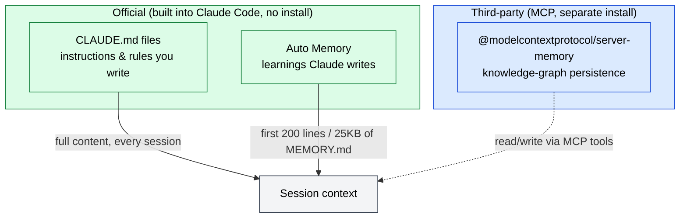

🌐 [日本語](../ja/appendix/claude-code-memory.md)

# Claude Code Memory Mechanisms — CLAUDE.md / rules / Auto Memory / server-memory

> [!NOTE]
> A single-page reference for **how Claude Code carries information across sessions**.
> Every session starts with a fresh context window. Two mechanisms fill it: CLAUDE.md (instructions you write) and Auto Memory (learnings Claude writes), plus a third-party MCP implementation, `server-memory`. Not confusing these three is the starting point.

## Overview — three kinds of memory



| Category    | Name                                  | Provider           | Role                                                          |
| :---------- | :------------------------------------ | :----------------- | :----------------------------------------------------------- |
| Official    | CLAUDE.md files / Auto Memory         | Anthropic (bundled)| Dev-focused: conventions, build commands, learned patterns   |
| Third-party | `@modelcontextprotocol/server-memory` | MCP official repo  | General knowledge graph: conversation personalization, relations |

> [!IMPORTANT]
> Both CLAUDE.md and Auto Memory are injected as **context, not enforced configuration**, at the start of every session. Claude reads and tries to follow them, but strict compliance is not guaranteed. For anything that **must** run (e.g. lint before every commit), enforce it with a [PreToolUse hook](../07-runtime-layer/hooks.md), not memory.

## 1. CLAUDE.md — instructions you write

### Locations and load order

CLAUDE.md can live in several places. Files load **broadest scope → most specific**, so a file loaded later (closer to your working directory) wins.

| Scope                    | Location                                                                                                                    | Purpose                          | Shared with              |
| :----------------------- | :------------------------------------------------------------------------------------------------------------------------- | :------------------------------- | :----------------------- |
| **Managed policy**       | macOS: `/Library/Application Support/ClaudeCode/CLAUDE.md`<br />Linux/WSL: `/etc/claude-code/CLAUDE.md`<br />Windows: `C:\Program Files\ClaudeCode\CLAUDE.md` | Org-wide policy (IT/DevOps)      | All users in org         |
| **User instructions**    | `~/.claude/CLAUDE.md`                                                                                                       | Personal prefs, all projects     | Just you (all projects)  |
| **Project instructions** | `./CLAUDE.md` or `./.claude/CLAUDE.md`                                                                                      | Team-shared project rules        | Team (source control)    |
| **Local instructions**   | `./CLAUDE.local.md`                                                                                                         | Personal project-specific prefs  | Just you (this project)  |

CLAUDE.md / CLAUDE.local.md files **above** your working directory load in full at launch. Files in **subdirectories** load on demand when Claude reads files there. Discovered files are **concatenated**, not overridden, ordered from filesystem root down to the working directory.

> [!TIP]
> Run `/init` to generate a starter CLAUDE.md. If one already exists, `/init` suggests improvements instead of overwriting. Verify what actually loaded via `/context` under **Memory files**.

### Write effective instructions

CLAUDE.md consumes context **in full** every session — longer files cost more tokens and lower adherence.

- **Size**: aim for **under 200 lines** per file. If it grows, split with path-scoped rules below.
- **Specificity**: "Use 2-space indentation" beats "format code properly"; "Run `npm test` before committing" beats "test your changes." Write instructions concrete enough to verify.
- **Consistency**: contradictory rules make Claude pick one arbitrarily. Periodically prune conflicts across CLAUDE.md, nested files, and `.claude/rules/`.

### Imports (`@path` syntax)

CLAUDE.md can pull in files with `@path/to/file`. Relative paths resolve **relative to the importing file**. Recursion is capped at a **maximum depth of four hops**.

```markdown
See @README for the overview and @package.json for npm commands.

# Git workflow
- @docs/git-workflow.md
```

- Import parsing skips code spans and fenced blocks. To mention a path literally, wrap it in backticks (`` `@README` `` is not imported).
- **External imports** (outside the working directory, e.g. `@~/.claude/...`) trigger a one-time approval dialog — protection against files others commit to a shared repo. User-scope imports (`~/.claude/CLAUDE.md` etc.) load without a dialog since you wrote them.
- Imports are for **organization**, not context savings — imported files still load in full at launch.

> [!TIP]
> If your repo already uses `AGENTS.md`, put `@AGENTS.md` in `CLAUDE.md` so both tools share instructions (Claude Code does not read `AGENTS.md` directly).

## 2. `.claude/rules/` — modular rules

For large projects, splitting into **topic files** beats one giant CLAUDE.md. `.claude/rules/*.md` are discovered recursively; those **without** `paths` load at launch at the **same priority as `.claude/CLAUDE.md`**.

```
your-project/
├── .claude/
│   ├── CLAUDE.md           # Main project instructions
│   └── rules/
│       ├── code-style.md   # Code style
│       ├── testing.md      # Testing conventions
│       └── security.md     # Security requirements
```

### Path-scoped rules (`paths` frontmatter)

YAML `paths` frontmatter makes a rule conditional — it loads **only when Claude touches matching files**, cutting noise and saving context.

```markdown
---
paths:
  - "src/api/**/*.ts"
---

# API Development Rules
- All API endpoints must include input validation
- Use the standard error response format
```

| Pattern                | Matches                                     |
| :--------------------- | :------------------------------------------ |
| `**/*.ts`              | All TypeScript files in any directory       |
| `src/**/*`             | All files under `src/`                       |
| `*.md`                 | Markdown in the project root                 |
| `src/**/*.{ts,tsx}`    | Brace expansion for multiple extensions      |

- Rules **without** `paths` apply to all files unconditionally.
- User-level `~/.claude/rules/*.md` apply to every project and load **before** project rules (so project rules win).
- `.claude/rules/` supports symlinks — share one rule set across projects.

> [!NOTE]
> **Rules vs skills**: rules are resident (loaded every session, or when a matching file opens). Procedures needed **only for a specific task** belong in [skills](../05-on-demand-context/skills.md), which load only when invoked or judged relevant.

## 3. Auto Memory — learnings Claude writes

Auto Memory is notes Claude writes for **itself** while working: build commands, debugging insights, style preferences — saved when Claude judges they'd help a future session (not every session). It runs in the **opposite direction** from CLAUDE.md.

### Location and mechanics

```
~/.claude/projects/<project>/memory/
├── MEMORY.md          # Index. First 200 lines / 25KB loaded every session
├── debugging.md       # Topic notes (loaded on demand)
├── api-conventions.md
└── ...
```

- `<project>` is derived from the git repository, so **all worktrees and subdirectories share one Auto Memory**. Outside a git repo, the working-directory root is used.
- **Machine-local** — not synced across machines or cloud.
- `MEMORY.md` is an **index**; only the first 200 lines or 25KB (whichever comes first) loads. Detail lives in topic files Claude reads on demand.
- Files with frontmatter get a `modified` (ISO 8601) timestamp on write, showing how current a fact is (v2.1.214+). Files without frontmatter never get one added.

### Enable / disable

**On by default.** Toggle via the `/memory` auto-memory switch (saved as `autoMemoryEnabled` in `~/.claude/settings.json`).

```json
{ "autoMemoryEnabled": false }
```

Disable via env var with `CLAUDE_CODE_DISABLE_AUTO_MEMORY=1`. Change the location with `autoMemoryDirectory` (absolute or `~/`-prefixed).

> [!TIP]
> You can teach it directly: "remember we use pnpm," "save to memory that API tests need a local Redis." To put something in CLAUDE.md instead, say "add this to CLAUDE.md."

> [!IMPORTANT]
> **Auto Memory requires Claude Code v2.1.59 or later.** Check with `claude --version`.

## 4. server-memory (MCP) — a separate thing

`@modelcontextprotocol/server-memory` is the MCP official-repo reference implementation (MIT). It is **not** a built-in Claude Code feature. It records Entity / Relation / Observation as a knowledge graph, fitting conversation personalization and modeling relations among people, orgs, and projects — mainly for MCP clients like Claude Desktop.

| Aspect       | Official (CLAUDE.md / Auto Memory) | server-memory (MCP)               |
| :----------- | :--------------------------------- | :-------------------------------- |
| Delivery     | Built into Claude Code             | External server via MCP           |
| Main use     | Dev rules & project knowledge      | Conversation context & user info  |
| Data format  | Markdown files                     | Knowledge graph (JSONL)           |
| Team sharing | Shareable via Git                  | File-shareable; Git not intended  |
| Setup        | None (bundled)                     | Requires MCP config               |

> [!NOTE]
> It's not either/or — the uses differ. If your goal is just dev work in Claude Code, official CLAUDE.md + Auto Memory suffice. For the design theory of an agent memory layer (knowledge graphs / Memory-first design), see the sister site [ai-agent-architecture / Memory & Knowledge Integration](https://shuji-bonji.github.io/ai-agent-architecture/concepts/08-memory-and-knowledge).

## 5. Operational strategy by scale

What you need scales with team size. Grow it incrementally.

### Solo (1 person)

```
project/
├── CLAUDE.md           # Build, stack, coding conventions
└── CLAUDE.local.md     # Local-env specifics (gitignored)
```

Put shared personal preferences in `~/.claude/CLAUDE.md`. Keep Auto Memory on so patterns accumulate. You usually don't need `.claude/rules/`.

### Small–mid team (2–10)

```
project/
├── .claude/
│   ├── CLAUDE.md               # Project-wide rules
│   └── rules/
│       ├── code-style.md
│       ├── testing.md
│       └── git-workflow.md
└── CLAUDE.local.md             # Each member's personal settings (gitignored)
```

Commit `.claude/CLAUDE.md` and `.claude/rules/` to share. Splitting rules makes convention-change PRs cleaner and easier to review.

### Large team / org (10+)

- Distribute org-wide policy via **Managed policy** (or the `claudeMd` key inside `managed-settings.json`), rolled out with MDM / Group Policy / Ansible. It can't be excluded by individual settings — good for enforcing org rules.
- Scope project rules per file type with `.claude/rules/` and `paths` frontmatter.
- In monorepos, skip other teams' CLAUDE.md with `claudeMdExcludes` (glob array). **Managed-policy CLAUDE.md cannot be excluded.**

> [!IMPORTANT]
> **CLAUDE.md and managed settings serve different purposes.** Use managed **settings** for technical enforcement (deny tools/commands/paths, sandbox, auth); use **Managed CLAUDE.md** for behavioral guidance (code quality, compliance reminders). Settings are enforced by the client; CLAUDE.md only shapes behavior.

## 6. Commands and troubleshooting

| Command    | Behavior                                                              |
| :--------- | :------------------------------------------------------------------- |
| `/init`    | Analyze the codebase and generate a starter CLAUDE.md (suggests improvements if one exists) |
| `/memory`  | List CLAUDE.md / rules / Auto Memory, open in editor, toggle Auto Memory |
| `/context` | See which Memory files **actually loaded**                            |

**When Claude isn't following CLAUDE.md**, debug in order: `/context` to confirm it loaded → check the location loads for your session → make instructions more specific → remove conflicts. If it must run at a fixed point, move it to a hook; for system-prompt-level instructions, use `--append-system-prompt`.

> [!WARNING]
> Root CLAUDE.md **survives `/compact`** (re-read from disk and re-injected), but **subdirectory CLAUDE.md files are not re-injected**. Put must-always-persist instructions in the root CLAUDE.md. Conversation-only instructions are also lost on compaction, so write anything you need to keep into CLAUDE.md.

## 🔗 Go deeper: why memory is needed

This page covered the **What/How** of memory mechanisms (what goes where and how). For **why** information is lost between sessions, and **what** to remember and **when** to recall it — from the LLM's structural constraints — see Part 8.

- [Part 8: Why Memory Matters](../08-session-management/memory-problem.md) — information loss between sessions
- [Part 8: What to Remember](../08-session-management/what-to-remember.md) — selecting what to persist
- [Part 8: When and How to Recall](../08-session-management/when-to-recall.md) — recall strategy
- [Part 8: Tool Comparison and Selection](../08-session-management/tools-comparison.md) — comparing memory tools

## References

- Anthropic (2026). "How Claude remembers your project." Claude Code Docs. [code.claude.com/docs/en/memory](https://code.claude.com/docs/en/memory) — the official reference for CLAUDE.md / rules / Auto Memory (primary source for this page)
- Arihei (2026). "Organizing Claude Code's memory features." Zenn. [zenn.dev/aria3](https://zenn.dev/aria3/articles/claude-code-memory-strategy) — separating official features from server-memory, and scale-based operations
- Model Context Protocol. "server-memory." GitHub. [github.com/modelcontextprotocol/servers](https://github.com/modelcontextprotocol/servers/tree/main/src/memory) — the MCP reference implementation of knowledge-graph persistence

---

> **Next**: [FAQ](faq.md)

> **Previous**: [Configuration Reference](claude-code-config-reference.md)
