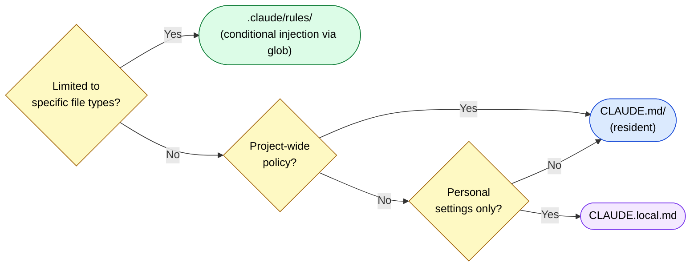

🌐 [日本語](../ja/appendix/faq.md)

# FAQ — Frequently Asked Questions and Design Decisions

> [!NOTE]
> A compilation of specific questions raised in the project's [Discussions](https://github.com/shuji-bonji/understanding-llm-through-claude-code/discussions) and their answers.
> We prioritize the thinking process behind "why we make these decisions."

## Configuration Placement Decisions

### Q: "Use mcp-mermaid for Mermaid diagrams" — where should this go?

> [Discussion #14](https://github.com/shuji-bonji/understanding-llm-through-claude-code/discussions/14)

**Conclusion: Write it in `CLAUDE.md`.**

It might seem like it could be written in `.claude/rules/` with `globs: "**/*.md"`, but this instruction applies beyond just editing Markdown. Mermaid diagrams may appear in PR descriptions, Issues, comments, and other contexts where glob patterns don't apply.

**Reasoning:**

| Perspective | Content |
| --- | --- |
| Scope of Application | Should apply not just to `.md` files, but across all contexts |
| File Type Dependency | Cannot be limited to specific glob patterns |
| Nature of Instruction | "Tool selection policy" = behavior guideline for the entire project |

**Configuration Placement Flow:**

**Comparison Examples:**

| Instruction | Location | Reason |
| --- | --- | --- |
| "Use mcp-mermaid for Mermaid diagrams" | `CLAUDE.md` | Project-wide policy regardless of file type |
| "Require OnPush change detection in `*.component.ts`" | `.claude/rules/` | Limited to specific file type |
| "Use local Ollama server" | `CLAUDE.local.md` | Personal environment-specific setting |

**Related Pages:** [CLAUDE.md Design Principles](../03-always-loaded-context/claude-md.md), [.claude/rules/ Design Principles](../04-conditional-context/rules.md)

---

> **Previous**: [Claude Code Configuration File Reference](claude-code-config-reference.md)

> New questions or discussions: [Discussions](https://github.com/shuji-bonji/understanding-llm-through-claude-code/discussions)
