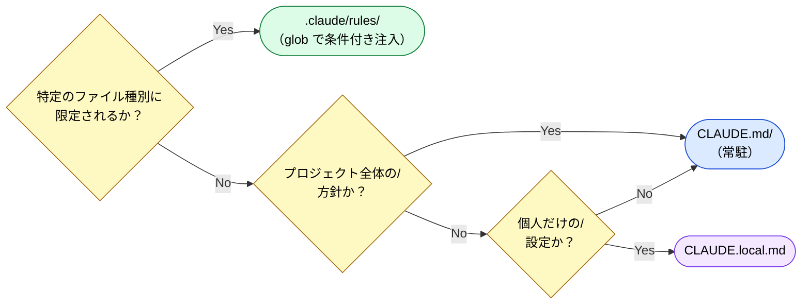

# FAQ — よくある質問と設計判断

> プロジェクトの [Discussions](https://github.com/shuji-bonji/understanding-llm-through-claude-code/discussions) で挙がった具体的な疑問と、その回答をまとめたもの。
> 「なぜそう判断するのか」の思考プロセスを重視している。

## 設定の配置判断

### Q: 「Mermaid図には mcp-mermaid を使え」はどこに書くべき？

> [Discussion #14](https://github.com/shuji-bonji/understanding-llm-through-claude-code/discussions/14)

**結論: `CLAUDE.md` に書く。**

一見 `.claude/rules/` に `globs: "**/*.md"` で書けそうだが、この指示は Markdown 編集に限らない。PR説明文、Issue、コメントなど glob に引っかからない場面でも Mermaid 図を生成する可能性がある。

**判断の根拠:**

| 観点             | 内容                                               |
| ---------------- | -------------------------------------------------- |
| 適用範囲         | `.md` ファイルだけでなく、あらゆる場面で適用すべき |
| ファイル種別依存 | 特定の glob パターンに限定できない                 |
| 指示の性質       | 「ツール選択の方針」= プロジェクト全体の行動指針   |

**配置判断フロー:**

**比較例:**

| 指示                                            | 配置先            | 理由                           |
| ----------------------------------------------- | ----------------- | ------------------------------ |
| 「Mermaid図には mcp-mermaid を使え」            | `CLAUDE.md`       | ファイル種別を問わない全体方針 |
| 「`*.component.ts` には OnPush 変更検知を必須」 | `.claude/rules/`  | 特定ファイル種別に限定される   |
| 「ローカルの Ollama サーバーを使え」            | `CLAUDE.local.md` | 個人環境依存の設定             |

**関連ページ:** [CLAUDE.md の設計原理](../03-always-loaded-context/claude-md.md)、[.claude/rules/ の設計原理](../04-conditional-context/rules.md)

---

> **前へ**: [Claude Code 設定ファイル一覧](claude-code-config-reference.md)

> 新しい質問や議論は [Discussions](https://github.com/shuji-bonji/understanding-llm-through-claude-code/discussions) へ
