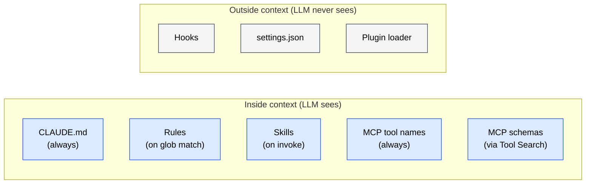

# Feature Index — Cross-feature cheatsheet

🌐 [日本語](../ja/appendix/feature-index.md)

> [!NOTE]
> One-page lookup of every configuration feature, when it loads, what problem it solves, and where to read more.

## Feature × Loading × Chapter

| Feature | When it loads | Lives in | Chapter | Topic page |
|---|---|---|---|---|
| **CLAUDE.md** | Session start (always) | Project / user / local | [Part 3](/03-always-loaded-context/) | [Topic](/topics/claude-md) |
| **Rules** | When a glob matches | `.claude/rules/` (typical) | [Part 4](/04-conditional-context/) | [Topic](/topics/rules) |
| **Skills** | LLM invokes by name | `.claude/skills/` | [Part 5](/05-on-demand-context/) | [Topic](/topics/skills-and-agents) |
| **Agents** | LLM (or user) spawns | Plugins / config | [Part 5](/05-on-demand-context/) | [Topic](/topics/skills-and-agents) |
| **MCP** | Tools always advertised, schemas via Tool Search | External servers | [Part 6](/06-tool-context/) | [Topic](/topics/mcp) |
| **Hooks** | Lifecycle event fires | `settings.json` | [Part 7](/07-runtime-layer/) | [Topic](/topics/hooks) |
| **Plugins** | Install time | Marketplaces | [Appendix](/appendix/plugins-and-marketplaces) | [Topic](/topics/plugins) |

## Feature × Structural Problem

Which feature is the primary tool for each of the 8 structural problems.

| Problem | Primary feature(s) | Why |
|---|---|---|
| [Context Rot](/01-llm-structural-problems/context-rot) | Rules, Skills, Tool Search | Move material out of always-loaded context |
| [Lost in the Middle](/01-llm-structural-problems/lost-in-the-middle) | `/compact`, Agents | Keep context short; offload long work |
| [Priority Saturation](/01-llm-structural-problems/priority-saturation) | CLAUDE.md (kept lean), Rules | Fewer competing signals |
| [Hallucination](/01-llm-structural-problems/hallucination) | MCP, LSP (Part 9), Agents | Ground in real data or isolated reasoning |
| [Sycophancy](/01-llm-structural-problems/sycophancy) | Hooks | Enforcement the LLM can't talk past |
| [Knowledge Boundary](/01-llm-structural-problems/knowledge-boundary) | MCP, Skills, Plugins | Inject capability beyond training cutoff |
| [Prompt Sensitivity](/01-llm-structural-problems/prompt-sensitivity) | Hooks, settings | Deterministic behavior independent of phrasing |
| [Instruction Decay](/01-llm-structural-problems/instruction-decay) | CLAUDE.md, Rules, Hooks | Re-inject or enforce outside the LLM |

## Feature × Visibility to the LLM

## See also

- [Problem × Countermeasure Map](/appendix/problem-countermeasure-map)
- [Lifecycle × Config Map](/appendix/lifecycle-config-map)
- [Configuration Reference](/appendix/claude-code-config-reference)
- [Topics index](/topics/)

---

> **Previous**: [Lifecycle × Config Map](/appendix/lifecycle-config-map)
> **Next**: [Configuration Reference](/appendix/claude-code-config-reference)
