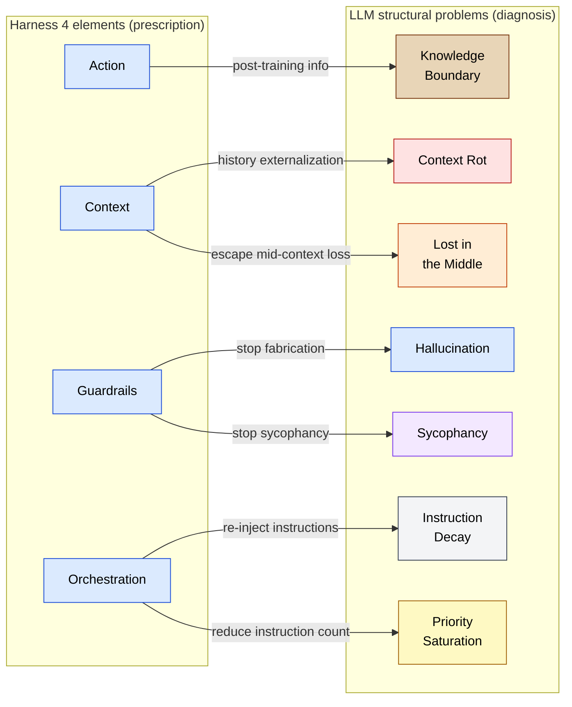
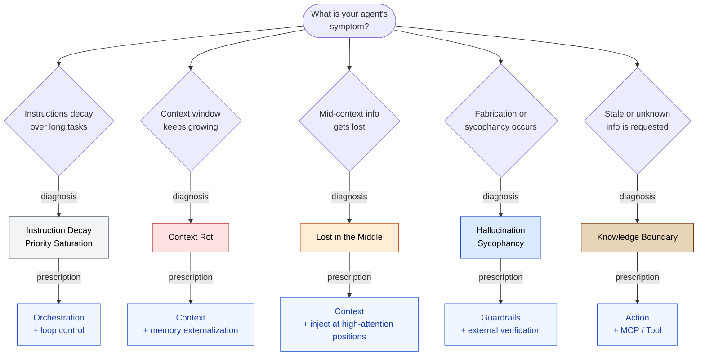

🌐 [日本語](../ja/appendix/harness-and-llm-constraints.md)

# Harness and LLM Constraints — Diagnose Before You Prescribe

> [!NOTE]
> The four elements of harness engineering can be read as symptomatic treatments for the eight structural constraints of LLMs. This page makes explicit which structural problem each harness prescription is responding to.

## About This Document

"**Harness engineering**" (Action / Context / Guardrails / Orchestration) is the implementation prescription for **operating** an LLM. This page reverse-maps each prescription onto the **LLM structural constraints** that lie behind it, using the 8-problem vocabulary.

> [!TIP]
> **In three lines**
>
> - The harness 4 elements = symptomatic treatments for the 8 problems.
> - Without knowing **why** the prescription is needed, you cannot judge when to apply it.
> - This page is "diagnosis before prescription."

## Reverse-Mapping Harness Onto the 8 Problems

Harness prescribes "give it memory" or "wrap it in a loop," but does not explain **why**. The table below organizes which harness element responds to which structural problem.

## Structural Problems Each Harness Element Addresses

### Action (Tool Integration)

> [!NOTE]
> Connection points to external APIs, databases, file systems, browsers, etc. MCP is its representative implementation.

| Structural Problem Addressed | Effect |
| --- | --- |
| **Knowledge Boundary** | Fetch information unknown to the training cut-off or evolving in real time |
| **Hallucination** (partial) | Ground the model in trusted external sources to stop fabrication |

> [!IMPORTANT]
> Action reaches *outside* the LLM's knowledge boundary. It is essential for **information not in training data or information that changes over time**. See [Part 6: Tool Context — MCP](../06-tool-context/).

### Context (Memory)

> [!NOTE]
> Mechanisms that retain past context, business background, and agent action history, and hand them back to the LLM when needed.

| Structural Problem Addressed | Effect |
| --- | --- |
| **Context Rot** | Externalize history and control how much is injected into the context window |
| **Lost in the Middle** | Inject only essential information near the tail to escape the U-curve trough |
| **Priority Saturation** (partial) | Reduce the total volume of simultaneously injected instructions and information |

> [!IMPORTANT]
> Simply "having memory" via harness is insufficient. You also need to design **which information is injected when and where** — see [Part 2: Context Window](../02-context-window/) through [Part 5: On-Demand Context](../05-on-demand-context/).

> [!WARNING]
> Bad memory design worsens Context Rot (re-loading the entire history is counterproductive). Memory only works when combined with **"expand only when invoked"** design — see the [Skills layer in the sister site](https://shuji-bonji.github.io/ai-agent-architecture/concepts/03-architecture).

### Guardrails (Safety Controls)

> [!NOTE]
> Safety devices that prevent leakage of confidential information and uncontrolled system damage.

| Structural Problem Addressed | Effect |
| --- | --- |
| **Hallucination** | Stop fabrication with **non-sycophantic verification**: compilers, tests, type checkers, etc. |
| **Sycophancy** | Break agreement bias through mechanical verification or cross-model QA |

> [!IMPORTANT]
> The core of Guardrails is **not letting the LLM verify itself**. Hooks ([Part 7: Runtime Layer](../07-runtime-layer/)) and compiler-like **non-sycophantic external mechanisms** are the effective counter to fabrication and agreement bias.

### Orchestration (Loop Control)

> [!NOTE]
> A continuous loop that decomposes tasks, lets the LLM think, executes, evaluates results, and decides the next action.

| Structural Problem Addressed | Effect |
| --- | --- |
| **Instruction Decay** | Re-inject instructions in each loop iteration to prevent decay over long tasks |
| **Priority Saturation** | Split tasks to reduce the instruction count per iteration |
| **Context Rot** (partial) | Isolate context per sub-task |

> [!IMPORTANT]
> Orchestration is intertwined with multi-session coordination ([Part 10](../10-multi-session/)). A design where **parallel splitting prevents any session from growing large** is structurally stronger than **running one long session in a loop**.

## Diagnose Before You Prescribe — Application Flow

> [!TIP]
> Rather than mechanically applying every harness prescription, **diagnose which structural problem your agent is suffering from** and choose prescriptions accordingly.

## Where Harness Falls Short

Some constraints are not addressed — or only partially addressed — by the four harness elements.

| Structural Problem | Harness Response | Additional Measures Required |
| --- | --- | --- |
| **Prompt Sensitivity** | ❌ No direct prescription | Prompt structuring, benchmarks, A/B testing |
| **Instruction Decay** (severe) | ⚠️ Only loop re-injection | Always-loaded context (CLAUDE.md), conditional injection (`.claude/rules/`) |
| **Hallucination** (full eradication) | ⚠️ External verification stops, but does not eliminate | Structurally unavoidable. Full eradication is impossible. |

> [!CAUTION]
> Harness is a prescription for *operating* and **does not change the LLM's limits themselves**. Hallucination cannot be reduced to zero; sycophancy can be mitigated but never eliminated. Treat these as constraints to **accept and operate around at design time**.

## Related Pages

- [Problems × Countermeasures Map](./problem-countermeasure-map.md) — 8 problems × Claude Code features
- [Part 1: Structural Problems](../01-llm-structural-problems/) — overview of the 8 problems
- [Part 6: Tool Context — MCP](../06-tool-context/) — details on Action (MCP)
- [Part 7: Runtime Layer](../07-runtime-layer/) — details on Guardrails (Hooks)
- [Part 10: Multi-Session Coordination](../10-multi-session/) — the structurally stronger form of Orchestration

## 🔗 Go Deeper: Designing the Harness With the 5-Layer Model

This page covered **diagnosing harness elements through the 8 problems (Why)**. For **how to incorporate each harness element into design (What/How)**, see the sister site.

- [ai-agent-architecture / Harness Engineering Mapping](https://shuji-bonji.github.io/ai-agent-architecture/strategy/harness-engineering-mapping) — mapping onto the 5-layer model, and the Skills and Doctrine layers that harness does not cover

---

> **Next**: [Lifecycle × Config Map](./lifecycle-config-map.md)
> **Previous**: [Problems × Countermeasures Map](./problem-countermeasure-map.md)
