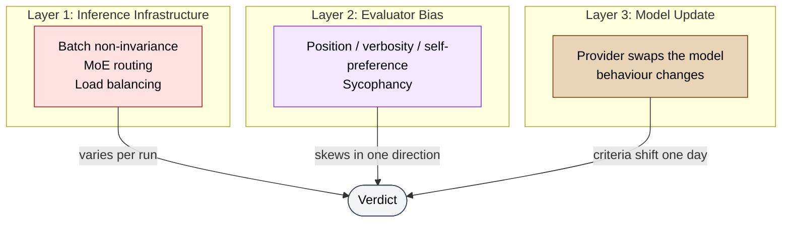
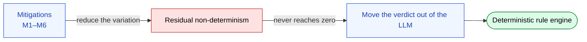

🌐 [日本語](../ja/appendix/judgment-drift.md)

# Judgment Drift — Why LLM Verdicts Do Not Reproduce

> [!NOTE]
> When an LLM is asked to issue a **verdict** such as pass/fail, the same input can produce different answers. This page shows that the irreproducibility arises from three distinct layers — (1) the inference infrastructure, (2) evaluator bias, and (3) model updates — and, drawing on empirical work, establishes that the widely believed mitigation "set temperature to 0" is **necessary but not sufficient**.

## About This Document

The sister site's [Deterministic Verdicts](https://shuji-bonji.github.io/ai-agent-architecture/strategy/deterministic-verdicts) covers the design discipline "put the verdict in deterministic code and let the LLM narrate" as **What/How**. This page covers the **Why**: why an LLM's verdict cannot be fully trusted, expressed in the vocabulary of structural constraints.

Where [Authority and LLM Constraints](./authority-and-llm-constraints.md) asked whether **discretion over actions** can be delegated to an LLM, this page asks whether the **power to issue a verdict** can be. They are different questions. Actions can be undone; a verdict cannot, once it has been absorbed into a downstream decision.

> [!TIP]
> **In three lines**
>
> - Non-determinism is not confined to the sampling step. Verdicts flip even at `temperature=0` and `top_k=1`, because the cause lives in the forward pass itself.
> - The variation is not directionless noise. Position, verbosity, and self-preference give it a **systematic direction**.
> - Model updates silently move the criteria themselves — and the primary mitigation, temperature control, is being deprecated out of existence.

## Three Layers

"The LLM's verdict fluctuates" is not one phenomenon. Different causes call for different countermeasures, so the layers must be kept apart.

| Layer | Timescale | Symptom | Effective countermeasure |
| --- | --- | --- | --- |
| 1. Inference infrastructure | Every run | Verdicts split on identical input and settings | Multiple runs + variance reporting |
| 2. Evaluator bias | Always | Systematic skew in a fixed direction | Position swapping, reference-guided grading, cross-model |
| 3. Model update | Months | Criteria change silently | Version pinning, regression suite |

> [!IMPORTANT]
> The three layers are independent. **A debiased judge can still be irreproducible, and a perfectly reproducible judge can still be biased.** "The verdict is stable" and "the verdict is correct" are different properties.

## Layer 1: Inference Infrastructure — `temperature=0` Does Not Mean Deterministic

This is where the most widespread misconception sits. "At temperature 0 the sampler always picks the most likely token, so the output must be deterministic" — correct in principle, but **it does not hold in production serving**.

Thinking Machines Lab reports that sampling 1,000 completions from Qwen3-235B at `temperature=0` produced **80 distinct outputs**, diverging at token 103 ([He et al., 2025](https://thinkingmachines.ai/blog/defeating-nondeterminism-in-llm-inference/)).

The cause is not floating-point non-associativity as such, but the **batch-size dependence of reduction kernels (the absence of batch invariance)**. Inference servers group incoming requests into dynamic batches, so the same prompt can be served under different batch sizes. Change the batch size, change the shape of the reduction tree, change the order of operations, change the result. Add mixture-of-experts routing variability and load balancing across non-identical replicas on top.

> [!WARNING]
> **Your result can change because of someone else's request arriving at the same moment, even when your own input is byte-identical.** The caller cannot control this. Pinning the prompt does not help; pinning the seed does not remove this layer.

### Sampling Parameters Do Not Close the Gap

An empirical study of Japan AISI's evaluation environment `aisev` ([Tamba, 2026](https://arxiv.org/abs/2606.26185)) measures this layer directly on a judging task. Across 7 borderline items, two providers, three model tiers, and five sampling configurations — **690 API calls** in total:

| Configuration | Model | Non-reproducible items |
| --- | --- | --- |
| Harness default (temperature unset → provider default 1.0) | gpt-4o | **4 of 7** |
| Explicit `temperature=0` | gpt-4o | **2 of 7** |
| `temperature=0` + `top_p=0.1` | gpt-4o | 2 of 7 (**same items, same rate**) |
| `temperature=0` (baseline) | Sonnet 4.6 | 1 of 7 |
| `temperature=0` + `top_k=1` (forced greedy decoding) | Sonnet 4.6 | 1 of 7 (**no improvement over baseline**) |

Three points matter.

1. **`top_p` does not mitigate.** Narrowing the nucleus to 0.1 changes neither which items flip nor how often.
2. **Forced greedy decoding does not eliminate flips.** `top_k=1` removes not a single non-reproducible item relative to the same model's baseline. If verdicts split while only the highest-probability token is ever selected, that is direct evidence that the non-determinism originates **before the sampling step, inside the forward pass**.
3. **The mitigation itself is disappearing.** Claude Opus 4.7 and 4.8 reject temperature values in `[0,1)` with HTTP 400, and `top_p` / `top_k` are deprecated on those models as well. This is a rational change once reasoning-trace models manage temperature internally — but it means the entire class of "pin the knobs" mitigations no longer applies to newer generations.

> [!CAUTION]
> In the harness that study examined, temperature was **not set at all**. The code passed `None`, and the provider's default of 1.0 was silently applied. The harness never surfaced this to the user. **A belief that "we run at temperature 0" is often unverified.**

## Layer 2: Evaluator Bias — The Variation Has a Direction

Layer 1 produces per-run random noise. Judging tasks carry a second, separate distortion: **a skew that repetition does not remove**.

[Zheng et al., 2023](https://arxiv.org/abs/2306.05685) quantified the principal biases of LLMs used as judges.

| Bias | Description | Measurement |
| --- | --- | --- |
| Position bias | Favours whichever candidate is presented first | Strong in every judge examined |
| Verbosity bias | Rates longer outputs higher | Verbosity attacks fool Claude / GPT-3.5 ~91% of the time (GPT-4: 8.7%) |
| Self-enhancement bias | Rates its own outputs higher | +10% for GPT-4, +25% for Claude |

These are continuous with [Sycophancy](../01-llm-structural-problems/sycophancy.md) as covered on this site. Self-enhancement bias in particular is the quantitative counterpart, in a judging context, of the observation that an LLM asked to both generate and review will endorse its own output.

What makes this severe for verdicts is that the distortions **have a direction rather than being random error** — the same property as the "always tilts toward expanding the delegation" pattern described in [Authority and LLM Constraints](./authority-and-llm-constraints.md). Random noise averages out with repetition; a directed skew does not.

> [!IMPORTANT]
> It also appears as the **content** of the judged artifact moving the criteria. The same standards violation may be judged harshly in a heavy document (a contract, a tax filing) and leniently in a light one (an internal notice). This is a form of [Prompt Sensitivity](../01-llm-structural-problems/prompt-sensitivity.md): the criteria are not part of the input, yet they end up conditioned on it. **In a domain that must be judged by a uniform standard, contextual adaptation — an LLM strength — acts as a defect.**

## Layer 3: Model Update — The Criteria Move Silently

The third layer is temporal. Neither the prompt nor the code changed, and yet the verdict did.

[Chen, Zaharia & Zou, 2023](https://arxiv.org/abs/2307.09009) compared the March 2023 and June 2023 versions of GPT-3.5 and GPT-4 on identical tasks. On prime-number identification, GPT-4's accuracy fell from **84% (March) to 51% (June)** — three months apart. The authors identify **a decline in instruction-following ability** as a factor common to many of the behaviour drifts.

What makes this layer awkward:

- **It does not show up in a diff.** Nothing changed in the repository or the config files. What changed lies outside your control.
- **It arrives as an improvement.** Providers update to raise performance. A model that "got smarter" may start helpfully returning `use_with_caution` where it previously returned a mechanical `reject`.
- **The direction is unpredictable.** Whether the model becomes stricter or more lenient varies by task.

> [!NOTE]
> [Knowledge Boundary](../01-llm-structural-problems/knowledge-boundary.md) is the problem that **the model does not know something**. Layer 3 is the different problem that **the model changes**. Upgrading the model mitigates the former; upgrading the model is the cause of the latter.

## The Variation Concentrates at the Boundary

Across all three layers, **irreproducibility clusters near the decision boundary**. In the study cited above, items that were clearly correct or clearly incorrect stayed stable; the ones that split were deliberately constructed to sit on the boundary.

Operationally this means two things.

1. **"It is usually right" is not a rebuttal.** Most samples are stable, so spot checks will not surface the problem. What breaks is always the hardest call — precisely the case a human most wants reviewed.
2. **As long as the verdict is pass/fail, the variation does not average out.** A benchmark score absorbs variance and smooths out with more test items. A pass/fail verdict is a single bit that either clears or blocks. If that bit is dominated by noise rather than the model's actual assessment, **the system is conferring legitimacy it has not earned**.

## Mitigations and Their Limits

| # | Mitigation | Layer | Limit |
| --- | --- | --- | --- |
| M1 | Set `temperature=0` explicitly at the call site (never rely on the provider default) | 1 | Necessary but insufficient; not even specifiable on newer models |
| M2 | Set `seed` and record it in run metadata | 1 | Only where the provider supports it |
| M3 | Run the judge multiple times and report **variance**, not a point estimate | 1, 2 | The only mitigation that survives parameter deprecation; costs N× |
| M4 | Surface judge disagreement as a first-class health metric | 1, 2 | High-disagreement items go to rubric revision or human adjudication |
| M5 | Log the effective configuration (model identifier, resolved version, temperature, seed, **and the resolved API endpoint**) into the artifact | 1, 3 | Logging does not reduce the variation; it serves after-the-fact accountability |
| M6 | Keep a fixed borderline test set and monitor regressions continuously | 3 | Detects drift; does not prevent it |

> [!CAUTION]
> M1–M6 are **mitigations, not solutions**. Layer 1 is outside the caller's control, layer 2 does not average out, and layer 3 happens outside your repository. If a verdict must reproduce, there is exactly one structural answer: **take the verdict out of the LLM**. Confine the LLM to explaining *why* the verdict came out that way, and the only thing that varies is prose — downstream decisions are unaffected.

## Relation to the Eight Problems

Judgment drift is not a ninth structural problem. It is a compound symptom that appears when existing problems concentrate on **the specific task shape of judging**, plus an infrastructure-layer factor that sits outside the eight.

| Layer | Corresponding structural problem | Factor outside the eight |
| --- | --- | --- |
| 1. Inference infrastructure | — | Batch non-invariance, MoE routing, load balancing |
| 2. Evaluator bias | [Sycophancy](../01-llm-structural-problems/sycophancy.md), [Prompt Sensitivity](../01-llm-structural-problems/prompt-sensitivity.md) | — |
| 3. Model update | [Instruction Decay](../01-llm-structural-problems/instruction-decay.md) (observed as declining instruction-following) | Provider-side model swap |

> [!TIP]
> The decision flow in [why-not-in-context](../07-runtime-layer/why-not-in-context.md) — "Does this need LLM judgement? → No → Is it mechanically verifiable? → Yes → Hooks" — applies to judging tasks unchanged. One caveat: **if the Hook itself judges via an LLM (Prompt Hook / Agent Hook), all three layers on this page move straight into the gatekeeper.** Choose a Command Hook when the gate must be deterministic.

## Related Pages

- [Authority and LLM Constraints](./authority-and-llm-constraints.md) — delegating discretion over *actions* (this page: delegating the power to *judge*)
- [Harness and LLM Constraints](./harness-and-llm-constraints.md) — why verification must come from a mechanism that does not defer
- [Sycophancy](../01-llm-structural-problems/sycophancy.md) — the limits of self-review and Cross-Model QA
- [Prompt Sensitivity](../01-llm-structural-problems/prompt-sensitivity.md) — how underspecification produces non-determinism
- [Why Not in Context](../07-runtime-layer/why-not-in-context.md) — where LLM judgement ends and code begins

## Going Deeper: Where Should the Verdict Live?

This page covered **why** LLM verdicts do not reproduce. For **where to put the judgment layer and how to design it (What/How)**, see the sister site.

- [ai-agent-architecture / Deterministic Verdicts](https://shuji-bonji.github.io/ai-agent-architecture/strategy/deterministic-verdicts) — the observation / judgment / narration split, which MCPs need a judgment layer, and how to secure reproducibility
- [ai-agent-architecture / MCP Family](https://shuji-bonji.github.io/ai-agent-architecture/strategy/mcp-family) — "the judge is code, the narrative is the LLM" as a family design discipline

## References

- He, H. et al. (2025). "Defeating Nondeterminism in LLM Inference." Thinking Machines Lab. [thinkingmachines.ai](https://thinkingmachines.ai/blog/defeating-nondeterminism-in-llm-inference/) — attributes output variation at `temperature=0` to batch non-invariance; 80 distinct outputs across 1,000 completions on Qwen3-235B
- Tamba, H. (2026). "Necessary but Not Sufficient: Temperature Control and Reproducibility in LLM-as-Judge Safety Evaluations." arXiv:2606.26185. [arxiv.org/abs/2606.26185](https://arxiv.org/abs/2606.26185) — 690 API calls; verdicts still split under `top_k=1`, and temperature is deprecated on Claude Opus 4.7/4.8
- Zheng, L., Chiang, W.-L., Sheng, Y., et al. (2023). "Judging LLM-as-a-Judge with MT-Bench and Chatbot Arena." NeurIPS 2023. [arxiv.org/abs/2306.05685](https://arxiv.org/abs/2306.05685) — quantifies position, verbosity, and self-enhancement bias, with position-swapping and reference-guided grading as mitigations
- Chen, L., Zaharia, M., & Zou, J. (2023). "How Is ChatGPT's Behavior Changing over Time?" arXiv:2307.09009. [arxiv.org/abs/2307.09009](https://arxiv.org/abs/2307.09009) — GPT-4 prime identification fell from 84% to 51% in three months; declining instruction-following as a common factor
- Wang, P., Li, L., Chen, L., et al. (2023). "Large Language Models are not Fair Evaluators." arXiv:2305.17926. [arxiv.org/abs/2305.17926](https://arxiv.org/abs/2305.17926) — systematic unfairness of LLMs acting as evaluators
- Stureborg, R., Alikaniotis, A., & Suhara, Y. (2024). "Large Language Models are Inconsistent and Biased Evaluators." arXiv:2405.01724. [arxiv.org/abs/2405.01724](https://arxiv.org/abs/2405.01724) — multi-dimensional characterisation of evaluator inconsistency and bias

---

> **Next**: [Output Format Constraints and Accuracy](./output-format-constraints.md)
> **Previous**: [Authority and LLM Constraints](./authority-and-llm-constraints.md)
