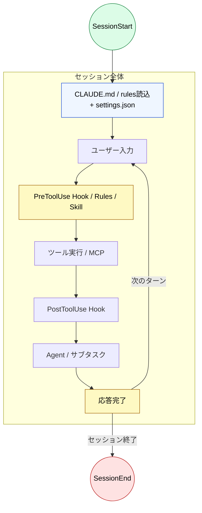

# ライフサイクル × 設定マップ

> [!NOTE]
> Claude Code のタスクフローの各フェーズで、どの設定レイヤーが作用するかを示す。
> Part 3〜7 で学んだ設定の全体像を、ライフサイクルの視点から横断的に整理したリファレンス。
>
> 関連 Issue: [#21](https://github.com/shuji-bonji/understanding-llm-through-claude-code/issues/21)

## ライフサイクルフロー

## 各フェーズで効く設定

### セッション開始（SessionStart → CLAUDE.md 読込）

| 設定レイヤー                   | 何が起きるか                                                                                            | 該当 Part                                      |
| :----------------------------- | :------------------------------------------------------------------------------------------------------ | :--------------------------------------------- |
| **CLAUDE.md**（全階層）        | グローバル → プロジェクト → ローカルの順にマージされ、常駐コンテキストとして注入                        | [Part 3](../03-always-loaded-context/index.md) |
| **settings.json**              | ランタイム設定（権限、環境変数、thinking モード等）が適用される。LLM のコンテキストには注入されない     | [Part 7](../07-runtime-layer/settings-json.md) |
| **MCP ツール定義**             | 接続済み MCP サーバーのツール定義がコンテキストに常駐注入される（Tool Search 有効時はインデックスのみ） | [Part 6](../06-tool-context/index.md)          |
| **Hook: `SessionStart`**       | 環境チェック、ログ初期化。stdout はコンテキストに追加される                                             | [Part 7](../07-runtime-layer/hooks.md)         |
| **Hook: `InstructionsLoaded`** | CLAUDE.md / rules ファイル読込時に発火。監査ログ、コンプライアンス追跡                                  | [Part 7](../07-runtime-layer/hooks.md)         |

### ユーザー入力時（UserPromptSubmit）

| 設定レイヤー                 | 何が起きるか                                                                                                   | 該当 Part                              |
| :--------------------------- | :------------------------------------------------------------------------------------------------------------- | :------------------------------------- |
| **Hook: `UserPromptSubmit`** | 入力バリデーション、追加コンテキスト注入。stdout はコンテキストに追加される。exit 2 でプロンプトをブロック可能 | [Part 7](../07-runtime-layer/hooks.md) |
| **Prompt Hook**              | `type: "prompt"` で LLM による入力評価が可能                                                                   | [Part 7](../07-runtime-layer/hooks.md) |

### ツール実行前（PreToolUse）

| 設定レイヤー                     | 何が起きるか                                                                                                        | 該当 Part                                      |
| :------------------------------- | :------------------------------------------------------------------------------------------------------------------ | :--------------------------------------------- |
| **`.claude/rules/`**             | 操作対象ファイルの glob パターンに一致するルールがコンテキストに注入される                                          | [Part 4](../04-conditional-context/rules.md)   |
| **Skills**                       | LLM の自動判断または `/` 呼び出しで、タスク固有の手順書がコンテキストに展開される                                   | [Part 5](../05-on-demand-context/skills.md)    |
| **settings.json（permissions）** | `allow` / `deny` ルールでツール使用を許可・拒否。Hook の `allow` より deny ルールが優先                             | [Part 7](../07-runtime-layer/settings-json.md) |
| **Hook: `PreToolUse`**           | 危険なコマンドのブロック、入力の書き換え（`updatedInput`）。`permissionDecision` で `allow` / `deny` / `ask` を制御 | [Part 7](../07-runtime-layer/hooks.md)         |
| **Hook: `PermissionRequest`**    | 権限ダイアログ表示時に発火。自動承認/拒否が可能                                                                     | [Part 7](../07-runtime-layer/hooks.md)         |

### ツール実行後（PostToolUse / PostToolUseFailure）

| 設定レイヤー                   | 何が起きるか                                                                             | 該当 Part                              |
| :----------------------------- | :--------------------------------------------------------------------------------------- | :------------------------------------- |
| **Hook: `PostToolUse`**        | 自動フォーマット（prettier 等）、lint 実行、ログ記録。ツールは実行済みのため取り消し不可 | [Part 7](../07-runtime-layer/hooks.md) |
| **Hook: `PostToolUseFailure`** | ツール失敗時のエラーログ、リトライ判定                                                   | [Part 7](../07-runtime-layer/hooks.md) |

### サブエージェント・タスク（SubagentStart/Stop, TaskCreated/Completed）

| 設定レイヤー              | 何が起きるか                                                       | 該当 Part                                   |
| :------------------------ | :----------------------------------------------------------------- | :------------------------------------------ |
| **Agents**                | 独立したコンテキストウィンドウで実行。結果のみメインに蒸留して返す | [Part 5](../05-on-demand-context/agents.md) |
| **Hook: `SubagentStart`** | サブエージェント生成時にコンテキスト注入                           | [Part 7](../07-runtime-layer/hooks.md)      |
| **Hook: `SubagentStop`**  | サブエージェント完了時に結果検証。exit 2 でブロック可能            | [Part 7](../07-runtime-layer/hooks.md)      |
| **Hook: `TaskCreated`**   | タスク作成時の命名規則強制、検証                                   | [Part 7](../07-runtime-layer/hooks.md)      |
| **Hook: `TaskCompleted`** | タスク完了条件の検証                                               | [Part 7](../07-runtime-layer/hooks.md)      |

### 応答完了（Stop / StopFailure）

| 設定レイヤー            | 何が起きるか                                                                                     | 該当 Part                              |
| :---------------------- | :----------------------------------------------------------------------------------------------- | :------------------------------------- |
| **Hook: `Stop`**        | 品質ゲート、続行判定。exit 2 または `decision: "block"` で Claude の停止を防止し作業を続行させる | [Part 7](../07-runtime-layer/hooks.md) |
| **Hook: `StopFailure`** | API エラー時のエラーログ、アラート送信                                                           | [Part 7](../07-runtime-layer/hooks.md) |
| **Agent Hook**          | `type: "agent"` でサブエージェントによるマルチターン検証（テスト実行等）                         | [Part 7](../07-runtime-layer/hooks.md) |

### コンテキスト圧縮時（PreCompact / PostCompact）

| 設定レイヤー                                   | 何が起きるか                                       | 該当 Part                              |
| :--------------------------------------------- | :------------------------------------------------- | :------------------------------------- |
| **Hook: `PreCompact`**                         | 圧縮前の検証。重要情報の退避等                     | [Part 7](../07-runtime-layer/hooks.md) |
| **Hook: `PostCompact`**                        | 圧縮後の検証                                       | [Part 7](../07-runtime-layer/hooks.md) |
| **Hook: `SessionStart`**（matcher: `compact`） | 圧縮後のセッション再開時にコンテキスト再注入が可能 | [Part 7](../07-runtime-layer/hooks.md) |

### 非同期イベント（ループと並行して発火）

| 設定レイヤー             | 何が起きるか                                                | 該当 Part                              |
| :----------------------- | :---------------------------------------------------------- | :------------------------------------- |
| **Hook: `CwdChanged`**   | 作業ディレクトリ変更時に環境変数の再読込（direnv 等）       | [Part 7](../07-runtime-layer/hooks.md) |
| **Hook: `FileChanged`**  | 監視ファイルの変更検出。matcher でファイル名を指定          | [Part 7](../07-runtime-layer/hooks.md) |
| **Hook: `ConfigChange`** | 設定ファイル変更時のセキュリティ監査。exit 2 でブロック可能 | [Part 7](../07-runtime-layer/hooks.md) |
| **Hook: `Notification`** | 通知発生時のデスクトップ通知、アラート                      | [Part 7](../07-runtime-layer/hooks.md) |

## 設定レイヤー別の作用タイミング一覧

| 設定レイヤー         | 作用タイミング                                             | コンテキスト消費           |
| :------------------- | :--------------------------------------------------------- | :------------------------- |
| **CLAUDE.md**        | セッション開始時に注入、全ターンで常駐                     | 常時                       |
| **`.claude/rules/`** | glob 一致するファイル操作時に注入                          | 条件時のみ                 |
| **Skills**           | `/` 呼出 or LLM 自動判断時に注入                           | 呼出時のみ                 |
| **Agents**           | `Agent()` / `Task()` で起動。独立コンテキスト              | メインは消費しない         |
| **MCP ツール定義**   | セッション開始時に注入（Tool Search 時はインデックスのみ） | 常時（または検索時）       |
| **settings.json**    | ランタイムで常時適用                                       | なし                       |
| **Hooks**            | 各ライフサイクルイベントで発火                             | なし（Prompt Hook を除く） |

> [!TIP]
> `problem-countermeasure-map.md` が「構造的問題 → どの設定で対策するか」を示すのに対し、このページは「ライフサイクルのどのフェーズで → どの設定が作用するか」を示す。両方を合わせて読むと、設定の全体像が立体的に理解できる。

---

> [!NOTE]
> Hook イベントの詳細（JSON 入出力スキーマ、matcher の仕様等）は公式リファレンスを参照:
> [Hooks reference](https://code.claude.com/docs/en/hooks) | [Hooks guide](https://code.claude.com/docs/en/hooks-guide)
