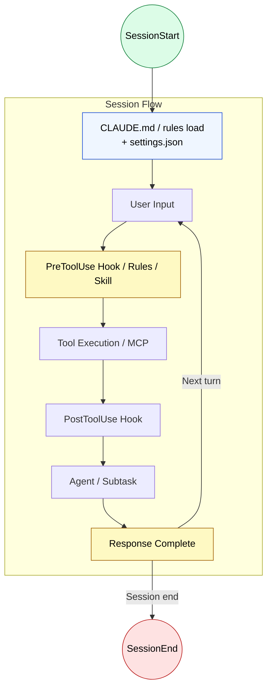

🌐 [日本語](../ja/appendix/lifecycle-config-map.md)

# Lifecycle × Configuration Map

> [!NOTE]
> Shows which configuration layers are active at each phase of Claude Code's task flow.
> A cross-sectional reference organizing the complete picture of configuration learned in Parts 3-7, from the perspective of lifecycle.
>
> Related Issue: [#21](https://github.com/shuji-bonji/understanding-llm-through-claude-code/issues/21)

## Lifecycle Flow

## Configuration Effective at Each Phase

### Session Start (SessionStart → CLAUDE.md Load)

| Configuration Layer | What Happens | Related Part |
| :--- | :--- | :--- |
| **CLAUDE.md** (all levels) | Merged in order: Global → Project → Local, injected as resident context | [Part 3](../03-always-loaded-context/index.md) |
| **settings.json** | Runtime settings (permissions, environment variables, thinking mode, etc.) applied. Not injected to LLM context | [Part 7](../07-runtime-layer/settings-json.md) |
| **MCP tool definitions** | Tool definitions from connected MCP servers resident-injected to context (index-only when Tool Search enabled) | [Part 6](../06-tool-context/index.md) |
| **Hook: `SessionStart`** | Environment check, log initialization. stdout added to context | [Part 7](../07-runtime-layer/hooks.md) |
| **Hook: `InstructionsLoaded`** | Fires when CLAUDE.md / rules files are loaded. Audit log, compliance tracking | [Part 7](../07-runtime-layer/hooks.md) |

### On User Input (UserPromptSubmit)

| Configuration Layer | What Happens | Related Part |
| :--- | :--- | :--- |
| **Hook: `UserPromptSubmit`** | Input validation, additional context injection. stdout added to context. Can block prompt with exit 2 | [Part 7](../07-runtime-layer/hooks.md) |
| **Prompt Hook** | Evaluate input using LLM with `type: "prompt"` | [Part 7](../07-runtime-layer/hooks.md) |

### Before Tool Execution (PreToolUse)

| Configuration Layer | What Happens | Related Part |
| :--- | :--- | :--- |
| **`.claude/rules/`** | Rules matching glob pattern of target file injected to context | [Part 4](../04-conditional-context/rules.md) |
| **Skills** | Task-specific procedures deployed to context via automatic LLM judgment or `/` invocation | [Part 5](../05-on-demand-context/skills.md) |
| **settings.json** (permissions) | `allow` / `deny` rules permit/deny tool use. Hook's `deny` rule takes priority over `allow` | [Part 7](../07-runtime-layer/settings-json.md) |
| **Hook: `PreToolUse`** | Block dangerous commands, rewrite input (`updatedInput`). Control `allow` / `deny` / `ask` with `permissionDecision` | [Part 7](../07-runtime-layer/hooks.md) |
| **Hook: `PermissionRequest`** | Fires when permission dialog shown. Auto-approve/deny possible | [Part 7](../07-runtime-layer/hooks.md) |

### After Tool Execution (PostToolUse / PostToolUseFailure)

| Configuration Layer | What Happens | Related Part |
| :--- | :--- | :--- |
| **Hook: `PostToolUse`** | Auto-format (prettier, etc.), lint execution, logging. Tools already executed, cannot be reverted | [Part 7](../07-runtime-layer/hooks.md) |
| **Hook: `PostToolUseFailure`** | Error log on tool failure, retry decision | [Part 7](../07-runtime-layer/hooks.md) |

### Sub-Agent and Tasks (SubagentStart/Stop, TaskCreated/Completed)

| Configuration Layer | What Happens | Related Part |
| :--- | :--- | :--- |
| **Agents** | Execute in independent context window. Distill results back to main | [Part 5](../05-on-demand-context/agents.md) |
| **Hook: `SubagentStart`** | Inject context when sub-agent generated | [Part 7](../07-runtime-layer/hooks.md) |
| **Hook: `SubagentStop`** | Validate results on sub-agent completion. Can block with exit 2 | [Part 7](../07-runtime-layer/hooks.md) |
| **Hook: `TaskCreated`** | Enforce naming conventions, validate on task creation | [Part 7](../07-runtime-layer/hooks.md) |
| **Hook: `TaskCompleted`** | Validate task completion conditions | [Part 7](../07-runtime-layer/hooks.md) |

### Response Complete (Stop / StopFailure)

| Configuration Layer | What Happens | Related Part |
| :--- | :--- | :--- |
| **Hook: `Stop`** | Quality gate, continuation decision. Exit 2 or `decision: "block"` prevents stop and continues work | [Part 7](../07-runtime-layer/hooks.md) |
| **Hook: `StopFailure`** | Error log on API error, send alerts | [Part 7](../07-runtime-layer/hooks.md) |
| **Agent Hook** | Sub-agent multi-turn verification (test execution, etc.) with `type: "agent"` | [Part 7](../07-runtime-layer/hooks.md) |

### Context Compression (PreCompact / PostCompact)

| Configuration Layer | What Happens | Related Part |
| :--- | :--- | :--- |
| **Hook: `PreCompact`** | Validate before compression. Backup critical information, etc. | [Part 7](../07-runtime-layer/hooks.md) |
| **Hook: `PostCompact`** | Validate after compression | [Part 7](../07-runtime-layer/hooks.md) |
| **Hook: `SessionStart`** (matcher: `compact`) | After compression, context re-injection possible on session restart | [Part 7](../07-runtime-layer/hooks.md) |

### Async Events (Fire Parallel to Loop)

| Configuration Layer | What Happens | Related Part |
| :--- | :--- | :--- |
| **Hook: `CwdChanged`** | Reload environment variables on working directory change (direnv, etc.) | [Part 7](../07-runtime-layer/hooks.md) |
| **Hook: `FileChanged`** | Detect watched file changes. Specify filename with matcher | [Part 7](../07-runtime-layer/hooks.md) |
| **Hook: `ConfigChange`** | Security audit on config file change. Can block with exit 2 | [Part 7](../07-runtime-layer/hooks.md) |
| **Hook: `Notification`** | Desktop notification, alert on notification event | [Part 7](../07-runtime-layer/hooks.md) |

## Configuration Layer Timing Summary

| Configuration Layer | Active Timing | Context Consumption |
| :--- | :--- | :--- |
| **CLAUDE.md** | Injected on session start, resident across all turns | Always |
| **`.claude/rules/`** | Injected when glob matches file operation | Conditional only |
| **Skills** | Injected on `/` invocation or LLM auto-judgment | On invocation only |
| **Agents** | Started with `Agent()` / `Task()`. Independent context | Main doesn't consume |
| **MCP tool definitions** | Injected on session start (index-only with Tool Search) | Always (or on search) |
| **settings.json** | Always applied at runtime | None |
| **Hooks** | Fire at each lifecycle event | None (except Prompt Hook) |

> [!TIP]
> While `problem-countermeasure-map.md` shows "structural problem → which configuration solves it," this page shows "which phase of the lifecycle → which configuration is active." Reading both together gives a three-dimensional understanding of the configuration landscape.

---

> [!NOTE]
> For detailed Hook events (JSON input/output schema, matcher specs, etc.), see the official reference:
> [Hooks reference](https://code.claude.com/docs/en/hooks) | [Hooks guide](https://code.claude.com/docs/en/hooks-guide)
