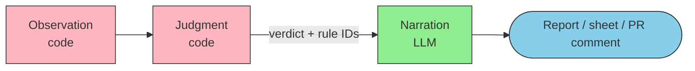

🌐 [日本語](../ja/appendix/narrative-layer-failures.md)

# Failures That Remain in the Narration Layer — What Is Left After Judgment Moves to Code

> [!NOTE]
> Moving the verdict into deterministic code stops the verdict itself from drifting. The narration layer — the stage where an LLM turns that verdict into something a person reads — keeps failures of its own. This page splits those failures into four, maps each onto the eight structural problems, and states what the consumer of the output should check in code.

## About This Document

"Keep the LLM off the judging side; let it only organize" is a widely adopted design. The design is sound, but it does **not** imply that organizing is safe. All eight structural problems apply to the narration layer.

[Judgment Drift](./judgment-drift.md) covered why verdicts fail to reproduce **when an LLM issues them**. This page covers **what remains when it does not**. It sits where someone lands after reading Judgment Drift and moving judgment into code.

> [!TIP]
> **In three lines**
>
> - Moving judgment into code relocates the drift from the verdict to the **prose and the reference IDs**. It does not remove it.
> - The narration layer's failures split into four, each traceable to a known structural problem. This is not a ninth problem.
> - The control is not a prompt instruction. **The consumer of the narration output reconciles it in code.**

## The Drift Relocates

Once the judgment layer is in code, the value flowing downstream is fixed. What a person actually reads, though, is the narration output. **A correct verdict does not help if the output disagrees with it — what the reader receives is the disagreement.**

## The Four Failures

### 1. Wrong item, dropped item

Origin: [Lost in the Middle](../01-llm-structural-problems/lost-in-the-middle.md), [Context Rot](../01-llm-structural-problems/context-rot.md)

Rare with a five-item sheet. Routine at sixty. Put the list of verdicts in context, ask for every item to be filled, and attention concentrates at the head and tail while items in the middle fall out. A dropped item does not necessarily appear as a blank — it can appear **filled with the neighbouring item's content**.

For the numbers, see [Lost in the Middle](../01-llm-structural-problems/lost-in-the-middle.md): accuracy drops by more than 30% in the middle span.

### 2. Misattributed or invented rule ID

Origin: [Hallucination](../01-llm-structural-problems/hallucination.md), [Knowledge Boundary](../01-llm-structural-problems/knowledge-boundary.md)

An ID appears in the prose that is not in the list of fired rule IDs the judgment layer returned. Or the explanation under one ID carries another ID's reason.

A short token like `REV-02` is trivially plausible to fabricate, and by the nature of Knowledge Boundary the model does not say "that ID was not given to me". **The more a design leans on mandatory reference IDs, the more this failure costs** — what survives is the appearance of grounding.

### 3. Deviation softened in wording

Origin: [Sycophancy](../01-llm-structural-problems/sycophancy.md)

`reject` written up as "a few points to note". `human_review_required` written up as "largely fine". The verdict value is unchanged, so **a check that only inspects values passes**. Only the part a person reads has moved.

The pull is strongest when the request arrives with "this is fine, right?" attached.

### 4. Malformed output

Origin: [Instruction Decay](../01-llm-structural-problems/instruction-decay.md), [Priority Saturation](../01-llm-structural-problems/priority-saturation.md)

Many items, many formatting instructions, a long conversation. Stack the three and the agreed format slips. [Priority Saturation](../01-llm-structural-problems/priority-saturation.md) reports compliance falling sharply at ten simultaneous instructions. A formatting rule counts as one instruction, so every per-item refinement lowers compliance across the whole set.

## Check It in Code

| Failure | Check | On failure |
| --- | --- | --- |
| Wrong item, dropped item | Reconcile the output item count against the verdict count | Do not emit until the counts match |
| Misattributed or invented rule ID | Verify every ID in the output exists in the verdict result | One nonexistent ID fails the run |
| Deviation softened in wording | Match verdict vocabulary against a fixed list | Any word outside the list fails the run |
| Malformed output | Run schema validation | Fail |

> [!IMPORTANT]
> None of the four is closed by telling the LLM to be careful. The instruction to be careful is itself subject to Priority Saturation: each added instruction lowers compliance with the others. **Do not add instructions — measure on the receiving side.**

The default on a failed check is regeneration, not a manual fix. Fix it by hand and the next run fails in the same place.

## Scope Against Judgment Drift

| | [Judgment Drift](./judgment-drift.md) | This page |
| --- | --- | --- |
| Subject | Designs where an LLM issues the verdict | Designs where code issues the verdict |
| What drifts | The verdict value | The prose and reference IDs |
| Downstream effect | The decision changes | What the reader takes away changes |
| Direction of the control | Move judgment outside the LLM | Reconcile the output in code |

The four failures here are what remains **after** Judgment Drift's conclusion — move judgment outside the LLM — has been carried out. They are sequential, not alternative.

## Relation to the Eight Problems

| Failure | Structural problem it comes from |
| --- | --- |
| Wrong item, dropped item | [Lost in the Middle](../01-llm-structural-problems/lost-in-the-middle.md), [Context Rot](../01-llm-structural-problems/context-rot.md) |
| Misattributed or invented rule ID | [Hallucination](../01-llm-structural-problems/hallucination.md), [Knowledge Boundary](../01-llm-structural-problems/knowledge-boundary.md) |
| Deviation softened in wording | [Sycophancy](../01-llm-structural-problems/sycophancy.md) |
| Malformed output | [Instruction Decay](../01-llm-structural-problems/instruction-decay.md), [Priority Saturation](../01-llm-structural-problems/priority-saturation.md) |

[Prompt Sensitivity](../01-llm-structural-problems/prompt-sensitivity.md) cuts across all four: the same verdicts produce different output when the template's wording changes. Keep the narration template under version control and diff the output whenever it changes.

## Related Pages

- [Judgment Drift](./judgment-drift.md) — irreproducibility when an LLM judges; the premise of this page
- [Problems × Countermeasures Map](./problem-countermeasure-map.md) — where the countermeasure for each of the eight problems sits
- [Harness and LLM Constraints](./harness-and-llm-constraints.md) — why verification must not be left to the LLM itself
- [Output Format Constraints and Accuracy](./output-format-constraints.md) — how format constraints affect accuracy
- [Why Not in Context](../07-runtime-layer/why-not-in-context.md) — routing mechanically verifiable items to Hooks

## Going Deeper: Where Should the Verdict Live?

This page covered the failures left in the narration layer (Why) once judgment moved into code. For **where the judgment layer belongs and what the narration layer receives** (What/How), see the sister site.

- [ai-agent-architecture / Deterministic Verdicts](https://shuji-bonji.github.io/ai-agent-architecture/strategy/deterministic-verdicts) — the observation / judgment / narration split; its "Check What Comes Back" section maps onto the four failures here

---

> **Next**: [Output Format Constraints and Accuracy](./output-format-constraints.md)  
> **Previous**: [Judgment Drift](./judgment-drift.md)
