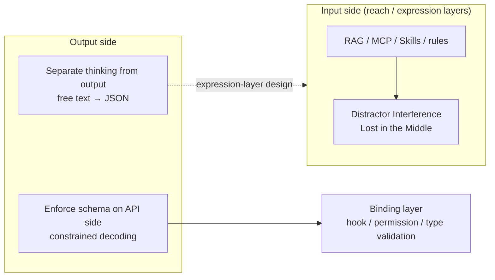

🌐 [日本語](../ja/appendix/output-format-constraints.md)

# Output Format Constraints and Accuracy — A Different Axis from Input-Side Structuring

> [!NOTE]
> There are reports that strongly constraining the **output format** ("answer in JSON") lowers accuracy on reasoning tasks. This page points out that this issue is often conflated with Distractor Interference in [Context Rot](../01-llm-structural-problems/context-rot.md) (an **input-side** phenomenon), separates the two, and sorts out which layer the output-side constraint belongs to.

## About This Document

The sister site's [Proposal and Binding](https://shuji-bonji.github.io/ai-agent-architecture/strategy/proposal-and-binding) states that "RAG, MCP, and Skills all reduce to the question of how to structure the data handed to the LLM." The "structuring" there refers to the structure of **data the LLM reads** (reach layer and expression layer), not the output format.

Separately, one sometimes encounters the claim that "structuring actually lowers accuracy." That claim is usually explained by merging an input-side phenomenon with an output-side one. Read as a single claim, it appears to contradict the "reduces to" statement above. This page shows that once the two are separated, no contradiction remains.

> [!TIP]
> **In three lines**
>
> - Distractor Interference is an input-side phenomenon. Whether distractors enter the context is decided by how the input data is designed. It reinforces the "reduces to" statement.
> - Accuracy loss under output format constraints is an output-side phenomenon. Reports disagree; it is not a settled result.
> - The output-side countermeasures fit into the existing layers (expression layer, binding layer). No new layer is needed.

## Separating the Two Kinds of "Structuring"

| | Distractor Interference | Output Format Constraints |
| :--- | :--- | :--- |
| Where it occurs | **Input side**. Unrelated but similar information contained in the context | **Output side**. Instructions that force JSON / XML etc. |
| What was observed | A single distractor already lowers accuracy, and more distractors lower it further. A logically coherent input performs worse than a shuffled one ([Hong et al., 2025](https://research.trychroma.com/context-rot)) | Stricter constraints tend to lower accuracy on reasoning tasks ([Tam et al., 2024](https://arxiv.org/abs/2408.02442)). However, a re-examination under equal conditions found the gap vanishes or reverses ([Kurt, 2024](https://blog.dottxt.ai/say-what-you-mean.html)) |
| Confidence | Confirmed consistently across 18 models | **Not settled** |
| Corresponding design | Deciding what goes into the context (conditional rule injection, lazy Skill expansion, Tool Search) | Separating thinking from output; enforcing the schema on the API side |

## What Happens on the Output Side

Tam et al. compared accuracy on reasoning tasks (GSM8K and others) between a strict format such as JSON mode and free-form answers. They found that the stricter the format constraint, the lower the accuracy. The paper is widely cited as the source of the claim that "structured output impairs reasoning."

Kurt's re-examination, however, points out that the original paper used **different prompts** for the structured and unstructured conditions, that the format instructions did not adequately explain the task, and that the parser used to extract answers from unstructured output was unreliable. Re-running the experiment with the same model and the same prompt, structured generation scored higher.

Two points hold regardless of which report one favors:

1. **Accuracy depends on whether there is room to write out the reasoning.** Forcing the answer directly into the format leaves no place to develop intermediate steps. Providing a reasoning field inside the format, or converting to the format after free-form reasoning, removes most of the loss.
2. **Instructions that specify the format and instructions that explain the task are different things.** Adding the former while cutting the latter makes the comparison unfair and lowers accuracy.

### Explanations We Do Not Adopt

The following explanations are sometimes attached to this topic. This site does not adopt them.

- "Maintaining syntactic correctness consumes compute resources, leaving less for content." — Compute per token is fixed; there is no contest for resources between syntax and content. What actually happens is a shift between the distribution seen most during training (natural text) and the requested output distribution (strict JSON), plus the loss of reasoning space described in point 1 above.
- "Superstitious learning" or "over-application of learned patterns." — These are not defined terms for a specific phenomenon. Describing what happens means the distribution shift above and the **blank-filling** described next.

### Blank-Filling

When a schema has a required field whose value is absent from the input, the model may generate a plausible value to fill it rather than leave it empty. This is a form of [Hallucination](../01-llm-structural-problems/hallucination.md), not a problem specific to output formats. The remedy is on the schema side, not the format side: provide a way to express absence (`null`, an `"unknown"` enum value, optional fields) and the incentive to fill blanks disappears.

## Which Layer the Countermeasures Belong To

The two output-side countermeasures can be classified using the dividing line from [Proposal and Binding](https://shuji-bonji.github.io/ai-agent-architecture/strategy/proposal-and-binding): "If the LLM produces output that ignores the instruction, does the result change?"

| Countermeasure | If the LLM ignores the instruction | Layer |
| :--- | :--- | :--- |
| Separate thinking from output (reason in free text, then summarize as JSON at the end) | The result changes. Malformed output can be returned | **Expression layer** (non-binding) |
| Enforce the schema on the API side (constrained decoding, tool use `input_schema`) | The result does not change. Output that violates the schema cannot be generated | **Binding layer** |

The former is part of designing "the data the LLM reads" and falls within the scope of "reduces to." The latter operates outside the token sequence and corresponds to the part where that page says "structuring alone is insufficient." Adding the output-side topic therefore adds no new layer.

## In Claude Code

The following are representative examples in Claude Code.

| Feature | Mechanism | Layer |
| :--- | :--- | :--- |
| **tool use `input_schema`** | Tool-call arguments are validated against the JSON Schema on the API side. Reasoning in the body is free-form; only the arguments are bound to the format | Binding |
| **Hook JSON output** | Fields such as `decision` returned by a hook script are read by Claude Code itself (code). They are the output of code, not of the LLM | Binding (outside the LLM) |
| **Subagent structured output** | Given a JSON Schema, the agent does its work freely and returns the result through a StructuredOutput tool call at the end. This is "separate thinking from output" implemented by the runtime | Expression + Binding |
| **Format instructions in CLAUDE.md / Skills** | "Answer in a table" or "return JSON" written in prose. If the LLM ignores it, the format breaks | Expression (non-binding) |

> [!IMPORTANT]
> Writing "return JSON" in CLAUDE.md and fixing the format via tool use `input_schema` look similar but belong to different layers. The former can suffer both accuracy loss and format breakage. The latter cannot suffer format breakage, but can still suffer accuracy loss unless reasoning space is reserved outside the schema.

## Related Pages

- [Context Rot](../01-llm-structural-problems/context-rot.md) — Distractor Interference is an input-side phenomenon
- [Hallucination](../01-llm-structural-problems/hallucination.md) — background for blank-filling
- [Judgment Drift](./judgment-drift.md) — a separate problem when the output is a verdict
- [Proposal and Binding](https://shuji-bonji.github.io/ai-agent-architecture/strategy/proposal-and-binding) — the dividing line between the expression and binding layers

## References

- Hong, K., Troynikov, A., & Huber, J. (2025). "Context Rot: How Increasing Input Tokens Impacts LLM Performance." Chroma Research. [research.trychroma.com](https://research.trychroma.com/context-rot) — relation between distractor count and accuracy; coherent haystacks performing worse than shuffled ones
- Tam, Z. R., Wu, C.-K., Tsai, Y.-L., Lin, C.-Y., Lee, H., & Chen, Y.-N. (2024). "Let Me Speak Freely? A Study on the Impact of Format Restrictions on Performance of Large Language Models." arXiv:2408.02442. [arxiv.org/abs/2408.02442](https://arxiv.org/abs/2408.02442) — stricter format constraints lower accuracy on reasoning tasks
- Kurt, W. (2024). "Say What You Mean: A Response to 'Let Me Speak Freely'." .txt blog. [blog.dottxt.ai/say-what-you-mean.html](https://blog.dottxt.ai/say-what-you-mean.html) — re-examination under equal conditions showing structured generation scoring higher

---

> **Next**: [Lifecycle × Config Map](./lifecycle-config-map.md)
> **Previous**: [Judgment Drift](./judgment-drift.md)
