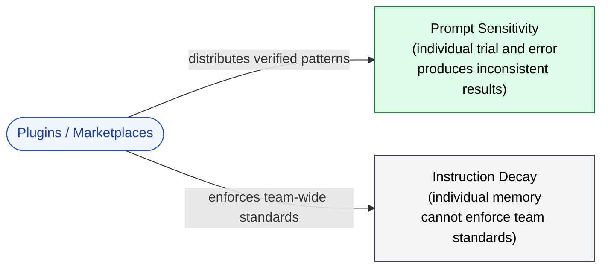

🌐 [日本語](../ja/appendix/plugins-and-marketplaces.md)

# Plugins & Marketplaces

> [!NOTE]
> A mechanism for **distributing verified configurations** — CLAUDE.md, Skills, Hooks, Agents, MCP servers, slash commands — as installable packages. Not a structural mitigation in its own right, but the practical answer to "how does an organization make Parts 3–10 actually apply to everyone?"

## Why This Page Exists in the Appendix, Not in a Main Part

Plugins and marketplaces are *distribution infrastructure*, not new design surfaces. Every problem they help with is one that Parts 1–11 already covered. What they add is a way to make those mitigations **shareable, versioned, and enforceable across a team** instead of being trapped in one engineer's local config.

This is closer to "npm for Claude Code configurations" than to "a new feature for LLMs." The structural problems remain; the delivery mechanism changes.

## What a Plugin Can Bundle

A plugin is a directory that can contain any of the following:

| Component | What it provides | Covered in |
|:--|:--|:--|
| CLAUDE.md fragments | Project-wide instructions | [Part 3](../03-always-loaded-context/index.md) |
| `.claude/rules/` files | Conditionally-loaded rules | [Part 4](../04-conditional-context/index.md) |
| Skills | Task-specific procedures | [Part 5](../05-on-demand-context/skills.md) |
| Agent definitions | Sub-agent specifications | [Part 5](../05-on-demand-context/agents.md) |
| MCP server configs | Connections to external services | [Part 6](../06-tool-context/index.md) |
| Hooks | Lifecycle scripts | [Part 7](../07-runtime-layer/hooks.md) |
| Slash commands | Custom commands | [Part 7](../07-runtime-layer/index.md) |

The plugin is, conceptually, **a bundle of everything from Parts 3–7 that one team has decided is worth standardizing**. Install the plugin → all those configurations apply at once.

## → Why: Which Structural Problems Does It Address?

Plugins do not solve a structural problem directly. They solve a *meta* problem: making sure the structural-problem mitigations *actually get used* by everyone who should be using them.

### Prompt Sensitivity (indirect)

[Part 1: Prompt Sensitivity](../01-llm-structural-problems/prompt-sensitivity.md) showed that semantically equivalent prompts produce different outputs. The single-person remedy is careful prompt engineering. The *team* remedy is: distribute the prompts that have already been verified to work.

A plugin lets one engineer's hard-won finding ("this exact phrasing reliably triggers the right behavior") become every engineer's default. The next person on the team does not start from zero; they start from the team's accumulated calibration.

### Instruction Decay (indirect)

[Part 1: Instruction Decay](../01-llm-structural-problems/instruction-decay.md) covered how individual instructions are forgotten over long conversations. There is a higher-level decay too: **organizational decay**. A senior engineer leaves; their CLAUDE.md goes with them. A team convention is written down once and then drifts as new hires never see it.

Plugins make organizational knowledge installable. The convention does not depend on memory or onboarding diligence; it ships in the plugin and applies the moment the plugin is installed.

## What a Marketplace Adds

A single plugin can be passed around as a tarball or git repo. A marketplace adds:

- **Discovery.** Engineers can find plugins relevant to their work without asking around.
- **Versioning.** Plugins can be pinned, upgraded, or rolled back.
- **Trust signals.** Whether through curation, ratings, or org-level provenance, marketplaces give a basis for deciding which plugins are safe to install.
- **Enforcement.** Org-level marketplaces can make certain plugins mandatory — every developer's Claude Code installs them.

The marketplace is what turns "I made a plugin" into "this is how our team works."

## When to Reach for a Plugin

> [!TIP]
> Three signals that a configuration belongs in a plugin rather than in an individual's CLAUDE.md:
>
> 1. **You have explained it more than twice.** If onboarding the third teammate involves the same instructions, those instructions belong in a plugin.
> 2. **The configuration is non-obvious from the code.** Conventions that experienced engineers absorbed but new ones cannot infer (preferred libraries, deprecated patterns, internal tooling quirks) are exactly what plugins capture.
> 3. **Multiple repositories need the same setup.** Copy-pasting CLAUDE.md across repos is the moment to extract it into a plugin instead.

## When NOT to Use a Plugin

> [!WARNING]
> Plugins are not free. Before packaging a configuration:
>
> - **A plugin for one repo and one user is overhead.** Local CLAUDE.md / Skills are simpler and faster to iterate.
> - **Plugins distribute *whatever* is in them**, including mistakes. A buggy plugin pushed to a marketplace is harder to take back than a buggy local config.
> - **Pinning matters.** If the team's plugin is not pinned to a version, an upstream change can silently alter every developer's behavior. Treat plugins as dependencies, with the same versioning hygiene you would apply to any other dependency.

## Concrete Example: Packaging Your Own MCP Servers as a Plugin

For an engineer who has built several MCP servers — say, a domain-specific search MCP, a law-lookup MCP, an OCR MCP — the natural distribution unit is a plugin that:

- Lists the MCP server entry points (so Claude Code knows how to launch them).
- Bundles a Skill explaining when each MCP is appropriate (so Claude Code knows when to *use* them — see [Part 5 Skills](../05-on-demand-context/skills.md)).
- Optionally ships hooks that wire the MCP results into validation steps.

The plugin name becomes the unit of "what this engineer's MCP work does" — installable as a whole, citable as a whole, versionable as a whole. This is the practical pattern behind reusable MCP collections.

## Risks and Caveats

> [!CAUTION]
> Plugin and marketplace mechanics are evolving quickly. Specific commands, manifest formats, and CLI surfaces will change. This page covers **why the abstraction exists**, not the current API.
>
> When the API does change, the underlying principle does not: organizations need a way to distribute verified configurations, and individuals need a way to install other people's verified work without rebuilding it. Whatever the current Claude Code release calls it, that is what to look for.

## Relation to Other Parts

- [Part 1: Prompt Sensitivity](../01-llm-structural-problems/prompt-sensitivity.md) — the structural problem that plugin-distributed prompts indirectly mitigate.
- [Part 1: Instruction Decay](../01-llm-structural-problems/instruction-decay.md) — instructions that survive in a plugin survive across sessions, hires, and turnover.
- [Part 3: CLAUDE.md](../03-always-loaded-context/claude-md.md) — most plugins ship a CLAUDE.md fragment; understand that page first.
- [Part 5: Skills](../05-on-demand-context/skills.md) — Skills are the most plugin-friendly Claude Code asset; many plugins are essentially "a Skill plus the MCPs it depends on."

---

> **Previous**: [FAQ](faq.md)

> **Next**: [Glossary](glossary.md)

> New questions or discussions: [Discussions](https://github.com/shuji-bonji/understanding-llm-through-claude-code/discussions)
