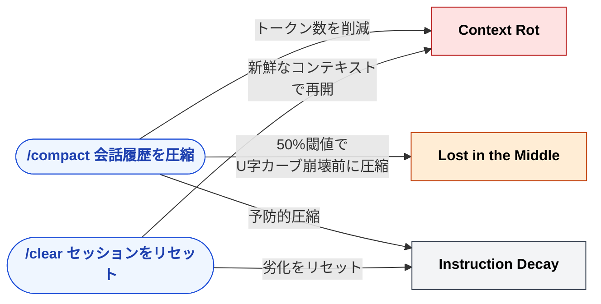
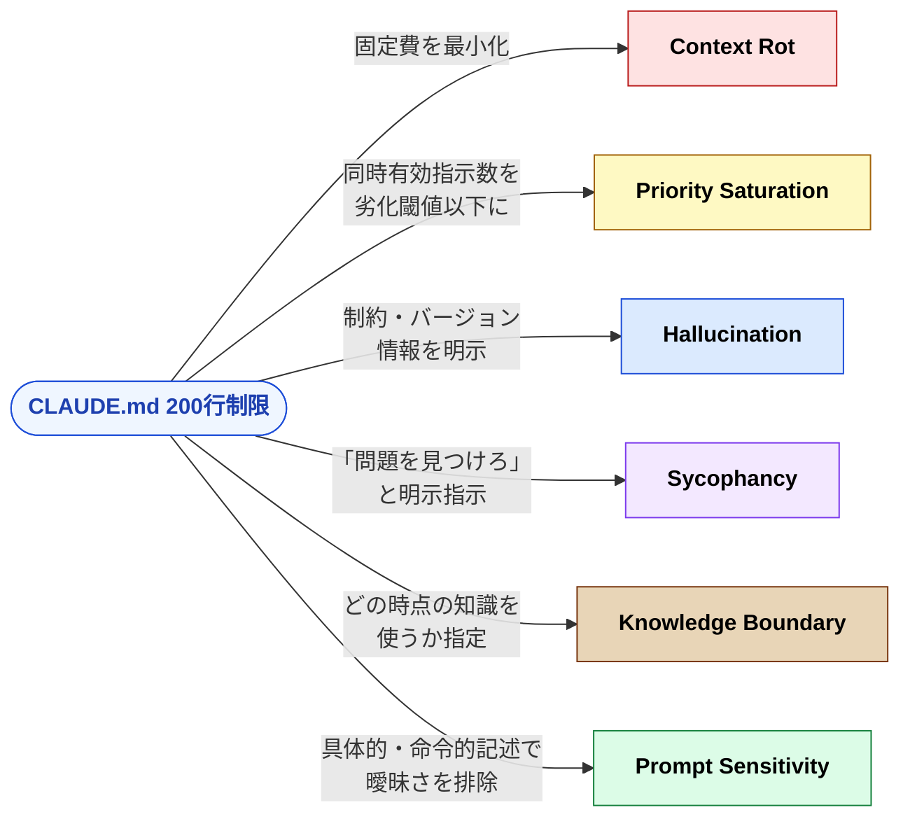
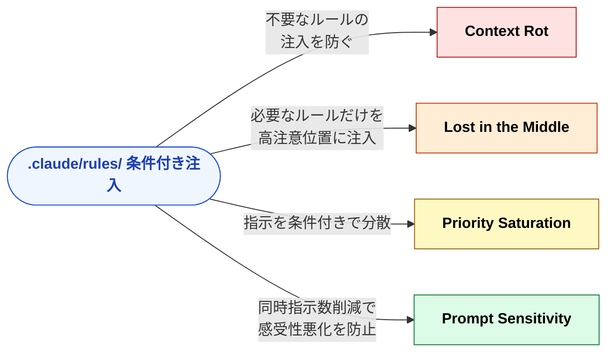
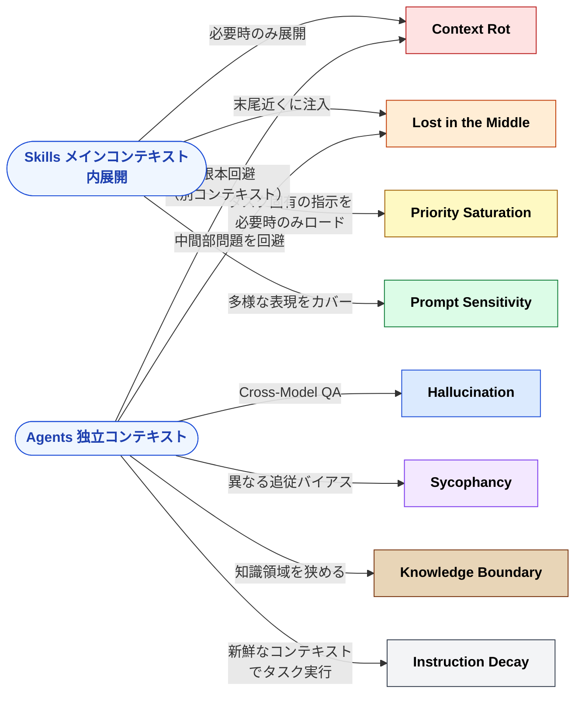
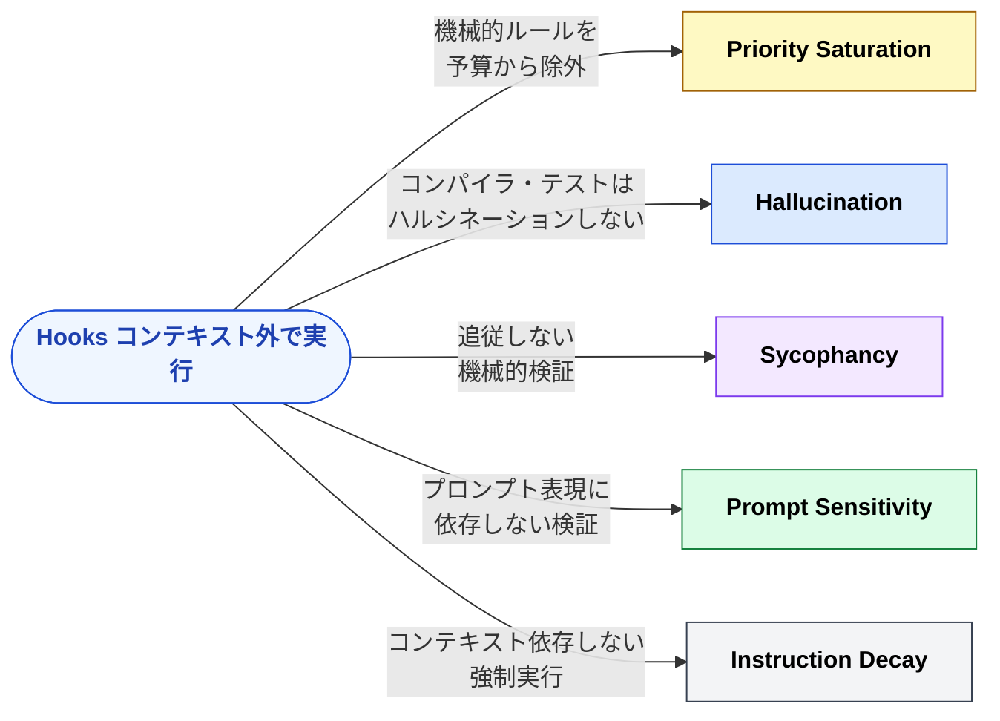
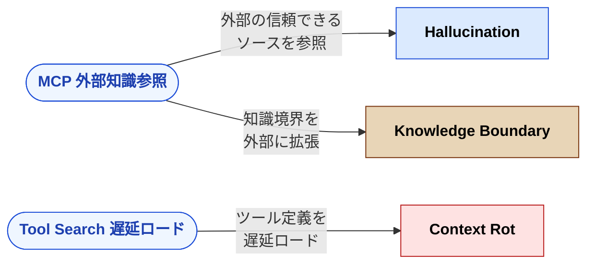
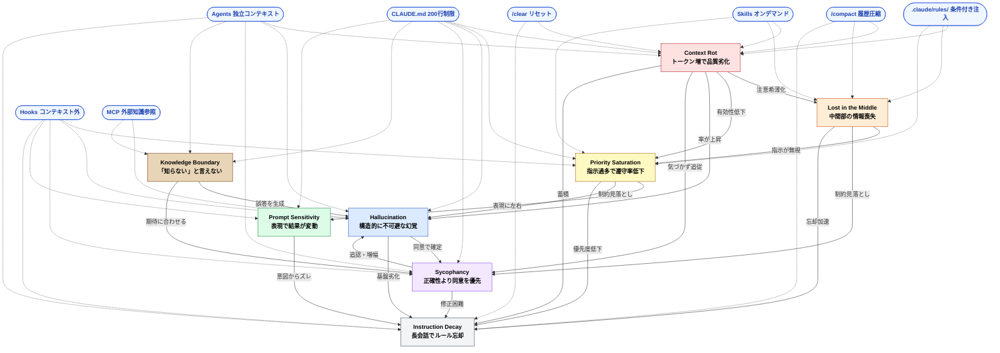

# 構造的問題 × Claude Code 対策マップ（詳細版）

> 8つの構造的問題と Claude Code の各機能の対応関係を詳細に示す。

## 対策マップ

### Context Rot（トークン増で品質劣化）

| 対策                | 分類                 | 効果                                             |
| :------------------ | :------------------- | :----------------------------------------------- |
| `/compact`          | セッション管理       | 会話履歴を圧縮してトークン数を削減               |
| `/clear`            | セッション管理       | セッションをリセットして新鮮なコンテキストで再開 |
| CLAUDE.md 200行制限 | 常駐コンテキスト     | 固定費を最小化                                   |
| `.claude/rules/`    | 条件付きコンテキスト | 不要なルールの注入を防ぐ                         |
| Skills              | オンデマンド         | 必要時のみ展開                                   |
| Agents              | オンデマンド         | 独立コンテキストで根本回避                       |
| MCP Tool Search     | ツール定義           | ツール定義を遅延ロード                           |

### Lost in the Middle（中間部の情報喪失）

| 対策                  | 分類                 | 効果                                 |
| :-------------------- | :------------------- | :----------------------------------- |
| `/compact`（50%閾値） | セッション管理       | U字カーブ崩壊前に圧縮                |
| `.claude/rules/`      | 条件付きコンテキスト | 必要なルールだけを高注意位置に注入   |
| Agents                | オンデマンド         | 新鮮なコンテキストで中間部問題を回避 |
| Skills                | オンデマンド         | 末尾近くに注入し高注意位置に配置     |

### Priority Saturation（指示過多で遵守率低下）

| 対策                | 分類                 | 効果                                   |
| :------------------ | :------------------- | :------------------------------------- |
| CLAUDE.md 200行制限 | 常駐コンテキスト     | 同時有効指示数を劣化閾値以下に         |
| `.claude/rules/`    | 条件付きコンテキスト | 指示を条件付きで分散                   |
| Skills              | オンデマンド         | タスク固有の指示を必要時のみロード     |
| Hooks               | ランタイム           | 機械的ルールをコンテキスト予算から除外 |

### Hallucination（構造的に不可避な幻覚）

| 対策                     | 分類             | 効果                                               |
| :----------------------- | :--------------- | :------------------------------------------------- |
| Hooks（テスト実行）      | ランタイム       | コンパイラ・テストランナーはハルシネーションしない |
| Cross-Model QA（Agents） | オンデマンド     | 異なるモデルでの検証                               |
| MCP                      | ツール定義       | 外部の信頼できるソースを参照                       |
| CLAUDE.md                | 常駐コンテキスト | 制約・バージョン情報を明示                         |

### Sycophancy（正確性より同意を優先）

| 対策                     | 分類             | 効果                         |
| :----------------------- | :--------------- | :--------------------------- |
| Agents（Cross-Model QA） | オンデマンド     | 同じ追従バイアスを共有しない |
| Hooks                    | ランタイム       | 追従しない機械的検証         |
| CLAUDE.md（反論指示）    | 常駐コンテキスト | 「問題を見つけろ」と明示指示 |
| テストコード             | 外部検証         | 客観的事実による防波堤       |

### Knowledge Boundary（「知らない」と言えない）

| 対策                        | 分類             | 効果                               |
| :-------------------------- | :--------------- | :--------------------------------- |
| MCP（外部知識参照）         | ツール定義       | 知識境界を外部に拡張               |
| CLAUDE.md（バージョン明示） | 常駐コンテキスト | 「どの時点の知識を使うか」を指定   |
| Agents（知識の分離）        | オンデマンド     | 知識領域を狭めて境界超過確率を低減 |
| テストコード                | 外部検証         | 知識境界を超えた出力の結果を検出   |

### Prompt Sensitivity（表現で結果が変動）

| 対策               | 分類                 | 効果                                   |
| :----------------- | :------------------- | :------------------------------------- |
| CLAUDE.md の書き方 | 常駐コンテキスト     | 具体的・命令的記述で曖昧さを排除       |
| Skills description | オンデマンド         | 多様な表現をカバーして呼び出し精度向上 |
| `.claude/rules/`   | 条件付きコンテキスト | 同時指示数削減で感受性悪化を防止       |
| Hooks・テスト      | ランタイム           | プロンプト表現に依存しない検証         |

### Instruction Decay（長会話でルール忘却）

| 対策         | 分類           | 効果                           |
| :----------- | :------------- | :----------------------------- |
| `/compact`   | セッション管理 | 50%使用率前に予防的圧縮        |
| `/clear`     | セッション管理 | セッション分割で劣化をリセット |
| Hooks        | ランタイム     | コンテキスト依存しない強制実行 |
| Agents       | オンデマンド   | 新鮮なコンテキストでタスク実行 |
| Git コミット | 外部永続化     | 劣化出力のロールバックを容易に |

## 全体マップ（視覚版）

上記の対策マップを、対策カテゴリの視点から可視化する。各図は「この対策がどの問題に効くか」を示す。

### セッション管理 — `/compact` `/clear`

### 常駐コンテキスト — CLAUDE.md（200行制限）

### 条件付きコンテキスト — `.claude/rules/`

### オンデマンドコンテキスト — Skills & Agents

### ランタイム — Hooks

### ツール定義 — MCP & Tool Search

## 統合全体マップ — 問題の連鎖 × 対策の配置

8つの構造的問題がどう連鎖し、Claude Code の各機能がどこに介入するかの全体像。

**読み方**:

| 要素 | 形 | 意味 |
|:--|:--|:--|
| ■ 四角ノード（各色） | 構造的問題（色で種類を区別） |
| ⬮ 角丸ノード（青） | Claude Code の対策 |
| **実線 →** | 問題が別の問題を引き起こす・増幅する |
| **点線 -.->** | 対策が問題に介入するポイント |

---

> [README の対策マップ表（概要版）](../../README.md) も参照
