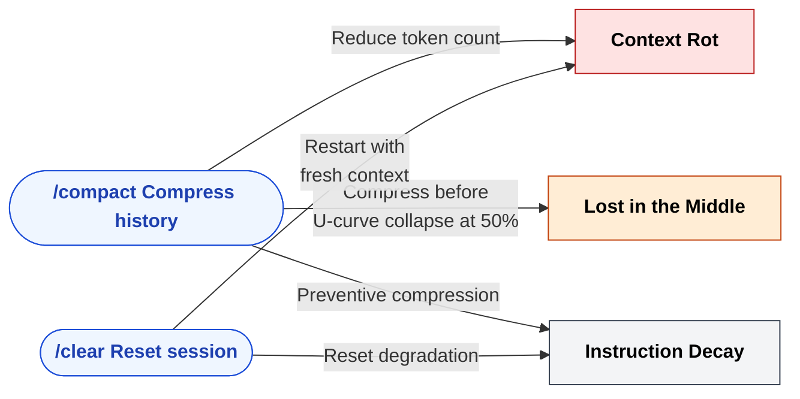
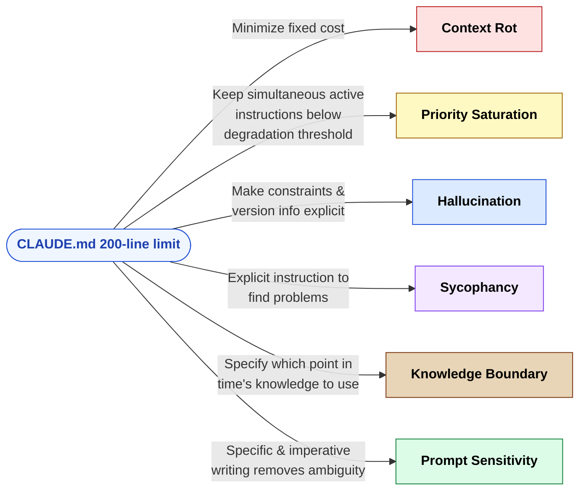
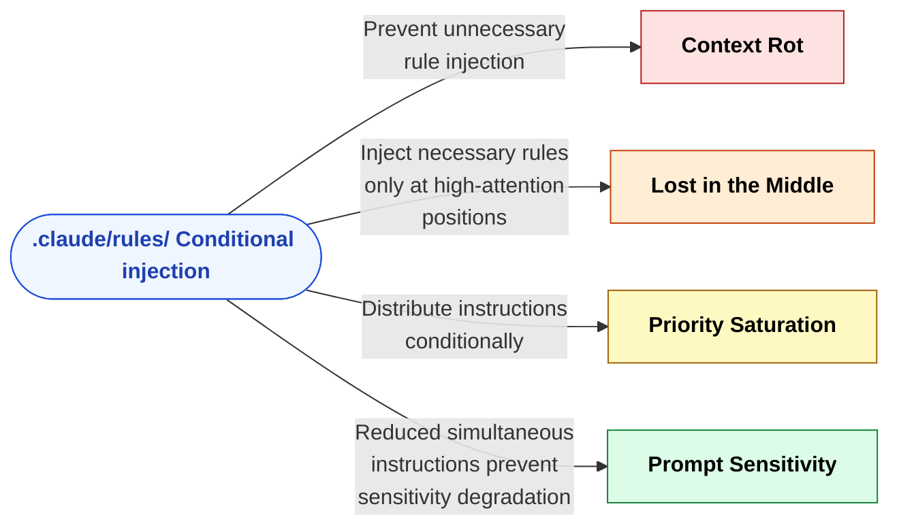
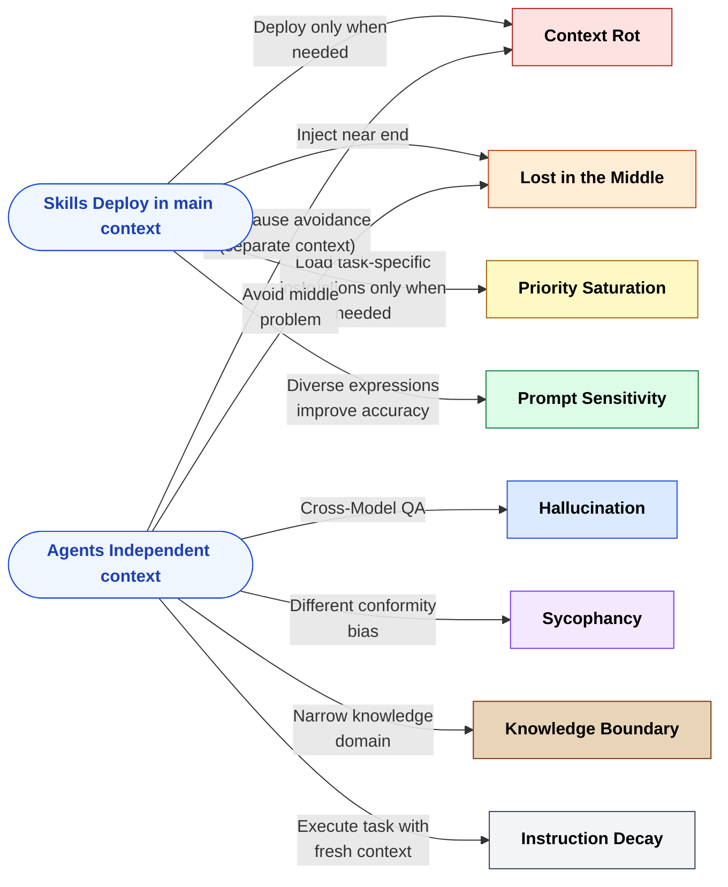
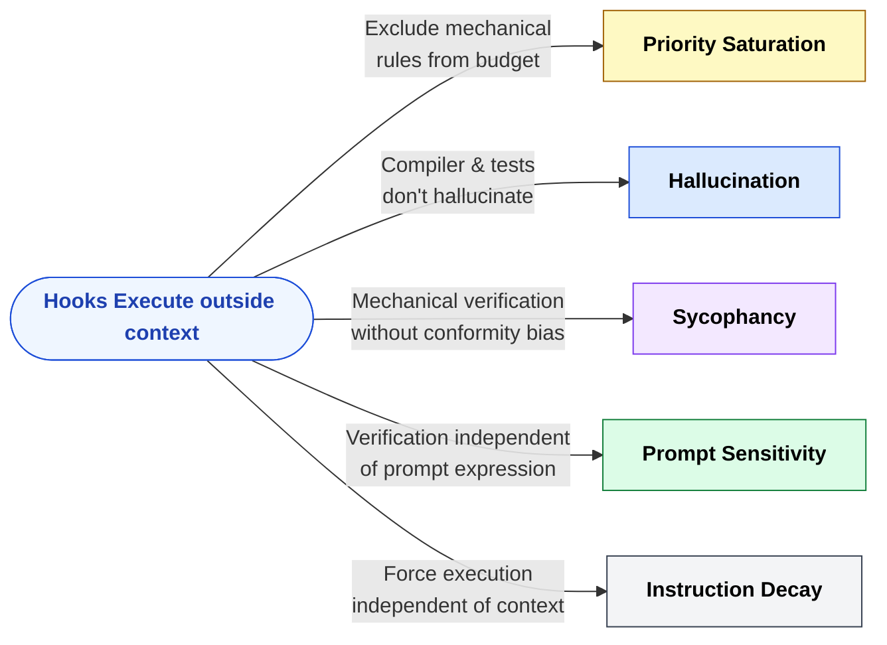
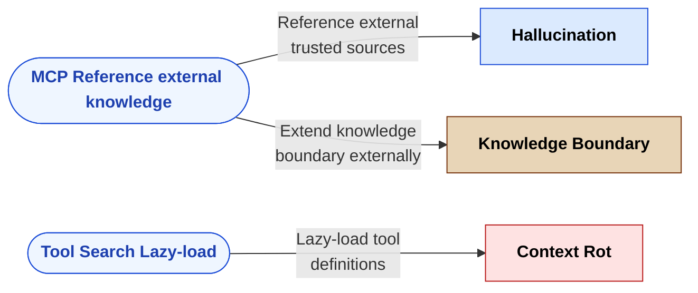

🌐 [日本語](../ja/appendix/problem-countermeasure-map.md)

# Structural Problems × Claude Code Countermeasures Map (Detailed)

> [!NOTE]
> Detailed correspondence between the 8 structural problems and Claude Code features.

## Countermeasure Map

### Context Rot (Quality Degradation with More Tokens)

| Countermeasure | Category | Effect |
| :--- | :--- | :--- |
| `/compact` | Session Management | Compress conversation history to reduce token count |
| `/clear` | Session Management | Reset session to start with fresh context |
| CLAUDE.md 200-line limit | Resident Context | Minimize fixed cost |
| `.claude/rules/` | Conditional Context | Prevent unnecessary rule injection |
| Skills | On-Demand | Deploy only when needed |
| Agents | On-Demand | Avoid root cause with independent context |
| MCP Tool Search | Tool Definition | Lazy-load tool definitions |

### Lost in the Middle (Information Loss in Middle of Context)

| Countermeasure | Category | Effect |
| :--- | :--- | :--- |
| `/compact` (50% threshold) | Session Management | Compress before U-curve collapse |
| `.claude/rules/` | Conditional Context | Inject only necessary rules at high-attention positions |
| Agents | On-Demand | Avoid middle problem with fresh context |
| Skills | On-Demand | Inject near end for high-attention placement |

### Priority Saturation (Reduced Compliance with Too Many Instructions)

| Countermeasure | Category | Effect |
| :--- | :--- | :--- |
| CLAUDE.md 200-line limit | Resident Context | Keep simultaneous active instructions below degradation threshold |
| `.claude/rules/` | Conditional Context | Distribute instructions conditionally |
| Skills | On-Demand | Load task-specific instructions only when needed |
| Hooks | Runtime | Exclude mechanical rules from context budget |

### Hallucination (Structurally Unavoidable)

| Countermeasure | Category | Effect |
| :--- | :--- | :--- |
| Hooks (test execution) | Runtime | Compilers and test runners don't hallucinate |
| Cross-Model QA (Agents) | On-Demand | Verification across different models |
| MCP | Tool Definition | Reference external trusted sources |
| CLAUDE.md | Resident Context | Make constraints and version info explicit |

### Sycophancy (Prioritizing Agreement Over Accuracy)

| Countermeasure | Category | Effect |
| :--- | :--- | :--- |
| Agents (Cross-Model QA) | On-Demand | Different models don't share the same conformity bias |
| Hooks | Runtime | Mechanical verification without conformity bias |
| CLAUDE.md (contradiction instruction) | Resident Context | Explicit instruction to "find problems" |
| Test Code | External Validation | Objective facts as a safeguard |

### Knowledge Boundary (Inability to Say "I Don't Know")

| Countermeasure | Category | Effect |
| :--- | :--- | :--- |
| MCP (external knowledge reference) | Tool Definition | Extend knowledge boundary externally |
| CLAUDE.md (explicit version) | Resident Context | Specify "which point in time's knowledge to use" |
| Agents (knowledge separation) | On-Demand | Narrow knowledge domain to reduce boundary crossing probability |
| Test Code | External Validation | Detect outputs that exceed knowledge boundary |

### Prompt Sensitivity (Results Vary by Expression)

| Countermeasure | Category | Effect |
| :--- | :--- | :--- |
| CLAUDE.md writing style | Resident Context | Specific and imperative writing removes ambiguity |
| Skills description | On-Demand | Diverse expressions improve invocation accuracy |
| `.claude/rules/` | Conditional Context | Reduced simultaneous instructions prevent sensitivity degradation |
| Hooks and tests | Runtime | Verification independent of prompt expression |

### Instruction Decay (Rule Forgetting in Long Conversations)

| Countermeasure | Category | Effect |
| :--- | :--- | :--- |
| `/compact` | Session Management | Preventive compression before 50% usage |
| `/clear` | Session Management | Reset degradation by splitting sessions |
| Hooks | Runtime | Force execution independent of context |
| Agents | On-Demand | Execute task with fresh context |
| Git commits | External Persistence | Easy rollback of degraded output |

## Full Map (Visual)

Visualize the above countermeasure map from the perspective of countermeasure categories. Each diagram shows "which problems this countermeasure addresses."

### Session Management — `/compact` `/clear`

### Resident Context — CLAUDE.md (200-line limit)

### Conditional Context — `.claude/rules/`

### On-Demand Context — Skills & Agents

### Runtime — Hooks

### Tool Definition — MCP & Tool Search

## Integrated Full Map — Problem Chain × Countermeasure Placement

The complete picture of how the 8 structural problems interconnect and where Claude Code features intervene.

```mermaid
graph TD
    %% ════════════════════════════════
    %% Structural Problems ■ Rectangle, unique color per type
    %% ════════════════════════════════
    CR["Context Rot<br/>Quality degradation with<br/>more tokens"]
    LM["Lost in the Middle<br/>Information loss in<br/>middle of context"]
    PS["Priority Saturation<br/>Reduced compliance with<br/>too many instructions"]
    HL["Hallucination<br/>Structurally unavoidable"]
    SY["Sycophancy<br/>Prioritizing agreement<br/>over accuracy"]
    KB["Knowledge Boundary<br/>Inability to say<br/>'I don't know'"]
    PM["Prompt Sensitivity<br/>Results vary by<br/>expression"]
    ID["Instruction Decay<br/>Rule forgetting in<br/>long conversations"]

    %% ── Problem chain (solid lines) ──
    CR -->|"Reduced attention"| LM
    CR -->|"Decreased effectiveness"| PS
    CR -->|"Increased rate"| HL
    CR -->|"Unaware conformity"| SY
    LM -->|"Ignored instructions"| PS
    LM -->|"Overlooked constraints"| SY
    PS -->|"Influenced by expression"| PM
    PS -->|"Overlooked constraints"| HL
    KB -->|"Generate wrong answers"| HL
    KB -->|"Conform to expectations"| SY
    SY -->|"Confirm & amplify"| HL
    HL -->|"Confirm through agreement"| SY

    %% ── All problems → Instruction Decay ──
    CR -->|"Accumulation"| ID
    LM -->|"Accelerated forgetting"| ID
    PS -->|"Priority decrease"| ID
    HL -->|"Foundation degradation"| ID
    SY -->|"Hard to correct"| ID
    PM -->|"Drift from intent"| ID

    %% ════════════════════════════════
    %% Countermeasures ⬮ Rounded, unified blue
    %% ════════════════════════════════
    COMPACT(["/compact Compress history"])
    CLEAR(["/clear Reset"])
    CMD(["CLAUDE.md 200-line limit"])
    RULES([".claude/rules/ Conditional injection"])
    SKILLS(["Skills On-demand"])
    AGENTS(["Agents Independent context"])
    HOOKS(["Hooks Context-external"])
    MCP(["MCP Reference external"])

    %% ── Countermeasures → Problems (dotted for intervention) ──
    COMPACT -.-> CR
    COMPACT -.-> LM
    COMPACT -.-> ID
    CLEAR -.-> CR
    CLEAR -.-> ID

    CMD -.-> CR
    CMD -.-> PS
    CMD -.-> HL
    CMD -.-> SY
    CMD -.-> KB
    CMD -.-> PM

    RULES -.-> CR
    RULES -.-> LM
    RULES -.-> PS

    SKILLS -.-> CR
    SKILLS -.-> LM
    SKILLS -.-> PS

    AGENTS -.-> CR
    AGENTS -.-> HL
    AGENTS -.-> SY
    AGENTS -.-> KB
    AGENTS -.-> ID

    HOOKS -.-> PS
    HOOKS -.-> HL
    HOOKS -.-> SY
    HOOKS -.-> PM
    HOOKS -.-> ID

    MCP -.-> HL
    MCP -.-> KB

    %% ════════════════════════════════
    %% Styles — problems unique colors, countermeasures unified blue
    %% ════════════════════════════════
    classDef cr fill:#fee2e2,stroke:#b91c1c,color:#000,font-weight:bold
    classDef lm fill:#ffedd5,stroke:#c2410c,color:#000,font-weight:bold
    classDef ps fill:#fef9c3,stroke:#a16207,color:#000,font-weight:bold
    classDef hl fill:#dbeafe,stroke:#1d4ed8,color:#000,font-weight:bold
    classDef sy fill:#f3e8ff,stroke:#7c3aed,color:#000,font-weight:bold
    classDef kb fill:#e8d5b7,stroke:#78350f,color:#000,font-weight:bold
    classDef pm fill:#dcfce7,stroke:#15803d,color:#000,font-weight:bold
    classDef id fill:#f3f4f6,stroke:#374151,color:#000,font-weight:bold
    classDef countermeasure fill:#eff6ff,stroke:#1d4ed8,color:#1e40af,font-weight:bold

    class CR cr
    class LM lm
    class PS ps
    class HL hl
    class SY sy
    class KB kb
    class PM pm
    class ID id
    class COMPACT,CLEAR,CMD,RULES,SKILLS,AGENTS,HOOKS,MCP countermeasure
```

**How to Read:**

| Element | Shape | Meaning |
|:--|:--|:--|
| ■ Rectangle nodes (color-coded) | Structural problems (color indicates type) |
| ⬮ Rounded nodes (blue) | Claude Code countermeasures |
| **Solid →** | Problem causes or amplifies another problem |
| **Dotted -.->** | Countermeasure intervenes at this point |

---

> **Next**: [Claude Code Configuration File Reference](claude-code-config-reference.md)

> [Countermeasure Map (Overview)](../01-llm-structural-problems/index.md#structural-problems--claude-code-countermeasures-map) also available
