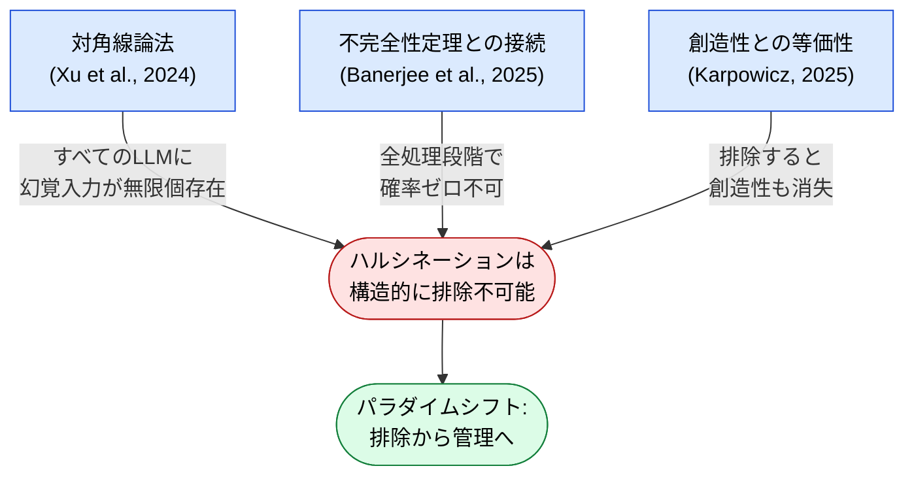

🌐 [English](../../01-llm-structural-problems/hallucination.md)

# Hallucination（幻覚）— LLMは構造的に「嘘」をつく

> [!NOTE]
> **一言で言うと**: LLM が事実に反する内容を自信を持って生成する現象。
> これは「バグ」ではなく、Transformer アーキテクチャの構造的制約であり、
> 数学的に「ゼロにできない」ことが証明されている。

## Hallucination とは何か

Hallucination（幻覚）とは、LLM が事実に反する内容を、あたかも正しいかのように生成する現象である。重要なのは、これがモデルの学習不足や設計ミスではなく、**アーキテクチャに内在する構造的制約**であるということ。

## 3つの数学的根拠



### 1. 対角線論法による証明（Xu et al., 2024）

カントールの対角線論法を応用し、**すべての LLM には必ずハルシネーションを起こす入力が無限個存在する**ことが証明された。これはモデルのサイズや訓練データの質に関係なく成立する。

### 2. ゲーデルの不完全性定理との接続（Banerjee et al., 2025）

LLM の処理全段階（エンコーディング、注意機構、デコーディング）でハルシネーション確率がゼロにならないことが論証された。形式的体系が自己の無矛盾性を証明できないのと同様に、LLM は自身の出力の正確性を完全に保証できない。

### 3. ハルシネーションと創造性の等価性（Karpowicz, 2025）

ハルシネーション制御の根本的不可能性が証明された。ハルシネーションを完全に排除すると、創造性も同時に失われる。つまり、**ハルシネーションと創造性は数学的に同一の操作**である。

## コーディングにおける影響

- 存在しない API やメソッドを自信を持って呼び出すコードを生成
- 古いバージョンの文法を現行バージョンとして提示
- 社内コードに対して、存在しないメソッドの型定義を生成
- テストコードで、実際には通らないアサーションを書く

## Claude Code での対策

ハルシネーションは排除できない。対策は**検出と管理**のパラダイムに基づく。以下は Claude Code における代表例である。

| 対策 | 仕組み | なぜ効くのか |
|:--|:--|:--|
| **Hooks（テスト実行）** | コード変更後に自動でテスト実行 | コンパイラ・テストランナーはハルシネーションしない |
| **Cross-Model QA** | 異なるモデルでレビュー（Agents） | 同じハルシネーションを2つのモデルが同時に起こす確率は低い |
| **CLAUDE.md での制約** | バージョン情報・禁止パターンを明示 | ハルシネーションの発生領域を狭める |
| **MCP による外部参照** | 外部の信頼できるソースを直接参照 | LLM の内部知識ではなく外部事実に基づく |
| **Code Intelligence（LSP）** | 言語サーバー経由でシンボルレベルの接地 | [Part 9](../09-code-intelligence/hallucination-and-symbols.md) を参照 — コードコミット前にシンボルの実在を確認 |
| **Agents（知識の分離）** | 専門エージェントに特定ドメインを委譲 | 知識領域を狭めることでハルシネーション確率を低減 |

## 創造性とのトレードオフをどう扱うか

ハルシネーションと創造性は数学的に等価である（Karpowicz, 2025）。つまり**片方を消すと、もう片方も消える**。したがって実務的な問いは「どうやってハルシネーションをゼロにするか」ではなく、**「設計タスクでは創造性を残しつつ、事実タスクではハルシネーションを抑える」をどう両立させるか**になる。

Claude Code の設計は、この問いに「**タスクごとに対策レイヤーを ON/OFF する**」という形で暗黙的に答えている:

| タスクの種類 | 欲しいもの | 推奨セットアップ |
|:--|:--|:--|
| **設計・ブレスト**（アーキテクチャ案、リファクタ案、命名） | 創造性 ON — ある程度のハルシネーションは対価として受け入れる | 通常会話のみ、LSP接地は不要 |
| **事実・コード生成**（API呼び出し、型シグネチャ、バージョン依存構文） | ハルシネーション抑制 — 出力範囲が狭くなることを受け入れる | LSP接地（[Part 9](../09-code-intelligence/hallucination-and-symbols.md)）、Hooks（テスト実行）、CLAUDE.md でのバージョン固定、MCP による外部参照 |

つまりトレードオフは**単一の設定では解決しない**。**タスクに応じて対策レイヤーを切り替える**ことで両立する。前述の対策表は「抑制モード」用の道具箱であり、「創造モード」では意図的にほとんど OFF にする。

> [!IMPORTANT]
> **なぜトレードオフは最適化で消せないのか**: Karpowicz (2025) はメカニズムデザインで証明している — 偽の出力を厳密にペナルティ付けするスコアリングルールは、**新規だが妥当な出力**にも同じペナルティを与える。両者は分離可能な信号ではない。「創造性を保ったまま真実性だけ上げる」は数学的にフリーランチを探すのと等価である。

## パラダイムシフト: 排除から管理へ

ハルシネーションを「なくす」のではなく「管理する」というパラダイムが重要:

```
ソフトウェア工学のバグ管理と同じ:
  バグをゼロにすることは不可能
  → テスト、レビュー、CI/CD で検出・管理する

LLM のハルシネーション管理:
  ハルシネーションをゼロにすることは不可能
  → Hooks、Cross-Model QA、テストコードで検出・管理する
```

## 他の構造的問題との関係

- **Knowledge Boundary**: 知識境界を超えた時にハルシネーションが発生する入口
- **Sycophancy**: ハルシネーションした内容をユーザーの同意で追認してしまう
- **Context Rot**: コンテキストが長くなるとハルシネーション率が上昇
- **Instruction Decay**: 「事実確認しろ」という指示自体が忘却される

## この制約は Claude に限らない

Hallucination は次トークン予測の構造に起因する。モデルの規模や製品を問わず、事実に反する内容を自信を持って生成しうる。ゼロにはできない。検出と管理が対策になる。

他の環境での現れ方の例:

- 存在しない API や論文を、根拠があるかのように提示する
- バージョンや日付を聞いても、訓練データ上のもっともらしい値を返す
- コンパイラ、テスト、一次資料への照合は、どのツールでもモデルの外で効く

同じ粒度の機能が他ツールに揃っているとは限らない。製品に依存しない原則は [Part 11: 他LLMへの応用](../11-cross-llm-principles/index.md) で抽出する。

## 参考文献

- Xu, Z. et al. (2024). "Hallucination is Inevitable: An Innate Limitation of Large Language Models." [arXiv:2401.11817](https://arxiv.org/abs/2401.11817) — 対角線論法によるハルシネーション不可避性の形式的証明
- Banerjee, S., Agarwal, A., & Singla, S. (2024). "LLMs Will Always Hallucinate, and We Need to Live With This." [arXiv:2409.05746](https://arxiv.org/abs/2409.05746) — ゲーデルの第一不完全性定理との接続による不可避性の証明
- Karpowicz, M. P. (2025). "On the Fundamental Impossibility of Hallucination Control in Large Language Models." [arXiv:2506.06382](https://arxiv.org/abs/2506.06382) — メカニズムデザインとスコアリングルールによるハルシネーションと創造性の等価性証明

---

> **前へ**: [Priority Saturation](priority-saturation.md)

> **次へ**: [Sycophancy](sycophancy.md)

> **Discussion**: [#7 Hallucination](https://github.com/shuji-bonji/understanding-llm-through-claude-code/discussions/7)
