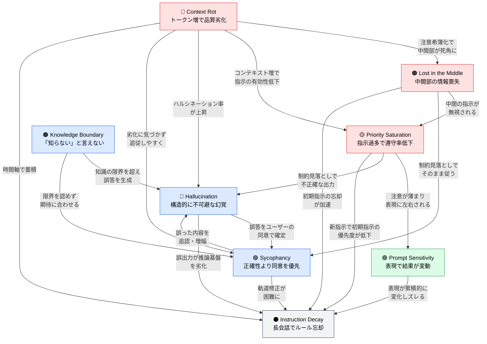

🌐 [English](../../01-llm-structural-problems/index.md)

# Part 1: LLMの構造的制約を知る

> [!NOTE]
> LLM は万能ではない。構造的な制約がある。
> これを理解することが、Claude Code の設計思想を理解する第一歩になる。

## なぜ構造的問題を知る必要があるのか

Claude Code の設定ファイル（CLAUDE.md, rules/, skills/, hooks 等）は、単なる「便利機能」ではない。LLM が抱える構造的問題への**設計的な回答**である。

例えば:
- CLAUDE.md の200行制限 → **Priority Saturation** への対策
- `.claude/rules/` の条件付き注入 → **Lost in the Middle** への対策
- Hooks の機械的検証 → **Hallucination** への対策

「なぜそう設定するのか（Why）」を理解するには、まず「LLMがどんな問題を抱えているか」を知る必要がある。

## 8つの構造的問題

LLM には以下の8つの構造的問題がある。これらは「バグ」ではなく、Transformer アーキテクチャと訓練プロセスに起因する**不可避な制約**である。

### コンテキスト関連（入力が増えるほど悪化する問題）

| 問題 | 一言で言うと | 詳細 |
|:--|:--|:--|
| [Context Rot](context-rot.md) | トークンが増えると出力品質が低下する | 200Kの容量があっても、50Kで既に劣化が始まる |
| [Lost in the Middle](lost-in-the-middle.md) | コンテキスト中間部の情報を無視する | 先頭と末尾に注意が集中し、中間部は30%以上の精度低下 |
| [Priority Saturation](priority-saturation.md) | 指示が多いと全体の遵守率が低下する | 10個の同時指示でGPT-4oは15%、Claude Sonnetは44%の遵守率 |

### 出力関連（生成内容の信頼性の問題）

| 問題 | 一言で言うと | 詳細 |
|:--|:--|:--|
| [Hallucination](hallucination.md) | 事実に反する内容を生成する | 数学的に「ゼロにできない」ことが証明されている |
| [Sycophancy](sycophancy.md) | ユーザーに同意し正確性を犠牲にする | RLHFの副作用。全モデル平均58%の追従率 |
| [Knowledge Boundary](knowledge-boundary.md) | 知識外の質問で「知らない」と言えない | 訓練目的関数に「知らない」への報酬がない |

### 入力感受性（プロンプトの書き方に依存する問題）

| 問題 | 一言で言うと | 詳細 |
|:--|:--|:--|
| [Prompt Sensitivity](prompt-sensitivity.md) | 表現の違いで結果が大きく変動する | 同じ意味でも最大76精度ポイントの差 |

### 時間軸（会話が長くなるほど悪化する問題）

| 問題 | 一言で言うと | 詳細 |
|:--|:--|:--|
| [Instruction Decay](instruction-decay.md) | 長い会話でルールを忘れる | 上記7問題の複合結果。マルチターンで平均39%性能低下 |

## 問題間の関係

これらの問題は独立して存在するのではなく、相互に増幅し合う。以下の図は、8つの構造的問題がどのように連鎖・増幅するかを視覚化したものである。

**3つの主要カスケード**:

1. **空間的劣化**: Context Rot → Lost in the Middle → Priority Saturation（コンテキストが長くなるほど加速）
2. **信頼性の崩壊**: Knowledge Boundary → Hallucination ↔ Sycophancy（フィードバックループ）
3. **時間的複合**: 全7問題 → Instruction Decay（マルチターンで全てが合流）

## 構造的問題 × Claude Code 対策マップ

LLM には 8 つの構造的問題があり、Claude Code の各機能はそれぞれの問題に対する設計的な回答である。Part 2 以降で、各機能がこれらの問題にどう対応しているかを詳しく見ていく。

| 構造的問題 | 概要 | 主な対策（Claude Code） | 対応ドキュメント |
|:--|:--|:--|:--|
| [**Context Rot**](context-rot.md) | トークン増で出力品質が劣化 | `/compact`, `/clear`, コンテキスト予算管理 | Part 2, 3, 5, 6, 8 |
| [**Lost in the Middle**](lost-in-the-middle.md) | コンテキスト中間部の情報を無視 | `/compact`（50%閾値）, 条件付きルール, Agents | Part 2, 4, 5, 8 |
| [**Priority Saturation**](priority-saturation.md) | 指示過多で全体の遵守率低下 | CLAUDE.md 200行制限, `.claude/rules/`, Skills | Part 3, 4, 5 |
| [**Hallucination**](hallucination.md) | 事実に反する内容を生成（構造的に不可避） | Hooks（機械的検証）, テストコード, MCP | Part 6, 7 |
| [**Sycophancy**](sycophancy.md) | ユーザーに同意し正確性を犠牲に | Cross-model QA（Agents）, Hooks, 問い方設計 | Part 5, 7 |
| [**Knowledge Boundary**](knowledge-boundary.md) | 知識外で「知らない」と言えない | MCP外部参照, バージョン明示, 専門Agents | Part 3, 5, 6 |
| [**Prompt Sensitivity**](prompt-sensitivity.md) | 表現の違いで結果が大きく変動 | CLAUDE.md の書き方, Skills description設計 | Part 3, 5 |
| [**Instruction Decay**](instruction-decay.md) | 長会話でルール忘却（7問題の複合結果） | `/compact`, `/clear`, Hooks, セッション分割 | Part 7, 8 |

> 詳細版は [構造的問題 × Claude Code 対策マップ（付録）](../appendix/problem-countermeasure-map.md) を参照。

---

> **次へ**: [Part 2: コンテキストウィンドウを理解する](../02-context-window/index.md)
