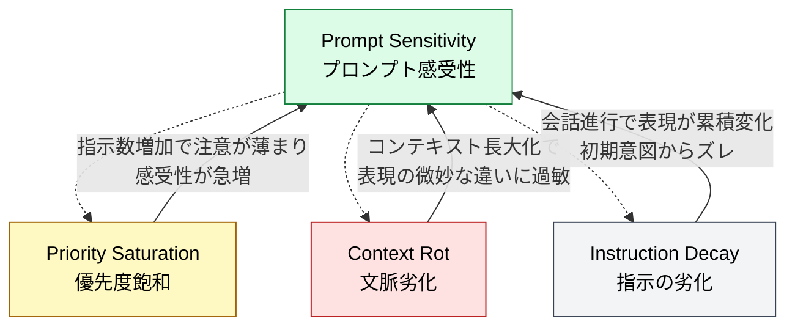

🌐 [English](../../01-llm-structural-problems/prompt-sensitivity.md)

# Prompt Sensitivity（プロンプト感受性）— 同じ意味なのに結果が変わる

> [!NOTE]
> **一言で言うと**: LLM は意味的に同等なプロンプトに対して大きく異なる出力を生成する。
> 同じ質問を異なる表現で問うと、最大 76 精度ポイントの差が生じる。
> これは単なる不安定性ではなく、モデルの理解の浅さを示す構造的制約である。

## Prompt Sensitivity とは何か

Prompt Sensitivity とは、**意味的に同じプロンプトでも、表現が異なるだけで LLM の出力が大きく変わる**現象である。

例えば:

- 「この関数をリファクタリングしてください」
- 「この関数を改善してください」
- 「この関数をクリーンにしてください」

これらは意味的にほぼ同等だが、LLM は異なる出力を生成する可能性がある。

## なぜ発生するのか

### 数学的説明

テイラー展開による分析では、出力差は以下で決まる:

```
出力差 ≈ 勾配ノルム × 埋め込み差ノルム
```

重要な点: **LLM は意味的に類似した入力を内部的にクラスタリングしない**。同じ意味でもトークン列が異なれば、異なる埋め込みベクトルが生成され、異なる出力につながる。

### 表面的な形式の影響

LLM は意味ではなく**トークンの統計的パターン**に反応する部分が大きい。そのため:

- 命令文 vs 疑問文で結果が変わる
- �条書き vs 自由文で結果が変わる
- 専門用語 vs 平易な表現で結果が変わる

## 定量的な根拠

- 同じ質問の異なる表現間で**最大 76 精度ポイントの差**
- これは「不安定」ではなく「特定の表現パターンに対して訓練されている」ことの反映

## コーディングへの影響

- CLAUDE.md に曖昧に書いたルールは遵守されにくい
- Skills の description が曖昧だと自動呼び出しが失敗する
- ユーザーの自然言語での要求の仕方によって、生成コードの品質が変わる

## Claude Code での対策

| 対策                              | 仕組み                               | なぜ効くのか                                             |
| :-------------------------------- | :----------------------------------- | :------------------------------------------------------- |
| **CLAUDE.md の書き方**            | 具体的で命令的な記述、コード例の含有 | 曖昧な表現を排除し、遵守率を向上                         |
| **Skills description 設計**       | ユーザーの自然言語表現を含める       | SEO の原理と同様、多様な表現でのマッチング精度向上       |
| **`.claude/rules/` 条件付き注入** | 同時有効な指示数を減らす             | 感受性悪化（指示が多いほど表現の影響を受けやすい）を防止 |
| **Hooks とテスト**                | プロンプト表現に依存しない外部検証   | プロンプトの書き方に関係なく結果を検証                   |

### 効果的な CLAUDE.md の書き方

```markdown
# ❌ 曖昧（感受性が高い）

- テストをちゃんと書いてね
- コードはきれいにしてほしい

# ✅ 具体的（感受性が低い）

- 全ての public メソッドに対して Jasmine テストを作成する
- テストファイルは \*.spec.ts に配置する
- describe/it の構造で記述する
```

### 効果的な Skills description の書き方

```yaml
# ❌ 曖昧（自動呼び出し失敗しやすい）
description: コンポーネント関連のタスク

# ✅ 具体的（多様な表現をカバー）
description: >
  Angularコンポーネントの新規作成。OnPush変更検知、
  NgRx Store接続、Jasmineテストを含むスキャフォールドを生成する。
  「コンポーネントを作って」「新しい画面を追加」等の要求で使用。
```

## 他の構造的問題との関係

Prompt Sensitivity は他の問題と**双方向に増幅し合う**。



> [!TIP]
> **実線（→）**: 各問題がPrompt Sensitivityを増幅する方向　／　**点線（⇢）**: Prompt Sensitivityが各問題を悪化させるフィードバックループ

## 参考文献

- Zhuo, J., Zhang, S., Fang, X., Duan, H., Lin, D., & Chen, K. (2024). "Assessing and Understanding the Prompt Sensitivity of LLMs." _EMNLP 2024 Findings_. [ACL Anthology](https://aclanthology.org/2024.findings-emnlp.108/) — 一次テイラー展開とコーシー・シュワルツの不等式による Prompt Sensitivity の数学的定式化
- Lu, S., Schuff, H., & Gurevych, I. (2024). "How are Prompts Different in Terms of Sensitivity?" _NAACL 2024_. [ACL Anthology](https://aclanthology.org/2024.naacl-long.325/) — プロンプトの微小な変更が出力を大きく変えるメカニズムの分析

---

> **前へ**: [Knowledge Boundary](knowledge-boundary.md)

> **次へ**: [Instruction Decay](instruction-decay.md)

> **Discussion**: [#12 Prompt Sensitivity](https://github.com/shuji-bonji/understanding-llm-through-claude-code/discussions/12)
