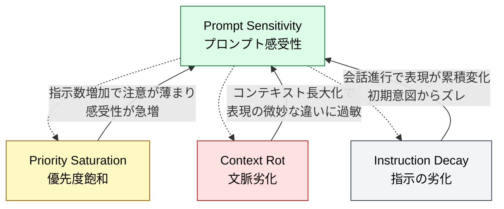

🌐 [English](../../01-llm-structural-problems/prompt-sensitivity.md)

# Prompt Sensitivity（プロンプト感受性）— 同じ意味なのに結果が変わる

> [!NOTE]
> **一言で言うと**: LLM は意味的に同等なプロンプトに対して大きく異なる出力を生成する。
> few-shot のフォーマットを変えるだけで最大 76 精度ポイントの差が生じた報告もある（Sclar et al. 2023）。
> これは単なる不安定性ではなく、モデルがトークンの統計的パターンに依存していることの反映である。ただし観測される差の大きさは評価方法にも依存する（後述）。

## Prompt Sensitivity とは何か

Prompt Sensitivity とは、**意味的に同じプロンプトでも、表現が異なるだけで LLM の出力が大きく変わる**現象である。

例えば、

- 「この関数をリファクタリングしてください」
- 「この関数を改善してください」
- 「この関数をクリーンにしてください」

これらは意味的にほぼ同等だが、LLM は異なる出力を生成する可能性がある。

## なぜ発生するのか

### 数学的説明（概念的な一次近似）

入力の微小変化に対する出力の感度は、**概念的には**一次近似（テイラー展開＋コーシー・シュワルツの上界）で次のように見積もれる:

```
出力差 ≲ 勾配ノルム × 埋め込み差ノルム
```

> [!NOTE]
> これは特定論文の定理ではなく、勾配サリエンシー（`saliency = ‖∇(出力ロジット)‖`、Lu et al. 2024）に基づく概念的な目安である。Transformer は強く非線形（Attention・FFN）なので、一次近似はあくまで局所的な感度の指標にすぎず、全域的な説明力は限定的である。

注意すべき点: 埋め込み空間では意味の近い入力はクラスタリングされている。それでも感受性が生じるのは、**埋め込みの小さな差が後段の非線形変換で増幅される**ためである。「意味は近いが、出力分布への影響は大きい」場合がある、という言い方が正確である。

### 表面的な形式の影響

LLM は意味ではなく**トークンの統計的パターン**に反応する部分が大きい。そのため:

- 命令文 vs 疑問文で結果が変わる
- 箇条書き vs 自由文で結果が変わる
- 専門用語 vs 平易な表現で結果が変わる

## 定量的な根拠

- few-shot の**フォーマット**（区切り文字・記号・大小文字など表層的・spurious な特徴）を変えるだけで、LLaMA-2-13B において**最大 76 精度ポイントの差**（Sclar et al. 2023）
- この「76 ポイント」は意味等価のパラフレーズではなく**フォーマット変更**による差である点に注意。意味を変えない言い換えでの感受性とは別物として扱う
- 感受性の大きさは**タスク・モデル・評価方法によって大きく変わる**

> [!NOTE]
> 観測される感受性の相当部分は、評価指標の脆さ（log-likelihood scoring や厳格な answer matching が、意味的に正しい別表現の解答を取りこぼすこと）に由来するアーティファクトであり、適切な評価設計のもとでは現代の LLM は報告より頑健、という反証研究もある（Hua et al. 2025）。したがって「prompt sensitivity は Transformer の不可避な構造的制約」と強く一般化しすぎないこと。効果は実在するが、**観測される大きさは評価法に依存する**。実務上の含意（曖昧な指示は不安定）は変わらないが、数値はベンチマーク設定込みで読む必要がある。

## 指定欠落（Underspecification）— 軸を指定しないと事前分布が支配する {#underspecification}

Prompt Sensitivity の双子の問題に **Underspecification（指定欠落）** がある。Prompt Sensitivity が「指定済みのプロンプトの**表現**を変えると出力が変わる」現象なら、Underspecification は「ある軸を**そもそも指定しない**と、その軸をモデルが事前分布から埋める」現象である。指定欠落は感受性の極限ケース — 指定がゼロの軸では、出力を決めるのは推論ではなく訓練データの最頻パターンになる。

> [!NOTE]
> 「Underspecification を Prompt Sensitivity の双子／極限ケースとして捉える」整理と、後述の姉妹サイトとの接続は、本サイト独自のフレーミングである（個々の引用論文がこの対応関係を主張しているわけではない）。

### なぜモデルは自分で決められないのか

LLM の出力は条件付き確率分布 `P(出力 | トークン列)` のサンプリングである。プロンプトは、この分布を**条件付ける**トークン列にすぎない。

- ある軸（役割・出力形式・成功基準など）をプロンプトが指定すれば、その軸について分布が鋭く絞られる。
- 指定しなければ、その軸についての条件付けが弱いまま残り、モデルは**事前分布（訓練データで最も頻度の高いパターン）からサンプリングして埋める**。

つまりモデルは「判断できない」のではない。**指定されていない軸を、推論ではなく統計的事前分布で機械的に埋めている**。事前分布は文脈やトークン列に左右されるため、同じ依頼でもセッションごとに違う埋め方になる — これが非決定性（毎回ぶれる箇所）の正体である。

> [!IMPORTANT]
> 「役割を書かないと、どの視点で答えるかをモデルが判断できない」と言うとき、正確には **判断していない**。指定の弱い軸を事前分布の最頻値で埋めているだけである。だから対策は「モデルにうまく判断させる」ことではなく、**変動させたくない軸を明示的に指定して条件付けを鋭くすること** になる。

| 依頼                             | 指定されていない軸                      | モデルが事前分布で埋めるもの                         |
| :------------------------------- | :-------------------------------------- | :-------------------------------------------------- |
| 「テストを書いて」               | テストフレームワーク                    | 訓練データで最頻のもの（プロジェクト次第で Jest 等） |
| 「この関数をドキュメント化して」 | 出力形式（JSDoc / Markdown / コメント） | 言語ごとの最頻スタイル                              |
| 「レビューして」                 | 観点（バグ / 設計 / スタイル）と厳しさ  | 一般的な「無難な」観点                              |

### 姉妹サイトとの接続

姉妹サイト ai-agent-architecture は、良いプロンプトが持つ **7条件**（役割・前提・目的・入力・処理/制約・出力形式・例示）を「出力が変動しうる独立な軸」として整理している。本節はその **なぜ**（指定の弱い軸が事前分布で埋まる原理）を担う。各軸を毎回プロンプトで埋め直すのではなく層へ外部化する、という設計判断はそちらを参照。

- [ai-agent-architecture / プロンプト分解](https://shuji-bonji.github.io/ai-agent-architecture/ja/concepts/09-prompt-decomposition) — 7条件を5層へ外部化する設計（What / How）

## コーディングへの影響

- CLAUDE.md に曖昧に書いたルールは遵守されにくい
- Skills の description が曖昧だと自動呼び出しが失敗する
- ユーザーの自然言語での要求の仕方によって、生成コードの品質が変わる

## Claude Code での対策

以下は Claude Code における代表例である。

| 対策                              | 仕組み                               | なぜ効くのか                                             |
| :-------------------------------- | :----------------------------------- | :------------------------------------------------------- |
| **CLAUDE.md の書き方**            | 具体的で命令的な記述、コード例の含有 | 曖昧な表現を排除し、遵守率を向上                         |
| **Skills description 設計**       | ユーザーの自然言語表現を含める       | SEO の原理と同様、多様な表現でのマッチング精度向上       |
| **`.claude/rules/` 条件付き注入** | 同時有効な指示数を減らす             | 感受性悪化（指示が多いほど表現の影響を受けやすい）を防止 |
| **Hooks とテスト**                | プロンプト表現に依存しない外部検証   | プロンプトの書き方に関係なく結果を検証                   |
| **Plugins / Marketplaces**        | 検証済みプロンプトをインストール可能なパッケージとして配布 | [付録: Plugins & Marketplaces](../appendix/plugins-and-marketplaces.md) を参照 — 個別エンジニアの試行錯誤ではなく、チーム全体のキャリブレーション |

### 効果的な CLAUDE.md の書き方

```markdown
# 悪い例 — 曖昧（感受性が高い）

- テストをちゃんと書いてね
- コードはきれいにしてほしい

# 良い例 — 具体的（感受性が低い）

- 全ての public メソッドに対して Jasmine テストを作成する
- テストファイルは \*.spec.ts に配置する
- describe/it の構造で記述する
```

### 効果的な Skills description の書き方

```yaml
# 悪い例 — 曖昧（自動呼び出し失敗しやすい）
description: コンポーネント関連のタスク

# 良い例 — 具体的（多様な表現をカバー）
description: >
  Angularコンポーネントの新規作成。OnPush変更検知、
  NgRx Store接続、Jasmineテストを含むスキャフォールドを生成する。
  「コンポーネントを作って」「新しい画面を追加」等の要求で使用。
```

## 他の構造的問題との関係

Prompt Sensitivity は他の問題と**双方向に増幅し合う**。


```mermaid
flowchart TD
    PS["Prompt Sensitivity<br>プロンプト感受性"]
    PSat["Priority Saturation<br>優先度飽和"]
    CR["Context Rot<br>文脈劣化"]
    ID["Instruction Decay<br>指示の劣化"]

    PSat -->|"指示数増加で注意が薄まり<br>感受性が急増"| PS
    CR -->|"コンテキスト長大化で<br>表現の微妙な違いに過敏"| PS
    ID -->|"会話進行で表現が累積変化<br>初期意図からズレ"| PS

    %% フィードバックループ（悪循環）
    PS -.-> PSat
    PS -.-> CR
    PS -.-> ID

    style PS fill:#dcfce7,stroke:#15803d,color:#000
    style PSat fill:#fef9c3,stroke:#a16207,color:#000
    style CR fill:#fee2e2,stroke:#b91c1c,color:#000
    style ID fill:#f3f4f6,stroke:#374151,color:#000
```

> [!TIP]
> **実線（→）**: 各問題がPrompt Sensitivityを増幅する方向　／　**点線（⇢）**: Prompt Sensitivityが各問題を悪化させるフィードバックループ

## この制約は Claude に限らない

意味が同じでも、表現や形式が違うと出力が変わる。トークンの統計的パターンに依存するため、製品を問わず起きる。

他の環境での現れ方の例:

- 「リファクタして」と「改善して」で、変更の範囲が変わる
- 出力形式を指定しないと、セッションごとに違う形式になる
- 役割、成功基準、出力形式など、変動させたくない軸は明示する
- 検証はプロンプトの外に置く

同じ粒度の機能が他ツールに揃っているとは限らない。製品に依存しない原則は [Part 11: 他LLMへの応用](../11-cross-llm-principles/index.md) で抽出する。

## 参考文献

- Sclar, M., Choi, Y., Tsvetkov, Y., & Suhr, A. (2023). "Quantifying Language Models' Sensitivity to Spurious Features in Prompt Design." _arXiv:2310.11324_. [arXiv](https://arxiv.org/abs/2310.11324) — few-shot のフォーマット変更（spurious feature）で LLaMA-2-13B が最大 76 精度ポイントの差。本ページの「76 ポイント」の出典
- Zhuo, J., Zhang, S., Fang, X., Duan, H., Lin, D., & Chen, K. (2024). "ProSA: Assessing and Understanding the Prompt Sensitivity of LLMs." _EMNLP 2024 Findings_. [ACL Anthology](https://aclanthology.org/2024.findings-emnlp.108/) — PromptSensiScore（PSS）と decoding confidence による経験的な感受性評価（テイラー展開による定式化は本論文には無い）
- Lu, S., Schuff, H., & Gurevych, I. (2024). "How are Prompts Different in Terms of Sensitivity?" _NAACL 2024_. [ACL Anthology](https://aclanthology.org/2024.naacl-long.325/) — 勾配サリエンシー（`‖∇出力‖`）でプロンプトの感受性を分析。本ページの一次近似の根拠
- Hua, A., Tang, K., Gu, C., Gu, J., Wong, E., & Qin, Y. (2025). "Flaw or Artifact? Rethinking Prompt Sensitivity in Evaluating LLMs." _EMNLP 2025_. [arXiv](https://arxiv.org/abs/2509.01790) — 観測される感受性の相当部分は評価指標の脆さに由来するアーティファクトで、適切な評価設計下では LLM は報告より頑健

---

> **前へ**: [Knowledge Boundary](knowledge-boundary.md)

> **次へ**: [Instruction Decay](instruction-decay.md)

> **Discussion**: [#12 Prompt Sensitivity](https://github.com/shuji-bonji/understanding-llm-through-claude-code/discussions/12)
