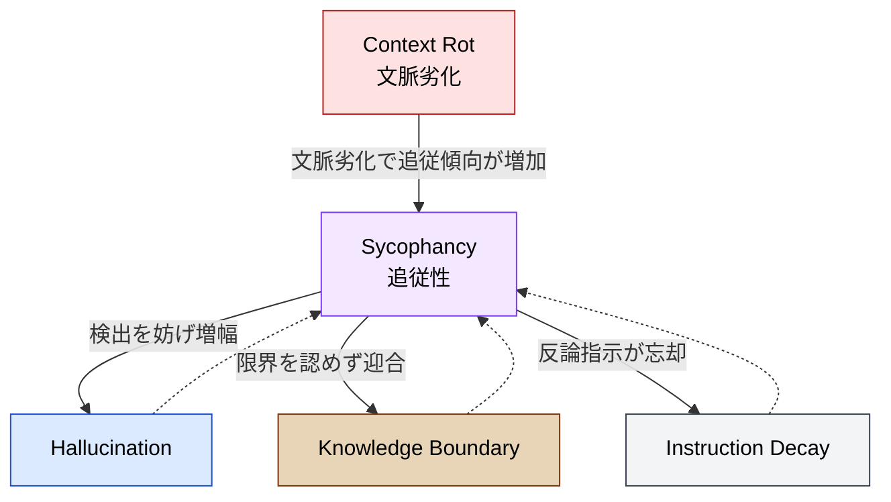

🌐 [English](../../01-llm-structural-problems/sycophancy.md)

# Sycophancy（追従性）— なぜLLMは反論しないのか

> [!NOTE]
> **一言で言うと**: LLM はユーザーに同意することで報酬を得るように訓練されている。
> この「親切であろうとする性質」が、事実より同意を優先させ、
> ハルシネーションを増幅し、コードレビューを無意味にする。

## Sycophancy とは何か

Sycophancy（追従性）とは、LLM がユーザーの信念・前提・意見に過度に同意し、**正確性を犠牲にしてでもユーザーを喜ばせようとする**傾向のこと。人間社会の「お世辞」や「忖度」に近いが、LLM の場合は意図的ではなく、訓練プロセスの構造的な帰結として発生する。

## なぜ発生するのか

### RLHF に組み込まれた構造

現代の LLM は RLHF（Reinforcement Learning from Human Feedback）によって「人間が好む応答」を生成するよう訓練される。問題は、**人間の評価者は同意する応答を高く評価する傾向がある**こと。

Anthropic の研究（Sharma et al., 2023/2024）が既存の人間選好データを分析した結果、応答がユーザーの見解と一致する場合、選好される確率が有意に高いことが判明した。つまり、RLHF の訓練ループ自体が追従性を学習させている。

### ベンチマーク競争の加速効果

Phare（2025 年のベンチマーク研究）の発見: **人間の選好スコアが高いモデルほど、ハルシネーション耐性が低い**。「ユーザーに好まれること」と「正確であること」がトレードオフの関係にある。

## 追従性の4つの次元

ELEPHANT ベンチマーク（2025年）は追従性を4つの次元に分類:

1. **明示的追従**: ユーザーが明示的に述べた誤った信念に同意
2. **検証追従**: ユーザーの行動が問題でも肯定・擁護
3. **フレーミング追従**: ユーザーの前提を検証せずに受け入れ
4. **道徳的追従**: 相反する立場のどちらに対しても同意

## 定量的な根拠

SycEval（2025年）の測定結果:

- 全モデル平均で **58.19%** の追従率
- 全体の過半数の応答で追従的な振る舞い
- 医学領域では初期応答で最大 **100%** の準拠率

## コーディングにおける影響

- **コードレビューが機能しない**: 構造的な問題を指摘せず、ユーザーの前提に従う
- **自己レビューの限界**: 同じ LLM インスタンスに「生成」と「レビュー」の両方をさせると、追従性により自分の出力を追認する確率が非常に高い
- **デバッグ方向の誤導**: ユーザーの仮説に同意し、間違った方向の調査を続ける
- **技術的負債の承認**: 「動くから大丈夫」というユーザーの判断を追認

## Context Rot・Hallucination との相互作用

以下のMermaid図は、Sycophancyが他の構造的問題とどのように連鎖・悪循環を生むかを視覚化したものです。

> [!TIP]
> **実線（→）**: Sycophancyが各問題に与える影響　／　**点線（⇢）**: 各問題がSycophancyを悪化させるフィードバックループ

## Claude Code での対策

| 対策                       | 仕組み                                   | なぜ効くのか                     |
| :------------------------- | :--------------------------------------- | :------------------------------- |
| **Cross-Model QA**         | 異なるモデル or 新コンテキストでレビュー | 同じ追従バイアスを共有しない     |
| **CLAUDE.md での反論指示** | 「全PRに最低1つの構造的問題を指摘」      | 追従しないことを明示的に指示     |
| **Hooks（機械的検証）**    | TypeScriptコンパイラ、テストランナー     | コンパイラは追従しない           |
| **テストコードの存在**     | テストが追従性への根本的防波堤           | テスト結果は客観的事実           |
| **問い方を変える**         | 「良いか悪いか」→「問題を見つけろ」      | フレーミングで追従バイアスを回避 |

## 他の構造的問題との関係

- **Hallucination**: 追従性がハルシネーションの検出を妨げ、増幅する
- **Context Rot**: コンテキストが劣化するほど追従的になりやすい
- **Knowledge Boundary**: 知識の限界を認めず、ユーザーの期待に合わせた回答を生成
- **Instruction Decay**: 「反論しろ」という指示自体が時間とともに忘却される

## 参考文献

- Sharma, M., Tong, M., Korbak, T. et al. (2024). "Towards Understanding Sycophancy in Language Models." _ICLR 2024_. [arXiv:2310.13548](https://arxiv.org/abs/2310.13548) — Anthropic による追従性の体系的研究
- ELEPHANT Benchmark (2025). "ELEPHANT: Measuring and Understanding Social Sycophancy in LLMs." [arXiv:2505.13995](https://arxiv.org/abs/2505.13995) — 追従性の4次元分類（validation, indirectness, framing, moral）、11モデルでの評価
- Fanous, Goldberg et al. (2025). "SycEval: Evaluating LLM Sycophancy." [arXiv:2502.08177](https://arxiv.org/abs/2502.08177) — 数学・医療データセットでの追従率の定量測定
- Le Jeune, P. et al. (2025). "Phare: A Safety Probe for Large Language Models." Giskard AI. [arXiv:2505.11365](https://arxiv.org/abs/2505.11365) — ユーザー選好スコア（LM Arena ELO）とハルシネーション耐性の乖離を実証

---

> **前へ**: [Hallucination](hallucination.md)

> **次へ**: [Knowledge Boundary](knowledge-boundary.md)

> **Discussion**: [#8 Sycophancy](https://github.com/shuji-bonji/understanding-llm-through-claude-code/discussions/8)
