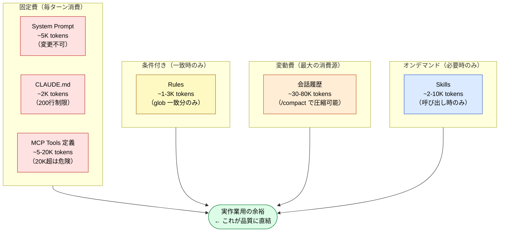

🌐 [English](../../02-context-window/context-budget.md)

# コンテキスト予算という考え方

> [!NOTE]
> コンテキストウィンドウのトークンを何にどれだけ使うか。
> この「予算」の概念が、Part 3〜7 の全ての設計判断の定量的根拠になる。
>
> ※ 本ページでは Claude Code で一般的な 200K トークンを基準に解説する。Claude 4.6 系では 1M トークンに拡張されたが、予算管理の原則は同じである。

## なぜ「予算」なのか

コンテキストウィンドウは有限のリソースである。200K トークンは一見大きいが、Part 1 で学んだ通り:

- **Context Rot**: 50K トークンで既に劣化が始まる
- **Lost in the Middle**: 50%使用率を超えるとU字カーブが崩壊
- **Priority Saturation**: ~3,000 トークンの指示量で遵守率が低下

つまり、200K の容量を全て使うことは想定されていない。**実効的なコンテキスト予算は 100K 以下**であり、その中でどう配分するかが設計の鍵になる。

## 典型的なコンテキスト予算配分



## 予算配分の原則

### 固定費を最小化する

常駐コンテキスト（System Prompt + CLAUDE.md + MCP 定義）は「固定費」。毎ターン消費される。

| 項目           | 目安         | 管理方法                                      |
| :------------- | :----------- | :-------------------------------------------- |
| System Prompt  | ~5K          | 変更不可                                      |
| CLAUDE.md      | ~2K（200行） | 200行制限を厳守                               |
| MCP Tools 定義 | ~5-20K       | 不要なMCPを外す。20K超でTool Search自動有効化 |

### 変動費を制御する

会話履歴は最大の「変動費」。放置するとコンテキストの大部分を消費する。

- `/compact` で予防的に圧縮（50%使用率前に実行）
- `/clear` でセッション分割（タスクごとにリセット）

### コンテキスト増加のトリガー

予算管理において重要なのは、**何がきっかけで Context が増えるか**を把握すること。以下はコンテキストが増加するトリガーの一覧。

| 種別 | トリガー | 注入タイミング | 消費パターン |
|:--|:--|:--|:--|
| System Prompt | セッション開始 | 自動 | 毎ターン固定消費 |
| CLAUDE.md | セッション開始 | 自動 | 毎ターン固定消費 |
| MCP ツール定義 | MCP サーバー接続時 | 自動 | 毎ターン固定消費 |
| Rules | 操作ファイルが glob パターンに一致 | 自動（条件付き） | 一致時のみ消費 |
| Skills | ユーザーが `/` で呼出 | 手動 | 呼出時のみ一時消費 |
| Skills（自動） | LLM が description との意味的類似度で判断 | LLM 判断 | 判断時のみ一時消費 |
| 会話履歴 | ユーザー入力・LLM 応答の蓄積 | 自動（累積） | ターンごとに増加 |
| ツール実行結果 | MCP ツールの応答 | 自動 | 実行のたびに追加 |
| ファイル読み込み | LLM が Read/Grep 等でファイル参照 | LLM 判断 | 参照のたびに追加 |

> [!TIP]
> 「自動」トリガーは予算の固定費になり、「手動」「LLM 判断」「条件付き」トリガーは変動費になる。固定費を最小化し、変動費を制御することが予算管理の基本戦略。

## MCP ツール定義の予算影響

MCP サーバーを接続すると、ツール定義（名前、パラメータスキーマ、説明文）が**毎ターン**消費される。

```
MCP が 25K の場合:
  200K - 5K(System) - 2K(CLAUDE.md) - 25K(MCP) = 168K
  → 50%ルール適用: 実効 84K
  → 会話履歴 50K を引くと: 残り 34K（実作業用）

MCP が 50K の場合:
  200K - 5K - 2K - 50K = 143K
  → 50%ルール適用: 実効 71.5K
  → 会話履歴 50K を引くと: 残り 21.5K（かなり窮屈）
```

## Part 3〜7 への接続

この予算概念が、以降の各パートの設計判断の定量的根拠になる。

| Part                    | 予算への影響          | 設計判断                                 |
| :---------------------- | :-------------------- | :--------------------------------------- |
| Part 3（CLAUDE.md）     | 固定費 ~2K            | 200行制限で固定費を最小化                |
| Part 4（Rules）         | 条件付き ~1-3K        | glob で必要時のみ追加                    |
| Part 5（Skills/Agents） | オンデマンド / 別予算 | Skills は一時的、Agents は別コンテキスト |
| Part 6（MCP）           | 固定費 ~5-20K         | ツール数を制限、Tool Search で遅延ロード |
| Part 7（Hooks）         | **予算ゼロ**          | コンテキスト外で実行。最も予算効率が良い |

---

> **前へ**: [注入タイミングの全体像](injection-timing.md)

> **次へ**: [Part 3: 常駐コンテキスト](../03-always-loaded-context/index.md)
