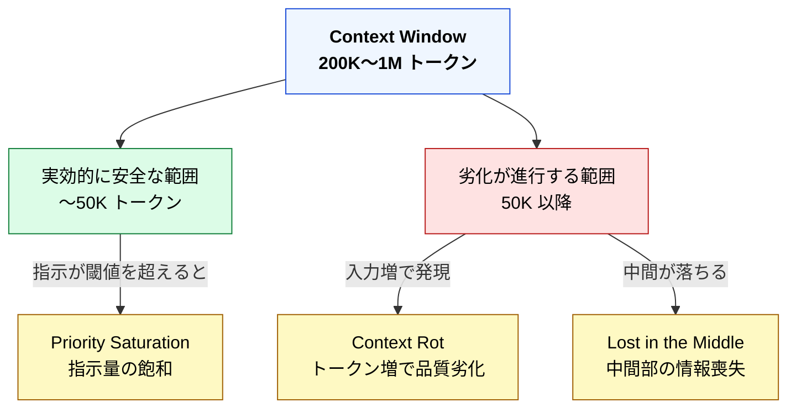

🌐 [English](../../02-context-window/context-window.md)

# Context Window — 上限と安全に使える範囲

> [!NOTE]
> **一言で言うと**: Context Window とは、LLM が一度に処理できる Context の上限である。単位はトークン数である。
> 上限まで使ってよいわけではない。容量が残っていても、入力が増えるほど品質は下がる。

## Context Window とは何か

Context Window（コンテキストウィンドウ）とは、**LLM が一度に処理できる Context の最大サイズ**である。

| モデル | Context Window サイズ |
| :-- | :-- |
| Claude Sonnet 4.6 / Opus 4.6 | 1M トークン（200K 超も標準料金の場合あり） |
| Claude Sonnet 4 / Opus 4 | 200K トークン |
| GPT-4o | 128K トークン |
| Gemini 2.5 Pro | 1M トークン |

数値はモデルと時期により変わる。設計の前提として重要なのは、具体的な桁そのものより、「有限である」「製品を問わず有限である」という点である。

> [!TIP]
> 開発者向けの比喩: Context Window はプロセスに割り当てられたメモリ空間である。サイズを超えると OOM するのと同じように、Context Window を超えるとトークンが切り捨てられる。

## なぜ重要か

上限はモデルによって異なる。ただし上限まで使ってよいわけではない。

容量が残っていても、入力が増えるほど出力品質は下がる。Context Window は「使える最大量」ではなく、「そのうち品質を保てる範囲はもっと狭い」と理解する必要がある。

常駐指示を短くする、条件付きで読む、別セッションで分ける、といった設計は、すべてこの制約への応答である。

## 「大きければ安全」ではない

ここが最も重要な点であり、Part 1 で学んだ構造的問題との接続点になる。

Context Window は「容量いっぱいまで使える」のではなく、「容量のうち、品質を保てるのは一部」である。1M に拡張されても、この原則は変わらない。定量的な配分は [コンテキスト予算](context-budget.md) で扱う。

## Part 1 の問題との接続

- **Context Rot**: トークン増で品質が劣化する。Window が広くても、長い入力そのものが原因になる。
- **Lost in the Middle**: 中間部の情報が参照されにくくなる。長い Context ほど中間が死角になる。
- **Priority Saturation**: 同時指示が増えると遵守率が落ちる。常駐枠を厚くすると起きやすい。

## 代表例: Claude Code の機能と Context Window

以下は Claude Code における代表例である。同じファイル名やコマンドが他ツールにあるとは限らない。対応するのは機能名ではなく、役割である。

| Claude Code の機能 | Context Window に対する戦略 |
| :-- | :-- |
| CLAUDE.md の行数制限 | 常駐する Context を最小限に抑える |
| `.claude/rules/` | 条件一致時のみ Context に注入する |
| Skills | 必要時だけ Context を消費する |
| Agents | 別の Context Window で実行する |
| `/compact` | Context を圧縮して空間を回復する |
| `/clear` | Context をリセットする |
| Hooks | Context を一切消費しない |

製品に依存しない原則の抽出は [Part 11](../11-cross-llm-principles/index.md) で行う。

## 3概念の関係

| 概念 | 一言で | 開発者向けの比喩 |
| :-- | :-- | :-- |
| **Token** | LLM の処理単位 | メモリのバイト |
| **Context** | LLM への入力全体 | HTTP リクエストボディ |
| **Context Window** | 入力の最大サイズ | プロセスのメモリ空間 |

Token は単位、Context は中身、Context Window は上限である。設計で操作するのは、主に Context の中身と長さである。

## 次に進む前に

上限と安全域を押さえたうえで、次は Context が時間方向にどう膨らむかを見る。[Chat / Session](chat-session.md) が、その「時間の入れ物」である。

---

> **前へ**: [Context — 1回の推論に渡す全情報](context.md)

> **次へ**: [Chat / Session — Context が蓄積する時間の入れ物](chat-session.md)
