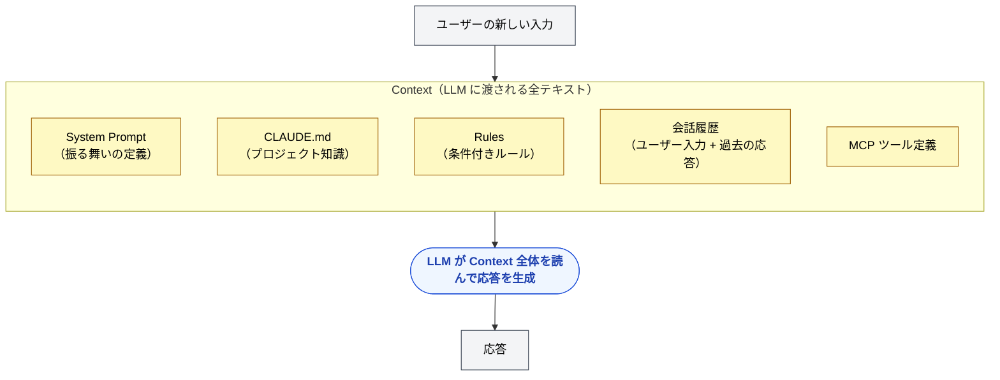
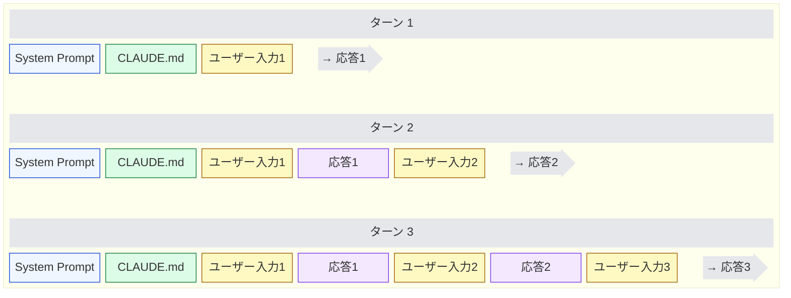

🌐 [English](../../02-context-window/context.md)

# Context — 1回の推論に渡す全情報

> [!NOTE]
> **一言で言うと**: Context とは、1回の推論で LLM に渡される情報の全体である。
> LLM は前回の内容を内部に保持しない。渡された Context だけを読んで応答する。

## Context とは何か

Context（コンテキスト）とは、**LLM が1回の応答を生成するために参照するすべてのテキスト**である。システム指示、プロジェクトルール、会話履歴、ツール定義、ツールの実行結果を含む。

開発者の日常で例えると、次のように対応する。

| 比喩 | Context に相当するもの |
| :-- | :-- |
| 関数呼び出し | 引数として渡される全データ |
| HTTP リクエスト | リクエストボディ全体 |
| コンパイル | コンパイラに渡されるソースファイル群 |

## なぜ重要か

LLM はステートレスである。過去の会話を「覚えている」のではない。アプリケーションが、会話履歴を含むすべてのテキストを毎回 Context として渡し、それを読んで応答を生成する。

何を載せるか、何を載せないかが設計になる。履歴が増えるほど Context は膨らむ。これが Part 1 で学んだ [Context Rot](../01-llm-structural-problems/context-rot.md) と [Instruction Decay](../01-llm-structural-problems/instruction-decay.md) の物理的な原因である。

## Context に入りうるもの

代表例として Claude Code を用いると、1回の推論の Context には次のようなものが載りうる。

同じ粒度のファイル名が他ツールにあるとは限らない。共通しているのは、「毎回渡す情報」「条件付きで渡す情報」「履歴として積み上がる情報」という区分である。

## ステートレスであることの意味

REST API に馴染みのある開発者なら直感しやすい。LLM の応答生成は HTTP リクエストと同じく、**リクエストごとに独立**している。

LLM は過去の会話を覚えているのではなく、毎ターン、全履歴を読んでいる。ターンが進むほど Context が膨らむ。

セッションをまたぐ「記憶」が必要なら、ファイルなど Context の外に書く。渡さなければ、次の推論には存在しない。

## Part 1 の問題との接続

- **Context Rot**: 入力トークンが増えるほど品質が劣化する。Context が長いほど起きやすい。
- **Instruction Decay**: 長い会話で初期指示への遵守が落ちる。履歴の膨張が時間軸で効く。

対策の型は共通する。載せる情報を選ぶ。長くなったら区切る、または圧縮する。重要な決定はファイルに残す。

## 次に進む前に

Context は「中身」である。次に見る Context Window は、その中身の上限である。上限まで使ってよいわけではない。

---

> **前へ**: [Token — LLM の処理単位](token.md)

> **次へ**: [Context Window — 上限と安全に使える範囲](context-window.md)
