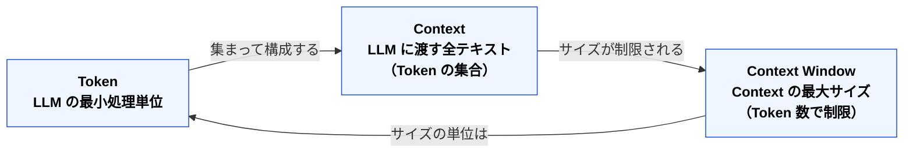

🌐 [English](../../02-context-window/token-context-basics.md)

# Token・Context・Context Window — 3つの関係

> [!NOTE]
> Token / Context / Context Window は、それぞれ独立したページで定義する。
> 本ページは3概念の関係だけを示す。詳細な定義は各ページを読む。

## 各ページへ

| 概念 | ページ | 一言 |
| :-- | :-- | :-- |
| **Token** | [Token](token.md) | LLM の処理単位 |
| **Context** | [Context](context.md) | 1回の推論に渡す全情報 |
| **Context Window** | [Context Window](context-window.md) | その上限と、安全に使える範囲 |

## 3概念の関係

| 概念 | 一言で | 開発者向けの比喩 |
| :-- | :-- | :-- |
| **Token** | LLM の処理単位 | メモリのバイト |
| **Context** | LLM への入力全体 | HTTP リクエストボディ |
| **Context Window** | 入力の最大サイズ | プロセスのメモリ空間 |

Token は単位である。Context は、その単位で測られる「1回分の入力全体」である。Context Window は、その Context の上限である。

設計で操作するのは、主に Context の中身と長さである。単位を間違えず、上限を過信しないことが、後続の Part 全体の前提になる。

---

> **次へ**: [Token — LLM の処理単位](token.md)
