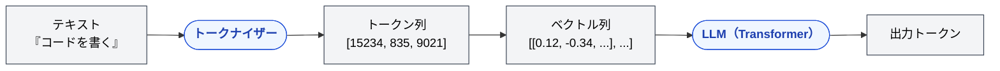

🌐 [English](../../02-context-window/token.md)

# Token — LLM の処理単位

> [!NOTE]
> **一言で言うと**: Token とは、LLM がテキストを処理する最小単位である。文字でも単語でもない。
> コンテキストの上限も、品質の劣化も、課金も、トークン数で測る。

## Token とは何か

LLM はテキストを「文字」単位でも「単語」単位でもなく、**Token**（トークン）という独自の単位で処理する。

```
入力テキスト:  "Claude Code でコードを書く"
                ↓ トークナイザーが分割
トークン列:    ["Claude", " Code", " で", "コード", "を", "書", "く"]
```

英語は概ね「1単語 ≈ 1〜1.3 トークン」、日本語は「1文字 ≈ 1〜3 トークン」になる。同じ内容でも日本語の方がトークン消費が多い。

## なぜ重要か

コンテキストの上限も、品質の劣化も、課金も、トークン数で測る。文字数や行数で見積もると、特に日本語では実態とずれる。

短い指示、短い履歴、必要な情報だけの注入といった設計判断は、すべて「何トークン使うか」に帰着する。単位を間違えると、後続の Context と Context Window の議論が測れなくなる。

## なぜ Token 単位なのか

LLM の内部は**数値ベクトルの演算**で動いている。テキストを直接は処理できないため、テキスト → トークン（整数 ID） → ベクトルに変換する必要がある。



このパイプライン全体を「トークン」という単位が貫いている。LLM の能力も制約も、すべてトークン単位で語られる。

## Token の実感

| 目安 | トークン数 |
| :-- | :-- |
| 英語 1 単語 | 約 1 トークン |
| 日本語 1 文字 | 約 1〜3 トークン |
| この README.md（約 135 行） | 約 2,000 トークン |
| 一般的なソースファイル（200 行） | 約 1,000〜3,000 トークン |
| Claude の 200K コンテキスト | 英語の本 約 2 冊分 / 日本語の本 約 1 冊分 |

> [!TIP]
> 開発者向けの比喩: Token はメモリのバイトに相当する。CPU（LLM）がデータを処理する最小単位であり、メモリ容量（Context Window）もバイト（トークン）で測る。

## 次に進む前に

Token は単位である。次に見る Context は、その単位で測られる「1回分の入力全体」である。

---

> **次へ**: [Context — 1回の推論に渡す全情報](context.md)
