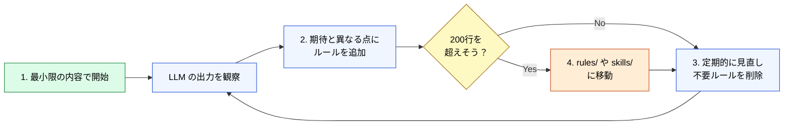

🌐 [English](../../03-always-loaded-context/claude-md.md)

# CLAUDE.md の設計原理

> [!IMPORTANT]
> → Why: **Priority Saturation** 対策（200行制限の根拠）
> → Why: **Prompt Sensitivity** 対策（具体的・命令的記述）

## CLAUDE.md とは

CLAUDE.md はセッション開始時に自動で読み込まれ、**毎ターン**コンテキストウィンドウを消費し続ける「常駐メモリ」。LLM からはシステムリマインダーとして注入される。

| 属性             | 値                             |
| :--------------- | :----------------------------- |
| 注入タイミング   | セッション開始時に自動読み込み |
| コンテキスト消費 | 常時（毎ターン消費し続ける）   |
| LLM からの見え方 | システムリマインダーとして注入 |
| 推奨サイズ       | **200行以内**                  |

## なぜ 200 行以内なのか

→ **Priority Saturation** の研究知見に基づく。

- 200行 ≈ 約 2,000〜3,000 トークン
- ManyIFEval が示した劣化閾値（~3,000 トークン）とほぼ一致
- 200行内に収めることで約 30〜40 個のアクティブな指示を維持
- 個々の指示の遵守率を実用的なレベルに保つ

> [!IMPORTANT]
> 詳細: [Priority Saturation](../01-llm-structural-problems/priority-saturation.md)

## 何を書くべきか

CLAUDE.md には「LLM がコードを読んだだけでは推測できない情報」を書く。

### 書くべき内容

- プロジェクトの技術スタック（Angular 18 + NgRx + .NET 8）
- フレームワークレベルの設計判断
- ビルド・テストコマンド（`npm run test:ci`）
- コミット規約（Conventional Commits）
- 禁止事項（any型禁止、console.log禁止）

### 書くべきでない内容

- コードスタイル（.editorconfig / eslint が担当）
- LLM がコードベースから推測できるパターン
- 特定ファイル種別にしか適用されないルール → `.claude/rules/` へ
- 特定タスクのワークフロー → `.claude/skills/` へ

## 実例: llms.txt による仕様の外部委譲（e-shiwake）

> [!TIP]
> CLAUDE.md を軽量に保つ手段は Rules/Skills への移動だけではない。**アプリ自体が提供する仕様ドキュメント**を活用する方法もある。

[e-shiwake](https://github.com/shuji-bonji/e-shiwake) では、[llms.txt](https://llmstxt.org/) という提案仕様を活用して CLAUDE.md の肥大化を防いでいる。llms.txt は Claude Code の機能ではなく、Web サイトが LLM 向けに仕様を公開するための標準フォーマット。

```
CLAUDE.md に全部書いた場合:
  CLAUDE.md（開発ルール + 勘定科目体系 + 操作手順 + データモデル + ...）
  → 数百行に膨張、Priority Saturation で指示遵守率が低下

llms.txt で外部委譲した場合:
  CLAUDE.md          → 開発ルールと指針だけ（軽量）
  llms.txt           → アプリ仕様・データモデル・ツール一覧
  help/*/content.md  → 各機能の詳細ドキュメント（Single Source of Truth）
  .claude/skills/    → llms.txt や content.md を参照する形でドメイン知識を注入
```

<details>
<summary>e-shiwake の CLAUDE.md（抜粋）— 開発ルールに特化し、仕様は含まない</summary>

```markdown
# e-shiwake

個人事業主向け PWA 仕訳帳アプリ。IndexedDB によるローカルファースト。

## 技術スタック

SvelteKit + TypeScript + shadcn-svelte + Tailwind CSS v4 + Dexie.js

## 重要: IndexedDB 保存時の注意

Svelte 5 の $state は Proxy を生成する。IndexedDB 保存前に必ず
JSON.parse(JSON.stringify(...)) でプレーンオブジェクトに変換すること。

## ドキュメント同期ルール

- Single Source of Truth: 各ヘルプページの content.md
- content.md と +page.svelte は必ず同時に更新する
- 機能変更時は llms.txt/+server.ts も更新する
```

</details>

<details>
<summary>e-shiwake の llms.txt（抜粋）— アプリ仕様・データモデル・ツール一覧を公開</summary>

```markdown
# e-shiwake (電子仕訳)

個人事業主・フリーランス向けの PWA 仕訳帳アプリケーション。

## 機能一覧
- 仕訳帳（複合仕訳、家事按分、検索、CSV出力）
- 総勘定元帳 / 試算表 / 損益計算書 / 貸借対照表
- 消費税集計 / 固定資産台帳 / 請求書管理

## データモデル
JournalEntry { id, date, description, lines[], evidences[] }
JournalLine  { accountCode, accountName, debit, credit, taxCategory }

## WebMCP ツール（Chrome 146+）
search_journals / create_journal / list_accounts / generate_ledger
generate_trial_balance / generate_profit_loss / calculate_consumption_tax ...
```

</details>

この設計のポイント:

- **CLAUDE.md の責務が明確になる** — 「開発時に LLM が守るべきルール」だけに絞れる
- **llms.txt は SvelteKit のプリレンダで生成** — アプリ実装との乖離が起きにくい
- **Claude 専用ではない** — どの LLM からも参照可能な標準フォーマット
- **Skills が参照ベースで構成できる** — Skill 内に仕様を重複記載する必要がない

> [!IMPORTANT]
> 「CLAUDE.md に何を書くか」だけでなく、**「CLAUDE.md に書かないことをどこに置くか」**も設計対象。llms.txt のような外部仕様を活用することで、200行制限の中で開発ルールの密度を最大化できる。
>
> → 実プロジェクト: [e-shiwake/.claude/](https://github.com/shuji-bonji/e-shiwake/tree/main/.claude)

## 効果的な書き方

> [!TIP]
> **Prompt Sensitivity** 対策として、具体的・命令的な記述が重要。

```markdown
# ❌ 曖昧（Prompt Sensitivity が高い）

- テストをちゃんと書いてね
- コードはきれいにしてほしい

# ✅ 具体的（Prompt Sensitivity が低い）

- 全ての public メソッドに対して Jasmine テストを作成する
- テストファイルは \*.spec.ts に配置する
- describe/it の構造で記述する
```

## Start Small 原則

CLAUDE.md は「最初から完璧に書く」のではなく、**失敗を観察してから追加する**のが正しい運用。



1. 最小限の内容で開始
2. LLM が期待と異なる出力をした時にルールを追加
3. 定期的に見直し、不要になったルールを削除
4. 200行を超えそうなら `.claude/rules/` や `.claude/skills/` に移動

---

> **前へ**: [Part 3: 常駐コンテキスト](index.md)

> **次へ**: [階層マージの仕組み](hierarchy.md)
