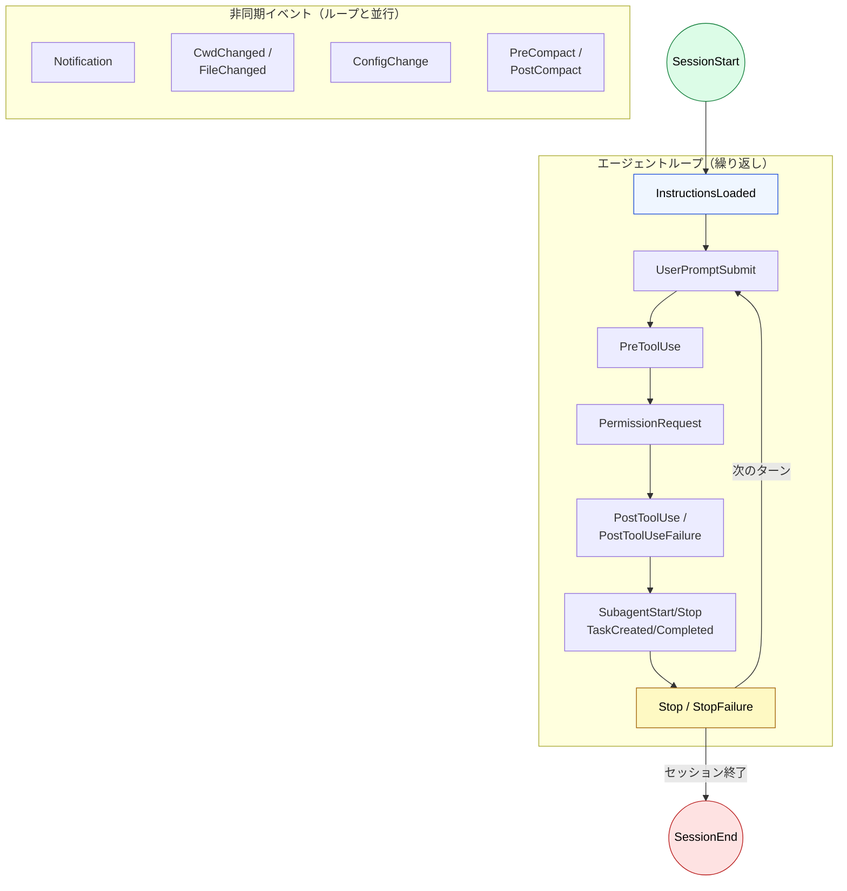

🌐 [English](../../07-runtime-layer/hooks.md)

# Hooks のライフサイクル

> [!IMPORTANT]
> → Why: **Hallucination** 対策（テスト実行 Hook で機械的に検出）
> → Why: **Sycophancy** 対策（コンパイラ・テストランナーは追従しない）
> → Why: **Instruction Decay** 対策（コンテキストに依存しない強制実行）

## Hooks とは

Hooks は Claude Code のライフサイクルイベントにフックして実行されるコンテキスト外の処理。LLM のコンテキストウィンドウを消費しない。

| 属性             | 値                                      |
| :--------------- | :-------------------------------------- |
| 注入タイミング   | **コンテキストに注入されない**          |
| コンテキスト消費 | なし（Prompt Hook を除く）              |
| 実行場所         | Claude Code ランタイム（シェル / HTTP） |
| 定義場所         | settings.json 内の `hooks` キー         |

## なぜ存在するのか

LLM に「毎回 eslint を実行しろ」と指示すると、

1. コンテキストウィンドウを消費する
2. Instruction Decay で忘れることがある
3. Sycophancy で「問題ない」と判断をスキップする可能性がある

Hooks はランタイムレベルで強制実行するため、これらの問題を全て回避する。

## ライフサイクルフロー



> [!TIP]
> **3層構造**: セッション層（`SessionStart` → `SessionEnd`）がエージェントループ層を囲み、非同期イベント層がループと並行して発火する。

## イベント一覧

### セッションライフサイクル

| イベント           | 発火タイミング         | 主な用途                             |
| :----------------- | :--------------------- | :----------------------------------- |
| `SessionStart`     | セッション開始・再開時 | 環境チェック、ログ初期化             |
| `SessionEnd`       | セッション終了時       | クリーンアップ処理                   |
| `UserPromptSubmit` | ユーザー入力送信時     | 入力バリデーション、コンテキスト追加 |
| `Stop`             | レスポンス完了時       | 続行判定、品質ゲート                 |
| `StopFailure`      | APIエラーによる終了時  | エラーログ、アラート送信             |

### ツール実行

| イベント             | 発火タイミング       | 主な用途                    |
| :------------------- | :------------------- | :-------------------------- |
| `PreToolUse`         | ツール実行前         | 危険なコマンドのブロック    |
| `PermissionRequest`  | 権限ダイアログ表示時 | 権限の自動承認/拒否         |
| `PostToolUse`        | ツール成功後         | 自動フォーマット、lint 実行 |
| `PostToolUseFailure` | ツール失敗後         | エラーログ、リトライ判定    |

### サブエージェント・タスク

| イベント        | 発火タイミング         | 主な用途                         |
| :-------------- | :--------------------- | :------------------------------- |
| `SubagentStart` | サブエージェント生成時 | エージェントへのコンテキスト注入 |
| `SubagentStop`  | サブエージェント完了時 | 結果の検証、続行判定             |
| `TaskCreated`   | タスク作成時           | 命名規則の強制、タスク検証       |
| `TaskCompleted` | タスク完了時           | 完了条件の検証                   |
| `TeammateIdle`  | チームメイト待機前     | 品質ゲート、リソース検証         |

### 設定・環境変更

| イベント             | 発火タイミング           | 主な用途                       |
| :------------------- | :----------------------- | :----------------------------- |
| `InstructionsLoaded` | CLAUDE.md / rules 読込時 | 監査ログ、コンプライアンス追跡 |
| `ConfigChange`       | 設定ファイル変更時       | セキュリティ監査、ポリシー強制 |
| `CwdChanged`         | 作業ディレクトリ変更時   | 環境変数管理（direnv 等）      |
| `FileChanged`        | 監視ファイル変更時       | ファイル変更トリガーの自動化   |
| `Notification`       | 通知発生時               | デスクトップ通知               |

### コンテキスト管理

| イベント      | 発火タイミング     | 主な用途     |
| :------------ | :----------------- | :----------- |
| `PreCompact`  | コンテキスト圧縮前 | 圧縮前の検証 |
| `PostCompact` | コンテキスト圧縮後 | 圧縮後の検証 |

### ワークツリー・MCP

| イベント            | 発火タイミング       | 主な用途               |
| :------------------ | :------------------- | :--------------------- |
| `WorktreeCreate`    | ワークツリー作成時   | Git 動作の置き換え     |
| `WorktreeRemove`    | ワークツリー削除時   | クリーンアップ処理     |
| `Elicitation`       | MCP 入力リクエスト時 | ユーザー入力の自動化   |
| `ElicitationResult` | MCP 入力応答時       | 応答データの検証・修正 |

> [!NOTE]
> イベントの詳細（JSON 入出力スキーマ、matcher の仕様、非同期 Hook 等）は公式リファレンスを参照:
> [Hooks reference](https://code.claude.com/docs/en/hooks) | [Hooks guide](https://code.claude.com/docs/en/hooks-guide)

## Hook の種類

### Command Hook（最も一般的）

```jsonc
{
  "hooks": {
    "PostToolUse": [
      {
        "type": "command",
        "command": "npx prettier --write $CLAUDE_FILE_PATH",
        "matcher": {
          "toolName": "edit_file",
          "pathPattern": "**/*.ts",
        },
        "timeout": 10000,
      },
    ],
  },
}
```

### Prompt Hook（唯一コンテキストに影響する）

```jsonc
{
  "hooks": {
    "UserPromptSubmit": [
      {
        "type": "prompt",
        "prompt": "必ず変更前にgit stashしてください",
      },
    ],
  },
}
```

### HTTP Hook（外部サービス連携）

```jsonc
{
  "hooks": {
    "PostToolUse": [
      {
        "type": "http",
        "url": "https://my-service.com/webhook",
        "matcher": { "toolName": "execute_command" },
      },
    ],
  },
}
```

### Agent Hook（マルチターン検証）

ファイルの読み取りやコマンド実行が必要な検証に使用。サブエージェントを起動し、最大50ターンのツール使用で条件を確認する。

```jsonc
{
  "hooks": {
    "Stop": [
      {
        "type": "agent",
        "prompt": "全てのユニットテストが通るか検証してください。テストスイートを実行し結果を確認してください。",
        "timeout": 120,
      },
    ],
  },
}
```

## Exit Code の意味

| Exit Code | 意味                                                      |
| :-------- | :-------------------------------------------------------- |
| 0         | 操作を許可（そのまま続行。stdout をコンテキストに追加可） |
| 2         | 操作をブロック（stderr の内容を Claude にフィードバック） |
| その他    | 操作は続行。stderr はログに記録されるが Claude には非表示 |

---

> **前へ**: [settings.json の役割](settings-json.md)

> **次へ**: [なぜLLMに見せないのか](why-not-in-context.md)
