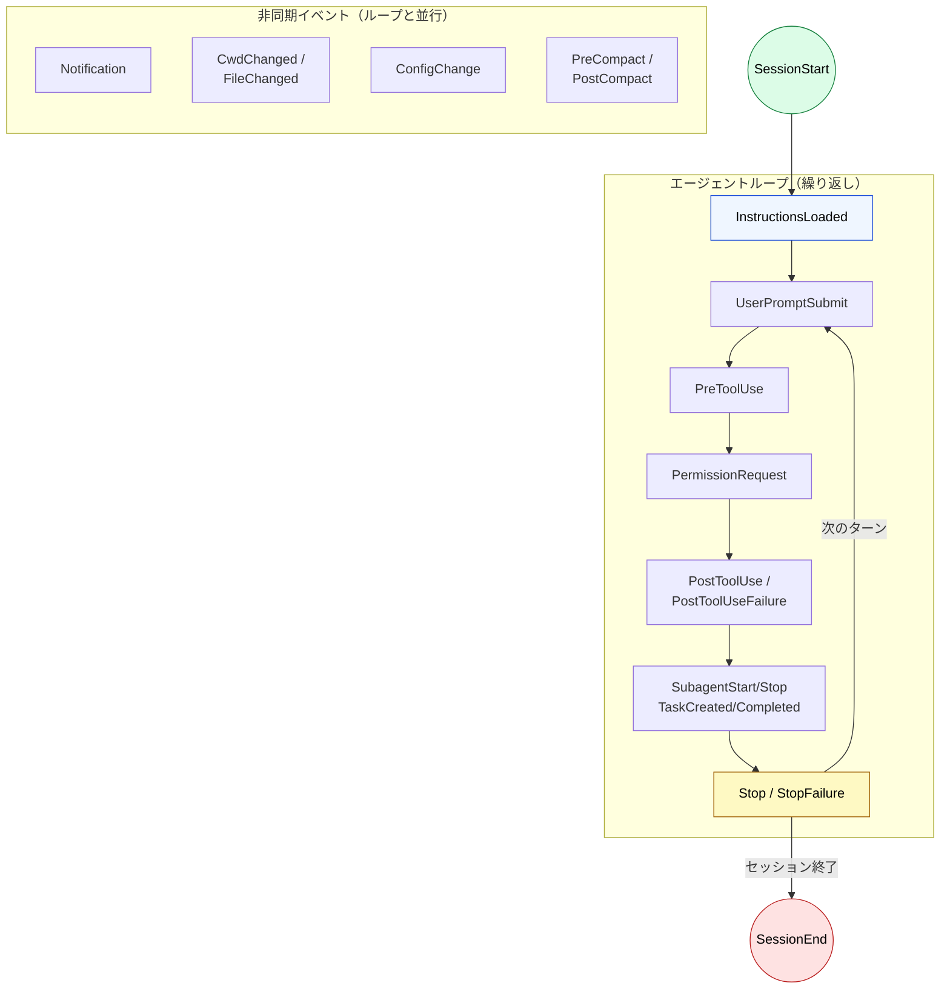

🌐 [English](../../07-runtime-layer/hooks.md)

# Hooks のライフサイクル

> [!IMPORTANT]
> → Why: **Hallucination** 対策（テスト実行 Hook で機械的に検出）
> → Why: **Sycophancy** 対策（コンパイラ・テストランナーは追従しない）
> → Why: **Instruction Decay** 対策（コンテキストに依存しない強制実行）

## Hooks とは

Hooks は Claude Code のライフサイクルイベントにフックして実行されるコンテキスト外の処理。LLM のコンテキストウィンドウを消費しない。

| 属性             | 値                                      |
| :--------------- | :-------------------------------------- |
| 注入タイミング   | **コンテキストに注入されない**          |
| コンテキスト消費 | なし（Prompt/Agent Hook の `reason` は `ok: false` 時に Claude にフィードバック）              |
| 実行場所         | Claude Code ランタイム（シェル / HTTP / サブ LLM / サブエージェント） |
| 定義場所         | settings.json 内の `hooks` キー         |

## なぜ存在するのか

LLM に「毎回 eslint を実行しろ」と指示すると、

1. コンテキストウィンドウを消費する
2. Instruction Decay で忘れることがある
3. Sycophancy で「問題ない」と判断をスキップする可能性がある

Hooks はランタイムレベルで強制実行するため、これらの問題を全て回避する。

## ライフサイクルフロー


```mermaid
flowchart TB
    SS@{ shape: circle, label: "SessionStart" }
    SE@{ shape: circle, label: "SessionEnd" }

    subgraph loop ["エージェントループ（繰り返し）"]
        direction TB
        IL["InstructionsLoaded"]
        UPS["UserPromptSubmit"]
        PTU["PreToolUse"]
        PR["PermissionRequest"]
        POST["PostToolUse /<br>PostToolUseFailure"]
        SUB["SubagentStart/Stop<br>TaskCreated/Completed"]
        STOP["Stop / StopFailure"]

        IL --> UPS
        UPS --> PTU --> PR --> POST --> SUB --> STOP
        STOP -->|"次のターン"| UPS
    end

    SS --> IL
    STOP -->|"セッション終了"| SE

    style SS fill:#dcfce7,stroke:#15803d,color:#000
    style SE fill:#fee2e2,stroke:#b91c1c,color:#000
    style IL fill:#eff6ff,stroke:#1d4ed8,color:#000
    style STOP fill:#fef9c3,stroke:#a16207,color:#000

    subgraph async ["非同期イベント（ループと並行）"]
        direction TB
        NF["Notification"]
        CWD["CwdChanged /<br>FileChanged"]
        CFG["ConfigChange"]
        CMP["PreCompact /<br>PostCompact"]
    end
```

> [!TIP]
> **3層構造**: セッション層（`SessionStart` → `SessionEnd`）がエージェントループ層を囲み、非同期イベント層がループと並行して発火する。

## イベント一覧

### セッションライフサイクル

| イベント           | 発火タイミング         | 主な用途                             |
| :----------------- | :--------------------- | :----------------------------------- |
| `SessionStart`     | セッション開始・再開時 | 環境チェック、ログ初期化             |
| `SessionEnd`       | セッション終了時       | クリーンアップ処理                   |
| `UserPromptSubmit` | ユーザー入力送信時     | 入力バリデーション、コンテキスト追加 |
| `Stop`             | レスポンス完了時       | 続行判定、品質ゲート                 |
| `StopFailure`      | APIエラーによる終了時  | エラーログ、アラート送信             |

### ツール実行

| イベント             | 発火タイミング       | 主な用途                    |
| :------------------- | :------------------- | :-------------------------- |
| `PreToolUse`         | ツール実行前         | 危険なコマンドのブロック    |
| `PermissionRequest`  | 権限ダイアログ表示時 | 権限の自動承認/拒否         |
| `PostToolUse`        | ツール成功後         | 自動フォーマット、lint 実行 |
| `PostToolUseFailure` | ツール失敗後         | エラーログ、リトライ判定    |

### サブエージェント・タスク

| イベント        | 発火タイミング         | 主な用途                         |
| :-------------- | :--------------------- | :------------------------------- |
| `SubagentStart` | サブエージェント生成時 | エージェントへのコンテキスト注入 |
| `SubagentStop`  | サブエージェント完了時 | 結果の検証、続行判定             |
| `TaskCreated`   | タスク作成時           | 命名規則の強制、タスク検証       |
| `TaskCompleted` | タスク完了時           | 完了条件の検証                   |
| `TeammateIdle`  | チームメイト待機前     | 品質ゲート、リソース検証         |

### 設定・環境変更

| イベント             | 発火タイミング           | 主な用途                       |
| :------------------- | :----------------------- | :----------------------------- |
| `InstructionsLoaded` | CLAUDE.md / rules 読込時 | 監査ログ、コンプライアンス追跡 |
| `ConfigChange`       | 設定ファイル変更時       | セキュリティ監査、ポリシー強制 |
| `CwdChanged`         | 作業ディレクトリ変更時   | 環境変数管理（direnv 等）      |
| `FileChanged`        | 監視ファイル変更時       | ファイル変更トリガーの自動化   |
| `Notification`       | 通知発生時               | デスクトップ通知               |

### コンテキスト管理

| イベント      | 発火タイミング     | 主な用途     |
| :------------ | :----------------- | :----------- |
| `PreCompact`  | コンテキスト圧縮前 | 圧縮前の検証 |
| `PostCompact` | コンテキスト圧縮後 | 圧縮後の検証 |

### ワークツリー・MCP

| イベント            | 発火タイミング       | 主な用途               |
| :------------------ | :------------------- | :--------------------- |
| `WorktreeCreate`    | ワークツリー作成時   | Git 動作の置き換え     |
| `WorktreeRemove`    | ワークツリー削除時   | クリーンアップ処理     |
| `Elicitation`       | MCP 入力リクエスト時 | ユーザー入力の自動化   |
| `ElicitationResult` | MCP 入力応答時       | 応答データの検証・修正 |

> [!NOTE]
> イベントの詳細（JSON 入出力スキーマ、matcher の仕様、非同期 Hook 等）は公式リファレンスを参照:
> [Hooks reference](https://code.claude.com/docs/en/hooks) | [Hooks guide](https://code.claude.com/docs/en/hooks-guide)

## Hook の種類

> [!IMPORTANT]
> 4種類すべて同じネスト構造: `event → [{ matcher?, hooks: [{ type, ... }] }]`。`matcher` フィールドは **ツール名に対する文字列正規表現**（例: `"Edit|Write"`）で、`toolName` / `pathPattern` を持つオブジェクトではない。ツール名は PascalCase（`Edit`, `Write`, `Bash`）。

### Command Hook（最も一般的）

シェルコマンドを実行する。Hook 入力は **stdin に JSON として届く**ので、`jq` でフィールド（`file_path` 等）を抽出する。`exit 0` で許可、`exit 2` でブロック（stderr が Claude にフィードバック）。

```jsonc
{
  "hooks": {
    "PostToolUse": [
      {
        "matcher": "Edit|Write|MultiEdit",
        "hooks": [
          {
            "type": "command",
            "command": "jq -r '.tool_input.file_path' | xargs -r npx prettier --write --ignore-unknown",
          },
        ],
      },
    ],
  },
}
```

### Prompt Hook（シングルターン LLM 判定）

Hook 入力を Claude モデル（デフォルト Haiku）に送り、yes/no 判定を委ねる。モデルは `{"ok": true}` で許可、`{"ok": false, "reason": "..."}` でブロックを返す。`Stop` イベントでは `reason` が Claude にフィードバックされ、作業継続のヒントになる。

```jsonc
{
  "hooks": {
    "Stop": [
      {
        "hooks": [
          {
            "type": "prompt",
            "prompt": "すべてのタスクが完了しているか確認してください。未完了なら {\"ok\": false, \"reason\": \"残作業\"} を返してください。",
          },
        ],
      },
    ],
  },
}
```

### HTTP Hook（外部サービス連携）

Hook 入力を JSON として HTTP エンドポイントに POST する。エンドポイントはレスポンスボディに同じ `ok`/`reason` JSON を返す。チーム共有の監査サービス等に有用。

```jsonc
{
  "hooks": {
    "PostToolUse": [
      {
        "hooks": [
          {
            "type": "http",
            "url": "http://localhost:8080/hooks/tool-use",
            "headers": { "Authorization": "Bearer $MY_TOKEN" },
            "allowedEnvVars": ["MY_TOKEN"],
          },
        ],
      },
    ],
  },
}
```

### Agent Hook（マルチターン検証、Experimental）

> [!WARNING]
> Agent Hook は **Experimental**（実験的）であり、挙動・設定は変更される可能性がある。本番ワークフローでは Command Hook を優先すること。

ファイル読み取りやコマンド実行が必要な検証に使用。サブエージェントを起動し、最大50ターンのツール使用で条件を確認、`{"ok": ..., "reason": ...}` を返す。デフォルトタイムアウト60秒。

```jsonc
{
  "hooks": {
    "Stop": [
      {
        "hooks": [
          {
            "type": "agent",
            "prompt": "全てのユニットテストが通るか検証してください。テストスイートを実行し結果を確認してください。$ARGUMENTS",
            "timeout": 120,
          },
        ],
      },
    ],
  },
}
```

> [!TIP]
> どれを選ぶか: **Command** は決定論的なシェルルール（lint、整形、ファイル保護）。**Prompt** は Hook 入力だけで判断できる場合（Haiku レベルの評価）。**Agent** はファイル読み取りやコマンド実行を伴う検証（テスト実行等）。**HTTP** は外部サービスにロジックを委譲する場合。

## Exit Code の意味（Command Hook のみ）

| Exit Code | 意味                                                      |
| :-------- | :-------------------------------------------------------- |
| 0         | 操作を許可（そのまま続行。stdout を `additionalContext` 経由でコンテキストに追加可） |
| 2         | 操作をブロック（stderr の内容を Claude にフィードバック） |
| その他    | 操作は続行。stderr はログに記録されるが Claude には非表示 |

> Prompt/Agent/HTTP Hook は Exit Code ではなく `{"ok": true/false, "reason": "..."}` JSON レスポンス形式を使う。

## フレームワーク別 実践レシピ

| フレームワーク | レシピ |
| :--- | :--- |
| Angular + NgRx + RxJS | [examples/angular-ngrx/](../../../examples/angular-ngrx/) |
| SvelteKit + Svelte 5 | [examples/svelte-kit/](../../../examples/svelte-kit/) |

## 8問題 × Hooks: クイックリファレンス

> [!IMPORTANT]
> Hooks は構造的問題のすべてに万能ではない。下表は Hooks が強い領域・部分的に効く領域・他層（rules / Agents / セッション管理）の方が効く領域を示す。「ここで Hook を使うべきか？」の判断補助として使う。

| 構造的問題 | 推奨 Hook イベント | 具体的なコマンド / タイプ | 効果 | 強度 |
| :--- | :--- | :--- | :--- | :--- |
| **Context Rot** | `SessionStart` (matcher: `compact`) | `echo` でプロジェクト規約、`git log --oneline -5` | コンパクション後に重要ルールを再注入 | ◯ 部分的 — `/compact` 自体が主対策 |
| **Lost in the Middle** | （Hooks 単独では効果薄） | — | Hooks はコンテキスト位置を制御しない | △ Rules / Agents の方が効果的 |
| **Priority Saturation** | `PostToolUse`, `Stop` | `prettier`, `eslint`, `tsc --noEmit` | 機械的ルールを CLAUDE.md から外す | ◎ 強 — 指示予算を解放 |
| **Hallucination** | `PostToolUse`, `Stop` | `tsc --noEmit`, `svelte-check`, `vitest run` | コンパイラ・型チェッカーは幻覚しない | ◎ 強 — 主対策 |
| **Sycophancy** | `Stop` | Command: `eslint --no-warn-ignored`<br>Agent Hook: 「テストが通るか検証」 | LLM の追従バイアスはランナーに効かない | ◎ 強 — 機械的検証は追従しない |
| **Knowledge Boundary** | `Stop` | `svelte-check`（Svelte 5 に混入するレガシー構文を検出）、`tsc`（型欠落を検出） | 古い API・構文の混入を検出 | ◯ 部分的 — 境界が検証可能な場合のみ |
| **Prompt Sensitivity** | `PreToolUse`, `Stop` | Hallucination と同じ機械的検証 | プロンプトの表現に出力品質が依存しなくなる | ◯ 部分的 — 最後の防衛線 |
| **Instruction Decay** | `Stop`, `PreToolUse` | `block-dangerous-commands.sh`, `tsc --noEmit` | コンテキスト依存しない強制実行 | ◎ 強 — Hooks は「忘れる」ことができない |

> [!TIP]
> **強度欄の読み方**:
> - ◎ 強: その問題に対する主たる対策
> - ◯ 部分的: 効くが、他層（rules / Agents / セッション）の方が大きく寄与する
> - △ 弱: ここで Hook を最初に使うべきではない。別の層で対応

全層（rules、Skills、Agents、セッション、plugins）を横断した対策マップは [付録: 構造的問題 × Claude Code 対策マップ](../appendix/problem-countermeasure-map.md) 参照。

---

> **前へ**: [settings.json の役割](settings-json.md)

> **次へ**: [なぜLLMに見せないのか](why-not-in-context.md)
