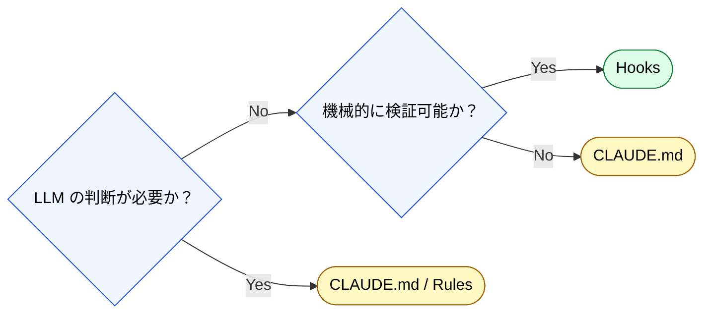

🌐 [English](../../07-runtime-layer/why-not-in-context.md)

# なぜLLMに見せないのか

> [!NOTE]
> settings.json と Hooks をコンテキスト外に置く設計判断の根拠。

## 核心的な問い

「LLM にルールを教えれば済むのに、なぜわざわざコンテキスト外に置くのか？」

答えは3つの構造的問題に集約される。

### 1. Instruction Decay への耐性

LLM に「毎回テストを実行しろ」と指示しても、長い会話の中で遵守率が低下する（平均39%の性能低下）。Hooks はコンテキストに存在しないため、Instruction Decay の影響を受けない。

### 2. Sycophancy への耐性

LLM は追従性により「テストは大丈夫だろう」と判断をスキップする可能性がある。Hooks は LLM の判断を介さずに機械的に実行するため、追従の余地がない。

### 3. コンテキスト予算の節約

「毎回 lint を実行しろ」「毎回テストを実行しろ」「毎回フォーマットしろ」—— これらをCLAUDE.md に書くと、常時コンテキストを消費する。Hooks に移動すれば**予算消費ゼロ**。

## 判断基準

## 原則

**ルールで判断が必要なものは CLAUDE.md / Rules に、機械的に強制できるものは Hooks に書く。**

---

> **前へ**: [Hooks のライフサイクル](hooks.md)

> **Part 7 完了 → 次へ**: [Part 8: セッション管理と記憶の永続化](../08-session-management/index.md)
