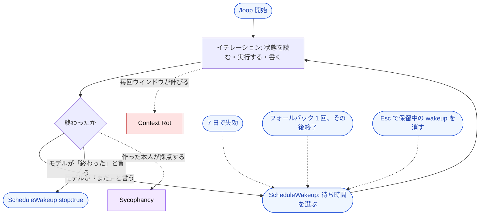

🌐 [English](../../08-session-management/loop-and-self-driving-sessions.md)

# /loop と自走するセッション

> [!IMPORTANT]
> → Why: **Context Rot** — 人が挟まらないまま、同じセッションにターンが積み上がる  
> → Why: **Sycophancy** — 作業したモデル自身が「終わった」を判定する  
> → Why: **Instruction Decay** — 誰も読まないターンを重ねるうちに、最初の指示が薄れる

このパートの他の機能は、セッションを短くするか、切るかのどちらかである。`/loop` は逆を行く。人を挟まずに同じセッションを回し続けるため、本書で扱う機能のうち、構造的問題への露出を**増やす**側に立つ唯一のものになる。だからこそ読む価値がある。仕様に書き込まれた歯止めが、制約をそのまま可視化しているからである。

## /loop は何をするか

`/loop` は、いま開いているセッションの中でプロンプトを繰り返し実行する bundled skill である。何を渡すかで挙動が決まる。

| 渡すもの                                        | 挙動                                                                                                 |
| ----------------------------------------------- | ---------------------------------------------------------------------------------------------------- |
| 間隔とプロンプト（`/loop 5m check the deploy`） | 固定の cron スケジュールで実行する                                                                   |
| プロンプトのみ（`/loop check the deploy`）      | 各イテレーションのあと、Claude が 1 分〜1 時間の範囲で待ち時間を選び、選んだ間隔とその理由を出力する |
| どちらも渡さない（`/loop`）                     | 内蔵の保守プロンプト、または `.claude/loop.md` / `~/.claude/loop.md` があればそれを実行する          |

タスクはセッションスコープである。セッションが起動していて手が空いているときにだけ発火し、`claude --resume` で未失効のものが復元され、繰り返しタスクは作成から 7 日で失効する。

## 対策ではなく、増幅器である

本書の他の機能と並べると、`/loop` は反対側に置かれる。

| 機能                                | 構造的問題に対する働き              |
| ----------------------------------- | ----------------------------------- |
| `/compact`                          | 履歴を短くする — 対策               |
| `/clear`                            | 履歴を切る — 対策                   |
| [Hooks](/ja/07-runtime-layer/hooks) | モデルの外側で強制する — 対策       |
| `/loop`                             | 誰も読まないターンを足す — **増幅** |

ターン数とともに増える問題は三つある。

- **[Context Rot](/ja/01-llm-structural-problems/context-rot)**: イテレーションのたびにツール出力と推論が同じウィンドウへ積まれる。人が同じ作業を回していればウィンドウが埋まっていくことに気づくが、ループは立ち止まって見ない。
- **[Sycophancy](/ja/01-llm-structural-problems/sycophancy)**: 自己ペースモードでは、Claude が `ScheduleWakeup` を `stop: true` で呼んだ時点でループが終わる。作った本人が自分の仕事に合格を出す構図である。
- **[Instruction Decay](/ja/01-llm-structural-problems/instruction-decay)**: ループを開始したプロンプトは、30 回目のイテレーションでは多数のメッセージのうちの一つでしかない。`loop.md` がその打ち返しにあたる。毎イテレーション読み直され、編集は次のイテレーションから効くため、一度きりの指示ではなく再注入として働く。

## 歯止めは、制約を書き下したものである

以下はどれも利便性のための機能ではない。自走するループに預けてはいけない判断が、それぞれ一つずつ対応している。

| 仕様に書かれた歯止め                                                                                                                                                  | 何を信用していないか                                 |
| --------------------------------------------------------------------------------------------------------------------------------------------------------------------- | ---------------------------------------------------- |
| 繰り返しタスクは作成から 7 日で失効し、最後に一度発火して自身を削除する                                                                                               | 始めたループを人が覚えていること                     |
| 再スケジュールも停止もしなかったイテレーションには約 20 分後にフォールバックが 1 回入り、そこでも動きがなければループは終わる                                         | 「再スケジュールしない」が「完了した」を意味すること |
| 自己ペースのループは `Esc` で保留中の wakeup が消える                                                                                                                 | モデルの停止判断だけが停止であること                 |
| 内蔵の保守プロンプトは新しい取り組みを始めず、push や削除はトランスクリプトが既に承認した続きのときだけ実行する                                                       | 人のいないターンが自分の権限を広げてよいこと         |
| スケジュール発火が実行するのは、Claude が自分で呼んでよい Skill だけである。`disable-model-invocation: true` の Skill は、bundled の `/verify` を含めて平文として届く | 検査役が自分で起動してよいこと                       |
| 1 セッションが保持できるスケジュールタスクは 50 件まで                                                                                                                | ループの本数が自然に収まること                       |

五行目は、しばらく眺める価値がある。**検査を担う Skill こそ、ループが自分のスケジュールで発火できないもの**として設計されている。

## maker と checker を分ける

Sycophancy は気分の問題ではない。自分の出力を採点しろと言われたモデルは、照合できる独立した証拠を持たない。だから「テストはまだ落ちているが、前進したので完了である」は、モデルにとって形式の整った答えになる。ループはこの隙間を円環に変える。同じモデルが書き、判定し、自分の次のターンを予約する。

分離は、モデルの外から与えるほかない。

- **完了条件を機械で判定する。** 「終わった」をモデルの自己申告ではなく、テストの合格、CI のグリーン、ターンを失敗させる [Hooks](/ja/07-runtime-layer/hooks) で定義する。Hooks は、モデルが言葉で回避できない強制である。
- **ループが起動できない検査役を置く。** `/verify` がスケジュール発火では平文として届くことは、この規律が製品に現れた形である。検査は人か、別のセッションが呼ぶ。
- **段落を分けるのではなく、セッションを分ける。** 検査役もモデルで担う場合は、[サブエージェントか別セッション](/ja/10-multi-session/)に置く。出力についての自分の推論ではなく、出力そのものを読ませるためである。

> [!WARNING]
> 検査役のいないループは、自律ではない。一つのモデルが、自分で決めた間隔で、自分に同意し続けているだけである。

## → What / How: ループそのものをどう組むか

本ページが扱ったのは、人のいないループになぜ停止条件・コンテキスト衛生・外部の批評者が要るのかという理由である。それをどう作るか — 外側ループを工学として扱う方法、四つの難所、人が抜けたときに何を失うか — は姉妹サイトが持つ。

- [Loop Engineering — 外側ループをシステムに移す](https://shuji-bonji.github.io/ai-agent-architecture/ja/strategy/loop-engineering) — 設計としての外側ループ
- [エージェントループのパターン](https://shuji-bonji.github.io/ai-agent-architecture/ja/strategy/agent-loop-patterns) — ReAct / Plan-and-Execute / Reflexion / Evaluator-Optimizer

## 参考文献

- Anthropic. "Run prompts on a schedule." Claude Code Docs. [code.claude.com](https://code.claude.com/docs/en/scheduled-tasks) — `/loop` の各モード、`loop.md`、7 日失効、フォールバック wakeup、スケジュール発火が実行しない Skill

---

> **前へ**: [/compact と /clear の使い分け](compact-and-clear.md)

> **次へ**: [なぜメモリが問題になるのか](memory-problem.md)
