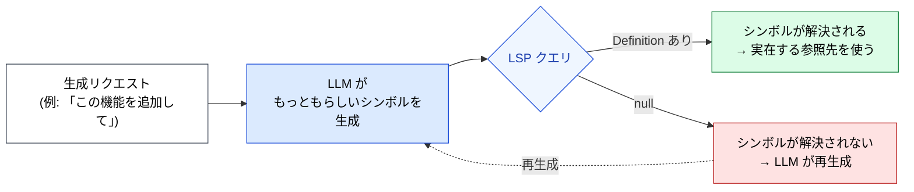

🌐 [English](../../09-code-intelligence/hallucination-and-symbols.md)

# Hallucination とシンボル

> [!IMPORTANT]
> → Why: **Hallucination** 緩和（シンボルレベルの接地で、最も頻発するコード生成失敗をディスク到達前に止める）
> → Why: **Knowledge Boundary** 緩和（プロジェクト内部・学習後の API のシンボルが、推測ではなく解決対象になる）

## 最も危険な Hallucination は「もっともらしい」もの

Hallucination の章ではこれを一般論として位置付けた: LLM は事実に反する内容を、自信を持って流暢に生成する。コードにおける危険なバリアントは「めちゃくちゃに間違っているコード」ではない — めちゃくちゃに間違っているコードはすぐに捕まる。危険なバリアントは、**見た目は正しく、姉妹バージョンではコンパイルが通り、目の前のコミットでだけ失敗するコード**である。

これらの失敗には共通の構造がある: LLM は*もっともらしく存在しそうな*シンボルを生成するが、この特定のシンボルだけは存在しない、と告げる信号が LLM の内側にはない。LSP がその信号である。



## パターン1: 関数シグネチャのドリフト

同じライブラリでもバージョンを跨ぐとシグネチャが変わる。LLM は多くのバージョンを見ており、それを平均化する。

**RxJS の例**。もっともらしく見える生成：

```typescript
import { combineLatest } from 'rxjs';

combineLatest(userId$, filter$).pipe(
  map((id, filter) => ({ id, filter })),
);
```

これは RxJS 6 で実在したシグネチャである。RxJS 7+ では `combineLatest` は observables の配列またはオブジェクトしか受け取らない — 位置引数形式は削除された。LLM の「訓練データの平均」が非推奨形を自信を持って生成する。

**LSP の介入**。インストール済み RxJS バージョンの `combineLatest` に Hover をかけると以下が返る：

```
combineLatest<T extends readonly unknown[]>(
  sources: readonly [...ObservableInputTuple<T>]
): Observable<T>
```

LLM は配列形式で再生成する。テストを走らせる必要はない。人間のレビューも要らない。

## パターン2: プロジェクト固有の型のドリフト

LLM が一度も見たことのない内部型は最悪のカテゴリである。なぜなら、LLM はアンカーになるものを*何も*持たないまま、もっともらしい形を発明することにフォールバックするからである。

**Angular ストアの例**。LLM が生成する：

```typescript
this.store.select(selectFilteredUsers).subscribe(users => { ... });
```

`selectFilteredUsers` はこのコードベースに存在しない。`selectActiveUsers` と `selectUserById(id)` は存在するが、LLM は類推で3つめのセレクタを発明した。

**LSP の介入**。`textDocument/definition` を `selectFilteredUsers` にかけると null が返る。LLM は次にストアモジュール周辺で `textDocument/references` を走らせて実際にエクスポートされているセレクタを発見するか、プロジェクト接続済みならシンボル検索で `selectActiveUsers` を見つける。捏造シンボルはファイルに到達しない。

> [!TIP]
> これはテストに最も見えにくい失敗モードである。コンポーネントの単体テストは、*モック*されたセレクタに対してなら通ってしまう。バグはランタイム、しかもおそらく本番で初めて表面化する。LSP は生成時点でこれを捕まえる。

## パターン3: import パスの Hallucination

シンボル名が正しくても、**パス**が間違っていることがある。バレルエクスポート、モノレポのエイリアス、再エクスポートが問題を複雑にする。

**例**。LLM の生成：

```typescript
import { UserService } from '@app/services';
```

`UserService` は実在する。しかしこのモノレポでは `@app/services` ではなく `@app/users/service` からエクスポートされている。コンパイラはエラーを返し、LLM はさらに別の間違ったパスを発明して「修正」しようとする可能性がある。

**LSP の介入**。Definition は `UserService` を正準ファイルに解決する。言語サーバーの auto-import 提案は、プロジェクトの `tsconfig.json` の `paths` 設定を使って**最初から正しい**パスを出す。LLM はエイリアスマップを覚えなくてよい。

## パターン4: 実在する型に対する架空のフィールド/メソッド

型は実在する。だがその型のメソッドが存在しない。

**Angular signals の例**。LLM は多くのフレームワーク（React, Solid, Vue）の signal API を見ており、こう生成する：

```typescript
const count = signal(0);
count.value = 1;
```

`.value` は Vue の ref API である。Angular の `signal` は `count.set(1)` または `count.update(prev => prev + 1)` を使う。LLM は API をもっともらしく混合した。

**LSP の介入**。`signal(0)` の結果に Hover をかけると `WritableSignal<number>` が返る。型の表面を読むと `set`、`update`、`asReadonly` が見える — `value` はない。LLM は `count.set(1)` で再生成する。

## パターン5: 古いイディオムを現行として提示

シンボルは存在し、型も正しいが、イディオムが古い時代のもの、というパターンもある。

**TakeUntilDestroyed の例**。LLM が v16 以前のパターンを生成する：

```typescript
private destroy$ = new Subject<void>();
ngOnDestroy() {
  this.destroy$.next();
  this.destroy$.complete();
}

source$.pipe(takeUntil(this.destroy$)).subscribe(...);
```

これは動く。だが Angular 16+ ではプロジェクトはおそらく：

```typescript
source$.pipe(takeUntilDestroyed()).subscribe(...);
```

を使っているはず。

**LSP の介入**。これは難しい。LSP は両方のパターンが型整合することを確認する。ここでの信号は「存在しないシンボル」ではなく「古いイディオム」である。緩和には LSP に加えて [CLAUDE.md のバージョン明示](../03-always-loaded-context/claude-md.md)（「このプロジェクトは Angular 17 で、`takeUntilDestroyed` を優先する」）と、場合によってはプロジェクトの選んだイディオムを文書化する Skill が必要になる。

> [!WARNING]
> LSP は Hallucination の完全な治療ではない。**シンボル存在**と**型の形**のカテゴリに対する最強の防衛であり、これらは型付き言語における生成失敗の大半を占める。パターン5（古いイディオム）は LSP に加えて CLAUDE.md と Skills が必要。

## LSP が捕捉できない失敗モード

期待値を正直に整理する：

| 失敗モード | LSP で捕捉？ | 対応箇所 |
|:--|:--|:--|
| シンボルが存在しない | ✅ Definition が null を返す | Part 9 |
| 関数シグネチャが間違い | ✅ Hover が実シグネチャを返す | Part 9 |
| import パスが間違い | ✅ Definition が正準パスに解決 | Part 9 |
| 実在する型に対する架空メソッド | ✅ Hover が実 surface を返す | Part 9 |
| 古いイディオム（両バージョンともコンパイル可） | ⚠️ 部分的 — CLAUDE.md が必要 | Part 3 + Part 9 |
| 型は正しいが、ロジックが間違い | ❌ | Part 7 Hooks（テスト）, Part 5 Agents（レビュー） |
| 競合状態、非同期の順序 | ❌ | Part 7 Hooks（結合テスト） |
| セキュリティ欠陥（例: SQL インジェクション） | ❌ | Part 7 Hooks（lint, SAST）, Part 5 Agents |

表全体に通底するパターンは：**LSP はシンボルレベルのギャップを閉じる。テストとレビューはセマンティックレベルのギャップを閉じる**。両者は積み重なる。

## 参考文献

- Liu, F. et al. (2024). "Exploring and Evaluating Hallucinations in LLM-Powered Code Generation." [arXiv:2404.00971](https://arxiv.org/abs/2404.00971) — シンボルレベル Hallucination 率を定量化した実証研究
- Tian, R. et al. (2024). "CodeHalu: Code Hallucinations in LLMs Driven by Execution-based Verification." [arXiv:2405.00253](https://arxiv.org/abs/2405.00253) — 本ページのパターンと整合するコード Hallucination カテゴリの分類体系
- Microsoft. "Language Server Protocol Specification." [microsoft.github.io/language-server-protocol](https://microsoft.github.io/language-server-protocol/) — `textDocument/definition`、`textDocument/hover`、`textDocument/references`

---

> **前へ**: [LSP は接地装置である](lsp-as-grounding.md)

> **次へ**: [ライブ型エラー](live-type-errors.md)
