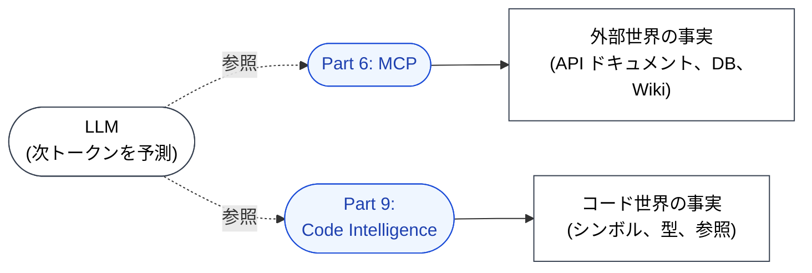

🌐 [English](../../09-code-intelligence/index.md)

# Part 9: コード世界の接地 — Code Intelligence

> [!NOTE]
> **コード世界の事実**への接続。
> MCP が外部世界の事実への接地を担うのに対し、LSP は「いま、このリポジトリの中に実在するシンボル・型・参照」への接地を担う。

## このパートが存在する理由

Hallucination の章で確立したとおり、LLM はもっともらしく見えるが存在しない関数名・型シグネチャ・import パスを、次トークン予測の構造的帰結として生成する。LLM に「Hallucination するな」と指示しても効かない — Hallucination はパッチを当てて消せるバグではない。

効くのは**接地（grounding）**である。シンボルを確定する前に、LLM に真実のソースを参照させる。Part 6（MCP）は外部世界（API ドキュメント、データベース、社内 Wiki）に対する接地を導入した。Part 9 は**コード世界**に対する接地 — ユーザのリポジトリに今この瞬間存在するシンボル・型・参照・診断情報への接地 — を導入する。

## → Why: どの構造的問題に対応しているか

> [!IMPORTANT]
> - **Hallucination**: LSP はプロジェクトに**実際に存在する**シンボルと型を返す。生成コードは、もっともらしく聞こえる捏造ではなく、実在する参照先に拘束される。
> - **Knowledge Boundary**: 学習カットオフ後にリリースされたライブラリ API、および LLM が一度も見ていないプロジェクト固有の型が、直接検査可能になる。境界は「モデルが何を暗記したか」から「LSP が何を解決できるか」へと移行する。
> - **Context Rot**（副次効果）: 定義ジャンプと参照検索は、ファイル全文を読み込まずに、必要なシンボルだけを正確に取得する。1回の調査あたりのトークン消費が減り、コンテキストウィンドウへの圧迫が減る。

## LSP は他の対策とどう違うか

| 対策 | 真実のソース | 何を検証するか |
|:--|:--|:--|
| **Hooks（テスト実行）** | ランタイム挙動 | コードが実行可能でテストが通るか |
| **MCP** | 外部サービス | リポジトリ外の事実 |
| **CLAUDE.md（バージョン明示）** | 静的宣言 | 「どのバージョンの知識を使うべきか」 |
| **Code Intelligence（LSP）** | コードのライブ解析 | シンボルが存在するか、型は何か、何が依存しているか |

テストは LLM が壊れたコードを書いた**後**に失敗する。LSP は壊れた参照をコミット**前**に — というよりコードがディスクに書かれる前に — 捕まえる。生成ループの内側で動くツールであり、生成ループの外側で動くツールではない。

## このパートのドキュメント

| ドキュメント | 内容 |
|:--|:--|
| [LSP は接地装置である](lsp-as-grounding.md) | LSP の4機能（Definition / Hover / References / Diagnostics）と、それぞれが何を接地するか |
| [Hallucination とシンボル](hallucination-and-symbols.md) | コードシンボル捏造の具体例と、LSP がそれぞれをどう封じるか |
| [ライブ型エラー](live-type-errors.md) | 生成中に取得される型エラーが、なぜ自己修正ループを成立させるか |
| [Grep / Read / LSP — どれをいつ使うか？](vs-grep-vs-read.md) | トークン効率の比較。全文読み込みとシンボルクエリの使い分け |

---

> **前へ**: [Part 8: セッション管理](../08-session-management/index.md)

> **次へ**: [LSP は接地装置である](lsp-as-grounding.md)
