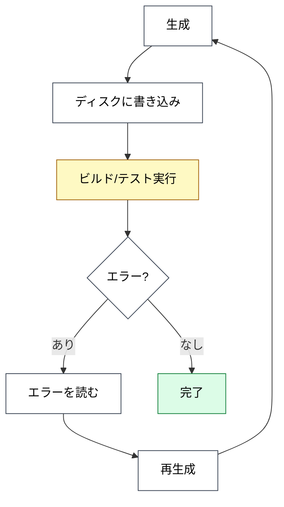
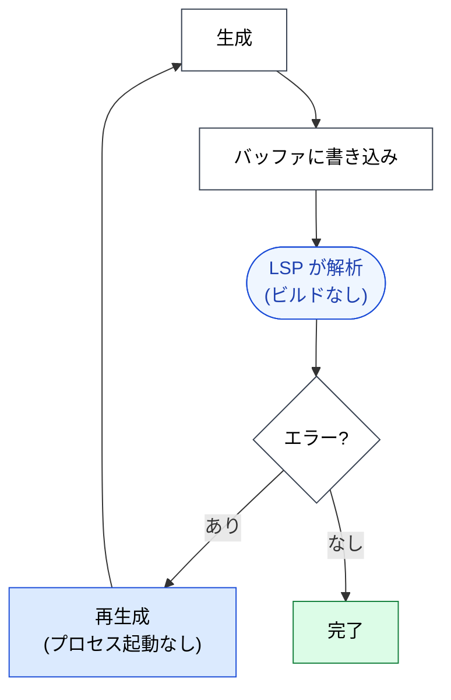

🌐 [English](../../09-code-intelligence/live-type-errors.md)

# ライブ型エラー

> [!IMPORTANT]
> → Why: **Hallucination** 緩和（エラーが生成中に取得される、生成後ではない）
> → Why: **Instruction Decay** 緩和（検証がランタイムレイヤーで起きる — LLM が検証を覚えていることに依存しない）

## フィードバックループの問題

検証なしでコードを生成するのはオープンループである。LLM はトークンを発し、それらがコンパイルされることを祈り、パイプラインの後段で何かが文句を言ってきて初めて違うことを知る。ループが長いほど、無駄になる生成が増え、意図と出力の間のドリフトが大きくなる。

このループを1周するコストは、最低でもプロセス起動（ビルド、テストランナー）、最悪では CI に数十秒。LLM はその間に壊れたコードに依存する別のコードをさらに生成している可能性がある。ループは**機能する**が、高くて遅い。

## LSP Diagnostics はループを短縮する

`textDocument/publishDiagnostics` はプッシュ通知である。言語サーバーは編集中のバッファ状態を継続的に解析し、コードが変わると**その瞬間に**エラーを配信する。ビルドを待つ必要がない。

検証ステップが LLM の編集-検証ループの**内側**に入る。外側ではない。型付き言語では、**Hallucination 系のエラーの大半がディスクに到達しない**ということになる。

## 「ライブ」エラーとは何を指すか

LSP Diagnostics は、実行なしで言語サーバーが計算できるものすべてを対象とする：

| 診断の種類           | 例                                                          | 重要度  |
| :------------------- | :---------------------------------------------------------- | :------ |
| 型不整合             | `string` が期待される箇所に `number` を渡す                 | Error   |
| 未解決の import      | シンボルを使っているが import していない                    | Error   |
| 解決不能シンボル     | 存在しない関数を呼び出す                                    | Error   |
| 必須フィールドの欠落 | TypeScript のオブジェクトリテラルに `required: true` がない | Error   |
| 未使用変数           | 宣言したが一度も参照していない                              | Warning |
| lint ルール違反      | ESLint / `tslint` ルール違反（配線済みの場合）              | Warning |
| 非推奨 API           | `@deprecated` シンボルの使用                                | Warning |

Error はブロッキングシグナル、Warning は情報提供だがゲートはしない。両方が同じチャネルで瞬時に届く。

## なぜ Instruction Decay に効くのか

長いセッションでよくあるパターン: ユーザは `CLAUDE.md` に「編集後は必ず `tsc --noEmit` を走らせること」と書いた。40 ターン後、コンテキストが半分埋まった状態で、LLM は忘れる — [Instruction Decay](../01-llm-structural-problems/instruction-decay.md)。

LSP Diagnostics は LLM が何かを覚えていることに依存しない。言語サーバーは常に走っている。エラーは、LLM が見ようと思ったかどうかに関わらず、ツールレスポンスに表面化する。これは [Part 7 Hooks](../07-runtime-layer/hooks.md) と同じ設計原則である: **検証は LLM の指示経由ではなくランタイムレイヤーで行う**。

> [!IMPORTANT]
> LSP Diagnostics とテスト実行 Hooks はどちらもランタイムレイヤー検証だが、コストスペクトル上の位置が異なる。
>
> - **LSP**: ほぼ無料、サブ秒、ただし言語サーバーが静的に推論できるエラーのみ捕捉する。
> - **Test Hooks**: より高コスト、ランタイム必須、ただし挙動エラーを捕捉する。
>
> LSP を内側のループ、テストを外側のループとして使う。

## 実際のループ

TypeScript ファイルを編集する典型的な Claude Code セッション：

1. LLM が編集を提案。
2. 編集が作業バッファに適用される。
3. LSP が `publishDiagnostics` を返す — 通常はミリ秒オーダー。
4. `severity: Error` の診断があれば、レスポンスはツール出力の一部として LLM にフィードバックされる。
5. LLM は同じターン内で修正と再編集を行う。ユーザは中間の壊れた状態を見ないことが多い。

ユーザ体験は「LLM が表面的には一発で正しいコードを書いた」になる。内部の実態は「LLM が試み、失敗し、言語サーバーに訂正され、修正した — それらすべてが1ターンの中で起きた」である。

## 限界

> [!WARNING]
> ライブ Diagnostics は言語サーバーが健全で、正しいプロジェクト状態を把握していることに依存する。
>
> - **コールドスタート**: 大きなリポジトリに LSP が最初に接続した時、完全にインデックスするまで数秒〜数分かかることがある。この期間の Diagnostics は不完全。
> - **古い lockfile / `node_modules`**: LSP が CI で動くものより古い依存バージョンを見ていると、Diagnostics は誤誘導になる。
> - **複数言語のリポジトリ**: 各言語に LSP が必要。多言語リポジトリではカバレッジが言語ごとにばらつく可能性がある。
> - **生成コード**: コード生成の出力（ビルドステップが生成する `.d.ts`、GraphQL の型）は、生成ステップが走った後でないと LSP には見えない。

ライブ Diagnostics が信頼できない時、検証の重みはテスト Hooks に戻る。この二層設計が頑健なのは、どちらかの層が弱ったらもう片方が荷重を引き受けられるからである。

## 他のパートとの関係

- 「検証をランタイムレイヤーで行う」原則は [Part 7: Settings & Hooks](../07-runtime-layer/index.md) と共通である。LSP はテスト実行 Hooks の静的解析版である。
- 「生成中にエラー、生成後ではない」という性質こそ、[Part 5 Agents](../05-on-demand-context/agents.md) がコード編集を subagent に委譲してその結果を信頼できる理由である。LSP がなければ、全ての委譲が再生成ラウンドを必要とするリスクを抱える。

## 参考文献

- Microsoft. "Language Server Protocol Specification: publishDiagnostics." [microsoft.github.io/language-server-protocol](https://microsoft.github.io/language-server-protocol/specifications/lsp/3.17/specification/#textDocument_publishDiagnostics) — 診断プッシュ通知の正準仕様
- Anthropic. "Claude Code: IDE integration." Claude Code ドキュメント. [docs.claude.com](https://docs.claude.com/) — Claude Code のツールレスポンスで Diagnostics がどのように現れるかの公式ガイド

---

> **前へ**: [Hallucination とシンボル](hallucination-and-symbols.md)

> **次へ**: [Grep / Read / LSP — どれをいつ使うか？](vs-grep-vs-read.md)
