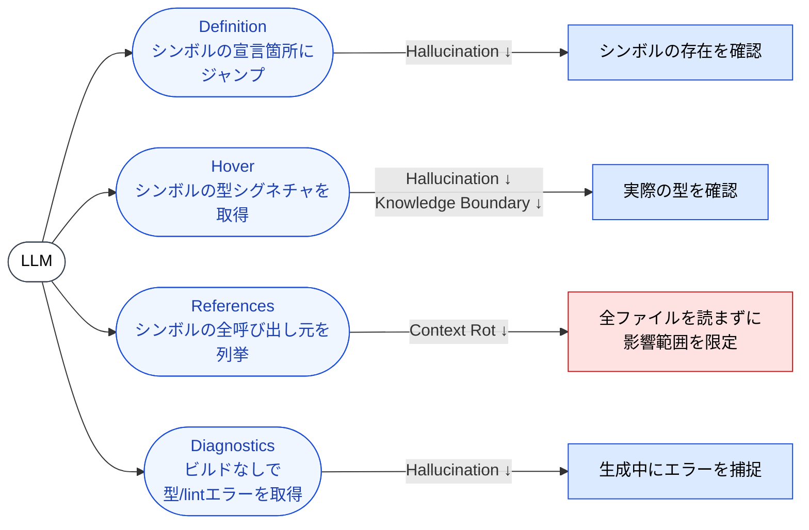

🌐 [English](../../09-code-intelligence/lsp-as-grounding.md)

# LSP は接地装置である

> [!IMPORTANT]
> → Why: **Hallucination** 緩和（生成シンボルを実在する参照先に拘束する）
> → Why: **Knowledge Boundary** 緩和（プロジェクト固有の型や学習後の API が検査可能になる）
> → Why: **Context Rot** 緩和（シンボル単位の取得でファイル全文読み込みを回避）

## LSP が提供するもの

Language Server Protocol（LSP）は、もとは「1つの言語サーバーがあらゆるエディタに対応できるように」設計された JSON-RPC プロトコルである。LLM の視点から見ると、LSP は**コード世界に対する事実のオラクル**である。「このシンボルは存在するか？」「その型は何か？」「どこで宣言されているか？」「誰が依存しているか？」に、LLM が推測する必要なく答えを返してくれる。

Claude Code は LSP の4つの機能を使う。それぞれが特定の失敗モードを封じる。



## 機能1: Definition — 「このシンボルは存在するか？」

`textDocument/definition` はシンボルが宣言された場所を返す。LLM が `userStore.selectFilteredUsers()` を呼び出そうとしている時、LSP は実在する宣言箇所を返すか、何も返さないかのどちらかである。

定義が返ってくることは**存在の証明**である。null が返ってくることは**非存在の証明**であり、提案がコードとしてコミットされる前のこの瞬間こそ、Hallucination のループが断ち切られる地点である。

これは Grep とは質的に異なる。Grep は文字列マッチを返す。本物の宣言と、たまたま同じ名前を含むコメント・文字列リテラル・docstring を区別できない。LSP は言語サーバーのセマンティックモデルに裏付けられた**当の宣言**を返す。

## 機能2: Hover — 「型は何か？」

`textDocument/hover` はシンボルの型シグネチャとドキュメントを返す。これは型付き言語における最強の Hallucination 対策である。

例えば RxJS を多用するコードベースで、LLM が次のようなコードを生成しようとしているとする：

```typescript
combineLatest([userId$, filter$]).pipe(
  switchMap(([id, filter]) => api.getUsers(id, filter)),
);
```

LLM は RxJS の全バージョンにわたる全 operator の正確なシグネチャを覚えていられない。`combineLatest` に Hover をかけると、`node_modules` にインストールされている実バージョンの実シグネチャが返ってくる — `ObservableInput<T>` の union、配列形式とオブジェクト形式のオーバーロード、非推奨形式まで含めて。LLM は半端な記憶ではなく実シグネチャに対してコードを生成する。

> [!TIP]
> これは [Knowledge Boundary § パターン2: 存在しない API の呼び出し](../01-llm-structural-problems/knowledge-boundary.md) で扱った失敗モードに対する最も直接的な治療である。LLM はもう「どの API が存在するか」を覚えなくてよい。教えてもらう側に回る。

## 機能3: References — 「誰が依存しているか？」

`textDocument/references` はシンボルの全呼び出し元を返す。これは主に **Context Rot 緩和**として効く。

LSP がないと、「この関数を変更したら何が壊れるか？」を調べるには、何十ものファイルをコンテキストウィンドウに読み込んで手で走査する必要がある。References を使えば、LSP が正確なファイル集合と行番号を返す。LLM は本当に必要な箇所だけを、必要な範囲だけ読み込む。

結果は小さく密度の高いコンテキストになる。30K トークンを食っていた調査が、数百トークンで済む。

## 機能4: Diagnostics — 「このコードは今この瞬間、妥当か？」

`textDocument/publishDiagnostics` は型エラー・未解決の import・lint 警告を、コード編集中に**ストリーミングで**配信する — ビルドを起動せずに。

この機能こそが LSP を「クエリツール」から**生成ループ内のフィードバック信号**へと変える機能である。次ページ（[ライブ型エラー](live-type-errors.md)）でこれを掘り下げる。シェルコールを挟むことなく「生成 → エラーを見る → 修正」がループするようになる、というのは大きな変化だからだ。

## なぜ LSP はテストとは違う問題を解くのか

LSP の Diagnostics と Hooks 経由のテストはどちらも LLM の出力を検証するが、介入する地点と捕捉できるエラーの種類が異なる。

| レイヤー | 発火タイミング | 捕捉するもの | 捕捉できないもの |
|:--|:--|:--|:--|
| **LSP Diagnostics** | 生成/編集中 | 型エラー、未解決シンボル、import エラー | ロジックバグ（型は正しいが挙動が間違い） |
| **Hooks（テスト実行）** | ファイル書き込み後 | 挙動バグ、ランタイムエラー、リグレッション | テストスイートが網羅していないエラー |

LSP と Hooks は冗長ではなく相補的である。LSP はコンパイル時に落ちる**はずの**エラーを — 高速・低コスト・プロセス起動なしに — 捕まえる。Hooks はコンパイルは通るが挙動が間違っているエラーを捕まえる。

## LSP にできないこと

> [!WARNING]
> LSP は**シンボル**に対する事実ソースであり、**セマンティクス**に対する事実ソースではない。
>
> - LSP は `getUserById(id: string)` が存在して文字列を受け取ることを確認する。空文字列を渡すのが妥当かどうかは確認しない。
> - LSP は関数が `Promise<User>` を返すことを確認する。呼び出し側が await しているかは確認しない。
> - LSP は型整合を確認する。ビジネスロジックが正しいかは確認しない。
>
> これらにはテスト（Part 7 Hooks）とレビュー（Part 5 Agents、Cross-Model QA）が必要。

## 運用上の注意

- LSP はユーザの IDE が使っているのと同じ言語サーバーに、同じ `node_modules` / lockfile 状態に対して接続する必要がある。古い状態のサーバーは古い答えを返す。これは LSP がないより悪い。
- TypeScript モノレポでは、プロジェクト参照と `tsconfig.json` の解決が健全である必要がある。`tsc --noEmit` が壊れていれば LSP も壊れている。
- 強い型システムを持たない言語（型なしの Python、素の JS）は Hover と Diagnostics から得られる価値が小さい。それでも Definition と References からは十分な価値が得られる。

## 参考文献

- Microsoft. "Language Server Protocol Specification." [microsoft.github.io/language-server-protocol](https://microsoft.github.io/language-server-protocol/) — LSP の正準仕様
- Anthropic. "Claude Code: IDE integration and language servers." Claude Code ドキュメント. [docs.claude.com](https://docs.claude.com/) — Claude Code における Code Intelligence の公式ガイド
- Liu, F. et al. (2024). "Exploring and Evaluating Hallucinations in LLM-Powered Code Generation." [arXiv:2404.00971](https://arxiv.org/abs/2404.00971) — コード生成におけるシンボルレベル Hallucination 率の実証研究

---

> **前へ**: [Part 9 概要](index.md)

> **次へ**: [Hallucination とシンボル](hallucination-and-symbols.md)
