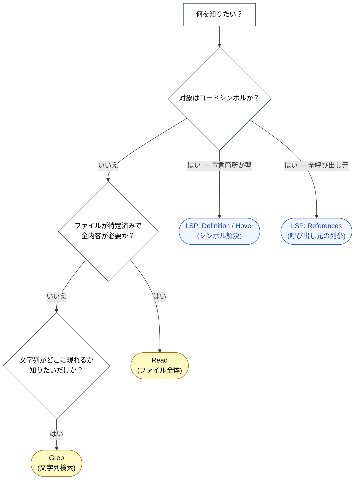

🌐 [English](../../09-code-intelligence/vs-grep-vs-read.md)

# Grep / Read / LSP — どれをいつ使うか？

> [!IMPORTANT]
> → Why: **Context Rot** 緩和（適切なツールを選ぶことで、本当に必要なトークンだけを読み込む）
> → Why: **Lost in the Middle** 緩和（コンテキストが小さいほど、関連情報が高アテンション位置に留まる）

## 3つのツール、3つのコストプロファイル

Claude Code には、コード世界を参照する主要な方法が3つある。それぞれが異なる問いに答え、それぞれが異なるトークンコストを持つ。

| ツール   | 答える問い                                                 | トークンコスト              | セマンティック？          |
| :------- | :--------------------------------------------------------- | :-------------------------- | :------------------------ |
| **Grep** | 「この文字列を含むファイルはどれか？」                     | 低                          | いいえ — 文字列マッチのみ |
| **Read** | 「このファイルの全内容は何か？」                           | 高 — ファイル全体           | 暗黙的（LLM が読む）      |
| **LSP**  | 「この**シンボル**はどこで定義/使用/型付けされているか？」 | 非常に低 — シンボル情報のみ | はい — セマンティック解決 |

ツールの選択を間違えても、間違った答えが出るわけではない。だが、無駄なコンテキストが生まれる。そして Part 1 で確立したとおり、Context Rot はウィンドウが満タンになるはるか前から品質を劣化させる。

## 判断フロー

## 具体例 1: 「この関数を変更したら何が壊れるか？」

Angular サービスの `getUserById` をリファクタするときの影響範囲を調べる場面を考える。

**素朴なアプローチ — import している全部を Read。**

1. `getUserById` をリポジトリ全体で Grep: 14 ファイルがマッチ。
2. 14 ファイルを全文 Read。
3. 平均ファイルサイズ約 200 行。合計約 2,800 行 ≒ 25K トークン。
4. マッチの多くはテストファイルとコメント。実呼び出し元は約 6 箇所。

**LSP ファーストのアプローチ。**

1. `getUserById` に `textDocument/references`: 正確な呼び出し元 6 箇所をファイル + 行範囲で返す。
2. 関連箇所だけを Read — 各箇所周辺 20 行とする。合計約 120 行 ≒ 1.2K トークン。

LSP ファーストのアプローチは**同じ調査を約 5% のトークン**で完了し、さらに精度が高い（コメント内の文字列マッチによる偽陽性がない）。

## 具体例 2: 「レート制限について言及している箇所を全部探したい」

今度は**コードシンボルではない**問いを考える。コードベースの中で「レート制限」について議論している箇所すべて — コード、コメント、docstring、設定ファイルを問わず — を探したい。

**LSP は役に立たない**。レート制限はシンボルではなく概念である。正しいツールは Grep。

| 問い                    | 最適なツール   | 理由                                                     |
| :---------------------- | :------------- | :------------------------------------------------------- |
| `getUserById`（関数）   | LSP References | LLM が欲しいのは呼び出し元、文字列出現箇所ではない       |
| `"rate limit"`（概念）  | Grep           | 概念はコメント・文字列・設定に現れる。LSP は大半を見逃す |
| `UserService`（クラス） | LSP Definition | 正準宣言は1つ。Grep は無関係な import を大量に返す       |
| `TODO` マーカー         | Grep           | TODO はシンボルではない。コメントこそが欲しいもの        |

ルール: **シンボル → LSP、概念と文字列 → Grep、既知ファイルの全内容 → Read**。

## 「全部読む」が必ず失敗する理由

魅力的なショートカット: 「モジュールフォルダを全部 Read してしまえば、LLM が何とかしてくれるだろう」。これは2つの理由で失敗する。

**Context Rot**。[Part 1: Context Rot](../01-llm-structural-problems/context-rot.md) でカバーしたとおり、LLM の品質はトークン数とともに劣化する。1K トークンの問いに答えるために 30K トークンのソースを読み込むのは、情報的利得ゼロのまま劣化を倍増させる。

**Lost in the Middle**。[Lost in the Middle](../01-llm-structural-problems/lost-in-the-middle.md) は、長いコンテキストの中央にある情報の想起精度が両端より悪いことを示している。14 ファイルを順に読み込めば、中央のファイルの情報は必ず最悪の想起位置に置かれる。

組み合わさると残酷な結果になる: **トークンを使って精度を悪化させる**。

> [!CAUTION]
> ディレクトリ全体の読み込みは、ユーザが明示的に網羅的レビューを望む場合（セキュリティ監査など）に限定すべき。日常的な「このコードベースは何をするのか」系の問いには、**まず LSP か Grep で局在化し、ピンポイントで Read する**。

## ファイル全体を Read すべきとき

ファイル全体の Read が正解になるのは：

- ファイルが小さく（< 200 行）構造全体が必要な場合（設定ファイル、小さなコンポーネントなど）。
- すでに LSP/Grep で1ファイルに局在化済みで、周辺コンテキストが必要な場合。
- LSP がサポートしないファイル（Markdown、プレーンテキスト、言語サーバーの視界外にある生成コード）。

Read は**仕上げ**のツールであり、**着手**のツールではない。

## ツール順序についての補足

よくあるアンチパターン: 「とりあえず Grep して、もし型が必要になったら LSP を使おう」。これはツール呼び出しを1回無駄にする。対象が型付きシンボルなら、LSP は Grep が見つけたであろうもの全部、プラス型、プラス正準宣言箇所を、1回の呼び出しで返す。

逆も真なり: 対象が文字列概念なら、LSP に手を出すべきでない。Grep に直行する。

**最初から正しいツールを選ぶ**。ツール呼び出し自体がトークンを消費する（リクエストもレスポンスもコンテキストを食う）。

## 他のパートとの関係

- [Part 6 MCP のコンテキストコスト](../06-tool-context/mcp-context-cost.md) はツール定義について同じ議論をする: 読み込んだバイトは実作業に使えないバイトである。同じロジックがここでは1調査あたりのレベルで適用される。
- [Part 8 セッション管理](../08-session-management/index.md) はコンテキストがすでに満タンになった後の対処を扱う。ツール選択は上流の制御、セッション管理は下流の対処である。

## 参考文献

- Hong, K., Troynikov, A., & Huber, J. (2025). "Context Rot: How Increasing Input Tokens Impacts LLM Performance." Chroma Research. [research.trychroma.com](https://research.trychroma.com/context-rot) — 18モデルでの Context Rot 定量測定。必要なものだけを読み込む動機付け
- Liu, N. F. et al. (2023). "Lost in the Middle: How Language Models Use Long Contexts." [arXiv:2307.03172](https://arxiv.org/abs/2307.03172) — U字型想起の実証

---

> **前へ**: [ライブ型エラー](live-type-errors.md)

> **Part 9 完了 → 次へ**: [Part 10: マルチセッション協調 — Agent Teams](../10-multi-session/index.md)
