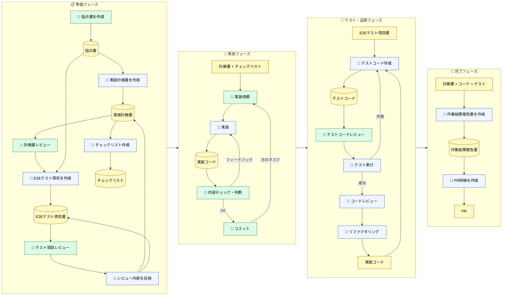

🌐 [English](../../09-cross-llm-principles/prompt-driven-development.md)

# ツール支援がない環境での実践

> [!NOTE]
> CLAUDE.md、Rules、Skills、MCP が使えない環境でも、LLM の構造的制約への対処原理は同じ。
> 手動で同じパターンを再現する「プロンプト駆動開発」の実践方法。

## 現実の制約

全ての開発環境が Claude Code のようなツール支援を備えているわけではない。

- GitHub Copilot のエージェントモデルで CLAUDE.md に相当する機能がない
- ソース管理が CodeCommit、タスク管理が別ツール、認証もバラバラ
- MCP でチケットやリポジトリを直接参照できない
- コミットメッセージの規約が統一されておらず、`git log` がコンテキストとして機能しない

こうした環境でも、Part 1〜8 で学んだ原理を理解していれば、**手動で同じ対策を実現できる**。

## プロンプト駆動開発のワークフロー

以下は、CLAUDE.md や Skills が使えない環境で実際に運用されているステップ開発手法。

#### チャート図



色分け：

- 🟢 緑 — ユーザーのアクション（レビュー・判断・コミット）
- 🔵 青 — LLM のアクション（生成・実装・テスト）
- 🟡 黄（円柱）— 成果物（6つ + チェックリスト + PR）

## なぜステップを分けるのか

> [!IMPORTANT]
> 一度に全てを依頼しない理由は、Part 1〜2 で学んだ構造的制約にある。

LLM はステートレスであり、Context は毎ターン膨らんでいく。一度に「計画して、実装して、テストして、PR を作って」と依頼すると、Context が巨大になり品質が劣化する。ステップを分けることで、各ステップの Context を小さく保てる。

| ステップ                     | 対処している構造的問題                                             |
| :--------------------------- | :----------------------------------------------------------------- |
| 指示書を事前に作成           | Knowledge Boundary（LLM が知らないプロジェクト文脈を明示的に注入） |
| 計画書を先に作成 → レビュー  | Context Rot（一括実装による Context 膨張を防ぐ）                   |
| E2Eテスト項目を実装前に作成  | Sycophancy（先に合格基準を決めて甘い判断を防ぐ）                   |
| チェックリストを外部化       | Instruction Decay（長いセッションでの手順忘れを防ぐ）              |
| タスクフェーズごとにコミット | Context Rot（フェーズ完了でセッションをリセットできる）            |

## 成果物がコンテキストの代替になる

このワークフローの核心は、**成果物をファイルとして永続化し、次のステップでパスを指定して LLM に参照させる**こと。

```
# プロンプト例
以下の成果物を参照して、フェーズ2の実装を行ってください。

- 指示書: ./docs/instructions.md
- 実装計画書: ./docs/implementation-plan.md
- チェックリスト: ./docs/checklist.md

まず内容を把握できたか確認してください。
```

LLM にパスを渡すと、内容を読み込んでサマリーを表示し確認を求めてくる。この「理解確認」のステップが重要で、LLM が正しくコンテキストを把握しているか検証できる。

> [!TIP]
> これは実質的に、CLAUDE.md + Skills と同じことを手動で行っている。
>
> | 手動プロセス                           | Claude Code の対応機能        |
> | :------------------------------------- | :---------------------------- |
> | 指示書を作成してパス指定               | CLAUDE.md（常駐コンテキスト） |
> | 成果物のパスを渡して「参照して」       | Skills の参照ベース設計       |
> | チケットを Markdown 化してローカル保存 | llms.txt / MCP 連携           |
> | LLM にサマリーを出させて確認           | 理解確認プロンプト            |

## 外部情報の Markdown 化

MCP でチケット管理システムやリポジトリに直接接続できない場合、**手動でテキスト化してプロジェクトフォルダに配置する**のが現実的な対処法。

- Backlog / GitHub Issue のチケット内容を Markdown にコピー
- バックエンドリポジトリの API 仕様をテキスト化
- 関連する設計ドキュメントをローカルに保存

```
プロジェクトフォルダ/
├── docs/
│   ├── instructions.md        # 指示書（テンプレート化済み）
│   ├── implementation-plan.md # LLM が生成した実装計画書
│   ├── e2e-test-spec.md       # LLM が生成したE2Eテスト項目書
│   └── checklist.md           # LLM が生成したチェックリスト
├── references/
│   ├── ticket-123.md          # チケット内容の Markdown 化
│   ├── backend-api-spec.md    # バックエンド API 仕様
│   └── design-doc.md          # 設計ドキュメント
└── src/
```

この手動変換には、面倒ではあるが利点もある。チケットの生データをそのまま渡すとコメント欄のやりとりや関係ない議論もコンテキストに入ってしまうが、Markdown 化する過程で「LLM に必要な情報だけ」を抽出できる。ある意味、**手動の Context Budget 管理**である。

## コミットメッセージとコンテキスト品質

> [!WARNING]
> コミットメッセージが統一されていない環境では、`git log` が LLM のコンテキストとしてほぼ機能しない。

`fix bug` や `update` のようなコミットが並んでいると、LLM は過去の変更意図を把握できない。Conventional Commits のような規約があり、チケット番号が紐付いていれば：

```
feat(auth): add login flow (#123)
fix(api): handle timeout in payment service (#456)
```

LLM は Issue #123 を辿って背景を把握し、関連する変更を追跡できる。コミットメッセージ、ブランチ命名、PR テンプレートといった「開発プロセスのメタデータ」の品質が、LLM の活用効率に直結する。

これは LLM 以前からの課題だが、AI 活用の文脈で改めて重要性が増している。人間同士なら「あの時のあれ」で通じることも、LLM には通じない。

## 原理の対応関係

ツール支援の有無に関わらず、対処の原理は同じ。

| 原理                         | Claude Code での実現  | プロンプト駆動での実現                 |
| :--------------------------- | :-------------------- | :------------------------------------- |
| 常駐コンテキストは最小限に   | CLAUDE.md 200行制限   | 指示書テンプレートの簡潔化             |
| 条件付き注入で分散           | `.claude/rules/`      | ステップごとに必要な成果物だけパス指定 |
| オンデマンドで知識注入       | Skills                | 成果物ファイルを参照させる             |
| 外部情報を LLM が読める形に  | MCP / llms.txt        | Markdown 化してローカル保存            |
| セッションは短く保つ         | `/compact` / `/clear` | タスクフェーズごとにコミット＋リセット |
| 機械的検証はコンテキスト外で | Hooks                 | CI/CD、手動テスト実行                  |

## ワークフロー自体を Skills として定義するアプローチ

ここまでは「ツール支援がない環境で手動で原理を適用する」話だったが、逆に Claude Code や Cursor のような Skills 対応ツールが使える環境であれば、**このワークフロー自体を Skill として定義する**ことで、プロセスの標準化と再利用が可能になる。

Addy Osmani の [agent-skills](https://github.com/addyosmani/agent-skills) はまさにこのアプローチを体系化したもので、プロダクションレベルの開発ワークフローを Plain Markdown の Skill として定義している。

- **Spec before code** — 実装前に仕様を定義（本ページの「指示書を事前に作成」に対応）
- **Plan-mode task breakdown** — 検証可能な単位へのタスク分割（「計画書を先に作成 → レビュー」に対応）
- **TDD with Prove-It pattern** — バグをまず失敗テストとして再現（「E2Eテスト項目を実装前に作成」に対応）
- **5-axis code review** — 正確性・可読性・設計・セキュリティ・パフォーマンスの5軸レビュー
- **Anti-rationalization table** — エージェントがステップを飛ばす口実とその反論を事前に定義（Sycophancy 対策）

> [!TIP]
> 重要なのは、これらが **Plain Markdown** であること。Claude Code、Cursor、Windsurf、Copilot、Codex のどれでも使える。本ページで紹介した手動プロセスも、Skill として定義すればツール支援のある環境で再利用可能になる。

## 参考資料

- Osmani, A. (2025). "agent-skills: Production-grade engineering skills for AI coding agents." [github.com/addyosmani/agent-skills](https://github.com/addyosmani/agent-skills) — 開発ワークフローを Plain Markdown の Skills として体系化。MIT ライセンス

---

> **前へ**: [構造的制約は全モデル共通](universal-patterns.md)

> **次へ**: [Cursor / Cline / Copilot 対応表](cursor-cline-mapping.md)
