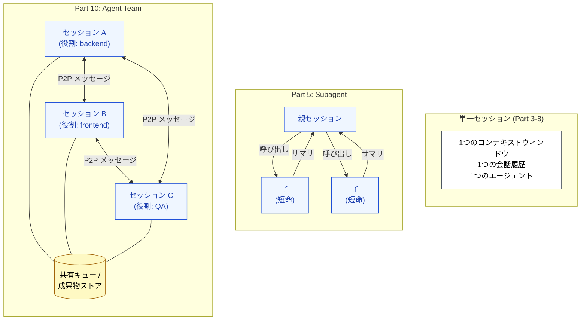

🌐 [English](../../10-multi-session/index.md)

# Part 10: マルチセッション協調 — Agent Teams

> [!NOTE]
> 単一セッションでは劣化せずに完了できないタスクに対する答えは、「より良い単一セッション」ではない。**それぞれが境界づけられたスコープを持ち、ピアツーピアで協調する複数のセッション**である。
> Part 5 の Subagent が親セッションの委譲された子であったのに対し、Agent Teams は独自のライフスパンを持つピアである。
> Agent Teams は Claude Code における代表例である。セッション境界を設計する、という考え方は製品を問わない。

## このパートが存在する理由

Part 5 では Subagent を導入した: 親セッションが独立したコンテキストウィンドウで子を呼び出し、子はサマリを返し、親は処理を続ける。このパターンは「呼び出し → 結果」にきれいに収まるタスクに対しては機能する。タスクが大きすぎて単一セッションが最初から最後まで保持できない場合 — 数週間にわたるリファクタ、バックエンドとフロントエンドにまたがる機能、QA を交えた長時間のデバッグ — このパターンは破綻する。

そのスケールで必要なのは、より大きなコンテキストではなく、**境界を持ったセッションが協調する**ことである。各セッションは作業の1スライスを所有し、独自のコンテキスト予算、独自の履歴、独自のモデル呼び出しを持つ。必要なときだけ互いに話す。

これは設計対象を移動させる。Part 3〜8 がセッションの*中身*を設計していたのに対し、Part 10 は*セッション間の境界*を設計する。

## → Why: どの構造的問題に対応しているか

> [!IMPORTANT]
> Agent Teams は3つの構造的問題に同時に対応する。なぜなら、底にある対策 — _各コンテキストを小さく集中したままに保つ_ — こそが、それら3つがそれぞれ個別に要求しているものだからである。
>
> - **Context Rot**: 並列分割が根本原因への対策である。各セッションは自分のスライスだけを保持する。どのセッションも満タンにならない。
> - **Lost in the Middle**: 各セッションの会話が短くトピックに集中していれば、情報が埋没する「真ん中」が存在しない。U字カーブは形成されない。
> - **Priority Saturation**: 責務がセッション間で分割されると、各セッションが同時に運ぶ指示の数が減る。遵守率は劣化閾値の上に留まる。

これは Part 8 の `/compact` や `/clear` が達成するものとは質的に異なる。あれらは*下流*の対症療法 — 劣化が始まってから管理するものである。Agent Teams は*上流*にある: そもそも単一セッションが大きく育つことを許さないことで、劣化が形成されることを未然に防ぐ。

## Subagent が終わり Agent Team が始まる地点

| 観点                   | Subagent (Part 5)             | Agent Team (Part 10)                           |
| :--------------------- | :---------------------------- | :--------------------------------------------- |
| **トポロジー**         | 階層 (親 → 子)                | ピアツーピア (セッション → セッション)         |
| **寿命**               | 1タスク、その後終了           | プロジェクトスコープ、多くのタスクを跨いで永続 |
| **状態**               | ステートレス (毎回フレッシュ) | ステートフル (各セッションが履歴を保持)        |
| **協調**               | 親が子の戻り値を待つ          | セッション同士が非同期にメッセージを交換       |
| **解決する失敗モード** | 親の Context Rot              | 単一セッションでは保持できない長期作業         |

役立つ目安: 作業が1回の呼び出し-リターンに収まるなら、Subagent で十分である。作業が多くの呼び出し-リターンに跨り、各セッションが前回何をしたかを覚えている必要があるなら、Agent Teams が欲しい。

## このパートが対象としないもの

> [!WARNING]
> このパートはマルチセッション協調の**構造的根拠**を扱う — なぜ機能するのか、何を解決するのか、いつ手を伸ばすのか。特定のオーケストレーションフレームワークや SDK のチュートリアルではない。
>
> 具体的な API 表面 (セッションをどう起動するか、ピアにどうアドレッシングするか、メッセージエンベロープがどう見えるか) は、Claude Code 自身の協調プリミティブ、Claude Agent SDK、AutoGen や CrewAI のようなサードパーティフレームワーク間で異なる。このパートの原則はそれら全てに適用される。具体的な内容はツール固有のドキュメントに属する。

## このパートのドキュメント

| ドキュメント                                       | 内容                                                                                   |
| :------------------------------------------------- | :------------------------------------------------------------------------------------- |
| [Subagent vs Agent Team](subagent-vs-team.md)      | 2つのパターンを並べて比較し、どちらを使うかを判断する                                  |
| [セッション境界の設計](session-boundary-design.md) | 役割で、工程で、レイヤで、機能で作業を分割する — そして選び方                          |
| [ピアメッセージング](peer-messaging.md)            | セッションがどう通信するか: 共有キュー、ダイレクトメッセージ、成果物、コンフリクト解決 |
| [長期実行タスク](long-running-tasks.md)            | スケールにおける Context Rot の根本対策としての並列分割                                |

## 次に到達する場所

本 Part までで、Claude Code を代表例とした対策の層は揃う。製品に依存しない原則の抽出は [Part 11: 他LLMへの応用](../11-cross-llm-principles/index.md) で行う。

## 参考文献

- Anthropic. (2025). "How we built our multi-agent research system." Anthropic Engineering. [anthropic.com/engineering](https://www.anthropic.com/engineering/built-multi-agent-research-system) — プロダクションのマルチエージェントシステムの背後にある設計判断についての Anthropic 自身による解説
- Wu, Q. et al. (2023). "AutoGen: Enabling Next-Gen LLM Applications via Multi-Agent Conversation." [arXiv:2308.08155](https://arxiv.org/abs/2308.08155) — マルチエージェント会話パターンの参照フレームワーク

---

> **前へ**: [Part 9: コード世界の接地 — Code Intelligence](../09-code-intelligence/index.md)

> **次へ**: [Subagent vs Agent Team](subagent-vs-team.md)
