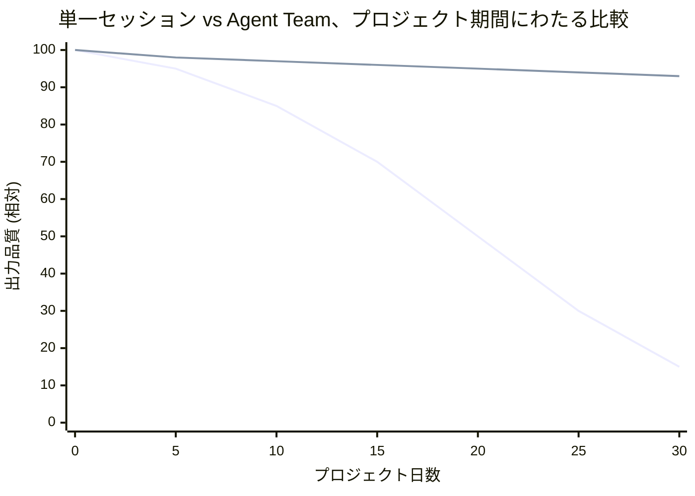
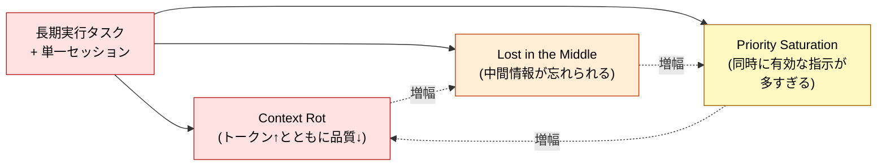
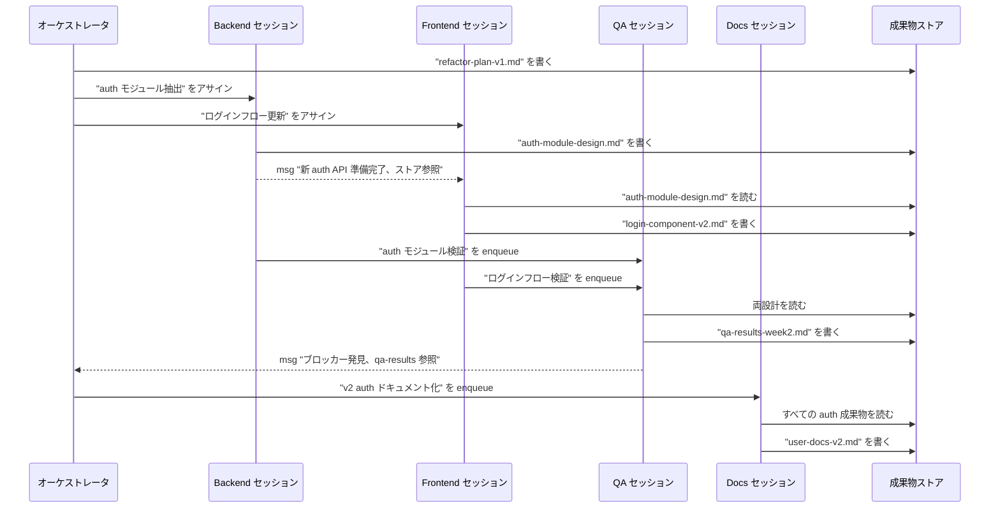

🌐 [English](../../10-multi-session/long-running-tasks.md)

# 長期実行タスク

> [!IMPORTANT]
> → Why: **Context Rot** 根本原因の緩和 (どのセッションもプロジェクト全体を保持しなくてよくなる)
> → Why: **Lost in the Middle** 根本原因の緩和 (各セッションの履歴が短いままで、U字カーブが形成されない)
> → Why: **Priority Saturation** 根本原因の緩和 (各セッションが1つの役割の指示を運ぶ、すべての役割ではなく)

## スケールにおける問題

Part 3〜8 はセッションを管理するツールを与える: CLAUDE.md をタイトに保つ、ルールを条件付きで分配する、50% で compact する — すべて機能する。だがそれらのテクニックはどれも**遅延戦術**である。劣化の速度を遅らせるが、排除しない。1日の作業ならそれで十分。1ヶ月の作業ならそうではない。

最初の線 (`/compact` ありの単一セッションでも) は、記憶された判断、過去のコード、蓄積されたルールの累積的重みが増すにつれて減衰する。2番目の線 (Agent Team) はほぼフラットを保つ — どのセッションもすべてを覚える必要がないからである。各セッションの履歴は自分のスライスだけを覆う; そのスライスが完了したら、セッションは `/clear` でき、成果物ストアが永続的な事実を持ち越す。

> [!NOTE]
> このチャートの数値は説明用であり、測定値ではない。質的な形 — 減衰カーブ vs 平坦なプラトー — が Context Rot (Hong et al., 2025) と Lost in the Middle (Liu et al., 2023) の研究がスケールにおいて予測するものである。

## 何が「長期実行」とみなされるか

閾値は日数ではなく、**作業自身が消費するコンテキスト予算**で測られる。役立つ目安:

| 作業範囲              | 単一セッション予算の圧迫                                 | パターン                          |
| :-------------------- | :------------------------------------------------------- | :-------------------------------- |
| 1 PR、1午後           | 低                                                       | 単一セッション                    |
| 1機能、1週間          | 中; `/compact` 1〜2回                                    | 規律ある単一セッション            |
| 1エピック、数週間     | 高; 複数の `/clear` サイクル、ローカルコンテキストを失う | Agent Team                        |
| 1イニシアチブ、継続中 | 飽和; すべての `/clear` で重要な履歴を失う               | 永続成果物ストア付きの Agent Team |

閾値を越えた信号は、**`/clear` がコストを伴いだしたとき**である。セッションをクリアすることが、LLM が figured out した重要な状態 (どのファイルが何をするか、チームがどのパターンを使うか、どの判断が下されてなぜか) を失うことを意味するなら、セッションは `/clear` が安全にリセットできる範囲を越えて成長している。その状態はセッションが所有する成果物に住む必要がある、単一セッションのチャット履歴ではなく。

## なぜ並列分割が根本原因対策なのか

他の Part 8 の対症療法 (`/compact`、`/clear`) は1つのセッションのライフサイクル内で動作する。Agent Teams は異なるレベルで動作する: **どのセッションも完全な状態を保持しなくてよくする**。

これが重要なのは、ここで扱う3つの構造的問題が独立していないからである — 互いに強化し合う:

単一セッションの対症療法は各問題を個別に扱う。スタックできるが、ある点まで。Agent Teams はソースでサイクルを断つ: 各セッションを小さく集中したままに保つことで、3つの問題すべてが同時に臨界閾値の下に留まる。

## 並列分割が役に立たないとき

> [!WARNING]
> Agent Teams は*作業*が分割可能なときに役立つ。一部の長期実行作業はそうではない。
>
> - **単スレッドの推論連鎖**。複雑な証明、答えが分割できないコンテキストに依存する困難なデバッグセッション — これらは並列に走れない。作業が本質的に直列であり、マルチセッションは協調コストを追加するだけになる。
> - **1人の専門家の専門性に支配されるタスク**。作業の 90% が1つの役割にあるなら、役割を跨いで分割すると 9 つのアイドルセッションと1つのボトルネックを生む。
> - **本当に小さな作業**。2日のタスクは長期実行ではない。Agent Team のセットアップコストはその利益を超える。
>
> 正直なテスト: 作業は*自然に*独立したスライスに分割されるか、それぞれを1つのセッションが絶えずピアに尋ねずに完了できるか? Yes なら並列分割が対策である。No なら、答えは `/compact`、`/clear`、そして規律ある単一セッション作業である — たとえ遅くても。

## 検討パターン: 数週間のリファクタ

backend サービス、frontend コンポーネント、テスト、ドキュメントに触れる数週間のリファクタを考える。作業は役割線に沿って分割可能である。

どのセッションもすべてを知る必要がない。オーケストレータが作業をルーティングする。各役割セッションが自分のスライスを所有する。成果物ストアが永続的な知識を週を跨いで運ぶ。backend セッションが途中で `/clear` され再起動されても、次の backend セッションは `refactor-plan-v1.md` と `auth-module-design.md` を読んで一貫して再開する。

## 長期実行チームの運用規律

> [!TIP]
> 長期実行 Agent Team を健全に保つ4つの習慣:
>
> 1. **来年ピアが読むかのように成果物を書く**。将来のセッション — 同じ役割のフレッシュに `/clear` されたインスタンスかもしれない — は書き手のセッション履歴ではなく成果物に依存する。
> 2. **CLAUDE.md はチームごとではなくセッションごとに保つ**。各役割セッションは自分の業務にチューニングされた CLAUDE.md を持つ。役割を跨いで共有された CLAUDE.md はすべてのセッションを膨張させる。
> 3. **セッションを意図的にサイクルする**。セッションの履歴が大きくなったら、`/clear` して成果物から再水和する。成果物ストアがチームの長期記憶であり、セッションは作業記憶でしかない。
> 4. **指定された「チーム CLAUDE.md」を持つ**。常駐コンテキストとしてではなく — すべての新しい役割セッションが起動時に読む成果物として。それはチームの慣習、成果物ストアのレイアウト、誰が何を所有しているかを記述する。

## 他のパートとの関係

- [Part 1 Context Rot](../01-llm-structural-problems/context-rot.md) — 長期実行の単一セッション作業が逃れられない構造的問題。
- [Part 1 Lost in the Middle](../01-llm-structural-problems/lost-in-the-middle.md) — なぜセッションの判断履歴が想起しにくくなるのか。
- [Part 8 セッション管理](../08-session-management/index.md) — 単一セッションの対症療法 (`/compact`、`/clear`)。Agent Teams はこれらを補完し、置き換えるものではない。
- [Part 9 Code Intelligence](../09-code-intelligence/index.md) — セッションがコードエリアで分割されているとき、LSP こそが各セッションがすべてのファイルをロードせずに変更のセッション間影響を理解できるようにするもの。

## 参考文献

- Hong, K., Troynikov, A., & Huber, J. (2025). "Context Rot: How Increasing Input Tokens Impacts LLM Performance." Chroma Research. [research.trychroma.com](https://research.trychroma.com/context-rot) — スケールにおける Context Rot の定量測定。長い時間軸で並列分割が重要である経験的根拠
- Anthropic. (2025). "How we built our multi-agent research system." Anthropic Engineering. [anthropic.com/engineering](https://www.anthropic.com/engineering/built-multi-agent-research-system) — 同じパターンを研究ワークフローに適用したプロダクションスケールの解説

---

> **前へ**: [ピアメッセージング](peer-messaging.md)

> **Part 10 完了 → 次へ**: [Part 11: 他LLMへの応用](../11-cross-llm-principles/index.md)
