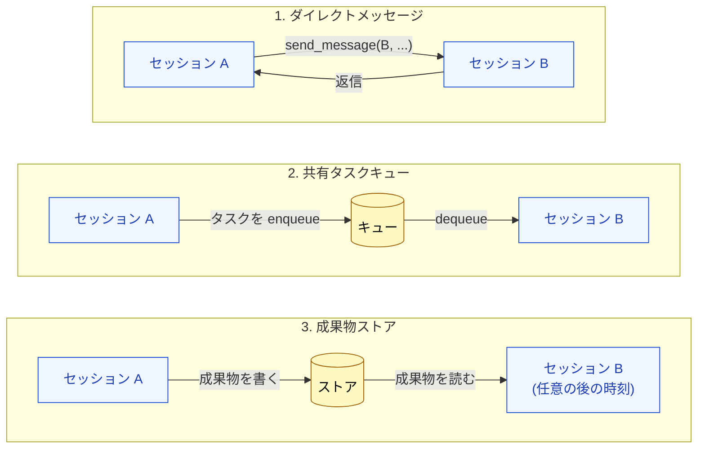
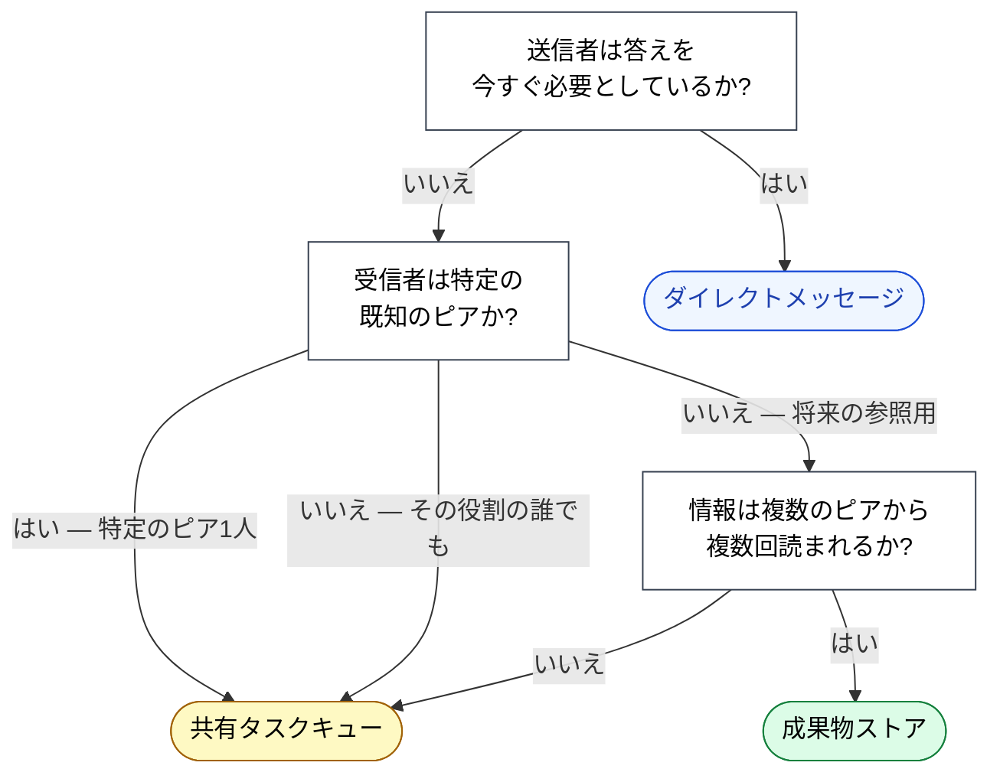

🌐 [English](../../10-multi-session/peer-messaging.md)

# ピアメッセージング

> [!IMPORTANT]
> → Why: ピアメッセージングは Agent Team が協調する*唯一*のチャネルである。このチャネルの設計が、チームが一貫した単位として振る舞うか、互いを踏みつけ合うセッションのコレクションとして振る舞うかを決める。

## 3つの通信プリミティブ

マルチセッション協調は3つのプリミティブを、非同期性の昇順で使う:



### 1. ダイレクトメッセージ — 「今すぐ答えて」

セッションは特定のピアに宛てたメッセージを送り、続きが期待される。送信者は (同期的に、またはポーリングループで) 返信を待つ。

使う場面: 答えなしには作業が進まないとき。

例:

- 「`users` テーブルのスキーマは何?」(backend → infrastructure セッション)
- 「この設計は実装の準備ができている?」(実装ステージセッション → 設計ステージセッション)

### 2. 共有タスクキュー — 「準備ができたら拾って」

セッションがタスクを enqueue する。そのタスクタイプを所有する任意のピアが dequeue して処理する。enqueue した側は待たず、他の作業を続ける。

使う場面: 作業が並列に進める*ことができる*とき。enqueue する側はどのピアがいつそのタスクを拾うかを知る必要がない。

例:

- 「このコミットでリグレッションスイートを走らせる」(任意のセッション → QA セッション)
- 「この新しい public API をドキュメント化する」(実装 → docs セッション)

### 3. 成果物ストア — 「関連するときに読んで」

セッションが成果物 — 設計ドキュメント、コードモジュール、テストレポート — を共有ストアに書く。ピアは自分のスケジュールで読む。

使う場面: 情報が永続的で、複数の将来の読者に、おそらく複数の作業セッションを跨いで関連する可能性があるとき。

例:

- 実装とレビューの両セッションから参照される設計ドキュメント。
- 実装と PM 両セッションから参照されるテスト結果。
- すべての新しいセッションが起動時に参照するアーキテクチャ判断記録 (ADR)。

## 正しいプリミティブを選ぶ



役立つデフォルト: **成果物 > キュー > ダイレクトメッセージの順に好む**。各ステップアップが結合度を下げ、異なるペースで動作するチームの能力を上げる。

## メッセージ規律: メッセージに何を入れるか

ピアメッセージは送信者の履歴*と*受信者の履歴の両方でコンテキストを消費する。雑なメッセージングはコンテキスト予算を実作業ではなく協調で燃やす安価な方法である。3つの原則:

> [!TIP]
> **完全な推論ではなく*サマリ*を送る**。10K トークンかけて何かを理解したなら、ピアが必要なのは結論であり、軌跡ではない。軌跡は成果物に保存してリンクする。
>
> **コンテキストではなく問いに宛てる**。「auth フローは何?」は「ログイン画面で作業していて、OAuth があるのと、マジックリンク系のものもどこかにあるみたいで — どうなっているか説明してくれる?」より良い。ピアは必要なら追加質問できる。
>
> **返信しやすくする**。Yes/No 質問、構造化出力リクエスト、または「ファイルパスと行範囲で答えて」はオープンエンドのプロンプトより答えるコストが安い。可能なら返信の形を制約する。

## コンフリクト解決

セッションが並列に動くと、時々互いを踏みつける。チームは最初のコンフリクトの*前に*解決ポリシーを必要とする、後ではなく。

| コンフリクト                          | 典型的な解決                                                                                                                                |
| :------------------------------------ | :------------------------------------------------------------------------------------------------------------------------------------------ |
| 2つのセッションが同じファイルを編集   | Last-write-wins は危険。成果物ストアレベルでロックするか、1つのセッションをそのファイルのオーナーに指定する。                               |
| 2つのセッションが同じタスクを enqueue | キューレベルでタスクのアイデンティティ (コミットハッシュ、チケット ID) で重複排除する。メッセージ内容ではなく。                             |
| 2つのセッションが事実で食い違う       | 成果物ストアが真実のソースである。成果物が間違っているなら、成果物を直す。2つのセッションが矛盾するコピーを保持することを許してはいけない。 |
| セッションが沈黙する                  | リクエストをタイムアウトさせる。クラッシュしたり `/clear` されたかもしれないピアを待ってチームが永遠にブロックすべきではない。              |

> [!CAUTION]
> マルチセッションの混乱の最大の発生源は**古い成果物**である。セッション A が成果物を読み、判断を下し、数時間の作業を行う — その間にセッション B が成果物を書き換えている。セッション A の判断は今や時代遅れの事実の上に作られている。
>
> 対策は以下のいずれか:
>
> - 成果物を明示的バージョニング付きの追記専用にする。
> - 成果物に依存する判断の直前に成果物を再読する。
> - 急速に進化する事実にはダイレクトメッセージを使い、成果物ストアは安定した知識のために予約する。

## オーケストレータ役

多くの Agent Team で、1つのセッションが**オーケストレータ**役を担う — 自身は作業をせず、メッセージをルーティングし、キューからタスクを割り当て、コンフリクトを裁定する。

オーケストレータは Subagent トポロジーの「親」と同じではない。特定の責任を持つピアであり、チームを解散させずに削除または交換できる。それは*構造的な天井*としてではなく、*役割*として存在する。

オーケストレータを含めるかどうかはトレードオフである:

- **オーケストレータあり**: デバッグが容易、タスクオーナーシップがより明確、コンフリクト解決の単一ポイント。コスト: オーケストレータのコンテキストがチームに関するメタデータで埋まる。
- **オーケストレータなし**: 完全にピアツーピア、より弾力的、ボトルネックなし。コスト: デバッグが困難、ポリシーを強制する単一の場所がない。

2〜3 セッションのチームなら、オーケストレータなしで通常問題ない。4 セッション以上では、オーケストレータが採算を取る。

## 実践例

具体的な例、省略形で:

```
[backend-session] 成果物 "api/v2-schema.md" を書く
[backend-session] タスク "v2 エンドポイントを検証" を enqueue → キュー
[QA-session]      "v2 エンドポイントを検証" を dequeue
[QA-session]      成果物 "api/v2-schema.md" を読む
[QA-session]      結合テストを走らせる
[QA-session]      成果物 "qa/v2-report.md" を書く
[QA-session]      ダイレクトメッセージ送信 → backend-session: "v2 準備完了、qa/v2-report.md 参照"
[backend-session] qa/v2-report.md を読み、続ける
```

ミックスに注目: スキーマとレポートは*成果物* (永続的、後で docs、PM などに読まれる可能性あり)。検証タスクは*キュー上* (特定の QA セッションなし、誰が拾ってもよい)。完了通知は*ダイレクトメッセージ* (backend は今知る必要がある)。

## 他のパートとの関係

- [セッション境界の設計](session-boundary-design.md) はピアが*誰なのか*を決定する。このページはどう話すかを決定する。
- [長期実行タスク](long-running-tasks.md) は数週間のプロジェクトのスケールでのメッセージングパターンを示す。
- [Part 8 セッション管理](../08-session-management/index.md) — ピアセッション自身のコンテキストが満タンになったら、チームはピアの `/compact` や `/clear` を優雅に扱う必要がある。これらのリセットを跨いで生存する必要のある状態は、どのセッションの履歴でもなく成果物ストアに住む必要がある。

---

> **前へ**: [セッション境界の設計](session-boundary-design.md)

> **次へ**: [長期実行タスク](long-running-tasks.md)
