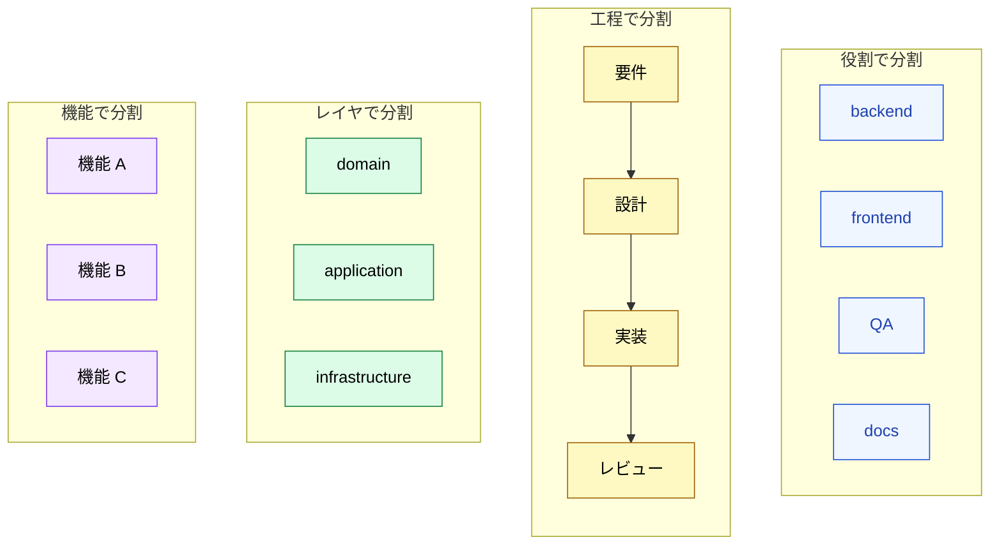

🌐 [English](../../10-multi-session/session-boundary-design.md)

# セッション境界の設計

> [!IMPORTANT]
> → Why: 間違った分割はセッションごとの負荷を減らすことなく協調オーバーヘッドを倍増させる。正しい分割は各セッションを**独立して一貫性のあるもの**にする — 絶えずピアにコンテキストを求めずに、自分のスライスで進捗を作れるようにする。

## 判断はどこで切るか

Agent Team にコミットしたら、次の問いは: どの軸に沿って作業を分割するか? である。この選択がセッション同士がどれだけ頻繁に話す必要があるか、そして各セッションがどれだけクリアに考えられるかを決める。

悪い分割はセッションを密結合に保つ: すべてのステップが、他のセッションが所有する事実を調べるためにピアメッセージを必要とする。良い分割は各セッションを**ほぼ自己充足的**にする。ピアメッセージはハンドオフのために予約され、継続的な対話のためではない。

## 4つの分割パターン

### 役割で分割

各セッションは*機能*を所有する: backend エンジニア、frontend エンジニア、QA、テクニカルライター。各役割は独自の専門性、独自のファイル、独自の業務にチューニングされた CLAUDE.md を持つ。

この分割は人間のチームの組織化方法と自然に揃う。また、単発の委譲については [Part 5 Agents](../05-on-demand-context/agents.md) ともよく揃う — 違いは、ここでは役割セッションが*永続的*であることである。「backend セッション」は先週書いたことを覚えている。

**向いているもの:** 安定した役割境界を持つ成熟したプロジェクトで、同じ種類の作業が繰り返し起こるもの。SaaS プロダクト開発、継続的なプラットフォーム作業。

**注意点:** 全役割をまたぐ機能。新機能には backend + frontend + QA + docs が必要であり、各役割セッションは1スライスしか持たない。すべての機能が全員に触れる場合、協調コストが高くなる。

### 工程で分割

各セッションは作業の*フェーズ*を所有する: 要件収集、設計、実装、レビュー。作業はそれらを線形に流れ、各境界でハンドオフがある。

これは最もパイプライン的な分割である。利点は各セッションのメンタルモデルが1種類の成果物 (要件ドキュメント、設計図、コード、レビューコメント) に境界づけられることである。欠点は作業が各ハンドオフで待たねばならず、最後のステージが上流で見つかった問題でブロックされることが多いことである。

**向いているもの:** 各ステージで明確に定義された成果物を持つワークフロー — 形式的なエンジニアリング、規制業界、あるステージの出力が次のステージの入力になるあらゆるもの。

**注意点:** 不可避なフィードバックループ。実装が設計の問題を見つけたとき、設計セッションを再オープンするのか、その場で解決するのか? どちらの選択にもコストがある。

### レイヤで分割

各セッションは*アーキテクチャレイヤ*を所有する: ドメインロジック、アプリケーション層、インフラストラクチャ。これはコードベース自体の clean architecture / hexagonal architecture の分割を反映している。

セッション境界はディレクトリ境界、依存境界、(通常は) コミット境界と揃う。各セッションのコンテキストは自分のレイヤのファイルにタイトにスコープできる。レイヤを跨ぐ変更には明示的なピアハンドオフが必要であり、これはコード自体がそう動くべき方法でもある。

**向いているもの:** 強いアーキテクチャ規律を持つコードベース。ドメイン駆動設計プロジェクト、レイヤードアーキテクチャ。

**注意点:** すべてのレイヤに対称に跨る機能 — 新しいエンティティを追加すると domain、application、infrastructure に同時に触れる、そしてあなたは3つのセッションをロックステップで動かす必要がある。

### 機能で分割

各セッションは*フィーチャーフラグ*または*プロダクトエリア*を所有する: 機能 A、機能 B、機能 C。各セッションは自分の機能についてすべて — frontend、backend、テスト、docs — を知るが、その機能についてだけである。

これは「役割で分割」の逆である。「役割で分割」が1つの機能における深さを最適化するのに対し、「機能で分割」は1つのプロダクトスライスのオーナーシップを最適化する。

**向いているもの:** 並列機能開発で、各機能がほぼ独立しているもの。グリーンフィールド作業、A/B テストされる実験。

**注意点:** 共有インフラストラクチャ。3つの機能セッションすべてが同じ auth サービスを変更する必要があるとき、3つのセッションが単一のオーナーなしで同じファイルに書き込むことになる。

## 選び方: トレードオフマトリクス

| パターン         | 協調コスト                                      | セッションごとの専門性の深さ    | ハンドオフの明確さ  | コードベースが最も変化する場所 |
| :--------------- | :---------------------------------------------- | :------------------------------ | :------------------ | :----------------------------- |
| **役割で分割**   | 中 (すべての機能が全員に触れる)                 | 高 (1つの craft の深さ)         | 中                  | 縦 (役割のファイル内)          |
| **工程で分割**   | 低 (線形パイプライン)                           | 中 (ステージごとの成果物タイプ) | 高 (明示的ゲート)   | 順次 (一度に1ステージ)         |
| **レイヤで分割** | 低 (境界がコードと一致)                         | 高 (1つのコードレイヤ)          | 高 (依存方向と一致) | レイヤ内                       |
| **機能で分割**   | 低 (機能内) / 高 (機能が共有コードに触れるとき) | 中 (フルスタック、狭スコープ)   | 中                  | 機能のスライス内               |

一般的なルール: **コードベースまたはワークフローに既に存在する境界を分割として選ぶ**。チームが既に役割専門化を持っているなら、「役割で分割」が採用コストが最も低い。アーキテクチャがレイヤ化されているなら、「レイヤで分割」が最もフィットする。

## 「独立して一貫性のある」境界とは何か

> [!TIP]
> 良いセッション境界は3つの性質を満たす:
>
> 1. **自己充足性**。セッションは判断の 80% 以上をピアに尋ねずに行える。ピアメッセージは日常的な調べ物ではなく、ハンドオフのためであるべき。
> 2. **境界づけられた語彙**。セッションは小さく安定した概念セットで作業する。「backend」セッションはサービス、リポジトリ、クエリを扱う — React コンポーネントは扱わない。
> 3. **安定したファイルセット**。セッションは予測可能なファイルセットを編集する。すべてのタスクがリポジトリの異なる部分に触れるなら、境界が間違っている。
>
> セッションが絶えずピアに「X は何?」と尋ねていることに気づいたら、それは X がこのセッションのスコープに属するという信号である — 境界を広げるか、トピックを移動させる。

## アンチパターン

> [!WARNING]
> 妥当に見えるが、節約より多くの協調コストを生む2つの分割:
>
> - **ファイルで分割** — ファイルまたはディレクトリごとに1セッション。ファイルは粒度が細かすぎる。自明でない変更はファイルを跨ぐので、すべてのタスクがマルチセッション協調になる。境界が作業と戦っている。
> - **タスクで分割** — チケット / PR ごとに1セッション。セッションはタスクを跨いだ連続性を持たないので、永続状態の利点を完全に失う。これは余計なステップを追加した Subagent でしかない。Subagent を使うこと。

## 他のパートとの関係

- [Subagent vs Agent Team](subagent-vs-team.md) はチームを使う*かどうか*を決定する。このページはチームを使うと決めた後*どう*分割するかを決定する。
- [ピアメッセージング](peer-messaging.md) は境界がまだ要求するハンドオフのメカニクスを扱う。
- [Part 5 Agents](../05-on-demand-context/agents.md) — Subagent に使われる役割定義の多くはここでも適用される、永続化されるだけである。

---

> **前へ**: [Subagent vs Agent Team](subagent-vs-team.md)

> **次へ**: [ピアメッセージング](peer-messaging.md)
