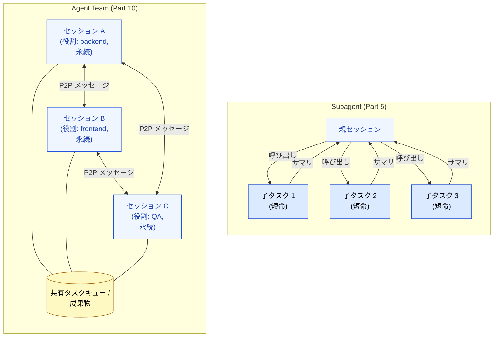
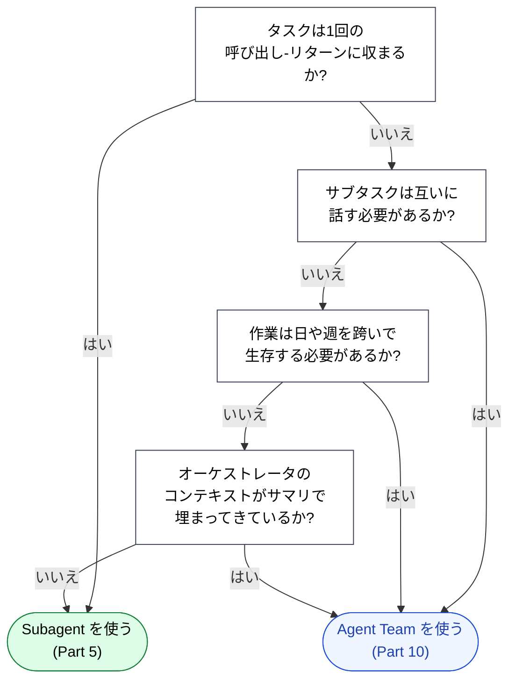

🌐 [English](../../10-multi-session/subagent-vs-team.md)

# Subagent vs Agent Team

> [!IMPORTANT]
> → Why: まず軽い方のプリミティブを選ぶこと。Subagent はよりシンプルで、コストが安く、ほとんどの並列作業に十分である。Agent Teams は単一の呼び出し-リターンに収まらなくなった作業に対する答えである。

## デフォルトは Subagent であるべき

「この作業を分割して結果を持ち帰る」状況の大多数に対して、Part 5 の Subagent パターンが正しい答えである:

- 親がタスクを所有する。
- 親が集中したプロンプトで子を呼び出す。
- 子はフレッシュなコンテキストで実行し、作業を行い、サマリを返す。
- 親はサマリを統合して処理を続ける。

これは安価で、推論しやすく、より長寿命な協調に伴うほとんどの失敗モードを回避する。**Agent Teams に手を伸ばすのは、このパターンが目に見えて破綻したときだけにする。**

## Subagent が破綻するとき

Subagent が不十分になった3つの兆候:

### 兆候1: 作業が親セッションより長生きする

Subagent は親のセッションに縛られている。Context Rot から回復するために親の `/clear` が必要になれば、すべての Subagent のアイデンティティは消える — 「先週使っていた子エージェント」のようなものは存在しない。日数や週を跨いで連続性が必要な作業については、永続化は独自のライフスパンを持つ場所に住まわせる必要がある。

### 兆候2: 子同士が話す必要がある

Subagent は親にサマリを返す、それだけである。別の Subagent に質問することはできない。QA エージェントがリグレッションを実装エージェントに伝える必要があり、実装エージェントがドキュメントエージェントに変更を記録するよう依頼する必要があるなら、それをサポートしない構造にツリー形状の協調を無理やり押し込めていることになる。

### 兆候3: 親がボトルネックになる

Subagent モデルでは、親セッションが全体像を保持する。すべてのサマリがそこを流れる。多くの作業項目を持つ数週間のプロジェクトでは、親のコンテキストは自身の実作業よりも速くサマリで埋まる — そして Context Rot に戻る、ただしより遅い速度で。

これら3つの兆候のいずれかが現れたら、正しい動きは子を*ピア*に昇格させることである — 各自に永続セッションを与え、互いに話せるようにし、元の「親」を特定の役割を持つ別のピア (多くの場合: オーケストレータ、プロジェクトリード、プロダクトオーナー) にする。

## トポロジーの違い、可視化

Subagent のトポロジーは**スター型**である — すべてが中心を通る。Agent Team のトポロジーは横に外部チャネルを持つ**メッシュ型**である — セッションは互いに話し、外部ストア (キュー、成果物バケット、プロジェクトトラッカー) を通じて状態も共有する。

## 判断フロー

フローは Subagent 寄りにバイアスがかかっている。このバイアスは意図的である: Agent Teams は協調オーバーヘッド (メッセージング、コンフリクト解決、共有状態の整合性) を導入する。Subagent にはないコストである。作業がそれを要求する場合にのみ、このコストを払う。

## Agent Teams のコスト

> [!WARNING]
> Agent Teams は無料ではない。採用する前に以下を考慮すること:
>
> - **協調オーバーヘッド**。すべてのピアメッセージはツール呼び出しである。4つのセッションのチームがメッセージを交換すると、総トークンの非自明な割合を実作業ではなく協調に費やすことがある。
> - **状態整合性**。同じ成果物を読む2つのセッションが、わずかに異なる時刻に異なるバージョンを見ることがある。ワークフローがこれを許容するか、共有ストアが順序を強制するかのどちらかが必要である。
> - **デバッグ容易性**。単一セッションの実行で何かが壊れたら、会話履歴は1本の線形ログである。Agent Team では、何が起きたかを理解するために複数セッションを跨いだイベント順序を再構築する必要がある。
> - **セッションごとのコスト**。各セッションは独自の常駐コンテキスト (システムプロンプト、CLAUDE.md、ツール定義) を持つ。4つのセッションは予算 4 倍の1セッションとは*異なる* — *固定*オーバーヘッドが 4 倍、加えて変動的な作業がある。

合理的なヒューリスティック: 単一セッションを数時間ごとに `/clear` しながら現実的に作業を完了できるなら、それを行う。それすら破綻したときに Agent Team を立ち上げる。

## 他のパートとの関係

- [Part 5 Agents](../05-on-demand-context/agents.md) は Subagent パターンを深く扱う。Agent Teams を検討する前に最初に読むものである。
- [Part 8 セッション管理](../08-session-management/index.md) は `/compact` と `/clear` を扱う — マルチセッションに移行する前に出し尽くすべき*単一セッション*の対症療法である。
- [長期実行タスク](long-running-tasks.md) はこのページの実用的な後続である: チームを使うと決めた後、実際にどう作業を分割するか。

---

> **前へ**: [Part 10 概要](index.md)

> **次へ**: [セッション境界の設計](session-boundary-design.md)
