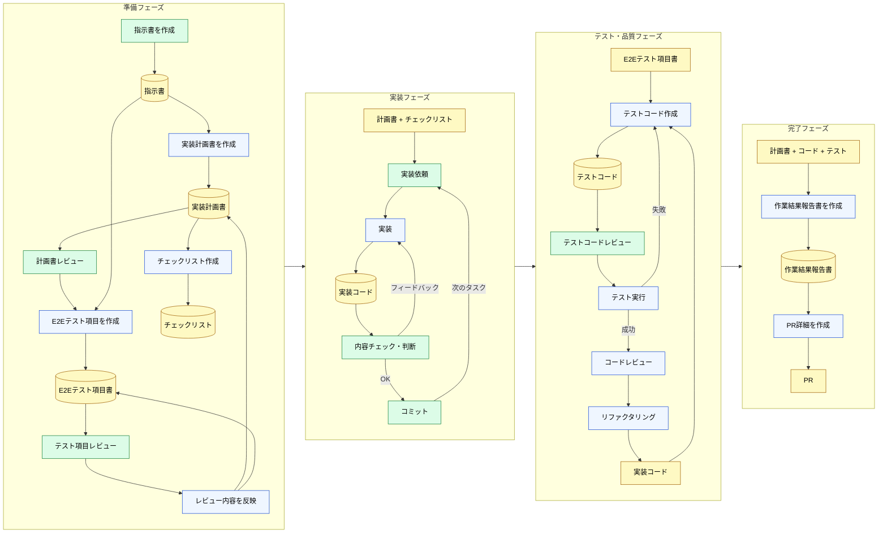

🌐 [English](../../11-cross-llm-principles/prompt-driven-development.md)

# ツール支援がない環境での実践

> [!NOTE]
> 専用のルールファイルや MCP が使えない環境でも、構造的制約への対処原理は同じである。
> 本ページは、その原則を手動で再現する「プロンプト駆動開発」を扱う。

## 現実の制約

全ての開発環境が、Claude Code と同じ粒度の注入制御を備えているわけではない。

- 常駐指示や条件付き注入が、同じ細かさでは揃っていない
- ソース管理、タスク管理、認証が別ツールに分散している
- チケットやリポジトリへ、MCP 相当で直接接続できない
- コミットメッセージの規約がなく、`git log` が Context として機能しない

こうした環境でも、Part 1〜10 で確認した原則は使える。専用コマンドの有無は、原則の可否を決めない。

## プロンプト駆動開発のワークフロー

以下は、専用の常駐ファイルや Skills が使えない環境で運用されているステップ開発の型である。

#### チャート図



色分け：

- 緑 — ユーザーのアクション（レビュー・判断・コミット）
- 青 — LLM のアクション（生成・実装・テスト）
- 黄（円柱）— 成果物（6つ + チェックリスト + PR）

## なぜステップを分けるのか

> [!IMPORTANT]
> 一度に全てを依頼しない理由は、Part 1〜2 で学んだ構造的制約にある。

LLM はステートレスである。Context は毎ターン膨らむ。一度に「計画して、実装して、テストして、PR を作って」と依頼すると、Context が巨大になり品質が劣化する。ステップを分けると、各ステップの Context を小さく保てる。

| ステップ                     | 対処している構造的問題                                             |
| :--------------------------- | :----------------------------------------------------------------- |
| 指示書を事前に作成           | Knowledge Boundary（LLM が知らないプロジェクト文脈を明示的に注入） |
| 計画書を先に作成 → レビュー  | Context Rot（一括実装による Context 膨張を防ぐ）                   |
| E2Eテスト項目を実装前に作成  | Sycophancy（先に合格基準を決めて甘い判断を防ぐ）                   |
| チェックリストを外部化       | Instruction Decay（長いセッションでの手順忘れを防ぐ）              |
| タスクフェーズごとにコミット | Context Rot（フェーズ完了でセッションをリセットできる）            |

## 成果物がコンテキストの代替になる

このワークフローの核心は、成果物をファイルとして永続化し、次のステップでパスを指定して LLM に参照させることである。

```
# プロンプト例
以下の成果物を参照して、フェーズ2の実装を行ってください。

- 指示書: ./docs/instructions.md
- 実装計画書: ./docs/implementation-plan.md
- チェックリスト: ./docs/checklist.md

まず内容を把握できたか確認してください。
```

パスを渡したあと、内容の要約を出させて確認する。この理解確認は、LLM が Context を取り違えていないかを見る手順である。

> [!TIP]
> これは CLAUDE.md と Skills が担う役割を、手動で再現している。
>
> | 手動プロセス                           | Claude Code の対応機能        |
> | :------------------------------------- | :---------------------------- |
> | 指示書を作成してパス指定               | CLAUDE.md（常駐コンテキスト） |
> | 成果物のパスを渡して「参照して」       | Skills の参照ベース設計       |
> | チケットを Markdown 化してローカル保存 | llms.txt / MCP 連携           |
> | LLM にサマリーを出させて確認           | 理解確認プロンプト            |

## 外部情報の Markdown 化

MCP でチケット管理システムやリポジトリに直接接続できない場合、必要な範囲をテキスト化してプロジェクトフォルダに置く。

- Backlog / GitHub Issue のチケット内容を Markdown にコピー
- バックエンドリポジトリの API 仕様をテキスト化
- 関連する設計ドキュメントをローカルに保存

```
プロジェクトフォルダ/
├── docs/
│   ├── instructions.md        # 指示書（テンプレート化済み）
│   ├── implementation-plan.md # LLM が生成した実装計画書
│   ├── e2e-test-spec.md       # LLM が生成したE2Eテスト項目書
│   └── checklist.md           # LLM が生成したチェックリスト
├── references/
│   ├── ticket-123.md          # チケット内容の Markdown 化
│   ├── backend-api-spec.md    # バックエンド API 仕様
│   └── design-doc.md          # 設計ドキュメント
└── src/
```

チケットの生データをそのまま渡すと、コメント欄のやりとりや本題以外の議論も Context に入る。Markdown 化する過程で、LLM に渡す情報を選べる。これは手動の Context Budget 管理である。

## コミットメッセージとコンテキスト品質

> [!WARNING]
> コミットメッセージが統一されていない環境では、`git log` が LLM のコンテキストとしてほぼ機能しない。

`fix bug` や `update` のようなコミットが並んでいると、LLM は過去の変更意図を把握できない。Conventional Commits のような規約があり、チケット番号が紐付いていれば、次のように読める。

```
feat(auth): add login flow (#123)
fix(api): handle timeout in payment service (#456)
```

LLM は Issue 番号から背景を辿り、関連する変更を追跡できる。コミットメッセージ、ブランチ命名、PR テンプレートといった開発プロセスのメタデータの品質が、Context の品質になる。

人間同士なら「あの時のあれ」で足りることがある。LLM には、その場に残されたテキストだけが届く。

## 原理の対応関係

ツール支援の有無に関わらず、対処の原理は同じである。

| 原理                         | Claude Code での実現  | プロンプト駆動での実現                 |
| :--------------------------- | :-------------------- | :------------------------------------- |
| 常駐コンテキストは最小限に   | CLAUDE.md 200行制限   | 指示書テンプレートの簡潔化             |
| 条件付き注入で分散           | `.claude/rules/`      | ステップごとに必要な成果物だけパス指定 |
| オンデマンドで知識注入       | Skills                | 成果物ファイルを参照させる             |
| 外部情報を LLM が読める形に  | MCP / llms.txt        | Markdown 化してローカル保存            |
| セッションは短く保つ         | `/compact` / `/clear` | タスクフェーズごとにコミット＋リセット |
| 機械的検証はコンテキスト外で | Hooks                 | CI/CD、手動テスト実行                  |

## ワークフロー自体を Skills として定義するアプローチ

ここまでは、専用機構がない環境で原則を手動適用する話である。手順書を Markdown として置ける環境であれば、このワークフロー自体を手順ファイルに固定できる。

Addy Osmani の [agent-skills](https://github.com/addyosmani/agent-skills) は、開発ワークフローを Plain Markdown の Skill として定義した例である。

- **Spec before code** — 実装前に仕様を定義（本ページの「指示書を事前に作成」に対応）
- **Plan-mode task breakdown** — 検証可能な単位へのタスク分割（「計画書を先に作成 → レビュー」に対応）
- **TDD with Prove-It pattern** — バグをまず失敗テストとして再現（「E2Eテスト項目を実装前に作成」に対応）
- **5-axis code review** — 正確性・可読性・設計・セキュリティ・パフォーマンスの5軸レビュー
- **Anti-rationalization table** — エージェントがステップを飛ばす口実とその反論を事前に定義（Sycophancy 対策）

> [!TIP]
> 重要なのは、手順が Plain Markdown であること。製品専用のローダーが無くても、パスを指定して読ませられる。各製品が同じ Skills 機構を持つとは限らない。

## 参考資料

- Osmani, A. (2025). "agent-skills: Production-grade engineering skills for AI coding agents." [github.com/addyosmani/agent-skills](https://github.com/addyosmani/agent-skills) — 開発ワークフローを Plain Markdown の Skills として体系化。MIT ライセンス

---

> **前へ**: [構造的制約は全モデル共通](universal-patterns.md)

> **次へ**: [Cursor / Cline / Copilot 対応表](cursor-cline-mapping.md)
