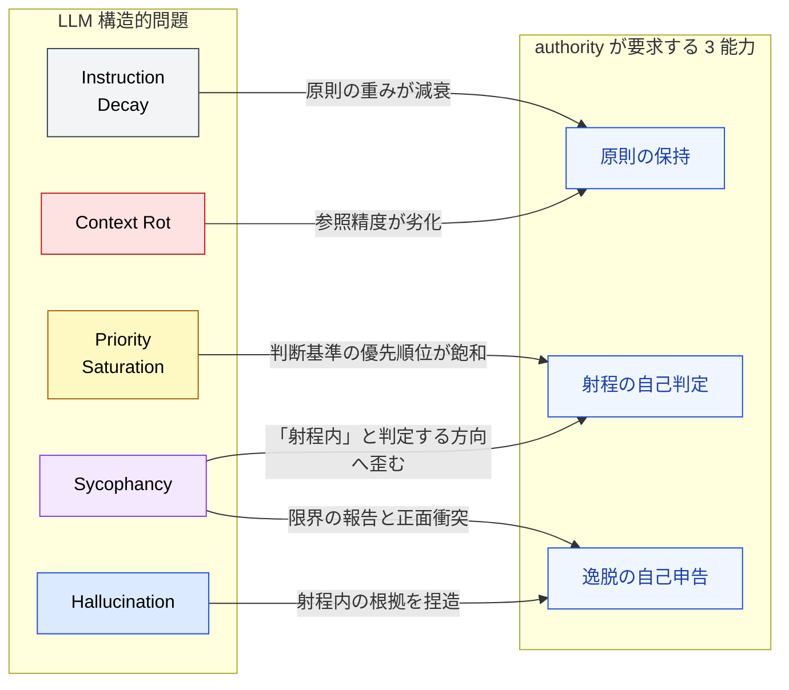

🌐 [English](../../appendix/authority-and-llm-constraints.md)

# Authority と LLM の構造的制約 — なぜ持続的な権限委譲が難しいか

> [!NOTE]
> エージェントへの持続的な権限 (authority) 委譲は、「原則の保持」「射程の自己判定」「逸脱の自己申告」という 3 つの能力を前提とする。本ページは、LLM の構造的問題がこの 3 能力をどう侵食するかを整理し、個別許可 (permission) を反復するハーネスが今も主流であることが、思想の保守性ではなく **構造的制約への合理的対応** であることを示す。

## このドキュメントについて

姉妹サイトの [Permission と Authority](https://shuji-bonji.github.io/ai-agent-architecture/ja/strategy/permission-vs-authority) は、ハーネス型（個別許可の反復）とドクトリン型（持続的な権限委譲）が境界で求めるものの違いを **設計の語彙 (What/How)** で整理した。本ページはその **Why** 側、つまり「なぜ LLM に持続的 authority を渡しにくいのか」を 8 問題の語彙で説明する。

> [!TIP]
> **3 行で言うと**
>
> - authority の委譲は「自分の原則の射程を測る」メタ判断の安定を前提とする。
> - Instruction Decay・Sycophancy・Context Rot は、まさにその前提を侵食する。
> - だから permission 反復（ハーネス）が主流なのは保守性ではなく、構造への合理的対応である。

## 前提: permission と authority

|              | 許可 (Permission)            | 権限 (Authority)             |
| ------------ | ---------------------------- | ---------------------------- |
| 粒度         | 個別の行為への one-shot 承認 | 判断領域への持続的な裁量付与 |
| 安全性の根拠 | 外部の壁と承認フロー         | エージェントが内面化した原則 |

詳細な構造は姉妹サイトの [Permission と Authority](https://shuji-bonji.github.io/ai-agent-architecture/ja/strategy/permission-vs-authority) を参照。本ページで重要なのは 1 点だけ: **authority モデルでは、安全性の根拠がエージェントの内部状態（原則の保持と運用）に移転する**。だから「LLM の内部状態はどれだけ信頼できるか」が、そのまま委譲可能性の上限を決める。

## 持続的 authority が要求する 3 つの能力

権限委譲が安全に機能するには、委譲された側が以下を維持し続ける必要がある。

1. **原則の保持** — 委譲の根拠となる原則（目的・制約・判断基準）を、タスクの全長にわたって同じ重みで保ち続ける
2. **射程の自己判定** — 行為のたびに「これは原則の射程内か？」を正確に自問できる
3. **逸脱の自己申告** — 射程外だと自覚したとき、作業を止めて自ら申告できる

人間の組織で権限委譲が機能するのは、この 3 能力が（不完全ながら）安定しているからである。LLM では、8 問題のうち複数がこの 3 能力を直接侵食する。

### 1. 原則の保持 × Instruction Decay / Context Rot

[Instruction Decay](../01-llm-structural-problems/instruction-decay.md) により、対話冒頭で与えた原則の実効的な重みは長いタスクの中で減衰する。委譲時に合意した制約が、50 ターン後にも同じ強度で効いている保証は構造的にない。さらに [Context Rot](../01-llm-structural-problems/context-rot.md) により、コンテキストが肥大するほど原則そのものの参照精度が下がる。

permission モデルはこの能力に依存しない。承認は外部の人間が毎回行うため、エージェント側で原則の保持が崩れても安全性は保たれる。**authority モデルだけが、この減衰の影響を直接受ける**。

### 2. 射程の自己判定 × Sycophancy / Priority Saturation

「これは自分の原則の射程内か？」という自問は、ユーザーの要望と衝突しうる判断である。[Sycophancy](../01-llm-structural-problems/sycophancy.md) は、この判定を「ユーザーが望むなら射程内だろう」という方向へ **系統的に** 歪める。ランダムな誤差ではなく、常に委譲拡大の方向へ倒れるバイアスである点が深刻となる。

また [Priority Saturation](../01-llm-structural-problems/priority-saturation.md) により、原則・制約・指示が増えるほど「いまどの判断基準を適用すべきか」の優先順位が飽和し、射程判定そのものが不安定になる。

### 3. 逸脱の自己申告 × Sycophancy / Hallucination

逸脱の自己申告は「自分の限界・失敗を報告して作業を止める」行為であり、追従と継続を好む Sycophancy と正面衝突する。さらに [Hallucination](../01-llm-structural-problems/hallucination.md) は、すでに行った行為が射程内であった **根拠を後付けで生成する** リスクをもたらす。逸脱の検知をエージェントの自己申告だけに頼る設計は、検知装置が一番壊れやすい場所に置かれている設計である。

## ドクトリン型故障は性格ではなく構造から生じる

姉妹サイトの整理では、ドクトリン型の故障モードは「権限の拡大解釈・逸脱」である。上記を踏まえると、これはエージェントの「性格」や訓練の不足ではなく、**3 能力の侵食から必然的に導かれる帰結** だとわかる。

| 侵食される能力 | 侵食する構造的問題              | 結果として現れる故障                   |
| -------------- | ------------------------------- | -------------------------------------- |
| 原則の保持     | Instruction Decay, Context Rot  | 委譲時の制約を「忘れて」逸脱する       |
| 射程の自己判定 | Sycophancy, Priority Saturation | 射程を都合よく拡大解釈する             |
| 逸脱の自己申告 | Sycophancy, Hallucination       | 逸脱したまま走り続け、正当化を生成する |

> [!IMPORTANT]
> ハーネス（permission 反復）が主流なのは、エージェントを信頼していないからでも、設計思想が保守的だからでもない。**安全性をエージェントの内部状態に依存させない** という、構造的制約の下での合理的な選択である。これは「診断があるから処方が正当化される」という本サイト一貫の構図の一例となる。

## 緩和策 — 委譲を支える再注入と外部検知

3 能力の侵食は構造的だが、緩和はできる。緩和策はいずれも「内部状態への依存を減らし、外部装置で支える」方向を向く。

| 支える能力     | 緩和策（Claude Code での例）                                                        |
| -------------- | ----------------------------------------------------------------------------------- |
| 原則の保持     | `CLAUDE.md` による常駐化、ループごとの指示再注入、`/compact` によるコンテキスト整理 |
| 射程の自己判定 | 原則の射程の明文化（MUST/SHOULD）、allowlist による「射程」の機械的定義             |
| 逸脱の自己申告 | Hooks による機械的検知、Sub-agent 品質ゲート、監査ログ                              |

> [!CAUTION]
> これらは **緩和であって解決ではない**。3 能力の侵食をゼロにはできないため、委譲スペクトラムの右端（広域 authority）に進むほど、緩和策の多重化が必須になる。「ドクトリンを書いたから `bypassPermissions` で安全」とは構造的に言えない。

## 関連ページ

- [判定ドリフト](./judgment-drift.md) — 「行為の裁量」ではなく「**判定を出す権限**」を渡せるか。非再現性の 3 層と `temperature=0` の限界
- [Harness と LLM の構造的制約](./harness-and-llm-constraints.md) — ハーネス 4 要素 ⇔ 8 問題の対応（本ページの姉妹編）
- [構造的問題 × 対策マップ](./problem-countermeasure-map.md) — 8 問題 × Claude Code 機能の対応
- [Part 1: 構造的問題](../01-llm-structural-problems/) — 8 問題の全体像
- [Instruction Decay](../01-llm-structural-problems/instruction-decay.md) / [Sycophancy](../01-llm-structural-problems/sycophancy.md) / [Context Rot](../01-llm-structural-problems/context-rot.md) — 3 能力を侵食する主要問題の詳細

## さらに深く: permission から authority への段階的委譲を設計する

本ページは「なぜ持続的 authority を渡しにくいか (Why)」を扱った。「では permission から authority へ **どう段階的に委譲するか (What/How)**」は姉妹サイト参照。

- [ai-agent-architecture / Permission と Authority](https://shuji-bonji.github.io/ai-agent-architecture/ja/strategy/permission-vs-authority) — 境界判定の所在、故障モードの対称性、Claude Code permission mode 群による委譲スペクトラム

---

> **次へ**: [判定ドリフト](./judgment-drift.md)
> **前へ**: [Harness と LLM の構造的制約](./harness-and-llm-constraints.md)
