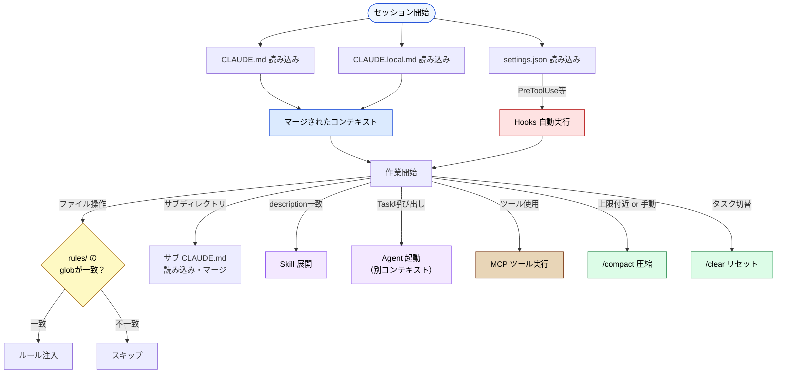

🌐 [English](../../appendix/claude-code-config-reference.md)

# Claude Code 設定ファイル一覧

> [!NOTE]
> Claude Code のプロジェクト設定を構成するファイル・ディレクトリの網羅的リファレンス。
> 「この設定は何のためにあるのか？」を本プロジェクトの各ページへのリンクで辿れるようにしたもの。

## ディレクトリ構造の全体像

### ユーザーレベル（グローバル）

```
~/.claude/
├── CLAUDE.md                    # 全プロジェクト共通の個人指示
├── settings.json                # グローバル個人設定（ツール許可等）
├── agents/                      # 全プロジェクト共通の個人 Subagent
│   └── *.md
└── rules/                       # 全プロジェクト共通の個人ルール
    └── *.md
```

### プロジェクトレベル

```
my-project/
├── CLAUDE.md                    # プロジェクトのメイン指示ファイル（自動読み込み）
├── CLAUDE.local.md              # ローカル専用指示（Git管理外）
├── .mcp.json                    # MCP サーバ定義（プロジェクトスコープ・チーム共有）
├── .claude/
│   ├── settings.json            # ツール許可・MCP設定・Hooks・env（チーム共有）
│   ├── settings.local.json      # ローカル専用設定（Git管理外）
│   ├── commands/
│   │   └── deploy.md            # カスタムスラッシュコマンド（/deploy で実行）
│   ├── agents/
│   │   └── code-reviewer.md     # Subagent 定義（独立コンテキスト）
│   ├── rules/
│   │   ├── frontend.md          # 条件付きルール（globパターンで自動注入）
│   │   ├── testing.md
│   │   └── ...
│   └── skills/
│       └── skill-name/
│           ├── SKILL.md         # Skill 定義（必須）
│           ├── scripts/         # 補助スクリプト（任意）
│           ├── references/      # 参照ドキュメント（任意）
│           └── assets/          # テンプレート等（任意）
├── src/
│   ├── CLAUDE.md                # サブディレクトリ用（該当ディレクトリ操作時に読み込み）
│   └── components/
│       └── CLAUDE.md            # さらに深い階層も可能
```

### エンタープライズレベル（管理者設定）

```
（組織管理者が配布）
├── managed-settings.json        # 組織ポリシー（MDM等で配布、最高優先度）
```

### 設定の優先順位

```
Managed（最高）   managed-settings.json（組織ポリシー）
  ↓
Command line      CLI 引数（--settings, --permission-mode 等）
  ↓
Project Local     .claude/settings.local.json（個人ローカル）
  ↓
Project           .claude/settings.json（チーム共有）
  ↓
User（最低）      ~/.claude/settings.json（グローバル個人）
```

> [!IMPORTANT]
> ローカル設定（`.claude/settings.local.json`）はチーム共有設定（`.claude/settings.json`）より優先され、コマンドライン引数はさらにその上に来る。上書きできないのは Managed 設定のみ。

以下では、各ファイル/ディレクトリを「コンテキストへの関わり方」で分類して解説する。

| カテゴリ                               | 設定ファイル / 機能                            | 読み込み                            | 解説                                                         |
| -------------------------------------- | ---------------------------------------------- | ----------------------------------- | ------------------------------------------------------------ |
| **常駐コンテキスト**（Part 3）         | `~/.claude/CLAUDE.md`                          | セッション開始時に自動              | [階層マージ](../03-always-loaded-context/hierarchy.md)       |
|                                        | `CLAUDE.md`                                    | セッション開始時に自動              | [設計原理](../03-always-loaded-context/claude-md.md)         |
|                                        | `CLAUDE.local.md`                              | セッション開始時に自動              | [運用](../03-always-loaded-context/local-md.md)              |
|                                        | `@import` 構文                                 | CLAUDE.md からの明示インポート      | 本ページ内「CLAUDE.md の `@import` 構文」                    |
|                                        | サブディレクトリの `CLAUDE.md`                 | 該当ディレクトリ操作時              | [階層マージ](../03-always-loaded-context/hierarchy.md)       |
| **条件付きコンテキスト**（Part 4）     | `.claude/rules/`                               | glob パターン一致時                 | [設計原理](../04-conditional-context/rules.md)               |
| **オンデマンドコンテキスト**（Part 5） | `.claude/skills/`                              | description 一致時に展開            | [Skills](../05-on-demand-context/skills.md)                  |
|                                        | `.claude/agents/`                              | description 一致 or `@`明示呼び出し | 本ページ内「Subagents（`.claude/agents/` のファイル定義）」  |
|                                        | Agents（`Task()`）                             | 明示的呼び出し時                    | [Agents](../05-on-demand-context/agents.md)                  |
| **ツール定義コンテキスト**（Part 6）   | `.mcp.json`（プロジェクトスコープ）            | ツール定義が常時消費                | 本ページ内「MCP（Model Context Protocol）」                  |
|                                        | `mcpServers`（settings.json内）                | ツール定義が常時消費                | [コンテキストコスト](../06-tool-context/mcp-context-cost.md) |
| **ランタイム制御**（Part 7）           | `managed-settings.json`                        | 組織ポリシー強制（最高優先）        | [settings.json](../07-runtime-layer/settings-json.md)        |
|                                        | `.claude/settings.json`                        | ランタイムが参照（LLM に見えない）  | [settings.json](../07-runtime-layer/settings-json.md)        |
|                                        | `.claude/settings.local.json`                  | 個人ローカル設定                    | [settings.json](../07-runtime-layer/settings-json.md)        |
|                                        | `~/.claude/settings.json`                      | グローバル個人設定（最低優先）      | [settings.json](../07-runtime-layer/settings-json.md)        |
|                                        | 環境変数                                       | シェル or `env` セクション          | 本ページ内「環境変数」セクション                             |
|                                        | Hooks                                          | LLM の行動前後に自動実行            | [ライフサイクル](../07-runtime-layer/hooks.md)               |
| **セッション管理**（Part 8）           | `/compact` · `/clear`                          | 手動 or コンテキスト上限付近で自動  | [使い分け](../08-session-management/compact-and-clear.md)    |
|                                        | Memory                                         | セッション横断で永続化              | [何を覚えるか](../08-session-management/what-to-remember.md) |
| **プラグイン拡張**                     | `.claude-plugin/plugin.json`                   | インストール時に有効化              | [プラグイン](plugins-and-marketplaces.md)                    |
|                                        | `marketplace.json`                             | `/plugin marketplace add` で登録    | [マーケットプレイス](plugins-and-marketplaces.md)            |
| **応答スタイル**                       | `outputStyle` / `.claude/output-styles/`       | システムプロンプトの一部            | 本ページ内「Output Styles」セクション                        |
| **CLI**                                | `claude --bare` / `-p` / `-c` / `--add-dir` 等 | 起動時オプション                    | 本ページ内「CLI フラグ」セクション                           |

---

## 常駐コンテキスト — セッション開始時に必ず読み込まれる

### ~/.claude/CLAUDE.md（ユーザーレベル）

| 項目         | 内容                                                                           |
| ------------ | ------------------------------------------------------------------------------ |
| **場所**     | `~/.claude/CLAUDE.md`                                                          |
| **読み込み** | セッション開始時に自動（最初にマージされる）                                   |
| **Git管理**  | しない（ホームディレクトリ）                                                   |
| **役割**     | 全プロジェクト共通の個人指示（例: 「日本語で回答」「関数型スタイル優先」など） |
| **詳細解説** | [階層マージの仕組み](../03-always-loaded-context/hierarchy.md)                 |

### CLAUDE.md（プロジェクトレベル）

| 項目             | 内容                                                                                                                                                   |
| ---------------- | ------------------------------------------------------------------------------------------------------------------------------------------------------ |
| **場所**         | プロジェクトルート直下                                                                                                                                 |
| **読み込み**     | セッション開始時に自動                                                                                                                                 |
| **Git管理**      | する（チーム共有）                                                                                                                                     |
| **役割**         | プロジェクト全体の指示・ルール・コンテキストの提供                                                                                                     |
| **対策する問題** | [Priority Saturation](../01-llm-structural-problems/priority-saturation.md)、[Prompt Sensitivity](../01-llm-structural-problems/prompt-sensitivity.md) |
| **制約**         | 200行以内推奨（Priority Saturation 回避）                                                                                                              |
| **詳細解説**     | [CLAUDE.md の設計原理](../03-always-loaded-context/claude-md.md)                                                                                       |

### CLAUDE.local.md

| 項目         | 内容                                                              |
| ------------ | ----------------------------------------------------------------- |
| **場所**     | プロジェクトルート直下                                            |
| **読み込み** | セッション開始時に自動（CLAUDE.md とマージ）                      |
| **Git管理**  | しない（.gitignore 推奨）                                         |
| **役割**     | 個人の環境依存設定（ローカルパス、個人APIキー等）                 |
| **詳細解説** | [CLAUDE.local.md の運用](../03-always-loaded-context/local-md.md) |

### CLAUDE.md の `@import` 構文

CLAUDE.md は `@path/to/file` 構文で他のファイルを取り込める。階層マージ（ディレクトリツリーの自動探索）とは別軸の、明示的なインポート機構。

| 項目          | 内容                                                                                                                                                               |
| ------------- | ------------------------------------------------------------------------------------------------------------------------------------------------------------------ |
| **構文**      | `@README` / `@docs/git-instructions.md` / `@~/.claude/my-preferences.md`                                                                                           |
| **読み込み**  | セッション開始時（CLAUDE.md と同じく**起動時に全て展開**される）                                                                                                   |
| **パス**      | 相対パス（参照元ファイル基準）と絶対パス（`/` または `~/` 始まり）の両方をサポート                                                                                 |
| **再帰**      | インポート先がさらに `@import` する場合、**最大4階層まで**展開                                                                                                     |
| **承認**      | 外部ファイル（プロジェクト外）の初回インポート時に承認ダイアログ。拒否すると以降そのインポートは無効化される                                                       |
| **注意**      | **コンテキスト消費は減らない**（起動時に全部読み込まれる）。組織化のための機能であり、サイズ削減には [`.claude/rules/`](../04-conditional-context/rules.md) を使う |
| **AGENTS.md** | 他のコーディングエージェント用 `AGENTS.md` がある場合、`CLAUDE.md` に `@AGENTS.md` だけ書けば両方のエージェントで同じ指示が読まれる                                |

**記述例（`CLAUDE.md`）:**

```markdown
@README - プロジェクト概要
@package.json - 利用可能な npm コマンド

# 追加指示

- git workflow: @docs/git-instructions.md
- 個人設定: @~/.claude/my-project-prefs.md
```

> [!TIP]
> worktree をまたいで個人指示を共有したい場合、`CLAUDE.local.md`（gitignore対象）に書く代わりに `@~/.claude/my-prefs.md` でホームディレクトリから読み込む方が便利。

### サブディレクトリの CLAUDE.md（階層マージ）

| 項目             | 内容                                                                                |
| ---------------- | ----------------------------------------------------------------------------------- |
| **場所**         | 任意のサブディレクトリ（例: `src/CLAUDE.md`）                                       |
| **読み込み**     | そのディレクトリ内のファイルを操作する際にオンデマンド                              |
| **Git管理**      | する                                                                                |
| **役割**         | ディレクトリ固有のルールを追加。親の CLAUDE.md とマージされる                       |
| **対策する問題** | [Context Rot](../01-llm-structural-problems/context-rot.md)（必要な時だけ読み込む） |
| **詳細解説**     | [階層マージの仕組み](../03-always-loaded-context/hierarchy.md)                      |

---

## 条件付きコンテキスト — 条件一致時のみ注入

### .claude/rules/

| 項目             | 内容                                                                                                                                                                           |
| ---------------- | ------------------------------------------------------------------------------------------------------------------------------------------------------------------------------ |
| **場所**         | `.claude/rules/*.md`                                                                                                                                                           |
| **読み込み**     | glob パターンが一致したファイル操作時                                                                                                                                          |
| **Git管理**      | する                                                                                                                                                                           |
| **役割**         | ファイル種別ごとの自動適用ルール（例: `*.test.ts` 編集時にテスト規約を注入）                                                                                                   |
| **対策する問題** | [Priority Saturation](../01-llm-structural-problems/priority-saturation.md)（常駐させず必要時のみ）、[Lost in the Middle](../01-llm-structural-problems/lost-in-the-middle.md) |
| **詳細解説**     | [.claude/rules/ の設計原理](../04-conditional-context/rules.md)、[glob パターン設計の実践](../04-conditional-context/glob-patterns.md)                                         |

**記述例：**

```markdown
---
description: TypeScript test files
globs: **/*.test.ts, **/*.spec.ts
---

- describe/it のネストは2階層まで
- モックは最小限に、実際のサービスを使う統合テストを優先
```

---

## オンデマンドコンテキスト — 呼び出された時だけ展開

### .claude/skills/

| 項目             | 内容                                                                                                |
| ---------------- | --------------------------------------------------------------------------------------------------- |
| **場所**         | `.claude/skills/<skill-name>/SKILL.md`                                                              |
| **読み込み**     | description が一致した時に展開                                                                      |
| **Git管理**      | する                                                                                                |
| **役割**         | 再利用可能なプロンプトテンプレート。コード生成パターン、ドキュメント生成手順など                    |
| **対策する問題** | [Context Rot](../01-llm-structural-problems/context-rot.md)（使わない時はコンテキストを消費しない） |
| **詳細解説**     | [Skills の設計原理](../05-on-demand-context/skills.md)                                              |

**ディレクトリ構成例：**

```
.claude/skills/
└── component-gen/
    ├── SKILL.md          # プロンプト指示（必須）
    ├── scripts/          # 補助スクリプト
    ├── references/       # 参照ドキュメント
    └── assets/           # テンプレート等
```

### Subagents（`.claude/agents/` のファイル定義）

Subagent は Markdown ファイル + YAML frontmatter で定義する独立コンテキスト実行単位。Skills と並列の正式機能で、`Task()` による動的呼び出しとは別系統。

| 項目             | 内容                                                                                                                                                                                                                                          |
| ---------------- | --------------------------------------------------------------------------------------------------------------------------------------------------------------------------------------------------------------------------------------------- |
| **場所**         | プロジェクト: `.claude/agents/*.md`（再帰スキャン可、サブフォルダで分類可）<br>ユーザー: `~/.claude/agents/*.md`（全プロジェクトで利用）                                                                                                      |
| **識別子**       | frontmatter の `name` フィールドのみ（**ファイルパスは関係なし**）                                                                                                                                                                            |
| **Git管理**      | プロジェクト版は**する**（チーム共有）／ユーザー版は**しない**                                                                                                                                                                                |
| **frontmatter**  | `name`, `description`, `tools`, `disallowedTools`, `model`, `permissionMode`, `mcpServers`, `hooks`, `maxTurns`, `skills`, `effort`, `background`, `isolation`, `color`, `memory` 等                                                          |
| **本文**         | システムプロンプト（Claude Code の標準システムプロンプトは含まれない）                                                                                                                                                                        |
| **呼び出し**     | description マッチで自動委譲 / `@subagent-name` で明示呼び出し / `Task()` でプログラム的に                                                                                                                                                    |
| **対策する問題** | [Sycophancy](../01-llm-structural-problems/sycophancy.md)（独立判断）、[Knowledge Boundary](../01-llm-structural-problems/knowledge-boundary.md)、[Context Rot](../01-llm-structural-problems/context-rot.md)（メインコンテキストを汚さない） |
| **詳細解説**     | [Agents の設計原理](../05-on-demand-context/agents.md)、[Skills vs Subagents の判断基準](../05-on-demand-context/skill-vs-agent.md)                                                                                                           |

**記述例（`.claude/agents/code-reviewer.md`）:**

```markdown
---
name: code-reviewer
description: コード品質・セキュリティ・ベストプラクティスをレビュー
tools: Read, Glob, Grep
model: sonnet
---

あなたはコードレビュアーです。呼び出されたら、対象コードを分析し、
品質・セキュリティ・ベストプラクティスに関する具体的で実行可能な
フィードバックを提供してください。
```

> [!IMPORTANT]
> **Skills と Subagents の使い分け**: Skills は**呼び出し側のコンテキストに展開される**プロンプトテンプレート。Subagent は**独立コンテキストで実行される別プロセス**。検索結果やログで親コンテキストを汚したくない探索系タスクは Subagent、再利用したい指示・テンプレートは Skill が原則。

### Agents（`Task()` による動的呼び出し）

| 項目             | 内容                                                                                                                                             |
| ---------------- | ------------------------------------------------------------------------------------------------------------------------------------------------ |
| **定義方法**     | Skills 内または会話中で `Task()` を使用（ファイル定義不要）                                                                                      |
| **コンテキスト** | 親とは**独立した**コンテキストウィンドウで実行                                                                                                   |
| **役割**         | アドホックな並列処理、Cross-model QA、一回限りの専門委譲                                                                                         |
| **対策する問題** | [Sycophancy](../01-llm-structural-problems/sycophancy.md)（独立判断）、[Knowledge Boundary](../01-llm-structural-problems/knowledge-boundary.md) |
| **詳細解説**     | [Agents の設計原理](../05-on-demand-context/agents.md)、[import vs 別プロセスの判断基準](../05-on-demand-context/skill-vs-agent.md)              |

---

## ツール定義コンテキスト — ツールがコンテキストを消費する

### MCP（Model Context Protocol）

MCP サーバは**3つのスコープ**で設定可能。スコープによって配置ファイルが異なる。

| スコープ    | ファイル                                  | Git管理            | 用途                                                    |
| :---------- | :---------------------------------------- | :----------------- | :------------------------------------------------------ |
| **Project** | `.mcp.json`（プロジェクトルート）         | する（チーム共有） | チーム全員に同じ MCP を配布。初回起動時に承認ダイアログ |
| **Local**   | `.claude/settings.json` の `mcpServers`   | 任意               | プロジェクト個人設定。チーム共有しない MCP              |
| **User**    | `~/.claude/settings.json` の `mcpServers` | しない             | 全プロジェクト共通の個人 MCP                            |

| 項目                   | 内容                                                                                                                                                                           |
| ---------------------- | ------------------------------------------------------------------------------------------------------------------------------------------------------------------------------ |
| **接続タイプ**         | `stdio`（コマンド実行）/ `http`（Streamable HTTP + OAuth）/ `sse`（Server-Sent Events、**非推奨** — `http` へ移行）                                                              |
| **コンテキストコスト** | ツール定義そのものがトークンを消費する（20K超で性能劣化）                                                                                                                      |
| **役割**               | 外部ツール・API との連携（DB参照、ファイル操作、外部サービス呼び出し等）                                                                                                       |
| **承認**               | `.mcp.json` のサーバは初回起動時に承認待ち（`claude mcp list` で `⏸ Pending approval` 表示）                                                                                   |
| **対策する問題**       | [Knowledge Boundary](../01-llm-structural-problems/knowledge-boundary.md)（外部知識へのアクセス）、[Hallucination](../01-llm-structural-problems/hallucination.md)（事実確認） |
| **詳細解説**           | [MCP のコンテキストコスト](../06-tool-context/mcp-context-cost.md)、[Tool Search / Deferred Loading](../06-tool-context/tool-search.md)                                        |

**`.mcp.json` 記述例（プロジェクトルート）:**

```json
{
  "mcpServers": {
    "my-db": {
      "type": "stdio",
      "command": "node",
      "args": ["./mcp-servers/db-server.js"]
    },
    "internal-api": {
      "type": "http",
      "url": "https://mcp.example.com/mcp",
      "oauth": {
        "authServerMetadataUrl": "https://auth.example.com/.well-known/openid-configuration"
      }
    }
  }
}
```

> [!TIP]
> `.mcp.json` と `.claude/settings.json` の `mcpServers` は**マージされる**（同名は project スコープが優先）。チーム共有したいものは `.mcp.json`、個人用は `.claude/settings.local.json` に書くのが運用上の鉄則。

---

## ランタイム制御 — LLM のコンテキストに入らないレイヤー

### .claude/settings.json

| 項目         | 内容                                                                                                                               |
| ------------ | ---------------------------------------------------------------------------------------------------------------------------------- |
| **場所**     | `.claude/settings.json`                                                                                                            |
| **読み込み** | ランタイムが参照（LLMには見えない）                                                                                                |
| **Git管理**  | する                                                                                                                               |
| **役割**     | ツール許可設定、MCP サーバー定義、Hooks 定義、環境変数                                                                             |
| **詳細解説** | [settings.json の役割](../07-runtime-layer/settings-json.md)、[なぜ LLM に見せないのか](../07-runtime-layer/why-not-in-context.md) |

**設定例：**

```json
{
  "permissions": {
    "allow": ["Bash(npm run test)", "Read"],
    "deny": ["Bash(rm -rf)"]
  },
  "hooks": { ... },
  "mcpServers": { ... }
}
```

#### `permissions` の詳細書式

permissions ルールは `Tool` または `Tool(specifier)` の形式で記述する。評価順は **deny → ask → allow** で、最初にマッチしたルールが勝つ。

| プロパティ              | 役割                                                                                           |
| :---------------------- | :--------------------------------------------------------------------------------------------- |
| `allow`                 | 確認なしで実行を許可するルールの配列                                                           |
| `ask`                   | 実行前に確認ダイアログを出すルールの配列                                                       |
| `deny`                  | 実行を拒否するルールの配列。**機密ファイルの読み取りを防ぐ用途にも使う**                       |
| `additionalDirectories` | Claude にアクセスを許可する追加ディレクトリ（例: `["../docs/"]`）                              |
| `defaultMode`           | 起動時のデフォルト permission モード（例: `"acceptEdits"` / `"plan"` / `"bypassPermissions"`） |

**書式例：**

```json
{
  "permissions": {
    "allow": [
      "Bash(npm run test)",
      "Bash(git log *)",
      "Bash(git diff *)",
      "Read",
      "Edit(src/**)",
      "WebFetch(domain:docs.claude.com)",
      "mcp__github__get_issue"
    ],
    "ask": ["Bash(git push *)", "Edit(production/**)"],
    "deny": ["Bash(rm -rf *)", "Read(.env*)", "Read(**/*.key)"],
    "additionalDirectories": ["../shared-libs/"],
    "defaultMode": "acceptEdits"
  }
}
```

> [!IMPORTANT]
> `deny` は **Claude にコンテキストとしても見せない**ためのフィルタとして機能する。`Read(.env*)` を deny すれば Claude は環境変数ファイルを読めない＝ハルシネーション原因にもならない。

#### `statusLine` — ステータスバーのカスタマイズ

ターミナル下部のステータス行を任意のコマンド出力に置き換える。

| 項目         | 内容                                                     |
| :----------- | :------------------------------------------------------- |
| **設定場所** | `~/.claude/settings.json` または `.claude/settings.json` |
| **type**     | `"command"`（外部コマンドの stdout を表示）              |
| **command**  | 実行するスクリプトのパス                                 |
| **padding**  | （任意）左右に追加する空白文字数                         |

**設定例：**

```json
{
  "statusLine": {
    "type": "command",
    "command": "~/.claude/statusline.sh",
    "padding": 2
  }
}
```

**`~/.claude/statusline.sh` の例：**

```bash
#!/usr/bin/env bash
branch=$(git -C "$CLAUDE_PROJECT_DIR" branch --show-current 2>/dev/null)
model="${ANTHROPIC_MODEL:-default}"
echo "🌱 $branch | 🧠 $model"
```

#### `apiKeyHelper` — カスタム認証スクリプト

API キーをスクリプトで動的に取得する仕組み。社内 Vault や AWS Secrets Manager から取得する場合に使う。

| 項目             | 内容                                                                                      |
| :--------------- | :---------------------------------------------------------------------------------------- |
| **動作**         | shell スクリプトを実行し、stdout に出力された値を API キーとして使用                      |
| **更新頻度**     | デフォルトは**5分後または HTTP 401 応答時**に再実行                                       |
| **TTL 設定**     | `CLAUDE_CODE_API_KEY_HELPER_TTL_MS` 環境変数で更新間隔をミリ秒で指定可能                  |
| **タイムアウト** | 10秒を超えると警告が表示される                                                            |
| **優先度**       | `ANTHROPIC_AUTH_TOKEN` / `ANTHROPIC_API_KEY` より**低い**（環境変数があればそちらが優先） |
| **リロード**     | 設定変更は**再起動不要**で反映                                                            |

**設定例：**

```json
{
  "apiKeyHelper": "/usr/local/bin/get-anthropic-key.sh"
}
```

### .claude/settings.local.json

| 項目        | 内容                                           |
| ----------- | ---------------------------------------------- |
| **場所**    | `.claude/settings.local.json`                  |
| **Git管理** | しない（.gitignore 推奨）                      |
| **役割**    | 個人のツール許可設定・ローカルMCPサーバー設定  |
| **関係**    | `settings.json` とマージされる（local が優先） |

### ~/.claude/settings.json（ユーザーレベル）

| 項目         | 内容                                   |
| ------------ | -------------------------------------- |
| **場所**     | `~/.claude/settings.json`              |
| **Git管理**  | しない（ホームディレクトリ）           |
| **役割**     | 全プロジェクト共通のグローバル個人設定 |
| **優先順位** | 最低（プロジェクト設定に上書きされる） |

### managed-settings.json（エンタープライズレベル）

| 項目         | 内容                                                         |
| ------------ | ------------------------------------------------------------ |
| **配布方法** | MDM（モバイルデバイス管理）やサーバー管理で配布              |
| **役割**     | 組織全体のセキュリティポリシー・許可設定の強制               |
| **優先順位** | 最高（全設定を上書き。ユーザーは変更不可）                   |
| **詳細解説** | [settings.json の役割](../07-runtime-layer/settings-json.md) |

### Hooks

| 項目               | 内容                                                                                                                                                                                                                                    |
| ------------------ | --------------------------------------------------------------------------------------------------------------------------------------------------------------------------------------------------------------------------------------- |
| **設定場所**       | `.claude/settings.json` 内の `hooks`                                                                                                                                                                                                    |
| **実行タイミング** | LLM の行動前後に自動実行（LLM は認識しない）                                                                                                                                                                                            |
| **役割**           | 機械的な検証・自動フォーマット・通知など                                                                                                                                                                                                |
| **対策する問題**   | [Hallucination](../01-llm-structural-problems/hallucination.md)（自動テスト実行）、[Sycophancy](../01-llm-structural-problems/sycophancy.md)（機械的チェック）、[Instruction Decay](../01-llm-structural-problems/instruction-decay.md) |
| **詳細解説**       | [Hooks のライフサイクル](../07-runtime-layer/hooks.md)                                                                                                                                                                                  |

**イベント一覧（カデンス別）：**

| カデンス               | イベント             | タイミング                                         |
| :--------------------- | :------------------- | :------------------------------------------------- |
| **セッション単位**     | `SessionStart`       | セッション開始時 / 再開時                          |
|                        | `SessionEnd`         | セッション終了時                                   |
|                        | `Setup`              | CI/スクリプト向けの一回限り準備（`--init-only`、または `-p` モードの `--init`/`--maintenance`） |
|                        | `InstructionsLoaded` | CLAUDE.md / rules がロードされた時（デバッグ向き） |
| **ターン単位**         | `UserPromptSubmit`   | ユーザーがプロンプト送信した時（Claude処理前）     |
|                        | `Stop`               | アシスタント応答が完了した時                       |
| **ツール呼び出し単位** | `PreToolUse`         | ツール実行前（ブロック判断もここで可能）           |
|                        | `PostToolUse`        | ツール実行後                                       |
| **Subagent 関連**      | `SubagentStart`      | Subagent が起動した時                              |
|                        | `SubagentStop`       | Subagent が完了した時                              |
| **コンテキスト管理**   | `PreCompact`         | `/compact` 実行直前                                |
|                        | `PostCompact`        | 圧縮完了直後                                       |
| **その他**             | `Notification`       | 通知発生時                                         |
|                        | `PermissionRequest`  | permission 確認が必要になった時                    |

> [!TIP]
> `InstructionsLoaded` Hook は「どの CLAUDE.md が・いつ・なぜロードされたか」をログに残せるので、階層マージや path-specific rules のデバッグに最適。

---

## セッション管理 — 会話の寿命と記憶

### /compact・/clear コマンド

| コマンド   | 動作                       | 用途                                          |
| ---------- | -------------------------- | --------------------------------------------- |
| `/compact` | コンテキストを要約して圧縮 | Context Rot の予防的対処。コンテキストウィンドウが上限に近づくと自動実行（`CLAUDE_AUTOCOMPACT_PCT_OVERRIDE` で前倒し可能） |
| `/clear`   | コンテキストを完全リセット | タスク切り替え時。蓄積したノイズを一掃        |

| 項目             | 内容                                                                                                                                                                                                            |
| ---------------- | --------------------------------------------------------------------------------------------------------------------------------------------------------------------------------------------------------------- |
| **対策する問題** | [Context Rot](../01-llm-structural-problems/context-rot.md)、[Lost in the Middle](../01-llm-structural-problems/lost-in-the-middle.md)、[Instruction Decay](../01-llm-structural-problems/instruction-decay.md) |
| **詳細解説**     | [/compact と /clear の使い分け](../08-session-management/compact-and-clear.md)                                                                                                                                  |

### Memory（記憶の永続化）

Claude Code には**2系統のメモリ機構**がある: ユーザーが書く CLAUDE.md と、Claude が自動で蓄積する Auto Memory。

| 観点             | CLAUDE.md                                                                   | Auto Memory                                                                                                                                                      |
| :--------------- | :-------------------------------------------------------------------------- | :--------------------------------------------------------------------------------------------------------------------------------------------------------------- |
| **書き手**       | ユーザー                                                                    | Claude（学習しながら自動で書く）                                                                                                                                 |
| **内容**         | 指示・ルール                                                                | 学んだパターン・気づき                                                                                                                                           |
| **スコープ**     | プロジェクト / ユーザー / 組織                                              | リポジトリごと（worktree 横断で共有）                                                                                                                            |
| **ロード**       | 毎セッション全文                                                            | 毎セッションで `MEMORY.md` の先頭 200 行 or 25KB                                                                                                                 |
| **対策する問題** | [Priority Saturation](../01-llm-structural-problems/priority-saturation.md) | [Context Rot](../01-llm-structural-problems/context-rot.md)（圧縮で失われる情報を救済）、[Instruction Decay](../01-llm-structural-problems/instruction-decay.md) |

**Auto Memory の場所:**

```
~/.claude/projects/<project>/memory/
├── MEMORY.md          # 全セッションでロードされるインデックス
├── debugging.md       # トピック別の詳細メモ（オンデマンド読み込み）
├── api-conventions.md
└── ...
```

`<project>` は git リポジトリから派生したパス。**worktree とサブディレクトリは1つの Auto Memory を共有**する。Auto Memory はマシンローカルで、クラウド同期されない。

**関連設定（`settings.json`）:**

| 設定キー                          | 役割                                                  |
| :-------------------------------- | :---------------------------------------------------- |
| `autoMemoryEnabled`               | Auto Memory の有効/無効（デフォルト: 有効）           |
| `autoMemoryDirectory`             | Auto Memory 保存先の上書き（絶対パス or `~/` 始まり） |
| `claudeMdExcludes`                | ロード対象から除外する CLAUDE.md のパスパターン配列   |
| `CLAUDE_CODE_DISABLE_AUTO_MEMORY` | `1` で Auto Memory を環境変数経由で無効化             |

**操作コマンド:**

| コマンド  | 動作                                                                            |
| :-------- | :------------------------------------------------------------------------------ |
| `/memory` | ロード中の CLAUDE.md / rules / Auto Memory 一覧表示、エディタで開く、トグル切替 |

> [!IMPORTANT]
> **Auto Memory が要求する Claude Code バージョン**: v2.1.59 以降。`claude --version` で確認。

> [!WARNING]
> CLAUDE.md は **`/compact` を生き残る**（再ロードされる）が、サブディレクトリの CLAUDE.md は再注入されない。コンパクト後も必ず効いていてほしい指示はルート CLAUDE.md に書くこと。

**詳細解説:**

- [なぜメモリが問題になるのか](../08-session-management/memory-problem.md)
- [何を覚えるか](../08-session-management/what-to-remember.md)
- [いつ・どう思い出すか](../08-session-management/when-to-recall.md)
- [ツール比較と選定基準](../08-session-management/tools-comparison.md)

---

## カスタムコマンド

### .claude/commands/

| 項目         | 内容                                                   |
| ------------ | ------------------------------------------------------ |
| **場所**     | `.claude/commands/*.md`                                |
| **呼び出し** | `/` + ファイル名で実行（例: `/deploy`）                |
| **役割**     | 定型プロンプトの再利用。デプロイ手順、レビュー手順など |

**記述例（`.claude/commands/deploy.md`）：**

```markdown
本番デプロイ前のチェックリストを実行してください。

1. `npm run test` が全てパスすること
2. `npm run build` がエラーなく完了すること
3. 変更内容のサマリーを出力すること
```

### 主要なビルトインスラッシュコマンド

ユーザー定義の `.claude/commands/` とは別に、Claude Code 本体が提供するコマンド群。

| コマンド   | 役割                                                                                                        |
| :--------- | :---------------------------------------------------------------------------------------------------------- |
| `/config`  | 対話的に設定を編集（permissions、outputStyle、autoMemory など）。変更は `settings.local.json` に保存される  |
| `/memory`  | ロード中の CLAUDE.md / rules / Auto Memory 一覧表示、ファイルを開く、Auto Memory トグル                     |
| `/agents`  | Subagent 一覧表示、新規 Subagent の作成（対話的）                                                           |
| `/skills`  | Skill 一覧表示、新規 Skill の作成                                                                           |
| `/plugin`  | プラグインのインストール・管理。`/plugin marketplace add <url>` でマーケットプレイス追加                    |
| `/mcp`     | MCP サーバ一覧、認証状態、接続テスト                                                                        |
| `/init`    | CLAUDE.md を自動生成（コードベースを解析してプロジェクト規約を抽出）。`CLAUDE_CODE_NEW_INIT=1` で対話モード |
| `/compact` | コンテキストを要約圧縮（手動 / コンテキスト上限付近で自動）                                                 |
| `/clear`   | コンテキストを完全リセット                                                                                  |
| `/help`    | ヘルプ表示                                                                                                  |

---

## Output Styles — 応答スタイルのカスタマイズ

Claude の**応答スタイル（システムプロンプトの一部）を切り替える機構**。「何を知っているか」ではなく「どう答えるか」を変える。

| 項目           | 内容                                                                                                                          |
| :------------- | :---------------------------------------------------------------------------------------------------------------------------- |
| **設定場所**   | `settings.json` の `outputStyle` キー / `/config` メニュー / `.claude/output-styles/*.md`                                     |
| **ビルトイン** | `Default`（標準）/ `Proactive`（仮定を置いて自律的に実行、計画より行動を優先）/ `Explanatory`（教育的「Insights」を追加）/ `Learning`（コードに `TODO(human)` マーカーを残して協働モード） |
| **カスタム**   | `.claude/output-styles/<name>.md` に frontmatter + システムプロンプト追記                                                     |
| **反映**       | システムプロンプトの一部なので、**変更後は `/clear` または新規セッション**で初めて効く                                        |

**カスタム Output Style 例（`.claude/output-styles/socratic.md`）:**

```markdown
---
name: socratic
description: 答えを直接示さず、質問で導く対話モード
keep-coding-instructions: true
---

あなたはソクラテス式の対話を行うコーチです。実装を直接示す前に、
ユーザーが自力で気づけるように、本質を突く質問を投げかけてください。
keep-coding-instructions が true のため、コーディング作業時は通常のスタイルを維持します。
```

| frontmatter キー           | 役割                                                                              |
| :------------------------- | :-------------------------------------------------------------------------------- |
| `name`                     | スタイル名（省略時はファイル名）                                                  |
| `description`              | 説明                                                                              |
| `keep-coding-instructions` | `true` でコーディング系の標準指示を保持。`false` / 省略でスタイルが完全に置き換え |

> [!TIP]
> Output Styles は「応答のトーン・形式」を変えるが、Skills のように「再利用可能なテンプレート」ではない。タスク固有のテンプレートは Skill、セッション全体のトーンは Output Style と使い分ける。

---

## CLI フラグ

`claude` コマンドの起動時オプション。`settings.json` を上書きする一時的な指定や、ヘッドレス実行・自動化で使う。

### セッション起動・管理

| フラグ            | 役割                                                                                                    |
| :---------------- | :------------------------------------------------------------------------------------------------------ |
| `-p "query"`      | プロンプトを1回だけ実行して終了（パイプ・スクリプト向き）                                               |
| `-c`              | 直前のセッションを継続                                                                                  |
| `-r <session-id>` | セッション ID 名で復元                                                                                  |
| `--bg "query"`    | バックグラウンドエージェントとして起動。すぐに session ID を返す                                        |
| `--bare`          | hooks / skills / plugins / MCP / Auto Memory / CLAUDE.md の自動ディスカバリを**全て無効化**して高速起動 |

### 設定上書き

| フラグ                            | 役割                                                                         |
| :-------------------------------- | :--------------------------------------------------------------------------- |
| `--add-dir <path>`                | 追加の作業ディレクトリ。`.claude/` 設定はそこからは**読まない**              |
| `--settings <file>`               | 任意の settings.json を読み込ませる                                          |
| `--setting-sources <list>`        | どのスコープの settings を読むか指定（`project`, `user`, `local`, `policy`） |
| `--mcp-config <file>`             | MCP 設定を任意ファイルから                                                   |
| `--plugin-dir <path>`             | プラグインディレクトリの追加指定                                             |
| `--allowedTools <list>`           | 確認なし許可ツールのリスト                                                   |
| `--append-system-prompt "..."`    | システムプロンプト末尾に追加テキスト                                         |
| `--append-system-prompt-file <f>` | ファイルから読み込んで追加                                                   |

### permission モード

| フラグ                                 | 役割                                                                                 |
| :------------------------------------- | :----------------------------------------------------------------------------------- |
| `--permission-mode <mode>`             | 起動時 permission モード（`default` / `acceptEdits` / `plan` / `bypassPermissions`） |
| `--dangerously-skip-permissions`       | 全 permission 確認をスキップ（`bypassPermissions` モードで起動）。コンテナ/VM 等の隔離環境でのみ使用 |

### Agent / Subagent

| フラグ            | 役割                              |
| :---------------- | :-------------------------------- |
| `--agent <name>`  | このセッションで使う agent を指定 |
| `--agents <json>` | JSON で動的に Subagent を定義     |

### 認証・更新

| フラグ                 | 役割                                                                |
| :--------------------- | :------------------------------------------------------------------ |
| `claude auth login`    | サインイン。`--console` で API キー課金モード、`--sso` で SSO 強制  |
| `claude auth status`   | 認証状態を JSON で表示                                              |
| `claude update`        | 最新版に更新                                                        |
| `claude install <ver>` | 特定バージョンをインストール（`stable` / `latest` / 例: `2.1.118`） |

> [!WARNING]
> `claude --help` には**全フラグが載っていない**。`--bare` `--dangerously-skip-permissions` 等の重要フラグは公式ドキュメントの [CLI reference](https://docs.claude.com/en/docs/claude-code/cli-reference) で確認すること。

---

## プラグイン拡張

### `.claude-plugin/` — プラグインのパッケージ単位

Claude Code のプラグインは、**commands / agents / skills / hooks / MCP** を一つのリポジトリにまとめて配布できる仕組み。マーケットプレイス経由でインストールする。

| 項目                               | 内容                                                                               |
| ---------------------------------- | ---------------------------------------------------------------------------------- |
| **マニフェスト**                   | `.claude-plugin/plugin.json`（必須）                                               |
| **内包可能**                       | `commands/` / `agents/` / `skills/` / `hooks/hooks.json` / `.mcp.json`             |
| **インストール**                   | `/plugin marketplace add <source>` → `/plugin install <plugin-name>`               |
| **マーケットプレイス source 種別** | `github`（リポジトリ）/ `git`（任意 git URL）/ `directory`（ローカルパス、開発用） |
| **詳細解説**                       | [プラグインとマーケットプレイス](plugins-and-marketplaces.md)                      |

**プラグインのディレクトリ構造（例）:**

```
my-plugin/
├── .claude-plugin/
│   └── plugin.json          # プラグインマニフェスト（必須）
├── commands/
│   └── custom-cmd.md        # カスタムスラッシュコマンド
├── agents/
│   └── specialist.md        # Subagent 定義
├── skills/
│   └── my-skill/
│       └── SKILL.md         # Agent Skill
├── hooks/
│   └── hooks.json           # Hook 定義
└── .mcp.json                # MCP サーバ定義
```

### マーケットプレイス（`marketplace.json`）

| 項目         | 内容                                                          |
| ------------ | ------------------------------------------------------------- |
| **役割**     | 複数プラグインを束ねて配布するインデックス                    |
| **ホスト**   | GitHub / GitLab / 任意の git ホスト                           |
| **追加方法** | ユーザーが `/plugin marketplace add <url>` で登録             |
| **詳細解説** | [プラグインとマーケットプレイス](plugins-and-marketplaces.md) |

---

## 環境変数

Claude Code の挙動は環境変数でも制御できる。`settings.json` の `env` キーに書けば**セッション横断・チーム配布**が可能。

### 主要な環境変数

| 変数                                           | 役割                                                              |
| :--------------------------------------------- | :---------------------------------------------------------------- |
| `ANTHROPIC_API_KEY`                            | Claude API 認証キー                                               |
| `ANTHROPIC_AUTH_TOKEN`                         | Bearer トークン認証                                               |
| `ANTHROPIC_MODEL`                              | 使用するモデルを指定                                              |
| `ANTHROPIC_DEFAULT_HAIKU_MODEL`                | `haiku`・バックグラウンド処理用の小型モデル指定（非推奨の `ANTHROPIC_SMALL_FAST_MODEL` の後継） |
| `CLAUDE_AUTOCOMPACT_PCT_OVERRIDE`              | オートコンパクトを前倒し（例: `70` = 70% で発動）                 |
| `CLAUDE_CODE_USE_BEDROCK`                      | `1` で Amazon Bedrock 経由に切り替え                              |
| `CLAUDE_CODE_USE_VERTEX`                       | `1` で Google Vertex AI 経由に切り替え                            |
| `CLAUDE_CODE_USE_FOUNDRY`                      | `1` で Microsoft Azure 経由に切り替え                             |
| `CLAUDE_CODE_DISABLE_AUTO_MEMORY`              | `1` で Auto Memory を無効化                                       |
| `CLAUDE_CODE_ADDITIONAL_DIRECTORIES_CLAUDE_MD` | `--add-dir` で追加した外部ディレクトリの CLAUDE.md も読み込ませる |
| `CLAUDE_PROJECT_DIR`                           | プロジェクトルートのパス（Hooks スクリプト等から参照可）          |
| `MAX_THINKING_TOKENS`                          | Extended Thinking の最大トークン数                                |
| `HTTP_PROXY` / `HTTPS_PROXY`                   | プロキシ経由の通信設定                                            |

### `settings.json` 経由での配布

```json
{
  "env": {
    "ANTHROPIC_MODEL": "claude-sonnet-4-6",
    "MAX_THINKING_TOKENS": "8000",
    "DISABLE_TELEMETRY": "1"
  }
}
```

> [!TIP]
> シェル環境変数として export するか、`settings.json` の `env` に書くかで**スコープが変わる**:
>
> - シェル export → そのシェルから起動した Claude Code のみ
> - `~/.claude/settings.json` の `env` → 全プロジェクト
> - `.claude/settings.json` の `env` → そのプロジェクト（Git でチーム共有可）
> - `managed-settings.json` の `env` → 組織全体（強制）

> [!WARNING]
> `ANTHROPIC_API_KEY` のような**秘匿情報を `.claude/settings.json`（Git管理対象）に直接書かない**。`settings.local.json` か、シェル環境変数で渡すこと。

---

## 設定の読み込みタイミング一覧



---

> **次へ**: [FAQ — よくある質問と設計判断](faq.md)
>
> **前へ**: [構造的問題 × Claude Code 対策マップ](problem-countermeasure-map.md)

> **Discussion**: 追加や修正の提案は [Discussions](https://github.com/shuji-bonji/understanding-llm-through-claude-code/discussions) へ
