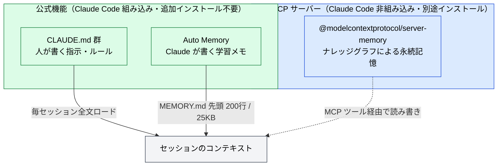

🌐 [English](../../appendix/claude-code-memory.md)

# Claude Code のメモリ機構 — CLAUDE.md / rules / Auto Memory / server-memory

> [!NOTE]
> Claude Code の**セッションを越えて情報を持ち越す仕組み**を1ページに集約したリファレンス。
> 各セッションは毎回まっさらなコンテキストで始まる。それを埋めるのが CLAUDE.md（人が書く指示）と Auto Memory（Claude が書く学習メモ）の2系統であり、加えて MCP のサードパーティ実装 `server-memory` がある。この3つを混同しないことが出発点になる。

## 全体像 — 3つの記憶



| 分類                 | 名称                                  | 提供元・出自                                | 役割                                                     |
| :------------------- | :------------------------------------ | :------------------------------------------ | :------------------------------------------------------- |
| Claude Code 組み込み | CLAUDE.md 群 / Auto Memory            | Anthropic（同梱・追加インストール不要）     | 開発作業に特化。規約・ビルドコマンド・学習パターンの記憶 |
| 外部 MCP サーバー    | `@modelcontextprotocol/server-memory` | MCP 公式リポジトリのリファレンス実装（MIT） | 汎用ナレッジグラフ。対話のパーソナライズ・関係性の構造化 |

> [!IMPORTANT]
> CLAUDE.md も Auto Memory も**「強制設定」ではなく「コンテキスト」** ``として毎セッション先頭に注入される。Claude はそれを読んで従おうとするが、厳密な遵守は保証されない。**必ず実行させたい**（例: コミット前に必ず lint）指示は、メモリではなく [PreToolUse フックや hooks](../07-runtime-layer/hooks.md) で技術的に強制する。

## 1. CLAUDE.md — 人が書く指示

### 配置場所とロード順

CLAUDE.md は複数の場所に置ける。読み込む順番は**スコープの広いものが先、狭いものが後**（Managed policy → User → Project → Local）。見つかったファイルは互いに打ち消し合わず**すべて読み込まれる**が、指示が食い違ったときは**後から読まれた設定のほうが優先されやすい**。

| 読み込み順 | スコープ                 | 配置場所                                                                                                                                                      | 用途                            | 共有範囲               |
| :--------: | :----------------------- | :------------------------------------------------------------------------------------------------------------------------------------------------------------ | :------------------------------ | :--------------------- |
|   **①**    | **Managed policy**       | macOS: `/Library/Application Support/ClaudeCode/CLAUDE.md`<br />Linux/WSL: `/etc/claude-code/CLAUDE.md`<br />Windows: `C:\Program Files\ClaudeCode\CLAUDE.md` | 組織全体のポリシー（IT/DevOps） | 組織の全ユーザー       |
|   **②**    | **User instructions**    | `~/.claude/CLAUDE.md`                                                                                                                                         | 全プロジェクト共通の個人設定    | 自分だけ（全 project） |
|   **③**    | **Project instructions** | `./CLAUDE.md` or `./.claude/CLAUDE.md`                                                                                                                        | チーム共有のプロジェクト規約    | チーム（Git 管理）     |
|   **④**    | **Local instructions**   | `./CLAUDE.local.md`                                                                                                                                           | 個人的なプロジェクト固有設定    | 自分だけ（現 project） |

作業ディレクトリと、**そこから上の階層**（親フォルダ、その親…）にある `CLAUDE.md` / `CLAUDE.local.md` は、起動時にまとめて読み込まれる。複数見つかっても**どれか1つが他を上書きするのではなく、全部つなげて（連結して）**コンテキストに入る。つなぐ順番は**上の階層（例: リポジトリのルート）が先、下の階層（作業ディレクトリ）が後**。一方、**作業ディレクトリより下のサブフォルダ**にある CLAUDE.md は起動時には読まれず、Claude がそのフォルダのファイルを触ったときに初めて読み込まれる。

たとえば `repo/app/` で起動した場合、`repo/CLAUDE.md`（先）→ `repo/app/CLAUDE.md`（後）の順に両方が読まれ、両者で指示が食い違えば後に読まれた `app/` 側が効きやすい。`repo/app/api/CLAUDE.md` は、Claude が `api/` のファイルを開いたときに追加で読み込まれる。

> [!TIP]
> `/init` でプロジェクトの雛形 CLAUDE.md を自動生成できる。既存の CLAUDE.md がある場合は上書きせず改善提案に切り替わる。実際にどのファイルがロードされたかは `/context` の **Memory files** で確認する。

### 効果的な書き方

CLAUDE.md は毎セッション**全文**がコンテキストを消費する。長いほどトークンを食い、遵守率も下がる。

- **サイズ**: 1ファイル**200行以内**を目安に。肥大化したら後述の path-scoped rules で分割する。
- **具体性**: 「コードを適切にフォーマット」ではなく「インデントは2スペース」。「テストして」ではなく「コミット前に `npm test` を実行」。検証できる粒度で書く。
- **一貫性**: 矛盾するルールがあると Claude はどちらかを恣意的に選ぶ。ネストした CLAUDE.md や `.claude/rules/` も含めて定期的に矛盾を掃除する。

### import（`@path` 構文）

CLAUDE.md は `@path/to/file` で外部ファイルを取り込める。相対パスは**取り込む側のファイル位置**が基準。再帰は**最大4ホップ**まで。

```markdown
プロジェクト概要は @README.md、npm コマンドは @package.json を参照。

# Git 運用

- @docs/git-workflow.md
```

- コードスパン / コードブロック内はパースされない。パスをリテラルとして書きたいときはバックティックで囲む（`` `@README` `` は取り込まれない）。
- **外部 import**（作業ディレクトリ外、例 `@~/.claude/...`）は初回に承認ダイアログが出る。他人がコミットしたファイルから勝手に読み込ませない保護。ユーザースコープ（`~/.claude/CLAUDE.md` 等）の import は自分が書いたものなのでダイアログなし。
- import はあくまで**整理**のためで、コンテキスト削減にはならない（取り込んだファイルも起動時に全文ロードされる）。

> [!TIP]
> 既存の `AGENTS.md` を使っているリポジトリでは、`CLAUDE.md` に `@AGENTS.md` を書けば両ツールが同じ指示を共有できる（Claude Code は `AGENTS.md` を直接は読まない）。

## 2. `.claude/rules/` — モジュール型ルール

大きなプロジェクトでは、1つの巨大な CLAUDE.md より**トピック別ファイル**に分けたほうが管理しやすい。`.claude/rules/*.md` は再帰的に発見され、`paths` を持たないものは `.claude/CLAUDE.md` と**同じ優先度**で起動時ロードされる。

```
your-project/
├── .claude/
│   ├── CLAUDE.md           # プロジェクト全体のルール
│   └── rules/
│       ├── code-style.md   # コードスタイル
│       ├── testing.md      # テスト規約
│       └── security.md     # セキュリティ要件
```

### path-scoped rules（`paths` frontmatter）

YAML frontmatter の `paths` で、**特定パスのファイルを触るときだけ**ロードされる条件付きルールにできる。無駄なルールの常駐を防ぎ、コンテキストを節約する。

```markdown
---
paths:
  - 'src/api/**/*.ts'
---

# API 開発ルール

- すべての API エンドポイントに入力バリデーションを入れる
- エラーレスポンスは標準フォーマットを使う
```

| パターン            | マッチ対象                               |
| :------------------ | :--------------------------------------- |
| `**/*.ts`           | 任意ディレクトリの全 TypeScript ファイル |
| `src/**/*`          | `src/` 以下の全ファイル                  |
| `*.md`              | プロジェクトルートの Markdown            |
| `src/**/*.{ts,tsx}` | ブレース展開で複数拡張子をまとめて指定   |

- `paths` を持たないルールは**全ファイルに無条件適用**。
- ユーザーレベル `~/.claude/rules/*.md` は全プロジェクトに適用され、**プロジェクトルールより先に**ロードされる（＝プロジェクトルールが優先）。
- `.claude/rules/` はシンボリックリンク対応。共有ルールを複数プロジェクトにリンクできる。

> [!NOTE]
> **rules と skills の使い分け**: rules は毎セッション（または該当ファイルを開いたとき）ロードされる常駐系。**特定タスクのときだけ**必要な手順は [skills](../05-on-demand-context/skills.md) にする（skills は呼び出したとき・関連と判断したときのみロード）。

## 3. Auto Memory — Claude が書く学習メモ

Auto Memory は Claude が作業中に**自分で**書き溜めるメモ。ビルドコマンド、デバッグで得た知見、コードスタイルの好みなどを、将来のセッションで役立つと判断したときに保存する（毎回保存するわけではない）。CLAUDE.md とは**書き手の方向が逆**。

### 保存場所と仕組み

```
~/.claude/projects/<project>/memory/
├── MEMORY.md          # 索引。毎セッション先頭 200行 / 25KB がロードされる
├── debugging.md       # トピック別の詳細メモ（オンデマンド読み込み）
├── api-conventions.md
└── ...
```

- `<project>` は git リポジトリから派生。**worktree とサブディレクトリは1つの Auto Memory を共有**する。git 外では作業ディレクトリのルートが使われる。
- **マシンローカル**。クラウドやマシン間で同期されない。
- `MEMORY.md` は**索引**として働き、先頭 200行 or 25KB（先に達したほう）だけがロードされる。詳細はトピック別ファイルに分け、Claude が必要時にオンデマンドで読む。
- frontmatter を持つメモは、書き込み時に `modified`（ISO 8601 タイムスタンプ）が記録され、事実の鮮度がわかる（v2.1.214 以降）。frontmatter を持たないファイルには付与されない。

### 有効化・無効化

デフォルトで**有効**。切り替えは `/memory` の Auto Memory トグル（`~/.claude/settings.json` の `autoMemoryEnabled` に保存）。

```json
{ "autoMemoryEnabled": false }
```

環境変数なら `CLAUDE_CODE_DISABLE_AUTO_MEMORY=1` で無効化。保存先を変えるには `autoMemoryDirectory`（絶対パス or `~/` 始まり）。

> [!TIP]
> 直接覚えさせることもできる。「pnpm を使うことを覚えておいて」「API テストにローカル Redis が要ることをメモリに保存して」のように頼むと Auto Memory に書かれる。CLAUDE.md に入れたいときは「これを CLAUDE.md に追記して」と明示する。

> [!IMPORTANT]
> **Auto Memory は Claude Code v2.1.59 以降**が必要。`claude --version` で確認。

## 4. server-memory（MCP）— 公式機能とは別物

`@modelcontextprotocol/server-memory` は MCP 公式リポジトリのリファレンス実装（MIT）。**Claude Code の組み込み機能ではない**。ナレッジグラフで Entity / Relation / Observation を構造的に記録し、対話のパーソナライズや人・組織・プロジェクト間の関係管理に向く。Claude Desktop など MCP 対応クライアントでの利用が主な想定。

| 観点         | 公式（CLAUDE.md / Auto Memory）    | server-memory（MCP）             |
| :----------- | :--------------------------------- | :------------------------------- |
| 提供形態     | Claude Code 組み込み               | MCP 経由の外部サーバー           |
| 主な用途     | 開発ルール・プロジェクト知識の記憶 | 対話の文脈・ユーザー情報の記憶   |
| データ形式   | Markdown ファイル                  | ナレッジグラフ（JSONL）          |
| チーム共有   | Git 管理で共有可能                 | ファイル共有可・Git 管理は想定外 |
| セットアップ | 不要（同梱）                       | MCP 設定が必要                   |

> [!NOTE]
> どちらか一方を選ぶ話ではなく、用途が違う。Claude Code での開発作業だけが目的なら公式の CLAUDE.md + Auto Memory で足りる。エージェント記憶層としての「ナレッジグラフ / Memory-first 設計」の設計論は姉妹サイト [ai-agent-architecture / 記憶と知識統合](https://shuji-bonji.github.io/ai-agent-architecture/ja/concepts/08-memory-and-knowledge) を参照。

## 5. 規模別の運用戦略

必要な仕組みは規模で変わる。段階的に広げればよい。

### 個人開発（1人）

```
project/
├── CLAUDE.md           # ビルド・使用技術・コーディング規約
└── CLAUDE.local.md     # ローカル環境固有（.gitignore 済み）
```

`~/.claude/CLAUDE.md` に全プロジェクト共通の好みを置くと便利。Auto Memory を有効にしておけばパターンは自動で溜まる。`.claude/rules/` まで分ける必要は通常ない。

### 小〜中規模チーム（2〜10人）

```
project/
├── .claude/
│   ├── CLAUDE.md               # プロジェクト全体のルール
│   └── rules/
│       ├── code-style.md
│       ├── testing.md
│       └── git-workflow.md
└── CLAUDE.local.md             # 各メンバーの個人設定（.gitignore）
```

`.claude/CLAUDE.md` と `.claude/rules/` を Git 管理して共有。ルールを分割しておくと規約変更の PR が出しやすく、変更の見通しがいい。

### 大規模チーム・組織（10人以上）

- 組織横断ポリシーは **Managed policy**（`managed-settings.json` の `claudeMd` キーでも直接指定可）で配布。MDM / Group Policy / Ansible 等で全社展開。個人設定で除外できないため組織ルールの強制に向く。
- プロジェクト固有ルールは `.claude/rules/` を `paths` frontmatter でファイル種別ごとにスコープ。
- モノレポで他チームの CLAUDE.md が混ざる場合は `claudeMdExcludes`（glob 配列）でスキップ。ただし **Managed policy の CLAUDE.md は除外不可**。

> [!IMPORTANT]
> **CLAUDE.md と managed settings は役割が違う**。技術的に**強制**したいこと（ツール/コマンド/パスの禁止、サンドボックス、認証方式）は managed settings（`permissions.deny` 等）。**行動を導きたい**こと（コード品質、コンプラの注意喚起）は Managed CLAUDE.md。前者はクライアントが強制、後者は Claude の振る舞いを形づくるだけ。

## 6. 運用コマンドとトラブルシュート

| コマンド   | 動作                                                                       |
| :--------- | :------------------------------------------------------------------------- |
| `/init`    | プロジェクトを解析して雛形 CLAUDE.md を生成（既存があれば改善提案）        |
| `/memory`  | CLAUDE.md / rules / Auto Memory の一覧・エディタで開く・Auto Memory トグル |
| `/context` | **実際にロードされた** Memory files を確認                                 |

**Claude が CLAUDE.md に従わないとき**は、`/context` でロードを確認 → 配置場所が正しいか → 指示を具体化 → 矛盾を除去、の順に切り分ける。それでも「必ず特定タイミングで実行」させたいなら hooks へ、システムプロンプトレベルで効かせたいなら `--append-system-prompt` へ。

> [!WARNING]
> ルート CLAUDE.md は **`/compact` を生き残る**（ディスクから再読込・再注入される）が、**サブディレクトリの CLAUDE.md は再注入されない**。コンパクト後も必ず効いていてほしい指示はルート CLAUDE.md に書く。会話でしか伝えていない指示も compact で失われるので、残したいなら CLAUDE.md に落とす。

## 🔗 さらに深く: なぜメモリが必要なのか

本ページはメモリ機構の **What/How（何をどこにどう置くか）** を扱った。「**なぜ** セッション間で記憶が失われるのか」「**何を**覚え、**いつ**思い出すべきか」を LLM の構造的制約から理解したい場合は、Part 8 を参照。

- [Part 8: なぜメモリが問題になるのか](../08-session-management/memory-problem.md) — セッション間の情報喪失問題
- [Part 8: 何を覚えるか](../08-session-management/what-to-remember.md) — 永続化すべき情報の選別
- [Part 8: いつ・どう思い出すか](../08-session-management/when-to-recall.md) — 記憶の呼び出し戦略
- [Part 8: ツール比較と選定基準](../08-session-management/tools-comparison.md) — 記憶ツールの比較

## 参考文献

- Anthropic (2026). "How Claude remembers your project." Claude Code Docs. [code.claude.com/docs/en/memory](https://code.claude.com/docs/en/memory) — CLAUDE.md / rules / Auto Memory の公式リファレンス（本ページの一次情報）
- アリヘイ (2026). "Claude Code のメモリ機能を整理する." Zenn. [zenn.dev/aria3](https://zenn.dev/aria3/articles/claude-code-memory-strategy) — 公式機能と server-memory の切り分け・規模別運用の整理
- Model Context Protocol. "server-memory." GitHub. [github.com/modelcontextprotocol/servers](https://github.com/modelcontextprotocol/servers/tree/main/src/memory) — ナレッジグラフによる永続メモリの MCP リファレンス実装

---

> **次へ**: [FAQ](faq.md)

> **前へ**: [Claude Code 設定リファレンス](claude-code-config-reference.md)
