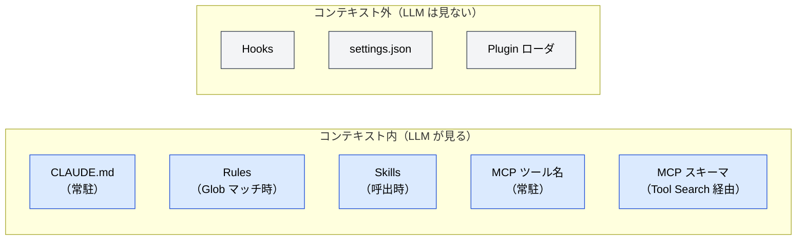

# 機能別早見表

🌐 [English](../../appendix/feature-index.md)

> [!NOTE]
> 全ての設定機能について、「いつロードされるか」「どの問題を解くか」「詳細はどの章か」を 1 ページに集約。

## 機能 × ロードタイミング × 章

| 機能 | ロードタイミング | 配置 | 章 | Topic ページ |
|---|---|---|---|---|
| **CLAUDE.md** | セッション開始時（常駐） | プロジェクト / ユーザー / local | [Part 3](/ja/03-always-loaded-context/) | [Topic](/ja/topics/claude-md) |
| **Rules** | Glob マッチ時 | `.claude/rules/` ほか | [Part 4](/ja/04-conditional-context/) | [Topic](/ja/topics/rules) |
| **Skills** | LLM が名前で呼出 | `.claude/skills/` | [Part 5](/ja/05-on-demand-context/) | [Topic](/ja/topics/skills-and-agents) |
| **Agents** | LLM（またはユーザー）が起動 | Plugins / config | [Part 5](/ja/05-on-demand-context/) | [Topic](/ja/topics/skills-and-agents) |
| **MCP** | ツール名は常駐、スキーマは Tool Search | 外部サーバ | [Part 6](/ja/06-tool-context/) | [Topic](/ja/topics/mcp) |
| **Hooks** | ライフサイクル発火時 | `settings.json` | [Part 7](/ja/07-runtime-layer/) | [Topic](/ja/topics/hooks) |
| **Plugins** | インストール時 | Marketplace | [付録](/ja/appendix/plugins-and-marketplaces) | [Topic](/ja/topics/plugins) |

## 機能 × 構造的問題

8 つの構造的問題それぞれに対する第一選択の機能。

| 問題 | 主な対応機能 | なぜ |
|---|---|---|
| [Context Rot](/ja/01-llm-structural-problems/context-rot) | Rules, Skills, Tool Search | 常駐コンテキスト外へ追い出す |
| [Lost in the Middle](/ja/01-llm-structural-problems/lost-in-the-middle) | `/compact`, Agents | 文脈を短く保ち、長い作業は外に出す |
| [Priority Saturation](/ja/01-llm-structural-problems/priority-saturation) | CLAUDE.md（精選）, Rules | 競合する信号を減らす |
| [Hallucination](/ja/01-llm-structural-problems/hallucination) | MCP, LSP (Part 9), Agents | 実データに接地、または推論を隔離 |
| [Sycophancy](/ja/01-llm-structural-problems/sycophancy) | Hooks | LLM が口先で回避できない強制 |
| [Knowledge Boundary](/ja/01-llm-structural-problems/knowledge-boundary) | MCP, Skills, Plugins | 学習カットオフを越えた能力注入 |
| [Prompt Sensitivity](/ja/01-llm-structural-problems/prompt-sensitivity) | Hooks, settings | プロンプト表現に依存しない決定論的挙動 |
| [Instruction Decay](/ja/01-llm-structural-problems/instruction-decay) | CLAUDE.md, Rules, Hooks | 再注入、または LLM 外で強制 |

## 機能 × LLM からの可視性

## 関連

- [構造的問題 × 対策マップ](/ja/appendix/problem-countermeasure-map)
- [ライフサイクル × 設定マップ](/ja/appendix/lifecycle-config-map)
- [Claude Code 設定リファレンス](/ja/appendix/claude-code-config-reference)
- [Topics 一覧](/ja/topics/)

---

> **前へ**: [ライフサイクル × 設定マップ](/ja/appendix/lifecycle-config-map)
> **次へ**: [Claude Code 設定リファレンス](/ja/appendix/claude-code-config-reference)
