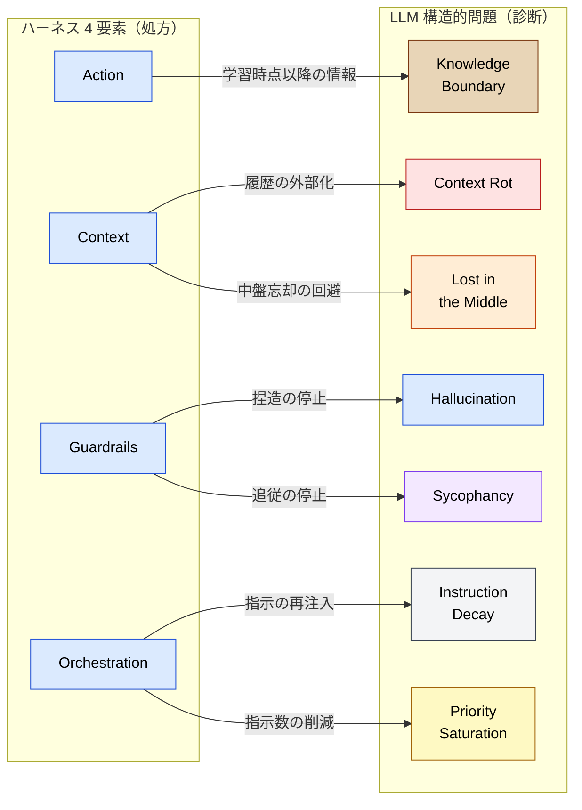
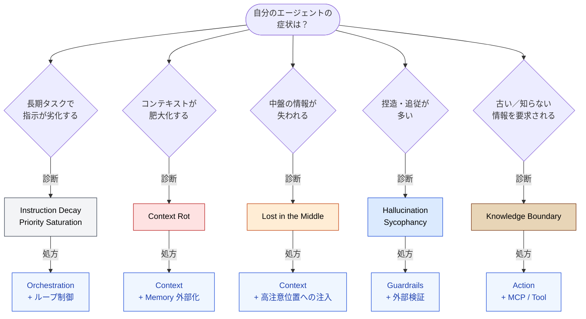

🌐 [English](../../appendix/harness-and-llm-constraints.md)

# Harness と LLM の構造的制約 — 処方の前に診断を

> [!NOTE]
> ハーネスエンジニアリングの 4 要素は、LLM の構造的制約（8 問題）への対症療法として読み解ける。本ページは「ハーネスが処方する各対策が、どの構造的問題に応答しているか」を明示する。

## このドキュメントについて

「**ハーネスエンジニアリング**」（Action / Context / Guardrails / Orchestration の 4 要素）は LLM を **動かす** ための実装処方箋である。本ページは、各処方の背後にある **LLM の構造的制約** を 8 問題の語彙で逆引きする。

> [!TIP]
> **3 行で言うと**
>
> - ハーネス 4 要素 = 8 問題への対症療法。
> - **なぜ** その処方が必要かを知らないと、適用判断ができない。
> - 本ページは「処方の前の診断」を提供する。

## ハーネスを 8 問題で逆引きする

ハーネスは「メモリを持たせよ」「ループを組め」と処方するが、**なぜ** その対策が必要かは説明しない。下表は、各ハーネス要素が **どの構造的問題に応答しているか** を整理したもの。

## ハーネス要素ごとの構造的問題対応

### Action（ツール連携）

> [!NOTE]
> 外部 API・データベース・ファイルシステム・ブラウザ等への接続口。MCP がその代表的な実装。

| 応答する構造的問題 | 効果 |
| --- | --- |
| **Knowledge Boundary** | 学習時点で知らない／変化する情報をリアルタイムで取得する |
| **Hallucination**（部分的） | 外部の信頼できるソースを参照し、捏造を接地する |

> [!IMPORTANT]
> Action は「LLM の知識境界の外」に手を伸ばすための機構。**学習データに含まれない情報・時間とともに変化する情報** を扱う際に必須となる。詳しくは [Part 6: ツールコンテキスト — MCP](../06-tool-context/) 参照。

### Context（メモリ・記憶）

> [!NOTE]
> 過去の文脈・業務の経緯・エージェントの行動履歴を保持し、必要な時に LLM へ引き渡す仕組み。

| 応答する構造的問題 | 効果 |
| --- | --- |
| **Context Rot** | 履歴を外部化し、コンテキストウィンドウへの注入量を制御する |
| **Lost in the Middle** | 必要な情報だけを末尾近くに注入し、U 字カーブの谷を回避する |
| **Priority Saturation**（部分的） | 同時注入される指示・情報の総量を削減する |

> [!IMPORTANT]
> Context をハーネスが「単に持たせる」だけでは不足する。**どの情報をいつ・どの位置に注入するか** の設計が必要で、これは [Part 2: コンテキストウィンドウ](../02-context-window/) 〜 [Part 5: オンデマンドコンテキスト](../05-on-demand-context/) で扱う。

> [!WARNING]
> Memory 設計を誤ると、Context Rot を悪化させる（履歴を全部読み戻すと逆効果）。「**呼ばれた時だけ展開する**」設計（[姉妹サイトの Skills 層](https://shuji-bonji.github.io/ai-agent-architecture/ja/concepts/03-architecture)）と組み合わせて初めて意味がある。

### Guardrails（安全制御）

> [!NOTE]
> 機密情報の漏洩や、暴走によるシステム破壊を防ぐ安全装置。

| 応答する構造的問題 | 効果 |
| --- | --- |
| **Hallucination** | コンパイラ・テスト・型チェック等の **追従しない検証** で捏造を停止 |
| **Sycophancy** | 機械的検証・別モデルでの QA で追従バイアスを破る |

> [!IMPORTANT]
> Guardrails の核心は「**LLM 自身に検証させない**」こと。Hooks（[Part 7: ランタイムレイヤー](../07-runtime-layer/)）やコンパイラのような **追従しない外部機構** こそが捏造・追従への有効な対抗手段となる。

### Orchestration（ループ制御）

> [!NOTE]
> タスクを細かく分解し、LLM 自身に考えさせ・実行させ・結果を評価して次の行動を決定するまでの連続ループ。

| 応答する構造的問題 | 効果 |
| --- | --- |
| **Instruction Decay** | ループの各反復で指示を再注入し、長期タスクでの劣化を防ぐ |
| **Priority Saturation** | タスクを分割して各反復の指示数を削減する |
| **Context Rot**（部分的） | サブタスク単位でコンテキストを分離する |

> [!IMPORTANT]
> Orchestration はマルチセッション協調（[Part 10](../10-multi-session/)）と密接。**1 つの長セッションをループで回す** より、**並列分割でどのセッションも大きく育たない** 設計の方が構造的に強い。

## 処方の前の診断 — 適用判断のフロー

> [!TIP]
> ハーネスの各処方を機械的に適用するのではなく、**自分のエージェントがどの構造的問題に直面しているか** を診断してから処方を選ぶ。

## ハーネスでは届かない領域

ハーネス 4 要素では応答できない／応答が部分的な制約もある。

| 構造的問題 | ハーネスでの応答 | 必要な追加策 |
| --- | --- | --- |
| **Prompt Sensitivity** | 直接の処方なし | プロンプト構造化、ベンチマーク、A/B テスト |
| **Instruction Decay**（深刻時） | ループでの再注入のみ | CLAUDE.md による常駐化、`.claude/rules/` への条件付き注入 |
| **Hallucination**（根絶） | 外部検証で停止 | 構造的に不可避。完全な根絶は不可能 |

> [!CAUTION]
> ハーネスは「動かす」ための処方であり、**LLM の限界そのものを変えるものではない**。Hallucination はゼロにできず、Sycophancy は緩和できても消えない。これらは **設計時に受け入れて運用する** 制約として扱う。

## 関連ページ

- [構造的問題 × 対策マップ](./problem-countermeasure-map.md) — 8 問題 × Claude Code 機能の対応
- [Part 1: 構造的問題](../01-llm-structural-problems/) — 8 問題の全体像
- [Part 6: ツールコンテキスト — MCP](../06-tool-context/) — Action（MCP）の詳細
- [Part 7: ランタイムレイヤー](../07-runtime-layer/) — Guardrails（Hooks）の詳細
- [Part 10: マルチセッション協調](../10-multi-session/) — Orchestration の構造的に強い形

## さらに深く: ハーネスを 5 層モデルで設計する

本ページはハーネス 4 要素を **8 問題で診断する (Why)** ことを扱った。「ハーネス各要素を **どう設計に組み込むか (What/How)**」は姉妹サイト参照。

- [ai-agent-architecture / Harness Engineering との対応関係](https://shuji-bonji.github.io/ai-agent-architecture/ja/strategy/harness-engineering-mapping) — 5 層モデルへの写像、ハーネスが扱わない Skills 層・Doctrine 層

---

> **次へ**: [Authority と LLM の構造的制約](./authority-and-llm-constraints.md)
> **前へ**: [構造的問題 × 対策マップ](./problem-countermeasure-map.md)
