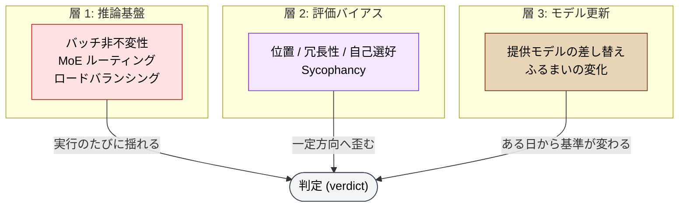

🌐 [English](../../appendix/judgment-drift.md)

# 判定ドリフト — なぜ LLM の判定は再現しないのか

> [!NOTE]
> LLM に pass/fail のような **判定 (verdict)** を出させると、同じ入力に対して異なる判定が返る。本ページは、この非再現性が (1) 推論基盤、(2) 評価バイアス、(3) モデル更新という 3 つの異なる層から生じることを示し、広く信じられている緩和策「temperature を 0 にする」が **必要だが十分ではない** ことを実証研究に基づいて整理する。

## このドキュメントについて

姉妹サイトの [判定の決定論性](https://shuji-bonji.github.io/ai-agent-architecture/ja/strategy/deterministic-verdicts) は、「判定は決定論的なコードに置き、LLM は解説に専念させる」という設計規律を **What/How** で扱った。本ページはその **Why** 側、つまり「なぜ LLM の判定は信用しきれないのか」を構造的制約の語彙で説明する。

[Authority と LLM の構造的制約](./authority-and-llm-constraints.md) が「**行為** の裁量を LLM に渡せるか」を扱ったのに対し、本ページは「**判定** を出す権限を LLM に渡せるか」を扱う。両者は別の問いである。行為は取り消せるが、判定は下流の意思決定に取り込まれた時点で取り消せない。

> [!TIP]
> **3 行で言うと**
>
> - 非決定性はサンプリング段階だけの現象ではない。`temperature=0` でも `top_k=1` でも判定は揺れる。原因は forward pass 自体にある。
> - 揺れは無方向のノイズではない。位置・冗長性・自己選好といった **系統的バイアス** が方向を与える。
> - モデル更新で判定基準そのものが静かに動く。しかも主要な緩和策である温度制御は、パラメータの廃止によって使えなくなりつつある。

## 3 つの層に分けて見る

「LLM の判定が揺れる」は単一の現象ではない。原因が違えば対策も違うため、層で分けて考える必要がある。

| 層 | 時間スケール | 症状 | 効く対策 |
| --- | --- | --- | --- |
| 1. 推論基盤 | 実行のたび | 同一入力・同一設定で判定が割れる | 複数回実行 + 分散報告 |
| 2. 評価バイアス | 常時 | 特定方向へ系統的に歪む | 位置入替・参照付き採点・別モデル |
| 3. モデル更新 | 数か月 | 判定基準が静かに変わる | バージョン固定・回帰スイート |

> [!IMPORTANT]
> 3 層は独立している。**バイアスを除去した judge でも再現しないことがあり、完全に再現する judge でもバイアスは残る**。「判定が安定している」ことと「判定が正しい」ことは別の性質である。

## 層 1: 推論基盤 — `temperature=0` は決定論を意味しない

最も広く信じられている誤解がここにある。「温度を 0 にすればサンプラーは常に最尤トークンを選ぶのだから、出力は決定論的になる」── 原理としては正しいが、**本番の推論サービスでは成立しない**。

Thinking Machines Lab の分析は、Qwen3-235B に対して `temperature=0` で 1,000 回の生成を行い、**80 種類の異なる出力** が得られたことを報告している。分岐はトークン 103 で発生した ([He et al., 2025](https://thinkingmachines.ai/blog/defeating-nondeterminism-in-llm-inference/))。

原因は浮動小数点の非結合性そのものではなく、**リダクションカーネルのバッチサイズ依存性 (batch invariance の欠如)** にある。推論サーバは到着したリクエストを動的にバッチへまとめるため、同じプロンプトでも実行時のバッチサイズが変わる。バッチサイズが変わればリダクション木の形が変わり、演算の順序が変わり、結果が変わる。ここに MoE のルーティング変動と、同一でない複製ノード間のロードバランシングが加わる。

> [!WARNING]
> **自分のリクエストの内容が同じでも、同時刻に来た他人のリクエストによって結果が変わりうる。** これは呼び出し側から制御できない。プロンプトを固定しても、シードを固定しても、この層は残る。

### サンプリングパラメータでは閉じない

日本 AISI の評価環境 `aisev` を対象とした実証研究 ([Tamba, 2026](https://arxiv.org/abs/2606.26185)) は、この層の影響を判定タスクで直接測定している。7 つの境界事例に対し、2 プロバイダ・3 モデルティア・5 つのサンプリング設定にわたる **690 回の API 呼び出し** を行った結果は次の通り。

| 設定 | モデル | 非再現な項目 |
| --- | --- | --- |
| ハーネス既定（温度未設定 → プロバイダ既定の 1.0） | gpt-4o | 7 件中 **4 件** |
| `temperature=0` を明示 | gpt-4o | 7 件中 **2 件** |
| `temperature=0` + `top_p=0.1` | gpt-4o | 7 件中 2 件（**同じ項目・同じ頻度**） |
| `temperature=0`（ベースライン） | Sonnet 4.6 | 7 件中 1 件 |
| `temperature=0` + `top_k=1`（強制 greedy デコード） | Sonnet 4.6 | 7 件中 1 件（**ベースラインから改善せず**） |

3 点が重要である。

1. **`top_p` は効かない。** 核を 0.1 まで絞っても、揺れる項目も頻度も変わらない。
2. **強制 greedy デコードでも揺れは消えない。** `top_k=1` は同一モデルのベースラインから非再現項目を 1 件も減らしていない。最尤トークンだけを選んでいるのに判定が割れるということは、非決定性が **サンプリング段階より前、forward pass の内部で発生している** ことの直接的な証拠である。
3. **緩和策自体が消えつつある。** Claude Opus 4.7 / 4.8 は `[0,1)` の temperature 値を HTTP 400 で拒否し、`top_p` / `top_k` も廃止している。推論トレースを持つモデルが内部で温度を管理する以上これは合理的な変更だが、結果として「つまみを固定する」種類の緩和策は新世代モデルに適用できない。

> [!CAUTION]
> この研究が対象にしたハーネスでは、そもそも temperature が **設定されていなかった**。コードが `None` を渡し、プロバイダ側の既定値 1.0 が黙って適用されていた。ハーネスはこれをユーザーに一切知らせない。**「温度を 0 にしている」という思い込みが、実際には検証されていないことがある。**

## 層 2: 評価バイアス — 揺れには方向がある

層 1 の揺れは実行ごとのランダムノイズだが、判定タスクにはそれとは別に、**繰り返しても消えない系統的な歪み** が存在する。

[Zheng et al., 2023](https://arxiv.org/abs/2306.05685) は LLM を judge として使う場合の主要なバイアスを定量化した。

| バイアス | 内容 | 実測 |
| --- | --- | --- |
| 位置バイアス | 提示順の先にあるものを選びやすい | 調査した全 judge に強く出現 |
| 冗長性バイアス | 長い出力を高く評価する | 冗長性攻撃が Claude / GPT-3.5 を約 91% 騙す（GPT-4 は 8.7%） |
| 自己選好バイアス | 自分自身の出力を高く評価する | GPT-4 で +10%、Claude で +25% |

これらは本サイトの [Sycophancy](../01-llm-structural-problems/sycophancy.md) と地続きである。とりわけ自己選好バイアスは、Sycophancy のページで述べた「同じ LLM に生成とレビューの両方をさせると自分の出力を追認する」という現象の、judge 文脈での定量的な裏付けになっている。

判定タスクにおいて深刻なのは、これらが **無作為な誤差ではなく方向を持つ** ことである。[Authority と LLM の構造的制約](./authority-and-llm-constraints.md) で述べた「常に委譲拡大の方向へ倒れる」構図と同じ性質を持つ。ランダムなノイズは回数を増やせば平均で消えるが、方向を持つ歪みは回数を増やしても消えない。

> [!IMPORTANT]
> 判定対象の **内容** が判定基準を動かす、という形でも現れる。同じ規格違反であっても、対象が重い文書（契約書・申告書）であれば厳しく、軽い文書（連絡通知）であれば甘く判定されうる。これは [Prompt Sensitivity](../01-llm-structural-problems/prompt-sensitivity.md) の一形態で、判定基準は入力の一部ではないにもかかわらず、入力によって条件付けられてしまう。**一律の基準で裁くべき領域に、文脈適応という LLM の長所が害として作用する。**

## 層 3: モデル更新 — 基準そのものが静かに動く

3 つ目は時間軸の層である。プロンプトもコードも変えていないのに、判定が変わる。

[Chen, Zaharia & Zou, 2023](https://arxiv.org/abs/2307.09009) は GPT-3.5 / GPT-4 の 2023 年 3 月版と 6 月版を同一タスクで比較した。素数判定において GPT-4 の正答率は **84% (3 月) から 51% (6 月)** へ低下している。わずか 3 か月である。著者らは、多くのふるまい変化に共通する要因として **指示追従能力の低下** を挙げている。

この層が厄介なのは、次の性質による。

- **差分に現れない。** リポジトリの diff にも設定ファイルにも変化がない。変わったのは自分の管理外にあるものである。
- **改善として起きる。** 提供側は性能向上のために更新している。「賢くなった」結果として、以前は機械的に `reject` していたケースに気を利かせて `use_with_caution` を返すようになる、ということが起こりうる。
- **方向が予測できない。** 厳しくなるか甘くなるかは、タスクごとに違う。

> [!NOTE]
> [Knowledge Boundary](../01-llm-structural-problems/knowledge-boundary.md) は「モデルが知らないことがある」という問題だった。層 3 はそれとは別で、「**モデルが変わる**」という問題である。前者はモデルを新しくすれば緩和されるが、後者はモデルを新しくすること自体が原因になる。

## 揺れは境界事例に集中する

3 層すべてに共通する性質として、**非再現性は判定境界の近くに集中する**。前掲の実証研究でも、明確に正しい／明確に誤っている項目は安定しており、割れたのは意図的に境界上に設計された項目だった。

これは運用上、次の 2 つを意味する。

1. **「たいてい合っている」は反証にならない。** サンプルの大半は安定するので、抜き取り確認では問題が見えない。壊れるのは常に、一番判断が難しく、一番人間が確認したいところである。
2. **判定が pass/fail である限り、揺れは平均化されない。** ベンチマークのスコアなら分散として吸収され、テスト件数を増やせば均される。しかし pass/fail は 1 ビットであり、通すか止めるかのどちらかにしかならない。そのビットがモデルの実際の評価ではなくノイズに支配されているなら、**そのシステムは獲得していない正統性を与えていることになる**。

## 緩和策とその限界

| # | 緩和策 | 効く層 | 限界 |
| --- | --- | --- | --- |
| M1 | 呼び出し箇所で `temperature=0` を明示する（プロバイダ既定に頼らない） | 1 | 必要だが不十分。新世代モデルでは指定自体が不可 |
| M2 | `seed` を指定し、実行メタデータに記録する | 1 | 対応プロバイダに限られる |
| M3 | 判定を複数回実行し、点推定ではなく **分散** を報告する | 1・2 | パラメータ廃止に耐える唯一の緩和策。コストは回数倍 |
| M4 | judge の不一致率を一級のヘルスメトリクスとして可視化する | 1・2 | 不一致が高い項目はルーブリック改訂か人間裁定へ回す |
| M5 | 実効設定（モデル識別子・解決済みバージョン・温度・シード・**解決された API エンドポイント**）を成果物に記録する | 1・3 | 記録するだけでは揺れは減らない。事後の説明責任のため |
| M6 | 境界事例の固定テストセットで回帰を継続監視する | 3 | ドリフトの検知はできるが、防止はできない |

> [!CAUTION]
> M1〜M6 は **緩和であって解決ではない**。層 1 は呼び出し側から制御できず、層 2 は回数を増やしても消えず、層 3 は自分の管理外で起きる。判定を確実に再現させたいなら、構造的な解は一つしかない ── **判定そのものを LLM の外に出す**。LLM の役割を「なぜその判定になったか」の解説に限定すれば、揺れるのは文章表現だけになり、下流の意思決定は影響を受けない。

## 8 問題との関係

判定ドリフトは 9 番目の構造的問題ではない。既存の問題が **判定という特定のタスク形状** に集中したときに現れる複合症状であり、そこに 8 問題の外側にある基盤層の要因が加わったものである。

| 層 | 対応する構造的問題 | 8 問題の外側にある要因 |
| --- | --- | --- |
| 1. 推論基盤 | — | バッチ非不変性・MoE ルーティング・ロードバランシング |
| 2. 評価バイアス | [Sycophancy](../01-llm-structural-problems/sycophancy.md)、[Prompt Sensitivity](../01-llm-structural-problems/prompt-sensitivity.md) | — |
| 3. モデル更新 | [Instruction Decay](../01-llm-structural-problems/instruction-decay.md)（指示追従の低下として観測） | 提供側のモデル差し替え |

> [!TIP]
> 「LLM の判断が必要か？ → No → 機械的に検証可能か？ → Yes → Hooks」という [why-not-in-context](../07-runtime-layer/why-not-in-context.md) の判断フローは、判定タスクにもそのまま適用できる。ただし一点だけ注意がいる ── **Hooks 自体を LLM に判定させると（Prompt Hook / Agent Hook）、本ページの 3 層がそのままゲートキーパーに入り込む**。決定論的なゲートを求めるなら Command Hook を選ぶ。

## 関連ページ

- [Authority と LLM の構造的制約](./authority-and-llm-constraints.md) — 「行為の裁量」を渡せるか（本ページは「判定の権限」を渡せるか）
- [Harness と LLM の構造的制約](./harness-and-llm-constraints.md) — 「LLM 自身に検証させない」外部機構の必要性
- [Sycophancy](../01-llm-structural-problems/sycophancy.md) — 自己レビューの限界と Cross-Model QA
- [Prompt Sensitivity](../01-llm-structural-problems/prompt-sensitivity.md) — 指定欠落が非決定性を生む機構
- [なぜコンテキスト外に置くのか](../07-runtime-layer/why-not-in-context.md) — LLM の判断とコードの判断の分岐点

## さらに深く: 判定をどこに置くか

本ページは「**なぜ** LLM の判定は再現しないか (Why)」を扱った。「では判定層を **どこに置き、どう設計するか** (What/How)」は姉妹サイトを参照。

- [ai-agent-architecture / 判定の決定論性](https://shuji-bonji.github.io/ai-agent-architecture/ja/strategy/deterministic-verdicts) — 観測 / 判定 / 解説の三段分離、判定層を持つべき MCP の判断表、再現性の担保手順
- [ai-agent-architecture / MCP Family](https://shuji-bonji.github.io/ai-agent-architecture/ja/strategy/mcp-family) — 「ジャッジはコード、ナラティブは LLM」という族の設計規律

## 参考文献

- He, H. et al. (2025). "Defeating Nondeterminism in LLM Inference." Thinking Machines Lab. [thinkingmachines.ai](https://thinkingmachines.ai/blog/defeating-nondeterminism-in-llm-inference/) — `temperature=0` でも出力が揺れる原因をバッチ非不変性に帰属。Qwen3-235B で 1,000 生成中 80 種類の異なる出力
- Tamba, H. (2026). "Necessary but Not Sufficient: Temperature Control and Reproducibility in LLM-as-Judge Safety Evaluations." arXiv:2606.26185. [arxiv.org/abs/2606.26185](https://arxiv.org/abs/2606.26185) — 690 回の API 呼び出しによる実測。`top_k=1` でも判定が割れること、Claude Opus 4.7/4.8 で temperature が廃止されたことを報告
- Zheng, L., Chiang, W.-L., Sheng, Y., et al. (2023). "Judging LLM-as-a-Judge with MT-Bench and Chatbot Arena." NeurIPS 2023. [arxiv.org/abs/2306.05685](https://arxiv.org/abs/2306.05685) — 位置・冗長性・自己選好バイアスの定量化と、位置入替・参照付き採点による緩和
- Chen, L., Zaharia, M., & Zou, J. (2023). "How Is ChatGPT's Behavior Changing over Time?" arXiv:2307.09009. [arxiv.org/abs/2307.09009](https://arxiv.org/abs/2307.09009) — GPT-4 の素数判定が 3 か月で 84% から 51% へ低下。指示追従能力の低下が共通因子
- Wang, P., Li, L., Chen, L., et al. (2023). "Large Language Models are not Fair Evaluators." arXiv:2305.17926. [arxiv.org/abs/2305.17926](https://arxiv.org/abs/2305.17926) — 評価者としての LLM の系統的不公平性
- Stureborg, R., Alikaniotis, A., & Suhara, Y. (2024). "Large Language Models are Inconsistent and Biased Evaluators." arXiv:2405.01724. [arxiv.org/abs/2405.01724](https://arxiv.org/abs/2405.01724) — 評価者 LLM の不整合性とバイアスの多次元的特徴づけ

---

> **次へ**: [出力フォーマット制約と精度](./output-format-constraints.md)
> **前へ**: [Authority と LLM の構造的制約](./authority-and-llm-constraints.md)
