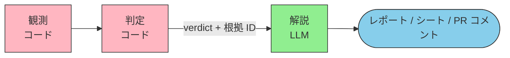

🌐 [English](../../appendix/narrative-layer-failures.md)

# 解説層に残る故障 — 判定をコードに出したあとに何が残るか

> [!NOTE]
> 判定 (verdict) を決定論的なコードへ移すと、判定値そのものは揺れなくなる。しかし LLM が担う解説層（判定結果を人が読める形に整える段）には、別の故障が残る。本ページはその故障を 4 つに分け、8 つの構造的問題のどれに由来するか、受け取る側がコードで何を検査すればよいかを整理する。

## このドキュメントについて

「LLM は判定しない側に置き、整理だけ担当させる」という設計は広く採られている。この設計は妥当だが、**整理なら安全である、という含意は成り立たない**。8 つの構造的問題は解説層にもそのまま効く。

[判定ドリフト](./judgment-drift.md) は「判定に使ったとき、なぜ再現しないか」を扱った。本ページは「**判定に使わなくても何が残るか**」を扱う。判定ドリフトを読んで判定をコードへ移した人が、次に読む位置にある。

> [!TIP]
> **3 行で言うと**
>
> - 判定をコードに出すと、揺れる場所が verdict から **文章と参照 ID** に移る。消えるのではない。
> - 解説層の故障は 4 つに分けられ、それぞれ既知の構造的問題に由来する。9 番目の新しい問題ではない。
> - 対策はプロンプトでの指示ではない。**解説層の出力を受け取った側が、コードで突合する**。

## 揺れる場所が移る

判定層をコードに置いた時点で、下流に流れる値は固定される。しかし人が実際に読むのは解説層の出力である。**判定が正しくても、出力が判定と食い違っていれば、読む人が受け取るのは食い違ったほうである。**

## 4 つの故障

### 1. 項目の取り違え・転記漏れ

由来: [Lost in the Middle](../01-llm-structural-problems/lost-in-the-middle.md)、[Context Rot](../01-llm-structural-problems/context-rot.md)

項目が 5 件のシートでは起きにくい。60 件になると起きる。判定結果の一覧をコンテキストに載せて「各項目を埋めよ」と指示したとき、注意は先頭と末尾に集まり、中間の項目が落ちる。落ちた項目は空欄として現れるとは限らず、**隣の項目の内容で埋まる**ことがある。

数値は [Lost in the Middle](../01-llm-structural-problems/lost-in-the-middle.md) を参照。中間部で 30% 以上の精度低下が報告されている。

### 2. 根拠 ID の付け違い・捏造

由来: [Hallucination](../01-llm-structural-problems/hallucination.md)、[Knowledge Boundary](../01-llm-structural-problems/knowledge-boundary.md)

判定層が返した発火ルール ID の一覧に無い ID が、解説文の中に現れる。あるいは、ある ID の説明欄に別の ID の理由が書かれる。

`REV-02` のような短い記号列は、それらしい形をいくらでも作れる。しかも Knowledge Boundary の性質上、モデルは「この ID は与えられていない」とは言わない。**根拠 ID を必須にした設計ほど、この故障の影響が大きい。** 根拠が付いているという体裁だけが残るからである。

### 3. 逸脱の言い換え・緩和

由来: [Sycophancy](../01-llm-structural-problems/sycophancy.md)

`reject` を「留意点があります」と書く。`human_review_required` を「概ね問題ありません」と書く。判定値そのものは変わっていないので、**値だけを見る検査は通る**。変わっているのは人が読む部分だけである。

利用者が「問題ないですよね」と添えて渡したときに、この方向へ寄る。

### 4. 出力書式の崩れ

由来: [Instruction Decay](../01-llm-structural-problems/instruction-decay.md)、[Priority Saturation](../01-llm-structural-problems/priority-saturation.md)

項目数が多い、書式の指示が多い、会話が長い。3 つが重なると、決めた書式から外れる。[Priority Saturation](../01-llm-structural-problems/priority-saturation.md) では、10 個の同時指示で遵守率が大きく落ちることが報告されている。書式指示は 1 つの指示として数えられるので、項目ごとの細かい規則を足すほど、全体の遵守率が下がる。

## 検査はコードで行う

| 故障 | 検査 | 落ちたときの扱い |
| --- | --- | --- |
| 項目の取り違え・転記漏れ | 出力の項目数と判定結果の件数を突合する | 件数が合うまで出力しない |
| 根拠 ID の付け違い・捏造 | 出力中の ID が判定結果に実在するか照合する | 実在しない ID が 1 つでもあれば失敗 |
| 逸脱の言い換え・緩和 | verdict 語彙を固定リストと照合する | リスト外の語があれば失敗 |
| 出力書式の崩れ | スキーマ検証を通す | 失敗 |

> [!IMPORTANT]
> 4 つとも、LLM に「注意させる」ことでは塞げない。注意させる指示自体が Priority Saturation の対象になり、指示を足すほど他の指示の遵守率が下がるからである。**指示を足すのではなく、受け取った側が測る。**

検査に落ちたときの既定は再生成であって、人手での修正ではない。人が直すと、次回も同じ場所で落ちる。

## 判定ドリフトとの守備範囲

| | [判定ドリフト](./judgment-drift.md) | 本ページ |
| --- | --- | --- |
| 対象 | LLM が verdict を出す構成 | verdict をコードが出す構成 |
| 揺れるもの | 判定値 | 文章と参照 ID |
| 下流への影響 | 意思決定が変わる | 人の読み取りが変わる |
| 対策の方向 | 判定を LLM の外に出す | 出力をコードで突合する |

判定ドリフトの結論（判定を LLM の外に出す）を実行したあとに残るのが、本ページの 4 つである。順番があり、置き換えではない。

## 8 問題との関係

| 故障 | 由来する構造的問題 |
| --- | --- |
| 項目の取り違え・転記漏れ | [Lost in the Middle](../01-llm-structural-problems/lost-in-the-middle.md)、[Context Rot](../01-llm-structural-problems/context-rot.md) |
| 根拠 ID の付け違い・捏造 | [Hallucination](../01-llm-structural-problems/hallucination.md)、[Knowledge Boundary](../01-llm-structural-problems/knowledge-boundary.md) |
| 逸脱の言い換え・緩和 | [Sycophancy](../01-llm-structural-problems/sycophancy.md) |
| 出力書式の崩れ | [Instruction Decay](../01-llm-structural-problems/instruction-decay.md)、[Priority Saturation](../01-llm-structural-problems/priority-saturation.md) |

[Prompt Sensitivity](../01-llm-structural-problems/prompt-sensitivity.md) は 4 つすべてに横断的に効く。同じ判定結果でも、テンプレートの書き方が変われば出力が変わる。解説層のテンプレートを版管理し、変えたら出力の差分を見る必要がある。

## 関連ページ

- [判定ドリフト](./judgment-drift.md) — 判定に使ったときの非再現性。本ページの前提
- [構造的問題 × 対策マップ](./problem-countermeasure-map.md) — 8 問題それぞれの対策の配置
- [Harness と LLM の構造的制約](./harness-and-llm-constraints.md) — 「LLM 自身に検証させない」外部機構の必要性
- [出力フォーマット制約と精度](./output-format-constraints.md) — 書式の制約が精度に与える影響
- [なぜコンテキスト外に置くのか](../07-runtime-layer/why-not-in-context.md) — 機械的に検証できる項目を Hooks へ回す判断

## さらに深く: 判定をどこに置くか

本ページは、判定をコードへ移したあとに解説層へ残る故障 (Why) を扱った。「判定層を **どこに置き、解説層に何を渡すか** (What/How)」は姉妹サイトを参照。

- [ai-agent-architecture / 判定の決定論性](https://shuji-bonji.github.io/ai-agent-architecture/ja/strategy/deterministic-verdicts) — 観測 / 判定 / 解説の三段分離。「渡したあとを検査する」に本ページの 4 つが対応する

---

> **次へ**: [出力フォーマット制約と精度](./output-format-constraints.md)  
> **前へ**: [判定ドリフト](./judgment-drift.md)
