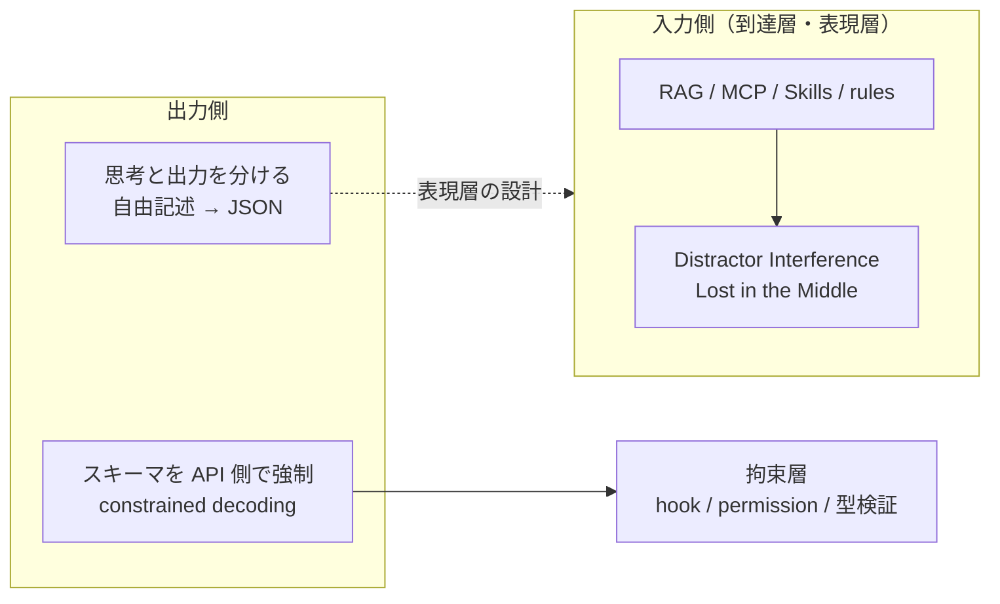

🌐 [English](../../appendix/output-format-constraints.md)

# 出力フォーマット制約と精度 — 入力側の構造化とは別の軸

> [!NOTE]
> 「JSON で返せ」のように **出力フォーマット** を強く制約すると、推論タスクの正答率が下がる、という報告がある。本ページは、この論点が [Context Rot](../01-llm-structural-problems/context-rot.md) の Distractor Interference（**入力側** の現象）としばしば混同されることを指摘し、2 つを分けたうえで、出力側の制約をどの層で扱うべきかを整理する。

## このドキュメントについて

姉妹サイトの [提案と拘束](https://shuji-bonji.github.io/ai-agent-architecture/ja/strategy/proposal-and-binding) は「RAG も MCP も Skills も、結局は LLM に渡すデータをどう構造化するかという問題に帰着する」と述べている。ここでの「構造化」は **LLM に読ませるデータ**（到達層・表現層）の構造であり、出力フォーマットのことではない。

一方で、「構造化するとかえって精度が下がる」という主張を目にすることがある。この主張は、入力側の現象と出力側の現象を 1 つに混ぜて説明されることが多い。混ぜたまま読むと、上記の「帰着する」と矛盾するように見える。本ページは、この 2 つを分けることで矛盾が生じないことを示す。

> [!TIP]
> **3 行で言うと**
>
> - Distractor Interference は入力側の現象。妨害情報がコンテキストに入るかどうかは、渡すデータの設計で決まる。「帰着する」を補強する。
> - 出力フォーマット制約による精度低下は出力側の現象。報告は割れており、確定した結論ではない。
> - 出力側の対策は、既存の層（表現層・拘束層）に収まる。新しい層は要らない。

## 2 つの「構造化」を分ける

| | Distractor Interference | 出力フォーマット制約 |
| :--- | :--- | :--- |
| どこで起きるか | **入力側**。コンテキストに含まれる無関係・類似の情報 | **出力側**。JSON / XML 等の形式を強制する指示 |
| 何が観測されたか | 妨害情報が 1 件あるだけで正答率が下がり、件数が増えるほど低下。文脈として一貫した入力のほうが、シャッフルした入力より成績が悪い ([Hong et al., 2025](https://research.trychroma.com/context-rot)) | 制約が厳しいほど推論タスクの正答率が下がる傾向 ([Tam et al., 2024](https://arxiv.org/abs/2408.02442))。ただし同条件で比較し直すと差が消える、または逆転するという再検証がある ([Kurt, 2024](https://blog.dottxt.ai/say-what-you-mean.html)) |
| 結論の確度 | 18 モデルで一貫して確認 | **確定していない** |
| 対応する設計 | 何をコンテキストに入れるかの設計（rules の条件付き注入、Skills の遅延展開、Tool Search） | 思考と出力の分離、スキーマの API 側強制 |

## 出力側で何が起きているのか

Tam らは、JSON モードのように厳格な形式を強制した場合と、自由記述の場合とで、推論タスク（GSM8K など）の正答率を比較した。結果は、形式の制約が厳しいほど正答率が低い、というものだった。この論文は「構造化出力は推論を妨げる」という主張の出典として広く引用されている。

ただし、Kurt による再検証は、原論文が構造化側と非構造化側で **異なるプロンプト** を使っていたこと、形式の指示が何をすべきかを十分に説明していなかったこと、非構造化側の回答抽出に使ったパーサーが不完全だったことを指摘し、同じモデル・同じプロンプトで実験し直すと構造化生成のほうが高い正答率を示したと報告している。

2 つの報告から取り出せる、条件によらず成り立つ点は次の 2 つである。

1. **思考を書き出す場所があるかどうかで正答率が変わる**。答えだけを即座に形式に入れさせると、途中の推論を展開する場所がなくなる。形式の内側に推論用の欄を設けるか、自由記述のあとで形式に変換すれば、低下の大半は解消する。
2. **形式を指定する指示と、タスクを説明する指示は別物**である。前者だけを増やして後者を削ると、比較は不公平になり、精度も下がる。

### 採らない説明

この論点について、次のような説明が添えられることがある。本サイトでは採用しない。

- 「構文の正しさを維持することに計算リソースを消費し、内容に割くリソースが減る」 — 1 トークンあたりの計算量は固定であり、構文と内容の間でリソースの奪い合いは起きない。起きているのは、学習時に多く見た分布（自然文）と、要求された出力分布（厳格な JSON）のずれ、および上記 1. の推論空間の喪失である。
- 「迷信的学習」「過剰な学習パターンの適用」 — 特定の現象を指す定義済みの用語ではない。何が起きているかを書くなら、上記の分布のずれ、および次の項で述べる **空欄の埋め合わせ** である。

### 空欄の埋め合わせ

スキーマに必須フィールドがあり、その値が入力に存在しない場合、モデルはフィールドを空にするのではなく、それらしい値を生成して埋めることがある。これは [Hallucination](../01-llm-structural-problems/hallucination.md) の一形態であり、出力フォーマット固有の問題ではない。対策もフォーマット側ではなく、スキーマ側にある。値が存在しない場合を表せる型（`null` 許容、`"unknown"` 列挙値、optional フィールド）を用意すれば、埋め合わせの動機はなくなる。

## 対策はどの層に属するか

出力側の対策として挙げられる 2 つは、[提案と拘束](https://shuji-bonji.github.io/ai-agent-architecture/ja/strategy/proposal-and-binding) の分割線で分類できる。「LLM が指示を無視する出力を出したとき、結果は変わるか」が基準である。

| 対策 | LLM が指示を無視したら | 層 |
| :--- | :--- | :--- |
| 思考と出力を分ける（自由記述で考えてから、最後に JSON にまとめる） | 結果は変わる。形式が崩れた出力が返り得る | **表現層**（非拘束） |
| スキーマを API 側で強制する（constrained decoding、tool use の `input_schema`） | 結果は変わらない。スキーマに合わない出力は生成され得ない | **拘束層** |

前者は「LLM に読ませるデータ」の設計の一部であり、「帰着する」の射程に入る。後者はトークン列の外側で動く仕組みであり、同ページが「構造化だけでは不十分」と述べている部分に対応する。したがって、出力側の論点を加えても、層は増えない。

## Claude Code での対応

| 機能 | 仕組み | 層 |
| :--- | :--- | :--- |
| **tool use の `input_schema`** | ツール呼び出しの引数は JSON Schema に照らして API 側で検証される。本文の推論は自由記述で行い、引数だけが形式に拘束される | 拘束層 |
| **Hooks の JSON 出力** | hook スクリプトが返す `decision` 等のフィールドは Claude Code 本体（コード）が読む。LLM の出力ではなく、コードの出力である | 拘束層（LLM の外） |
| **サブエージェントの構造化出力** | JSON Schema を渡すと、エージェントは本文の作業を自由に行い、最後に StructuredOutput ツール呼び出しで結果を返す。「思考と出力を分ける」をランタイム側で実装した形 | 表現層 + 拘束層 |
| **CLAUDE.md / Skills での形式指示** | 「表で答えて」「JSON で返して」と文章で書く。LLM が無視すれば形式は崩れる | 表現層（非拘束） |

> [!IMPORTANT]
> 「JSON で返せ」と CLAUDE.md に書くことと、tool use の `input_schema` で形式を固定することは、見た目は似ているが属する層が違う。前者は精度の低下と形式の崩れの両方が起こり得る。後者は形式の崩れは起こらないが、推論の場所をスキーマの外に確保しないと精度の低下は起こり得る。

## 関連ページ

- [Context Rot](../01-llm-structural-problems/context-rot.md) — Distractor Interference は入力側の現象
- [Hallucination](../01-llm-structural-problems/hallucination.md) — 空欄の埋め合わせの背景
- [判定ドリフト](./judgment-drift.md) — 判定を出力させる場合の別の問題
- [提案と拘束](https://shuji-bonji.github.io/ai-agent-architecture/ja/strategy/proposal-and-binding) — 表現層と拘束層の分割線

## 参考文献

- Hong, K., Troynikov, A., & Huber, J. (2025). "Context Rot: How Increasing Input Tokens Impacts LLM Performance." Chroma Research. [research.trychroma.com](https://research.trychroma.com/context-rot) — 妨害情報の件数と正答率の関係、および一貫した haystack のほうがシャッフルより成績が悪いという結果
- Tam, Z. R., Wu, C.-K., Tsai, Y.-L., Lin, C.-Y., Lee, H., & Chen, Y.-N. (2024). "Let Me Speak Freely? A Study on the Impact of Format Restrictions on Performance of Large Language Models." arXiv:2408.02442. [arxiv.org/abs/2408.02442](https://arxiv.org/abs/2408.02442) — 形式制約が厳しいほど推論タスクの正答率が下がるという報告
- Kurt, W. (2024). "Say What You Mean: A Response to 'Let Me Speak Freely'." .txt blog. [blog.dottxt.ai/say-what-you-mean.html](https://blog.dottxt.ai/say-what-you-mean.html) — 同条件で比較し直すと構造化生成のほうが高い正答率を示したという再検証

---

> **次へ**: [ライフサイクル × 設定マップ](./lifecycle-config-map.md)
> **前へ**: [判定ドリフト](./judgment-drift.md)
